# Visual walkthrough: notifications and sales

The second part of the visual walkthrough — it picks up where [Visual walkthrough: getting started](recorrido-visual.md) ends. Here we configure outgoing mail and get the instance ready to sell: individual courses and memberships.

!!! note "Where these screenshots come from"
    The same isolated, seed-free instance as part one. SMTP points at the Mailpit service bundled in `docker-compose.alpha.yml` — this is a real send, not a simulation: the test email genuinely lands in the mailbox.

## 1 · Notifications (SMTP)

Under **Administration → Settings → Notifications** (`/admin/configuracion`, the "Notifications" tab) each tenant can define its own SMTP server. Without this, the organization inherits the instance-wide SMTP server if the operator configured one through environment variables — see [Email](../configuracion/email.md).

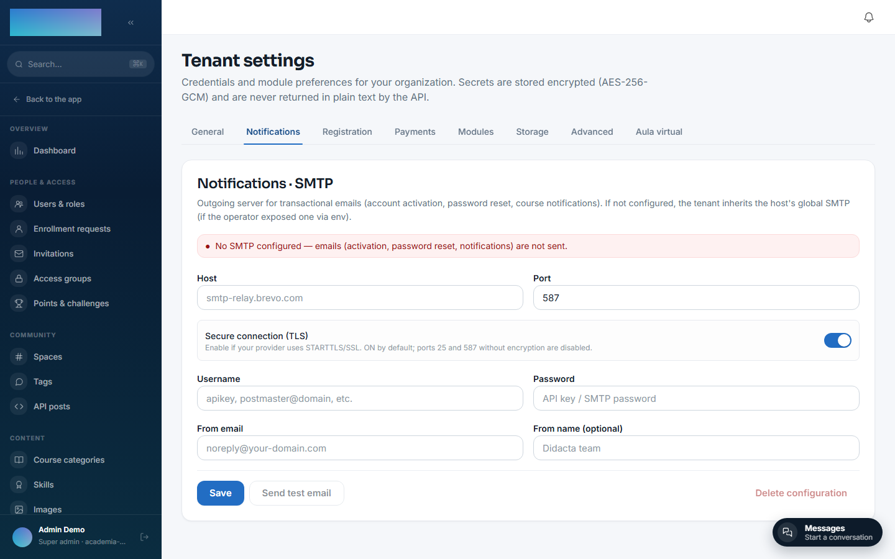

Fill in the host, port, username/password and the sender address. Important: **"Secure connection (TLS)" is on by default** — you only need it if your provider requires STARTTLS/SSL (typically port 587 or 465). An unencrypted server on port 25/1025 (like Mailpit in development) needs TLS **off**, or the connection fails with a handshake error.

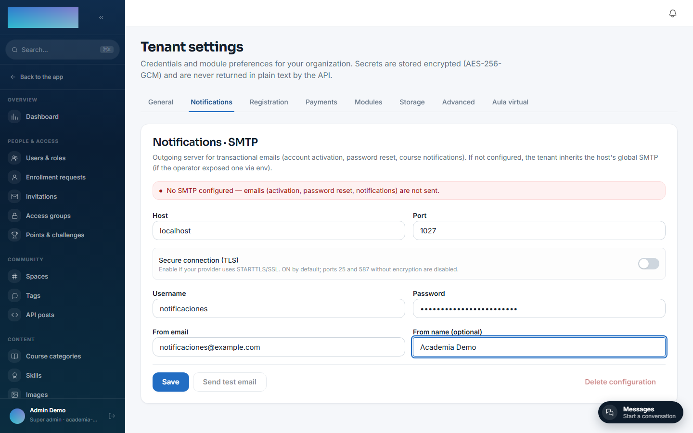

On saving, the banner switches to "configured but not verified" — Didacta does not test the connection when you save, it only validates the format.

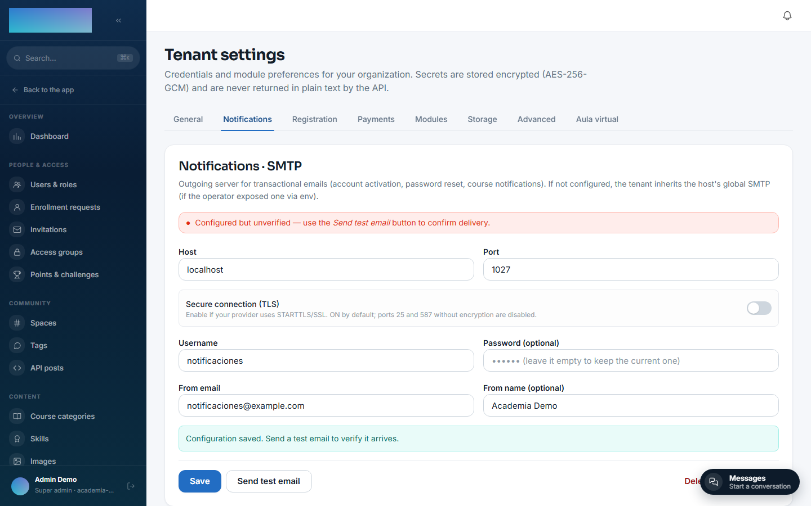

**"Send test email"** confirms the configuration really works: it opens a dialog with the admin's own email pre-filled.

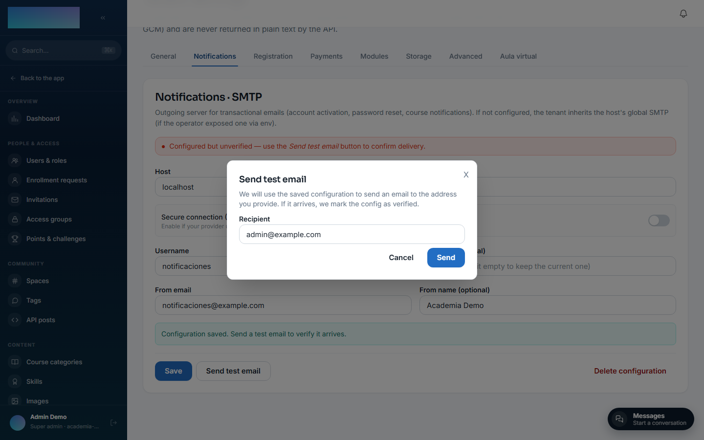

If the email arrives, the banner switches to **"Verified"** with a date and time — the signal that the organization can now genuinely send invitations, password resets and course notifications.

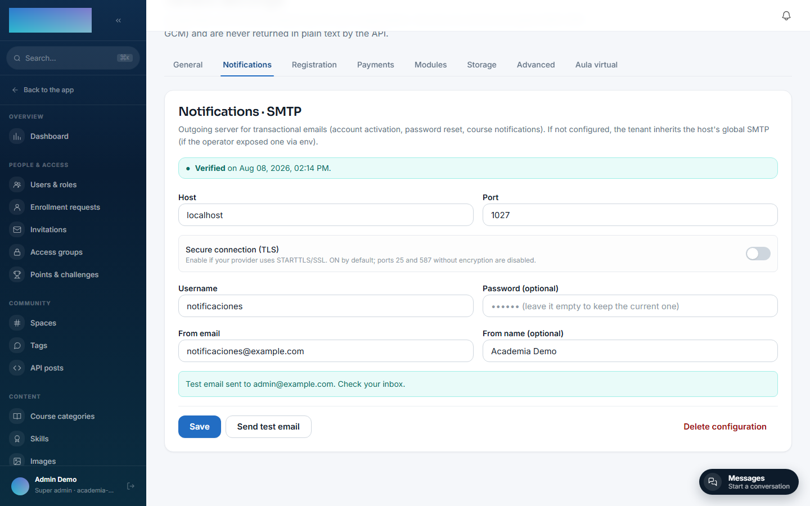

And the email, for real, in the mailbox:

<!-- El cuerpo de este correo sale en español aunque el destinatario tenga el
     perfil en inglés: el asunto y el texto del email de prueba de SMTP están
     cableados en apps/api/src/admin/admin-smtp.controller.ts. Cuando se
     traduzca, basta con volver a lanzar el generador de capturas
     (didacta-io, apps/e2e/shots/) y esta imagen sale ya en inglés. -->
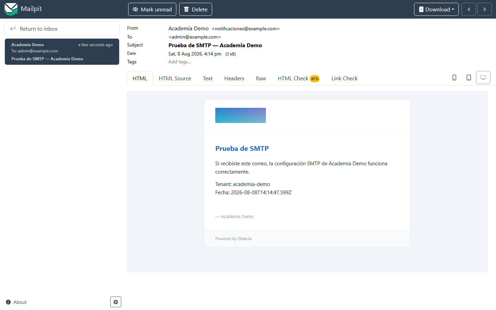

!!! tip "Editing the content of the emails"
    The form above only configures the **transport**. The text of each email (subject, body) is edited per tenant under **Administration → Emails**, with no code changes — see [Email](../configuracion/email.md).

## 2 · Selling individual courses (mod.billing)

Stripe is configured **per tenant, from the admin panel** — there is no need to touch the instance `.env`. A single pair of credentials (secret key + webhook secret) covers both individual courses (`mod.billing`) and subscriptions/membership (`mod.subscriptions`): they share the same Stripe account, so one academy charges through both paths.

Under **Administration → Settings → Payments** (`/admin/configuracion`, the "Payments" tab), with nothing configured yet:

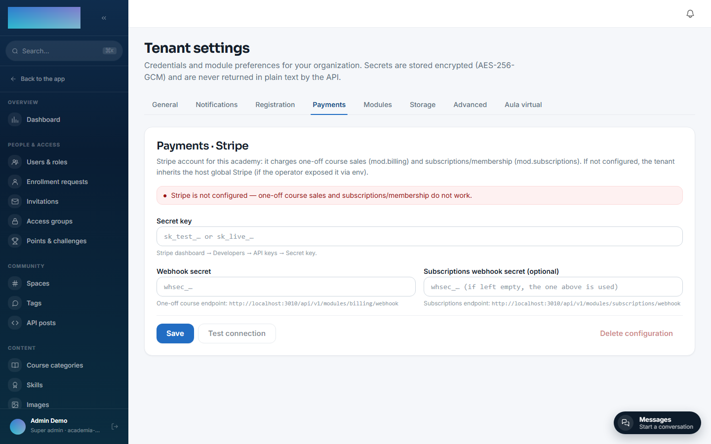

While Stripe is not configured, two more screens warn you **before** a student tries to pay, rather than letting the failure show up in production with no context:

- **Membership** (`/admin/membresia`) shows a notice at the very top — plans and the `/unete` page are prepared all the same, but the actual charge will fail until you configure Stripe.

  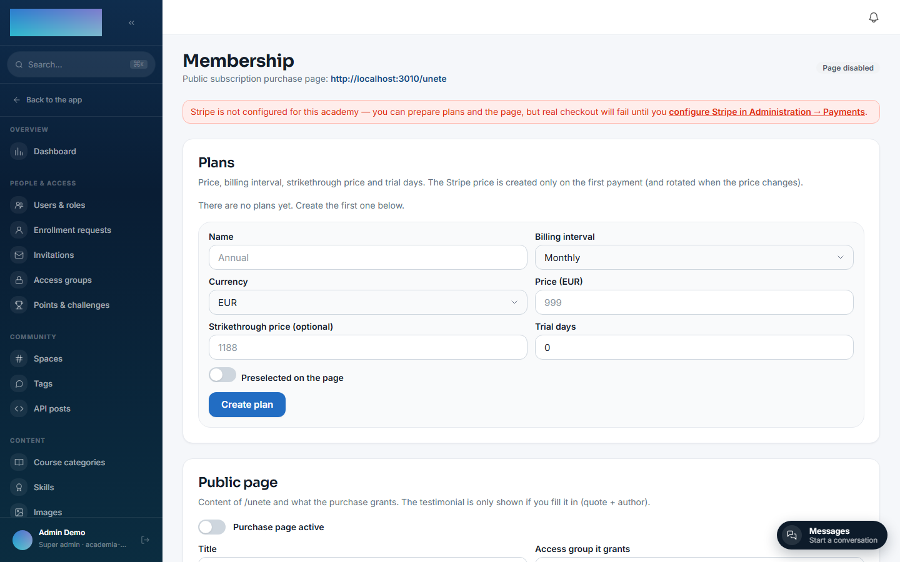

- **Payments · Stripe products** (`/admin/billing/products`) still lets you link courses, but saving without Stripe configured returns a clear message and a direct link to the Payments tab — never a raw 500.

  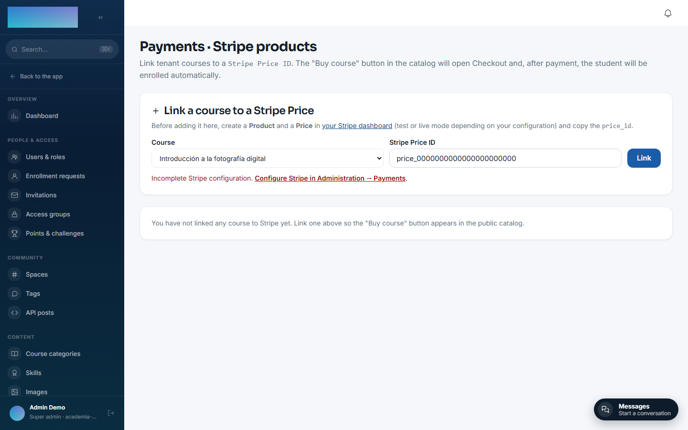

To activate it: paste the **secret key** (Stripe → Developers → API keys) and the **webhook secret** — the card itself shows the two URLs to paste into your Stripe dashboard (`{your-domain}/api/v1/modules/billing/webhook` and `.../modules/subscriptions/webhook`; the subscriptions webhook is optional — leave it empty and it reuses the same secret as individual courses).

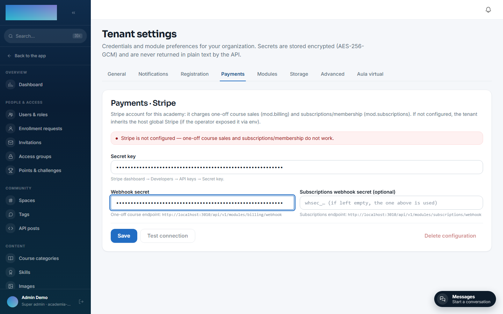

On saving, just like SMTP, the banner switches to "configured but not verified" — Didacta does not call Stripe when you save, it only validates the format.

**"Test connection"** does call Stripe's real API (`balance.retrieve`, read-only, with no side effects). With a genuine key it marks the banner as verified; here, with a made-up key for this demo, Stripe rejects it with its own error message — proof that the validation is real, not cosmetic:

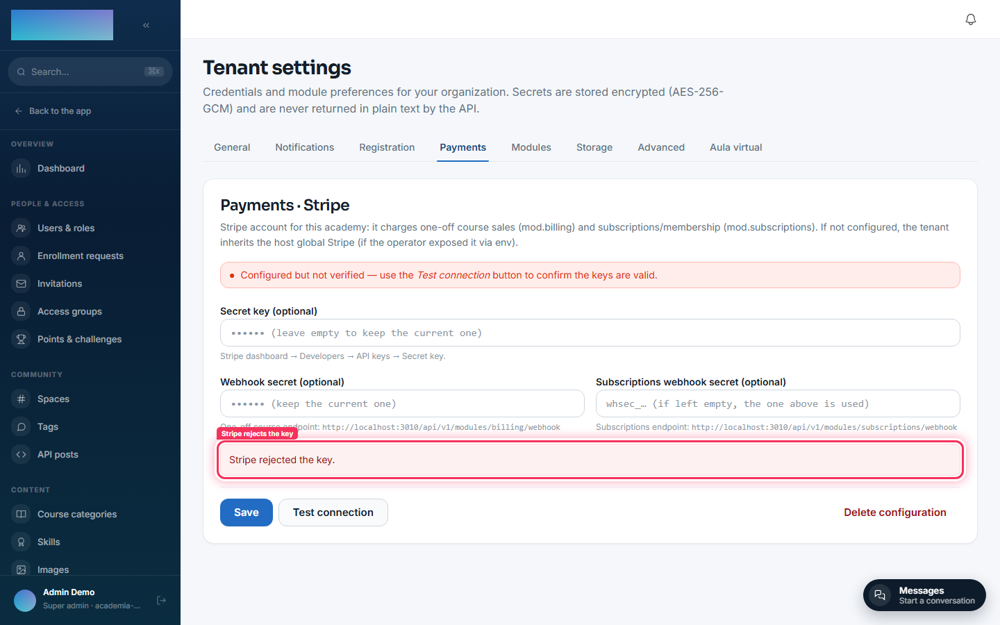

With a real key saved and verified: for each course linked from **Payments · Stripe products**, you pick the published course, paste the `price_id` of a **Product + Price you already created in your Stripe dashboard** (Didacta validates against the API that it exists and is active before saving) and the "Buy course" button appears on that course's public catalog page.

!!! warning "Not to be confused with «Payment connections»"
    `/admin/integraciones/payment-connections` is a **different** screen: it reconciles subscribers from an **external** Stripe account using a read-only restricted key — it does not enable Didacta's checkout. To actually sell, the only way is to configure Stripe under **Administration → Settings → Payments**, above.

!!! tip "Installations that already used STRIPE_SECRET_KEY from .env"
    It still works as an instance-wide fallback: if a tenant does not configure its own credentials in the panel, it inherits the operator's environment variables (when they are defined) — exactly like the instance-wide SMTP server. No existing deployment breaks on upgrade.

## 3 · Selling memberships (mod.subscriptions)

Unlike individual courses, **creating and editing membership plans does not require Stripe to be configured** — the Stripe Price is generated on its own at the first real charge. Only the final checkout (the "Continue to secure payment" button) depends on the same variables as the previous step.

### Access group

Each plan grants access through an **access group**. Before creating the plan, we add one at `/admin/grupos-acceso` with type "All courses":

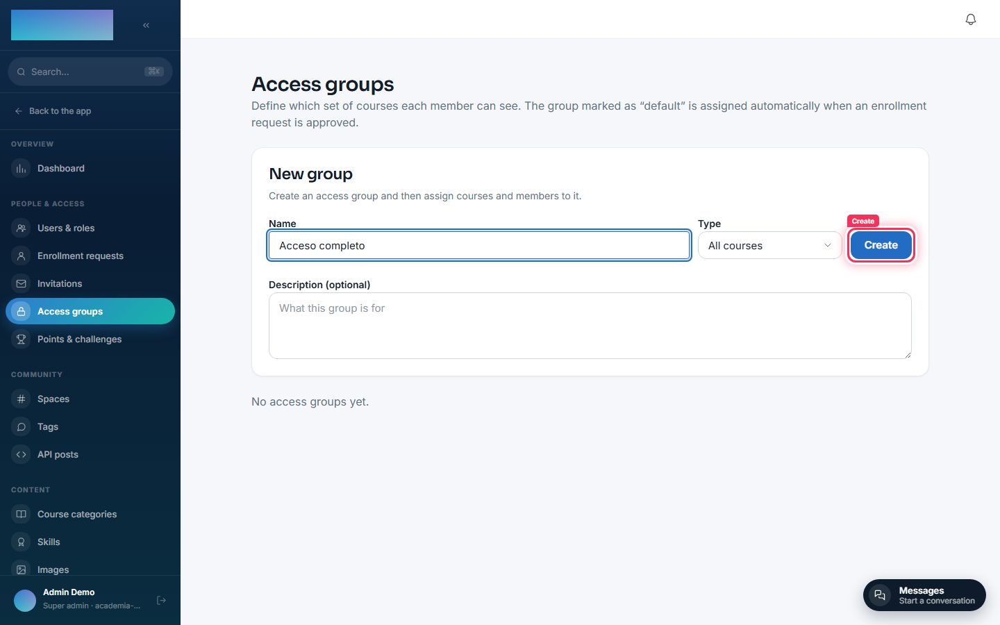

### The plan

Under **Membership** (`/admin/membresia`) we create the plan: name, billing period, currency, price (and an optional struck-through price), trial days and whether it appears pre-selected on the public page.

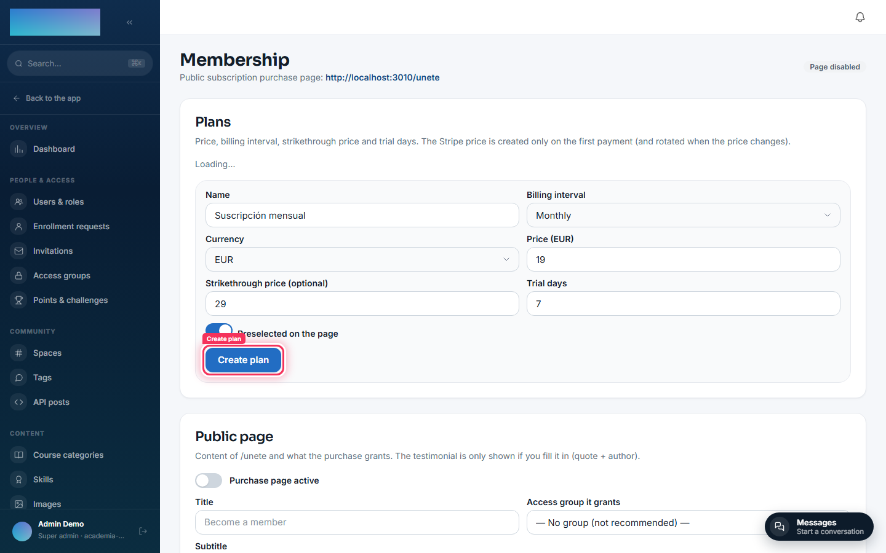

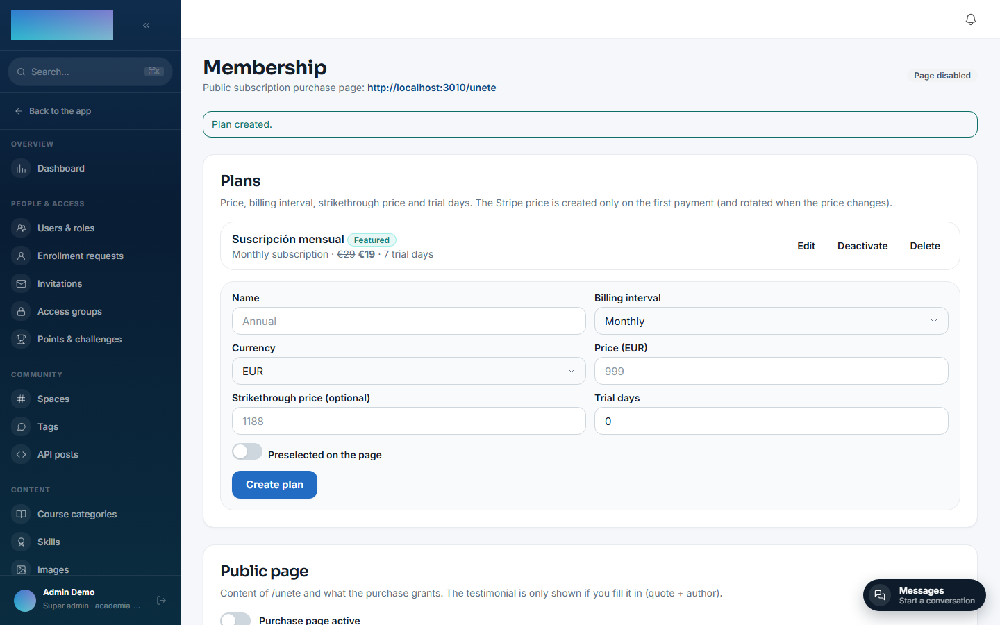

### The public `/unete` page

On the same screen, the "Public page" card controls the content of `/unete`: whether it is enabled, the title, the access group it grants, the subtitle, and whether it shows the catalog of included courses.

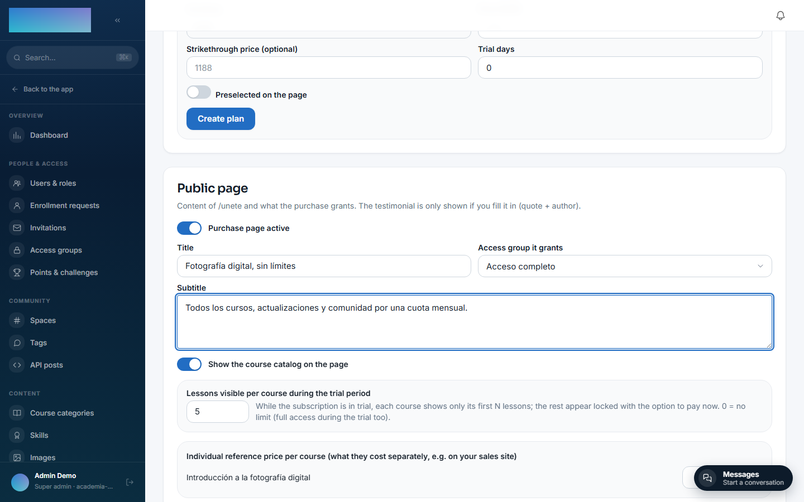

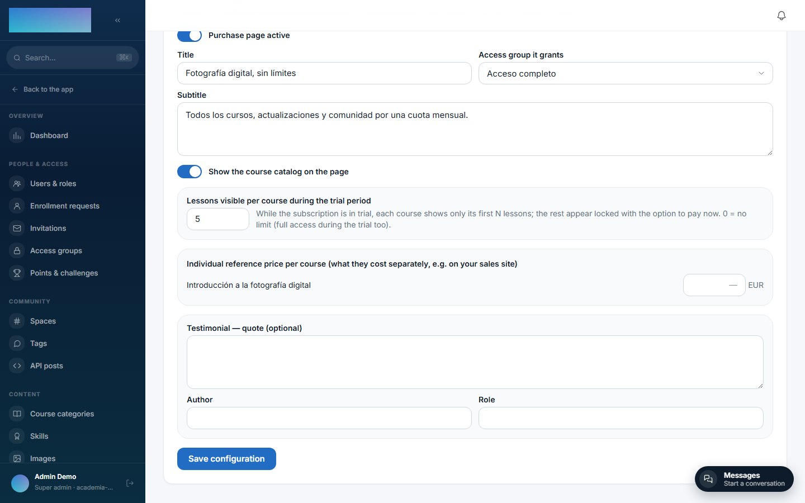

And the result, live and signed out — with the price, the saving, the included course and the FAQ already generated from the tenant's real data:

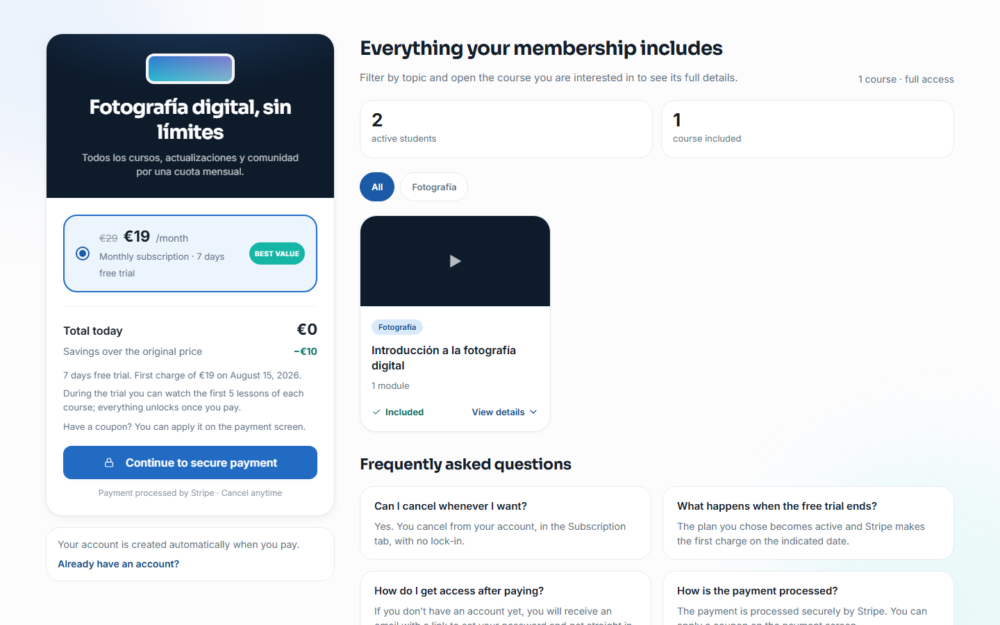

The "Continue to secure payment" button opens Stripe Checkout — it works as soon as you configure Stripe under **Administration → Settings → Payments** (§2), per tenant. With no credentials (neither the tenant's nor the instance fallback), it returns the same error explained above.

## Next step

- [Email](../configuracion/email.md) — instance-wide vs. per-tenant SMTP, templates.
- [mod.billing — Stripe Checkout](../modulos/catalogo/billing.md)
- [mod.subscriptions — Subscriptions](../modulos/catalogo/subscriptions.md)
- [mod.payment-connections — Payment connections](../modulos/catalogo/payment-connections.md) — so you do not confuse it with the above.
