# Recorrido visual: notificaciones y ventas

Segunda parte del recorrido visual — continúa donde termina [Recorrido visual: primeros pasos](recorrido-visual.md). Aquí configuramos el correo saliente y preparamos la instancia para vender: cursos sueltos y membresías.

!!! note "De dónde salen estas capturas"
    Misma instancia aislada y sin seeds de la primera parte. El SMTP apunta al Mailpit del propio `docker-compose.alpha.yml` — es un envío real, no una simulación: el correo de prueba llega de verdad al buzón.

## 1 · Notificaciones (SMTP)

En **Configuración → Notificaciones** (`/admin/configuracion`, tab "Notificaciones") cada tenant puede definir su propio servidor SMTP. Sin esto, la organización hereda el SMTP global de la instancia si el operador lo configuró por variables de entorno — ver [Email](../configuracion/email.md).

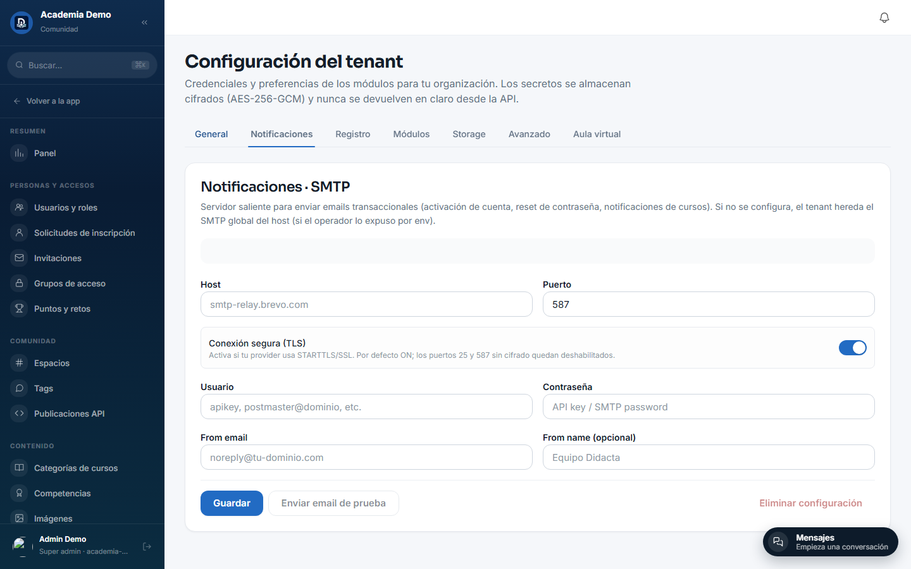

Rellena host, puerto, usuario/contraseña y el remitente. Importante: la **"Conexión segura (TLS)" viene activada por defecto** — solo la necesitas si tu proveedor exige STARTTLS/SSL (típicamente puerto 587 o 465). Un servidor sin cifrado en el puerto 25/1025 (como Mailpit en desarrollo) necesita el TLS **apagado**, o la conexión falla con un error de handshake.

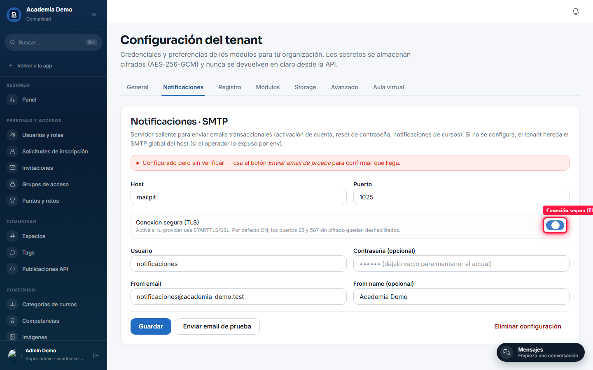

Al guardar, el banner pasa a "configurado pero sin verificar" — Didacta no prueba la conexión al guardar, solo valida el formato.

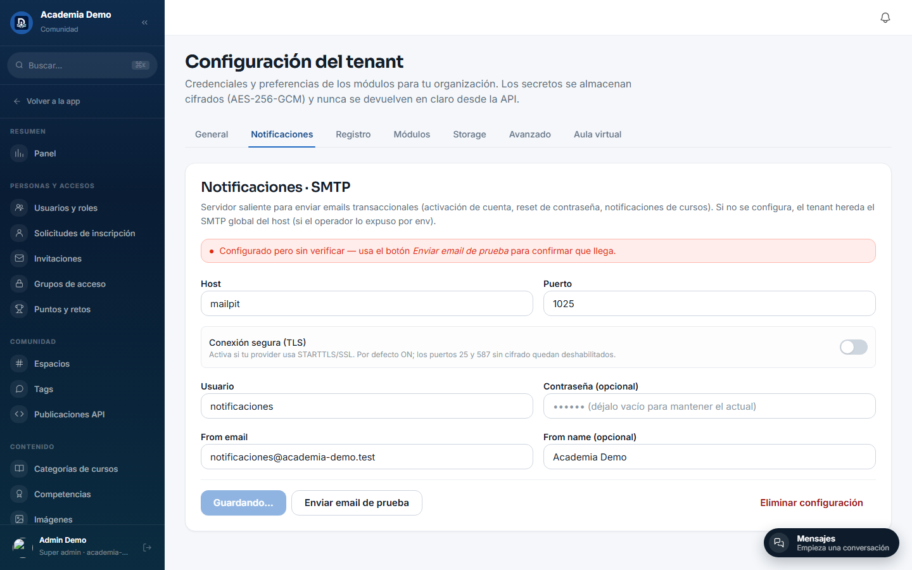

**"Enviar email de prueba"** confirma que la configuración funciona de verdad: abre un diálogo con el email del propio admin prellenado.

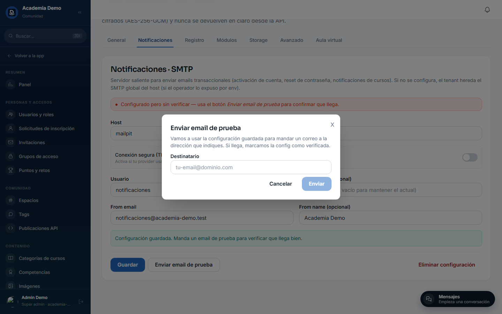

Si el correo llega, el banner pasa a **"Verificado"** con fecha y hora — la señal de que la organización ya puede mandar invitaciones, resets de contraseña y avisos de curso de verdad.

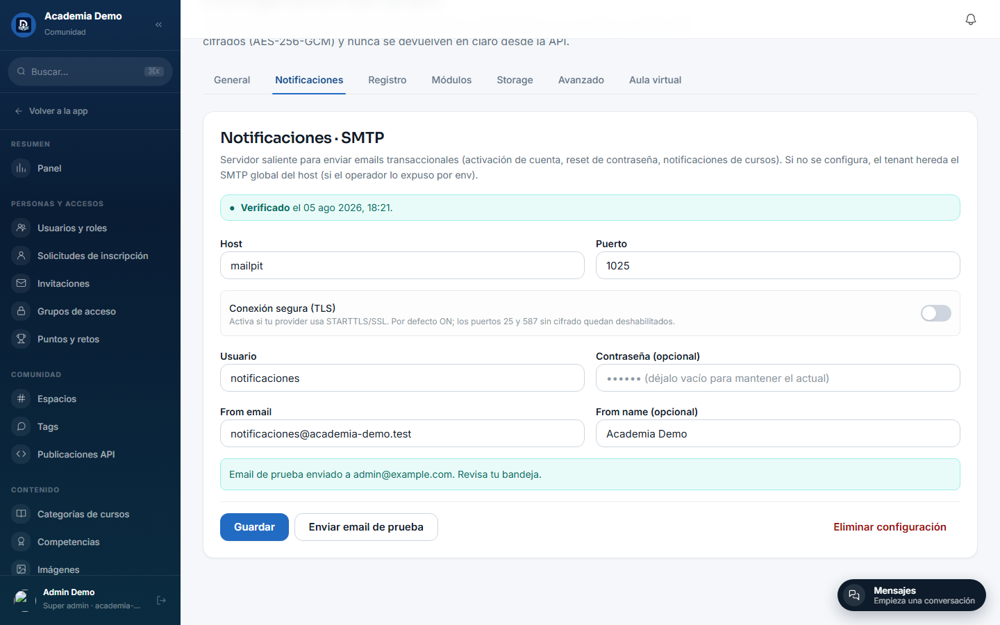

Y el correo, real, en el buzón:

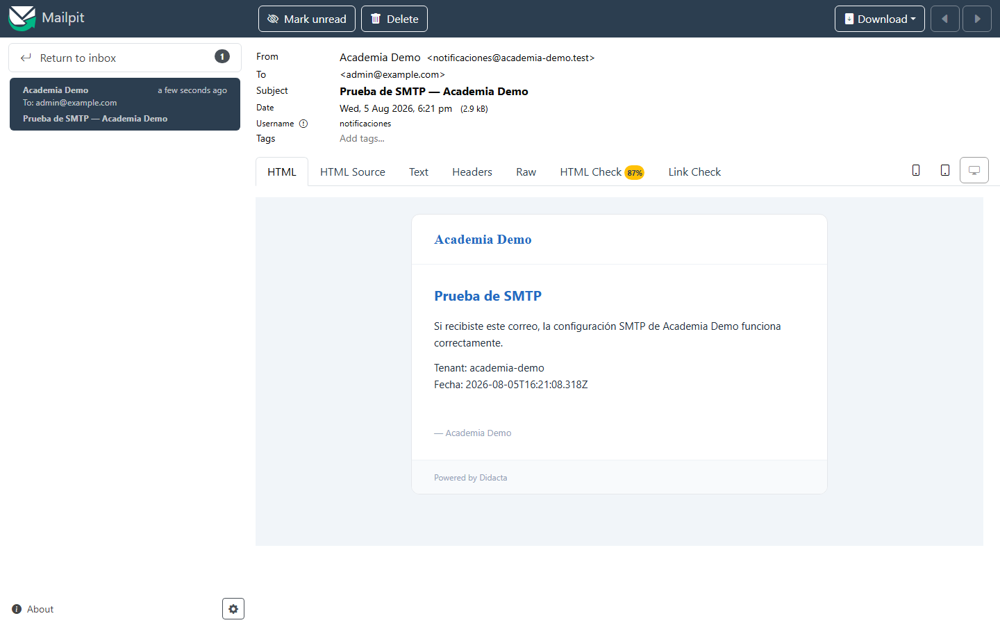

!!! tip "Editar el contenido de los emails"
    El formulario de arriba solo configura el **transporte**. El texto de cada email (asunto, cuerpo) se edita por tenant en **Administración → Emails**, sin tocar código — ver [Email](../configuracion/email.md).

## 2 · Vender cursos sueltos (mod.billing)

A diferencia del SMTP, **Stripe no se configura desde ningún panel de administración**. `STRIPE_SECRET_KEY` y `STRIPE_WEBHOOK_SECRET` son variables de entorno a nivel de instancia (`.env` del operador), compartidas por `mod.billing` (cursos sueltos) y `mod.subscriptions` (membresías) — un solo Stripe account por instancia.

Sin esas variables, **Pagos → Productos Stripe** (`/admin/billing/products`) muestra exactamente esto — el estado real que ve cualquier instalación recién montada:

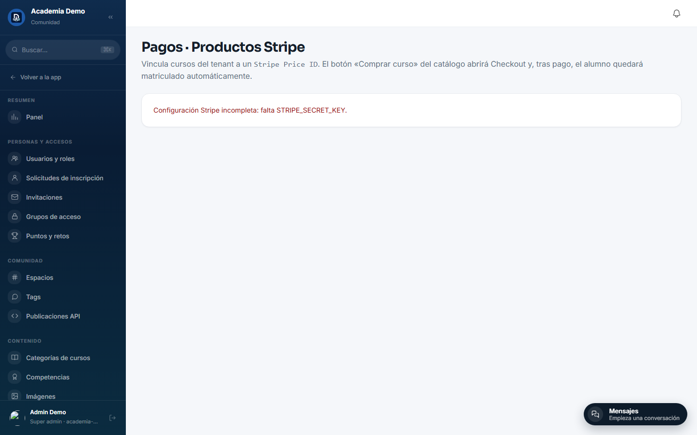

Para activarlo, en el `.env` del operador:

```bash
# Genera el webhook secret en https://dashboard.stripe.com/test/webhooks
# (endpoint: {API_URL}/api/v1/modules/billing/webhook)
STRIPE_SECRET_KEY=sk_test_...
STRIPE_WEBHOOK_SECRET=whsec_...
```

Con eso configurado y el contenedor reiniciado, el panel deja de dar error y aparece el formulario real: eliges un curso publicado, pegas el `price_id` de un **Product + Price ya creado en tu dashboard de Stripe** (Didacta valida contra la API de Stripe que existe y está activo antes de guardar) y el botón «Comprar curso» aparece solo en el catálogo público de ese curso.

!!! warning "No confundir con «Conexiones de pago»"
    `/admin/integraciones/payment-connections` es una pantalla **distinta**: sirve para reconciliar suscriptores de una cuenta de Stripe **externa** con una clave restringida de solo lectura — no habilita el checkout de Didacta. Para vender de verdad, la única vía es `STRIPE_SECRET_KEY`/`STRIPE_WEBHOOK_SECRET` de arriba.

## 3 · Vender membresías (mod.subscriptions)

A diferencia de los cursos sueltos, **crear y editar planes de membresía no necesita Stripe configurado** — el Price de Stripe se genera solo en el primer cobro real. Solo el checkout final (el botón "Continuar al pago seguro") depende de las mismas variables del paso anterior.

### Grupo de acceso

Cada plan concede acceso a través de un **grupo de acceso**. Antes de crear el plan, damos de alta uno en `/admin/grupos-acceso` con tipo "Todos los cursos":

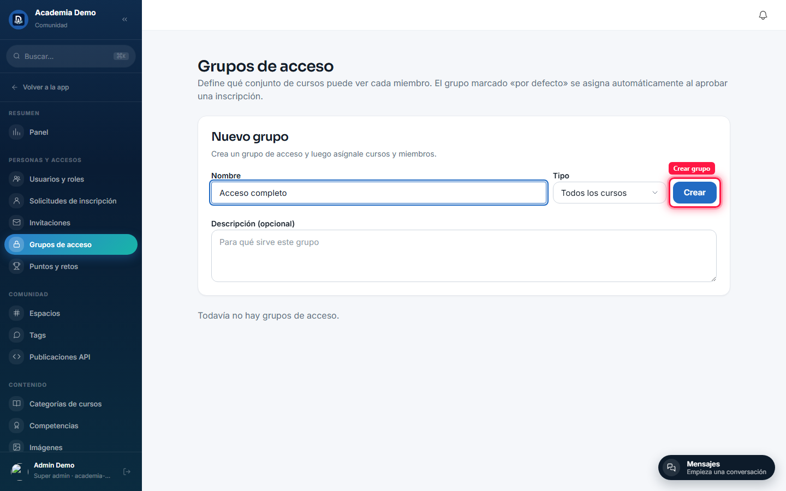

### El plan

En **Membresía** (`/admin/membresia`) creamos el plan: nombre, periodicidad, moneda, precio (y precio tachado opcional), días de prueba y si aparece preseleccionado en la página pública.


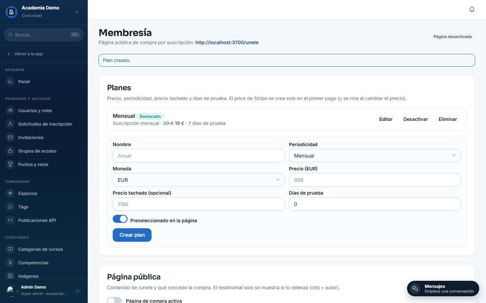

### La página pública `/unete`

En la misma pantalla, la tarjeta "Página pública" controla el contenido de `/unete`: activarla, título, el grupo de acceso que otorga, subtítulo, y si muestra el catálogo de cursos incluidos.

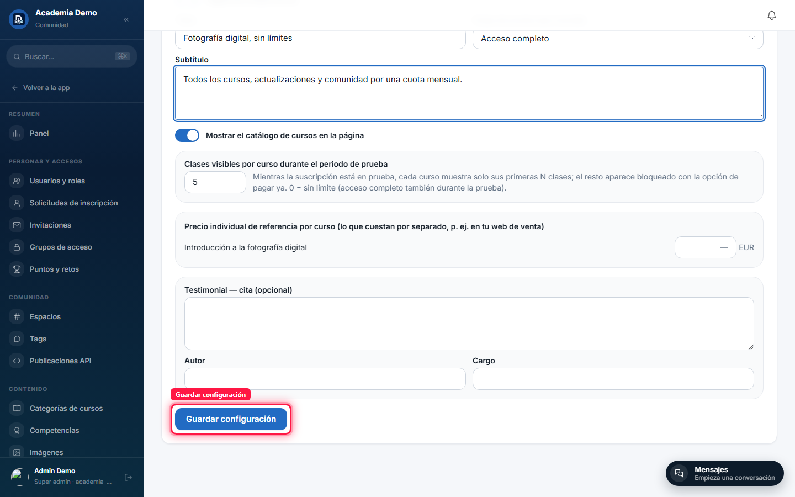

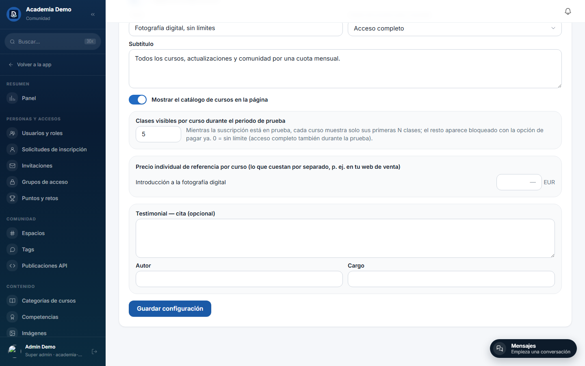

Y el resultado, en vivo, sin sesión — con el precio, el ahorro, el curso incluido y las preguntas frecuentes ya generadas a partir de datos reales del tenant:

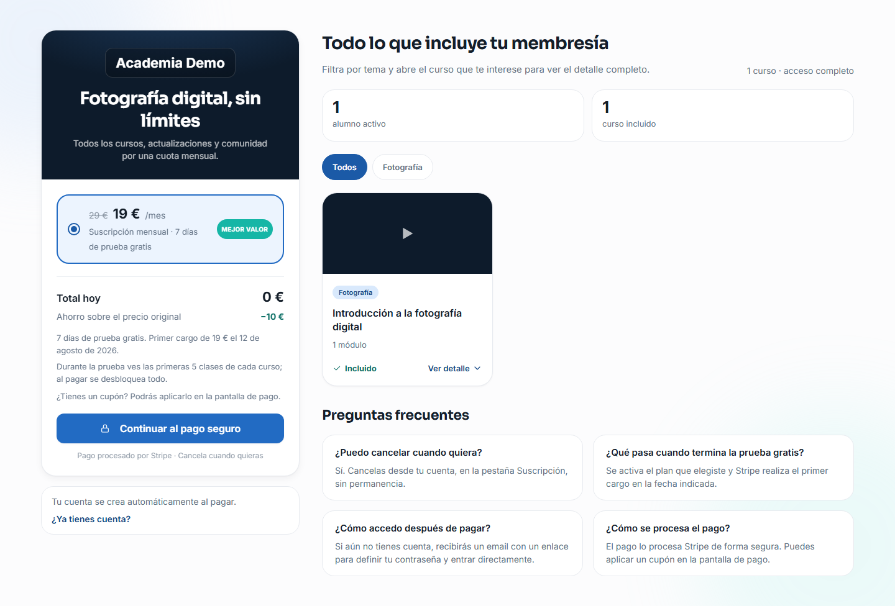

El botón "Continuar al pago seguro" abre Stripe Checkout — funciona en cuanto el operador configure `STRIPE_SECRET_KEY`/`STRIPE_WEBHOOK_SECRET` (§2). Sin ellas, responde el mismo error explicado arriba.

## Siguiente paso

- [Email](../configuracion/email.md) — SMTP global vs. por tenant, plantillas.
- [mod.billing — Stripe Checkout](../modulos/catalogo/billing.md)
- [mod.subscriptions — Suscripciones](../modulos/catalogo/subscriptions.md)
- [mod.payment-connections — Conexiones de pago](../modulos/catalogo/payment-connections.md) — para no confundirlo con lo anterior.
