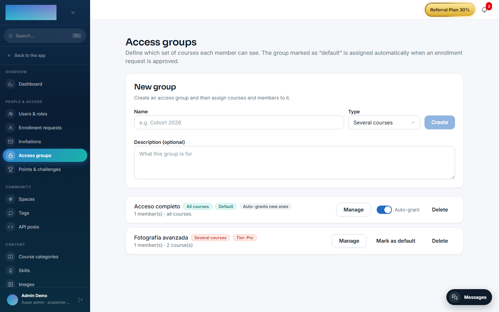
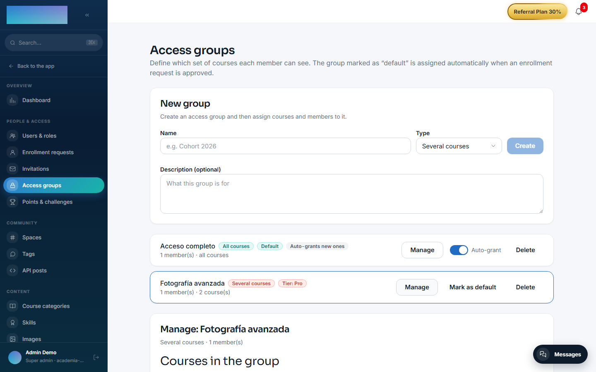
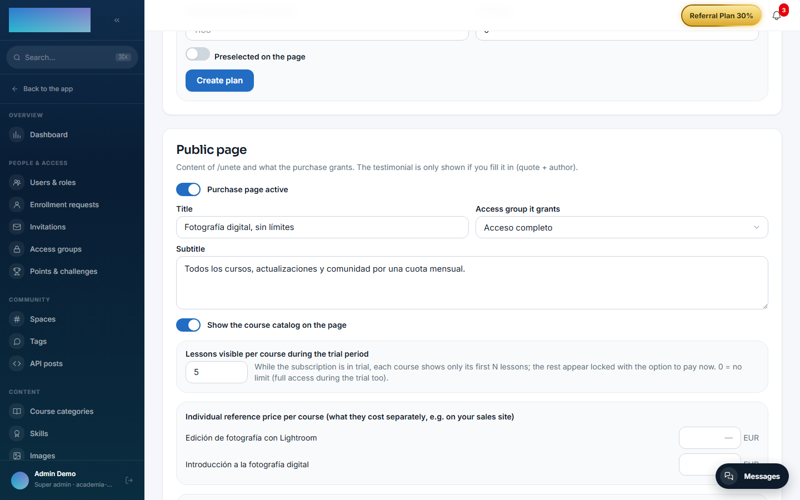

# mod.access-groups — Access groups

Community · **Core** category (always active — trying to disable it returns `422 CORE_MODULE_NOT_DISABLEABLE`)

## What it does

It encapsulates the entitlement "which courses a member can see" as a composable building block. A group is defined with one of three kinds (`kind`):

- **`ALL_COURSES`** — every published course, with `autoGrantNewCourses` to enroll members automatically in each new course.
- **`COURSE`** / **`MULTI_COURSE`** — an explicit set of courses.

Group membership materialises as **real core enrollments** (through `mod.learning`, with origin `GROUP`), never by touching another module's tables.

## How it works

- Members arrive through three routes with different owners: **MANUAL** (added by an admin or on registration approval — *sticky*, never revoked on its own), **TIER** (reconciled against `mod.payment-connections` tiers) and **MEMBERSHIP** (granted by the paid membership from `mod.subscriptions`).
- The key design idea is **refcounting with provenance**: a course is only unenrolled when no live group grants it, and enrollments with origin `PURCHASE`, `SUBSCRIPTION` or `API` are never touched.
- Revocation on cancellation or non-payment removes **only** the memberships whose origin is `MEMBERSHIP`. In `/admin/grupos-acceso` and in the user dossier, those memberships are marked with the "By membership" badge.
- Deleting a group revokes its memberships and cleans up orphaned drip schedules.
- A group can be flagged `isDefaultForApproval` (granted when registrations are approved) or linked to a tier (`linkedTierName`).

It is a first-party module **formalised as a package** (`modules/access-groups/`, with its own manifest) whose NestJS orchestration — controller, Prisma service and event bridges — lives in the host (`apps/api/src/modules/access-groups/`), the standard built-in module pattern.

## Configuration

Being a **core**-category module, it does not appear in the list of switchable modules (Administration → Brand & settings → Settings, "Modules" tab): it is always active for every tenant. It reads no environment variables of its own and no setting requires an Enterprise licence — everything is Community.

Everything is configured from the panel, always with an admin role (`super_admin` / `tenant_admin`):

- **Create a group** — `/admin/grupos-acceso` (Administration → People & access → "Access groups"): fields "Name", "Type" ("All courses", "Several courses", "One course") and "Description (optional)".
- **"Mark as default"** — `/admin/grupos-acceso`: sets `isDefaultForApproval`; that group is granted when `mod.member-registration` requests are approved.
- **"Auto-grant" switch** — `/admin/grupos-acceso`, only on "All courses" groups: `autoGrantNewCourses`, enrolls members in every course as it is published.
- **"Courses in the group"** — `/admin/grupos-acceso` → "Manage": the course set of a "Several courses"/"One course" group, with "Save courses".
- **"Tier link (payments)"** — `/admin/grupos-acceso` → "Manage": "Tier name" field + "Save link" (`linkedTierName`). Reconciliation is triggered with the "Sync tiers from payments" button on `/admin/integraciones/payment-connections` (owner: `mod.payment-connections`).
- **"Access group it grants"** — `/admin/membresia`: which group the paid membership grants. That setting belongs to `mod.subscriptions`, not to this module.

## Step-by-step usage

1. Go to Administration → People & access → **Access groups** (`/admin/grupos-acceso`).
2. Under "New group", type the "Name", pick the "Type" and press **Create**.

3. Press **Manage** on the newly created group:
    - On a "Several courses" or "One course" group, tick the published courses and press **Save courses**.
    - An "All courses" group needs no selection; turn on the "Auto-grant" switch if you also want it to enroll members in every new course.
4. Add members by hand: search by name or email, press **Search** and then **Add** next to the user. These additions have origin `MANUAL` (*sticky*): only an admin removes them with **Remove**. Members who arrived through payments are marked with the "By tier" and "By membership" badges.

5. *(Optional)* Press **Mark as default** on the group that should be granted when member registrations are approved.
6. *(Optional, with `mod.payment-connections`)* Under "Tier link (payments)", type the "Tier name" and press **Save link**. Users whose effective tier matches join (and leave when downgraded) when you press **Sync tiers from payments** on `/admin/integraciones/payment-connections`.
7. *(Optional, with `mod.subscriptions`)* On `/admin/membresia`, pick the group under "Access group it grants" so the paid membership grants and revokes it on its own.

The member never sees "groups" on any screen: the group's courses simply show up as active enrollments in `/cursos`, and disappear when no live group grants them (enrollments from any other origin are never touched).

## Dependencies

- Hard: `mod.courses`, `mod.learning`. Optional: `mod.payment-connections`, `mod.subscriptions`.

## Data model

`mod_access_groups_group` (group, kind, flags) · `mod_access_groups_group_course` (the group's courses) · `mod_access_groups_group_member` (membership with `status` and `source`) · `mod_access_groups_grant` (provenance/refcount per group, user and course).

## API

Prefix `/modules/access-groups` — **everything requires admin**, reads included (they expose the roster). Details in [Reference → Learning](../../api/referencia/aprendizaje.md#access-groups-modulesaccess-groups-all-admin).

## Events

- **Emits**: none.
- **Consumes**: `courses.course.published`, `payment_connections.user_tier.changed`, `subscriptions.membership.activated`, `subscriptions.subscription.activated/canceled/unpaid`.
