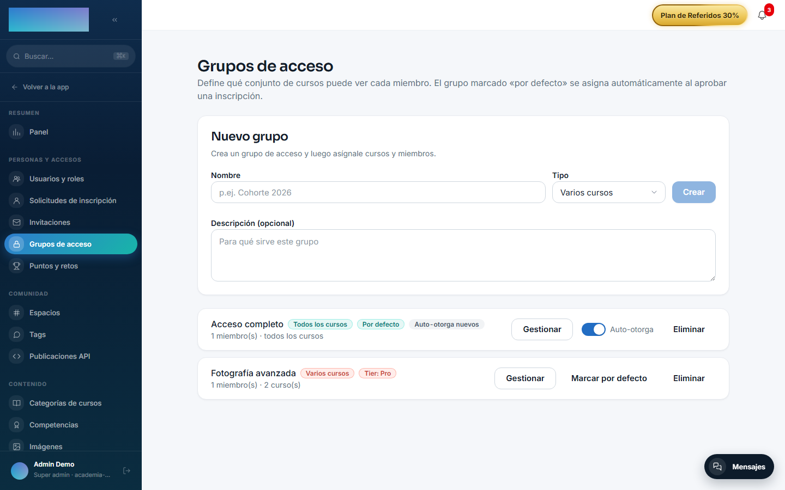
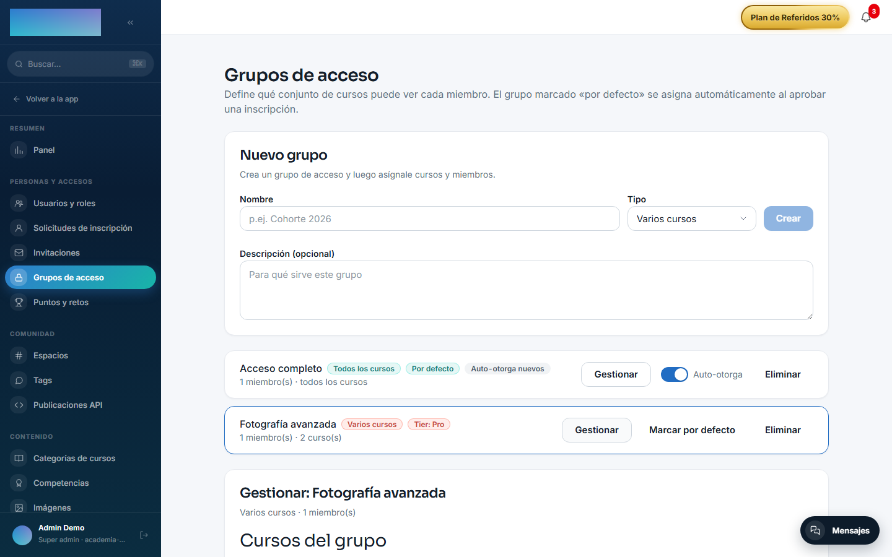
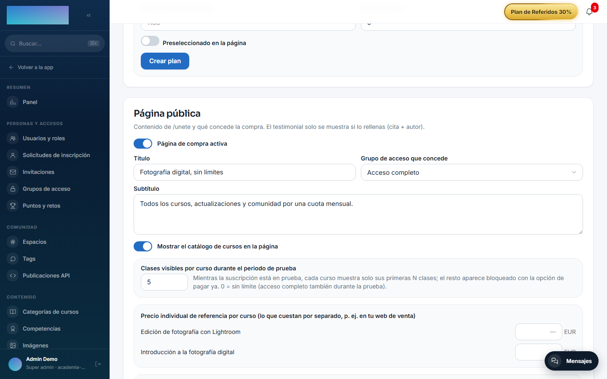

# mod.access-groups — Grupos de acceso

Community · Categoría **core** (siempre activo — intentar desactivarlo responde `422 CORE_MODULE_NOT_DISABLEABLE`)

## Qué hace

Encapsula el *entitlement* «qué cursos puede ver un miembro» como pieza componible. Un grupo se define con tres tipos (`kind`):

- **`ALL_COURSES`** — todos los cursos publicados, con `autoGrantNewCourses` para matricular automáticamente en cada curso nuevo.
- **`COURSE`** / **`MULTI_COURSE`** — un set explícito de cursos.

La pertenencia al grupo se materializa como **matrículas reales** del core (vía `mod.learning`, con origen `GROUP`), nunca tocando tablas ajenas.

## Cómo funciona

- Los miembros entran por tres vías con dueño distinto: **MANUAL** (alta del admin o aprobación de inscripción — *sticky*, nunca se revoca sola), **TIER** (reconciliada con los tiers de `mod.payment-connections`) y **MEMBERSHIP** (concedida por la membresía de pago de `mod.subscriptions`).
- La clave del diseño es el **refcount con provenance**: un curso solo se desmatricula cuando ningún grupo vivo lo otorga, y jamás se tocan matrículas de origen `PURCHASE`, `SUBSCRIPTION` o `API`.
- La revocación por cancelación o impago retira **solo** las membresías de origen `MEMBERSHIP`. En `/admin/grupos-acceso` y en el dossier del usuario, esas membresías se distinguen con el badge «Por membresía».
- Borrar un grupo revoca sus membresías y limpia los calendarios de drip huérfanos.
- Un grupo puede marcarse `isDefaultForApproval` (se concede al aprobar inscripciones) o vincularse a un tier (`linkedTierName`).

Es un módulo first-party **formalizado como paquete** (`modules/access-groups/`, manifest propio) cuya orquestación NestJS —controller, service Prisma y bridges de eventos— vive en el host (`apps/api/src/modules/access-groups/`), el patrón estándar de módulo built-in.

## Configuración

Al ser de categoría **core** no aparece en el listado de módulos activables (Administración → Marca y ajustes → Configuración, pestaña «Módulos»): está siempre activo en todos los tenants. No lee ninguna variable de entorno propia y ningún ajuste exige licencia Enterprise — todo es Community.

Todo se configura desde el panel, siempre con rol admin (`super_admin` / `tenant_admin`):

- **Crear grupo** — `/admin/grupos-acceso` (Administración → Personas y accesos → «Grupos de acceso»): campos «Nombre», «Tipo» («Todos los cursos», «Varios cursos», «Un curso») y «Descripción (opcional)».
- **«Marcar por defecto»** — `/admin/grupos-acceso`: fija `isDefaultForApproval`; ese grupo se concede al aprobar solicitudes de `mod.member-registration`.
- **Interruptor «Auto-otorga»** — `/admin/grupos-acceso`, solo en grupos «Todos los cursos»: `autoGrantNewCourses`, matricula a los miembros en cada curso que se publique.
- **«Cursos del grupo»** — `/admin/grupos-acceso` → «Gestionar»: el set de cursos de un grupo «Varios cursos»/«Un curso», con «Guardar cursos».
- **«Vínculo con tier (pagos)»** — `/admin/grupos-acceso` → «Gestionar»: campo «Nombre del tier» + «Guardar vínculo» (`linkedTierName`). La reconciliación se lanza con el botón «Sincronizar tiers desde pagos» de `/admin/integraciones/payment-connections` (dueño: `mod.payment-connections`).
- **«Grupo de acceso que concede»** — `/admin/membresia`: qué grupo otorga la membresía de pago. El ajuste pertenece a `mod.subscriptions`, no a este módulo.

## Uso paso a paso

1. Entra en Administración → Personas y accesos → **Grupos de acceso** (`/admin/grupos-acceso`).
2. En «Nuevo grupo», escribe el «Nombre», elige el «Tipo» y pulsa **Crear**.

3. Pulsa **Gestionar** en el grupo recién creado:
    - En un grupo «Varios cursos» o «Un curso», marca los cursos publicados y pulsa **Guardar cursos**.
    - Un grupo «Todos los cursos» no pide selección; activa el interruptor «Auto-otorga» si además quieres que matricule en cada curso nuevo.
4. Añade miembros a mano: busca por nombre o email, pulsa **Buscar** y después **Añadir** junto al usuario. Estas altas son de origen `MANUAL` (*sticky*): solo las retira un admin con **Quitar**. Los miembros que llegaron por pagos se distinguen con los badges «Por tier» y «Por membresía».

5. *(Opcional)* Pulsa **Marcar por defecto** en el grupo que deba concederse al aprobar inscripciones de miembros.
6. *(Opcional, con `mod.payment-connections`)* En «Vínculo con tier (pagos)», escribe el «Nombre del tier» y pulsa **Guardar vínculo**. Los usuarios cuyo tier efectivo coincida entran (y salen al bajar de tier) al pulsar **Sincronizar tiers desde pagos** en `/admin/integraciones/payment-connections`.
7. *(Opcional, con `mod.subscriptions`)* En `/admin/membresia`, elige el grupo en «Grupo de acceso que concede» para que la membresía de pago lo otorgue y lo revoque sola.

El miembro no ve «grupos» en ninguna pantalla: simplemente los cursos del grupo aparecen como matrículas activas en `/cursos`, y desaparecen si ningún grupo vivo los otorga (las matrículas de otro origen nunca se tocan).

## Dependencias

- Duras: `mod.courses`, `mod.learning`. Opcionales: `mod.payment-connections`, `mod.subscriptions`.

## Modelo de datos

`mod_access_groups_group` (grupo, kind, flags) · `mod_access_groups_group_course` (cursos del grupo) · `mod_access_groups_group_member` (membresía con `status` y `source`) · `mod_access_groups_grant` (provenance/refcount por grupo, usuario y curso).

## API

Prefijo `/modules/access-groups` — **todo requiere admin**, incluidas las lecturas (exponen el roster). Detalle en [Referencia → Aprendizaje](../../api/referencia/aprendizaje.md#grupos-de-acceso-modulesaccess-groups-todo-admin).

## Eventos

- **Emite**: ninguno.
- **Consume**: `courses.course.published`, `payment_connections.user_tier.changed`, `subscriptions.membership.activated`, `subscriptions.subscription.activated/canceled/unpaid`.
