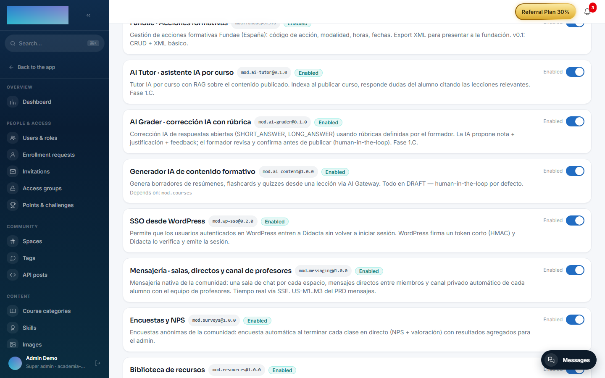

# mod.ai-content — Learning content generator

Community · **AI** category (can be disabled)

## What it does

It generates **learning drafts** from a lesson's text: summaries (`SUMMARY`), flashcards (`FLASHCARDS`) and quizzes (`QUIZ`). The result is always persisted as a **draft**: the instructor reviews it, can edit the JSON, and then publishes or rejects it with a reason. **Human-in-the-loop by default** — nothing is published automatically.

## How it works

- The prompt is specific to each type and the call goes through the [AI Gateway](../../configuracion/ia.md) with the tenant's configuration.
- Every draft records generation telemetry: provider, model and input/output tokens.
- A lesson with no text returns `AI_CONTENT_LESSON_TEXT_EMPTY` 422; with no provider configured, a 503 with a clear message.
- Only a draft in `DRAFT` state can be edited/published/rejected (409 in any other state).
- The instructor waits for the generation (~5-30 s); there is no streaming yet. Automatic ingestion of a published quiz into `mod.assessments` is a later step — today the flow emits the event and the instructor creates the quiz.

## Configuration

**Enabling the module.** Under `/admin/configuracion?tab=modules` (the "Modules" tab). The module's row shows "Depends on: mod.courses" — its only hard dependency. This module contributes no screen of its own today: no menu entry and no panel; its entire surface is the API.

**AI provider (BYOK).** It only uses the AI Gateway's **chat** purpose: the **"Chat (AI tutor)"** block under `/admin/ia/providers` ("Integrations and API → AI providers" in the menu) or, failing that, the global default `DEFAULT_AI_CHAT_*`. Chat providers the code accepts today: OpenAI, Anthropic (Claude), Google Gemini, OpenRouter, Mistral AI, Groq and Ollama (self-hosted). Gateway and key-encryption details in [Configuration → AI](../../configuracion/ia.md). With no provider configured (or if the provider fails), generation returns **503** `AI_CONTENT_PROVIDER_ERROR`.

**No variables of its own, no per-tenant settings and no Enterprise license requirement.**

## Step by step

The whole flow is API-driven (instructor, tenant_admin or super_admin role), under the `/modules/ai-content` prefix:

1. **Generate**: `POST /modules/ai-content/generate` with `{ "lessonId": "...", "courseId": "...", "type": "SUMMARY" | "FLASHCARDS" | "QUIZ" }`. The call is synchronous (~5-30 s) and returns the draft in `DRAFT` state with its telemetry (provider, model, tokens). The lesson must belong to the course and have text.
2. **Review**: `GET /modules/ai-content/drafts` (optional filters `lessonId`, `courseId`, `status`) and `GET /modules/ai-content/drafts/:id` for the detail.
3. **Edit** (optional): `PATCH /modules/ai-content/drafts/:id/content` with the corrected JSON; the shape is revalidated per type (`SUMMARY` → `{text}`, `FLASHCARDS` → `{cards:[{front,back}]}`, `QUIZ` → `{questions:[{prompt,options?,answer,explanation?}]}`). Only in `DRAFT` state.
4. **Decide**: `PATCH /modules/ai-content/drafts/:id/publish` or `PATCH /modules/ai-content/drafts/:id/reject` (with an optional `reason`). Each draft is published or rejected exactly once; in any other state the transition returns 409.
5. Publishing emits `ai-content.draft.published`. A published quiz is **not** automatically turned into a `mod.assessments` quiz today: the instructor creates it by hand from the draft's content.

## Dependencies

Hard: `mod.courses` (to resolve the course and validate that the lesson belongs to it).

## Data model

`mod_ai_content_draft` — the draft: type, state (`DRAFT`/`PUBLISHED`/`REJECTED`), JSON content (a different shape per type) and AI telemetry.

## API

Prefix `/modules/ai-content` (instructor and above): `generate`, `drafts` listing/detail and state transitions. Details in [Reference → Payments, classroom and AI](../../api/referencia/pagos-directo-ia.md#ai).

## Events

**Emits**: `ai-content.draft.generated`, `ai-content.draft.published`, `ai-content.draft.rejected`. It consumes none.
