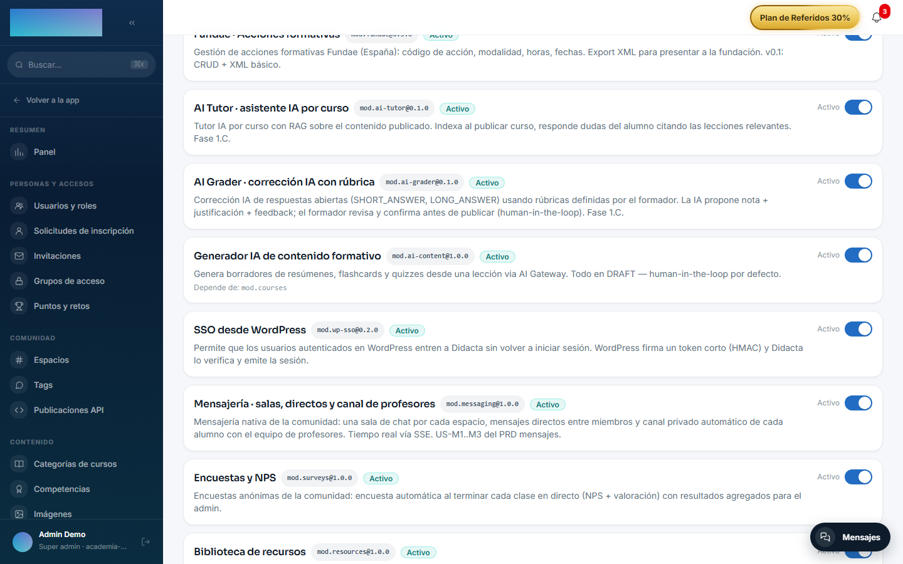

# mod.ai-content — Generador de contenido formativo

Community · Categoría **ai** (desactivable)

## Qué hace

Genera **borradores formativos** a partir del texto de una lección: resúmenes (`SUMMARY`), flashcards (`FLASHCARDS`) y quizzes (`QUIZ`). El resultado se persiste siempre como **borrador**: el formador revisa, puede editar el JSON, y después publica o rechaza con motivo. **Human-in-the-loop por defecto** — nada se publica automáticamente.

## Cómo funciona

- El prompt es específico por tipo y la llamada pasa por el [AI Gateway](../../configuracion/ia.md) con la configuración del tenant.
- Cada borrador guarda telemetría de la generación: proveedor, modelo y tokens de entrada/salida.
- Una lección sin texto responde `AI_CONTENT_LESSON_TEXT_EMPTY` 422; sin proveedor configurado, 503 con mensaje claro.
- Solo se puede editar/publicar/rechazar un borrador en estado `DRAFT` (409 en otro estado).
- El formador espera la generación (~5-30 s); no hay streaming todavía. La ingestión automática del quiz publicado hacia `mod.assessments` es un paso posterior — hoy el flujo emite el evento y el formador crea el quiz.

## Configuración

**Activar el módulo.** En `/admin/configuracion?tab=modules` (pestaña «Módulos»). La fila del módulo muestra «Depende de: mod.courses» — su única dependencia dura. Este módulo no aporta hoy ninguna pantalla propia: ni entrada de menú ni panel; toda su superficie es la API.

**Proveedor de IA (BYOK).** Usa solo el propósito **chat** del AI Gateway: bloque **«Chat (tutor IA)»** de `/admin/ia/providers` (menú «Integraciones y API → Proveedores de IA») o, en su defecto, el default global `DEFAULT_AI_CHAT_*`. Proveedores de chat que acepta el código hoy: OpenAI, Anthropic (Claude), Google Gemini, OpenRouter, Mistral AI, Groq y Ollama (self-hosted). Detalle del gateway y del cifrado de claves en [Configuración → IA](../../configuracion/ia.md). Sin proveedor configurado (o si el proveedor falla), la generación devuelve **503** `AI_CONTENT_PROVIDER_ERROR`.

**Sin variables propias, sin ajustes por tenant y sin exigencia de licencia Enterprise.**

## Uso paso a paso

Todo el flujo es por API (rol formador, tenant_admin o super_admin), con el prefijo `/modules/ai-content`:

1. **Generar**: `POST /modules/ai-content/generate` con `{ "lessonId": "...", "courseId": "...", "type": "SUMMARY" | "FLASHCARDS" | "QUIZ" }`. La llamada es síncrona (~5-30 s) y devuelve el borrador en estado `DRAFT` con su telemetría (proveedor, modelo, tokens). La lección debe pertenecer al curso y tener texto.
2. **Revisar**: `GET /modules/ai-content/drafts` (filtros opcionales `lessonId`, `courseId`, `status`) y `GET /modules/ai-content/drafts/:id` para el detalle.
3. **Editar** (opcional): `PATCH /modules/ai-content/drafts/:id/content` con el JSON corregido; se revalida la forma por tipo (`SUMMARY` → `{text}`, `FLASHCARDS` → `{cards:[{front,back}]}`, `QUIZ` → `{questions:[{prompt,options?,answer,explanation?}]}`). Solo en estado `DRAFT`.
4. **Decidir**: `PATCH /modules/ai-content/drafts/:id/publish` o `PATCH /modules/ai-content/drafts/:id/reject` (con `reason` opcional). Cada borrador se publica o rechaza una sola vez; en otro estado la transición responde 409.
5. Publicar emite `ai-content.draft.published`. El quiz publicado **no** se convierte hoy automáticamente en un quiz de `mod.assessments`: el formador lo crea a mano con el contenido del borrador.

## Dependencias

Dura: `mod.courses` (resolver el curso y validar que la lección le pertenece).

## Modelo de datos

`mod_ai_content_draft` — el borrador: tipo, estado (`DRAFT`/`PUBLISHED`/`REJECTED`), contenido JSON (forma distinta por tipo) y telemetría IA.

## API

Prefijo `/modules/ai-content` (formador+): `generate`, listado/detalle de `drafts` y transiciones. Detalle en [Referencia → Pagos, aula e IA](../../api/referencia/pagos-directo-ia.md#ia).

## Eventos

**Emite**: `ai-content.draft.generated`, `ai-content.draft.published`, `ai-content.draft.rejected`. No consume.
