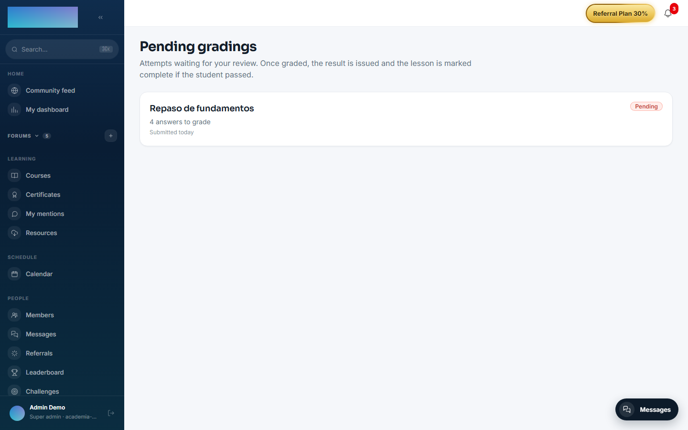
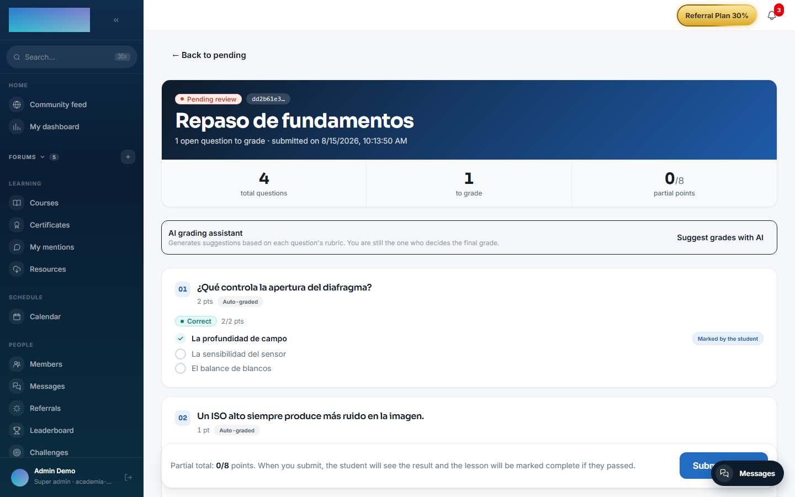

# mod.ai-grader — AI grading with rubrics

Community · **AI** category (can be disabled)

## What it does

AI-assisted grading for the open-ended questions in [mod.assessments](assessments.md) (`SHORT_ANSWER`, `LONG_ANSWER`). The instructor defines a **rubric per question** (instructions + 1-8 weighted criteria); the AI reads the rubric and the student's answer and proposes a **score with a per-criterion justification** plus overall feedback. The score is **never published on its own**: the instructor reviews and applies (or discards) the suggestion. The module records AI–human agreement metrics.

## How it works

- The criteria weights must add up to the question's points (validated when the rubric is saved).
- There is **one suggestion per answer**: regenerating with `force` replaces the previous one; without `force`, the cached one is served without calling the model again.
- "Apply" on a suggestion only marks it as applied for auditing — the real score is set through the manual grading in assessments (`POST attempts/:id/grade`), keeping a single grading path.
- Suggestions are persisted so they can be reviewed later without spending tokens.

## Configuration

**Enabling the module.** Under `/admin/configuracion?tab=modules` (the "Modules" tab). The module contributes the **"Grading"** entry to the Instructor group of the sidebar (`/formador/correcciones`). If the module is disabled, the manual grading page keeps working: AI suggestions simply do not load.

**AI provider (BYOK).** It only uses the AI Gateway's **chat** purpose: the **"Chat (AI tutor)"** block under `/admin/ia/providers` ("Integrations and API → AI providers" in the menu) or, failing that, the global default `DEFAULT_AI_CHAT_*`. Chat providers the code accepts today: OpenAI, Anthropic (Claude), Google Gemini, OpenRouter, Mistral AI, Groq and Ollama (self-hosted). Gateway and key-encryption details in [Configuration → AI](../../configuracion/ia.md). With no provider configured (or if the provider fails), the suggestions request returns **502** `AI_GRADER_PROVIDER_ERROR`; manual grading is unaffected.

**Rubrics.** There is no rubric editing screen yet: they are managed through the API (`GET`/`PUT`/`DELETE /modules/ai-grader/questions/:questionId/rubric`, instructor role and above). Validations on save: instructions from 10 to 2000 characters, 1 to 8 criteria, each criterion with a name, a description and an integer weight (1-100), and the weights summing to the question's points.

**No variables of its own, no per-tenant settings and no Enterprise license requirement.**

## Step by step

**Preparation (instructor, through the API)**

1. Create the rubric for each open-ended question of the quiz with `PUT /modules/ai-grader/questions/:questionId/rubric`, body `{ "instructions": "...", "criteria": [{ "name": "...", "description": "...", "weight": n }] }`. Questions with no rubric are skipped when generating suggestions (that is not an error).

**Grading (instructor, in the panel)**

1. Open **"Grading"** in the menu (Instructor group): the "Pending gradings" page lists attempts with open answers waiting for review, with the "Pending" badge and "N answers to grade".

    

2. Enter an attempt (`/formador/correcciones/[id]`): you will see each question with the "Student's answer" and, for the open-ended ones, the "Points (max N)" and "Feedback (optional)" fields.
3. In the **"AI grading assistant"** block, click **"Suggest grades with AI"**. One suggestion is generated per open question with a rubric; the notice sums it up: "N suggestions generated.", "N questions without a rubric." and "Tokens: N.".
4. Each suggestion appears under its question with the **"AI suggestion"** badge, the proposed score ("X/Y pts · provider"), the overall feedback and the per-criterion breakdown with its justification.

    

5. Click **"Apply to the form"** to copy the score and feedback into the grading fields — you can edit them before submitting. Applying only marks the suggestion for auditing. **"Re-generate"** forces a new model call and replaces the suggestion; without regenerating, re-entering the attempt serves the persisted one without spending tokens.
6. Click **"Submit grades"**: the grade is issued by mod.assessments (the single grading path), the student sees the result and the lesson is marked complete if they passed.

## Dependencies

Optional: `mod.assessments` (the source of attempts, answers and questions).

## Data model

`mod_ai_grader_rubric` (one per question: instructions + weighted criteria as JSON) · `mod_ai_grader_suggestion` (proposed score, per-criterion breakdown, provider/model, application traces).

## API

Prefix `/modules/ai-grader` (instructor and above): rubric management and the suggestion cycle. Details in [Reference → Payments, classroom and AI](../../api/referencia/pagos-directo-ia.md#ai).

## Events

**Emits**: `ai-grader.suggestion.generated`, `ai-grader.suggestion.failed`. It consumes none.
