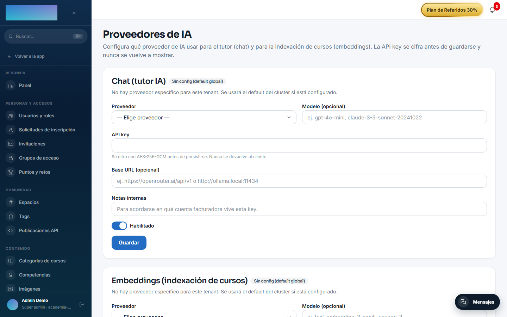
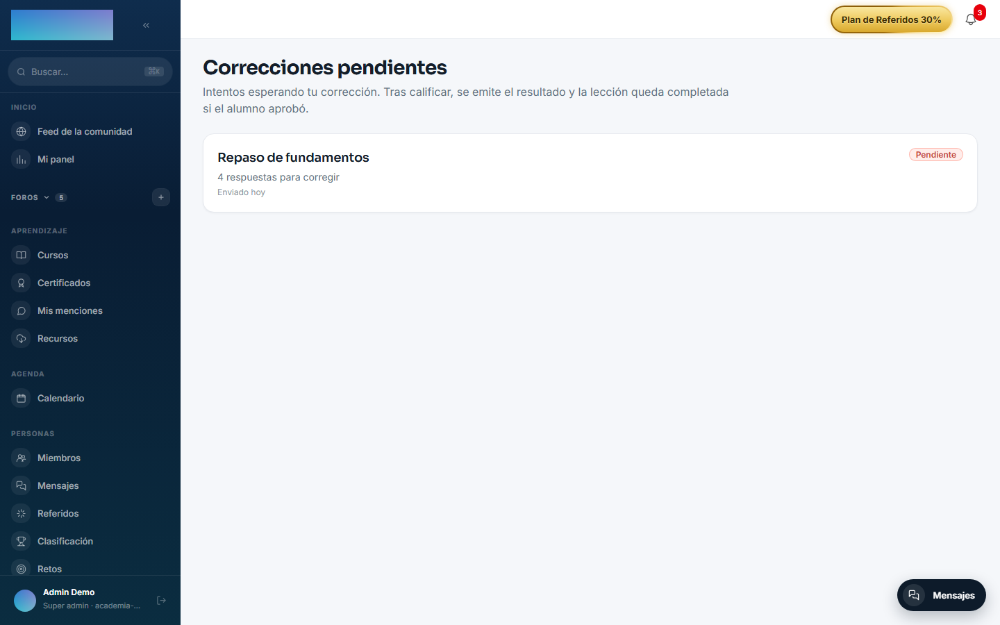

# mod.ai-grader — Corrección IA con rúbrica

Community · Categoría **ai** (desactivable)

## Qué hace

Corrección asistida por IA para las preguntas abiertas de [mod.assessments](assessments.md) (`SHORT_ANSWER`, `LONG_ANSWER`). El formador define una **rúbrica por pregunta** (instrucciones + 1-8 criterios con peso); la IA lee la rúbrica y la respuesta del alumno y propone **nota con justificación por criterio** y feedback global. La nota **nunca se publica sola**: el formador revisa y aplica (o no) la sugerencia. El módulo registra métricas de acuerdo IA-humano.

## Cómo funciona

- La suma de los pesos de los criterios debe igualar los puntos de la pregunta (validado al guardar la rúbrica).
- Hay **una sugerencia por respuesta**: regenerar con `force` reemplaza la anterior; sin `force`, se sirve la cacheada sin volver a llamar al modelo.
- «Aplicar» una sugerencia solo la marca como aplicada para auditoría — la nota real se pone con la corrección manual de assessments (`POST attempts/:id/grade`), manteniendo un único camino de calificación.
- Las sugerencias se persisten para poder revisarlas después sin gastar tokens.

## Configuración

**Activar el módulo.** En `/admin/configuracion?tab=modules` (pestaña «Módulos»). El módulo aporta la entrada **«Correcciones»** al grupo Formador del menú lateral (`/formador/correcciones`). Si el módulo está inactivo, la página de corrección manual sigue funcionando: simplemente no se cargan sugerencias IA.

**Proveedor de IA (BYOK).** Usa solo el propósito **chat** del AI Gateway: bloque **«Chat (tutor IA)»** de `/admin/ia/providers` (menú «Integraciones y API → Proveedores de IA») o, en su defecto, el default global `DEFAULT_AI_CHAT_*`. Proveedores de chat que acepta el código hoy: OpenAI, Anthropic (Claude), Google Gemini, OpenRouter, Mistral AI, Groq y Ollama (self-hosted). Detalle del gateway y del cifrado de claves en [Configuración → IA](../../configuracion/ia.md). Sin proveedor configurado (o si el proveedor falla), la petición de sugerencias devuelve **502** `AI_GRADER_PROVIDER_ERROR`; la corrección manual no se ve afectada.

**Rúbricas.** No hay pantalla de edición de rúbricas todavía: se gestionan por API (`GET`/`PUT`/`DELETE /modules/ai-grader/questions/:questionId/rubric`, rol formador+). Validaciones al guardar: instrucciones de 10 a 2000 caracteres, de 1 a 8 criterios, cada criterio con nombre, descripción y peso entero (1-100), y la suma de pesos igual a los puntos de la pregunta.

**Sin variables propias, sin ajustes por tenant y sin exigencia de licencia Enterprise.**

## Uso paso a paso

**Preparación (formador, por API)**

1. Crea la rúbrica de cada pregunta abierta del quiz con `PUT /modules/ai-grader/questions/:questionId/rubric`, body `{ "instructions": "...", "criteria": [{ "name": "...", "description": "...", "weight": n }] }`. Las preguntas sin rúbrica se saltan al generar sugerencias (no es un error).

**Corrección (formador, en el panel)**

1. Abre **«Correcciones»** en el menú (grupo Formador): la página «Correcciones pendientes» lista los intentos con respuestas abiertas esperando corrección, con el badge «Pendiente» y «N respuestas para corregir».

    

2. Entra en un intento (`/formador/correcciones/[id]`): verás cada pregunta con la «Respuesta del alumno» y, para las abiertas, los campos «Puntos (max N)» y «Feedback (opcional)».
3. En el bloque **«Asistente IA de corrección»**, pulsa **«Sugerir notas con IA»**. Se genera una sugerencia por cada pregunta abierta con rúbrica; el aviso resume el resultado: «N sugerencias generadas.», «N preguntas sin rúbrica.» y «Tokens: N.».
4. Cada sugerencia aparece bajo su pregunta con el badge **«Sugerencia IA»**, la nota propuesta («X/Y pts · proveedor»), el feedback global y el desglose por criterio con su justificación.

    

5. Pulsa **«Aplicar al formulario»** para copiar nota y feedback a los campos de corrección — puedes editarlos antes de enviar. Aplicar solo marca la sugerencia para auditoría. **«Re-generar»** fuerza una llamada nueva al modelo y reemplaza la sugerencia; sin re-generar, volver a entrar al intento sirve la persistida sin gastar tokens.
6. Pulsa **«Enviar calificación»**: la nota la emite mod.assessments (único camino de calificación), el alumno ve el resultado y la lección queda completada si aprobó.

## Dependencias

Opcional: `mod.assessments` (de donde salen intentos, respuestas y preguntas).

## Modelo de datos

`mod_ai_grader_rubric` (una por pregunta: instrucciones + criterios JSON con peso) · `mod_ai_grader_suggestion` (nota propuesta, desglose por criterio, proveedor/modelo, trazas de aplicación).

## API

Prefijo `/modules/ai-grader` (formador+): gestión de rúbricas y ciclo de sugerencia. Detalle en [Referencia → Pagos, aula e IA](../../api/referencia/pagos-directo-ia.md#ia).

## Eventos

**Emite**: `ai-grader.suggestion.generated`, `ai-grader.suggestion.failed`. No consume.
