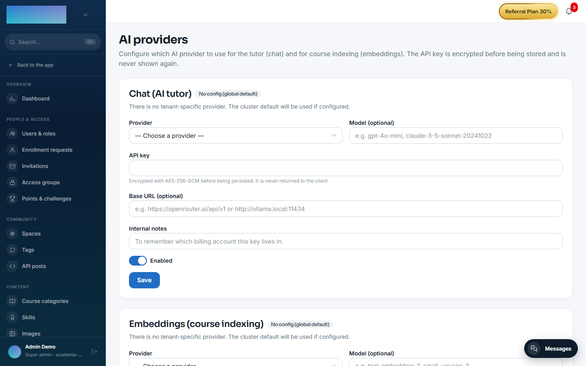
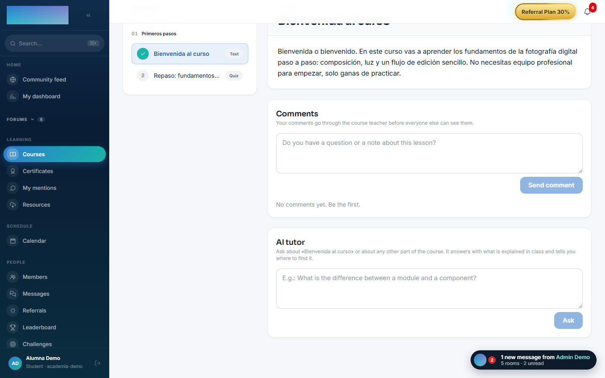
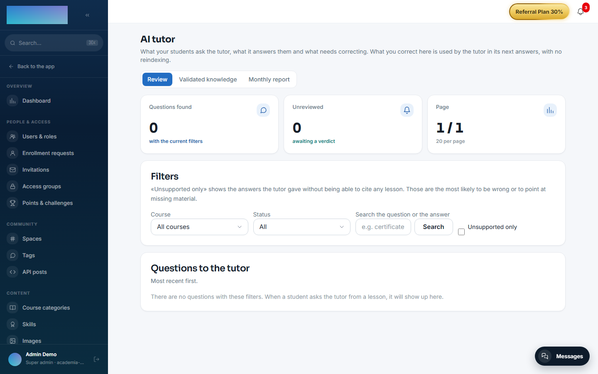

# mod.ai-tutor — Conversational tutor with RAG

Community · **AI** category (can be disabled)

## What it does

A **per-course** AI tutor with RAG: it indexes the content when the course is published, generates embeddings (provider configurable per tenant through the [AI Gateway](../../configuracion/ia.md)) and stores them in pgvector; the chat lives on the course page and **cites the specific lessons** each answer relies on.

On top of that there is a **quality loop** under Administration → AI Tutor with three tabs: review of question→answer pairs (with an "Unsupported only" filter to isolate answers with no citations), human-written **validated knowledge**, and a monthly report grouping questions by topic and ordering them by volume.

## How it works

- It indexes on receiving `courses.course.published` and **reindexes per lesson** when lessons are created/edited/deleted — there is no need to reindex the whole course when you add a class.
- **Human corrections live in their own table**, not as chunks: they are retrieved by similarity, injected into the prompt **above** the RAG context, and take effect immediately without reindexing (and they survive reindexes, which delete and regenerate the chunks).
- A quota of **10 questions per day** per student (it does not apply to staff, who can also try any course's tutor without enrolling).
- Quota exceeded → 429; AI provider not configured → 424.

## Configuration

**Enabling the module.** Under `/admin/configuracion?tab=modules` (the "Modules" tab). With the module enabled, **"AI Tutor"** appears in the Content group of the admin menu and the student panel shows up on the course page.

**AI provider (BYOK).** The tutor needs **two** configurations under `/admin/ia/providers` ("Integrations and API → AI providers" in the menu): the **"Chat (AI tutor)"** block to answer and the **"Embeddings (course indexing)"** block to index. Each block has the fields "Provider", "Model (optional)", "API key", "Base URL (optional)", "Internal notes" and the "Enabled" switch. Providers the code accepts today:

- **Chat**: OpenAI, Anthropic (Claude), Google Gemini, OpenRouter, Mistral AI, Groq and Ollama (self-hosted).
- **Embeddings**: OpenAI, Google Gemini, Mistral AI, Ollama (self-hosted) and Voyage AI.

The key is encrypted with AES-256-GCM when saved and is never shown again (to change it you re-enter it). Saving per-tenant configuration requires the `AI_CONFIG_ENCRYPTION_KEY` variable on the server. If the tenant configures nothing, the cluster's global default is used (`DEFAULT_AI_CHAT_*` / `DEFAULT_AI_EMBED_*`); if that does not exist either, the tutor answers **424** and the student sees "No AI provider is configured in this tenant. Ask your admin to set one up.". The full gateway detail is in [Configuration → AI](../../configuracion/ia.md).

**Indexing.** Automatic when the course is published. For courses published **before** configuring embeddings, the same providers screen has the "Indexing of existing courses" card with the **"Reindex all published courses"** button. Reindexing one specific course (`POST /admin/ai-tutor/courses/:courseId/index`) has no button: it is API-only.

**RAG parameters.** They are product constants, not settings: top-K 5, a 3000-token history budget, the corrections similarity threshold and the daily quota of 10 questions.

**License.** Nothing in this module requires an Enterprise license.

## Step by step

**Preparation (admin)**

1. Enable `mod.ai-tutor` and configure chat + embeddings under `/admin/ia/providers`.

    

2. Publish the course (it indexes on its own) or click **"Reindex all published courses"** if they were already published. If the bulk reindex takes long and the connection drops, it has not failed: it keeps running on the server.

**As a student**

1. On the course page (`/cursos/[slug]`), with a lesson open, the **"AI tutor"** panel sits below the player and the comments.

    

2. Type your question (at least 3 characters) and click **"Ask"**. The panel also sends which lesson you have in front of you and which second of the video you are at, to prioritize its fragments.
3. The answer arrives with **"Citations"** to the lessons (with "min mm:ss" when a timed transcript exists), the token spend and the counter "You have N of 10 questions left today.". Follow-ups keep the thread's context; **"New thread"** resets it.
4. Once the day's 10 questions are used up, the tutor answers 429. Staff has no quota.

**Quality loop (admin)** — "Content → AI Tutor" (`/admin/ia/tutor`):

1. **"Review"** tab: filter by course, status ("Unreviewed", "Correct", "Corrected"), free text or the **"Unsupported only"** check (answers the tutor gave without being able to cite any lesson: the most suspicious ones). Open one with **"Review"** and decide: **"It's fine"**, or correct it by filling in "Question it will be saved under (generalise it if the original is too personal)", "Correct answer", "Internal note (optional)" and the "Applies to every course, not just this one" check, then click **"Save correction"**.

    

2. **"Validated knowledge"** tab: lists the answers written by the team and lets you create one by hand with "Add a validated answer" (fields "Question", "Answer", "Course" or "All courses (general question)"). Each entry shows how many times it has been used and can be "Disable"d/"Enable"d or "Delete"d. They take effect immediately, with no reindexing, and the tutor uses them ahead of the course content.

3. **"Monthly report"** tab: the month's questions grouped by meaning and ordered by volume, with who asked, plus "unsupported" and "corrected" badges. A heavily asked topic with no backing in the material is missing content.

## Dependencies

Optional: `mod.courses`, `mod.learning`.

## Data model

`mod_ai_tutor_conversation` · `_message` (with the question's embedding and its review status) · `_chunk` (indexed chunks, 1536-dimension vector) · `_correction` (validated knowledge, 1536-dimension vector) · `_token_usage` (consumption, for the quota).

## API

`POST /modules/ai-tutor/courses/:courseId/ask` (student) + the admin surface (`/admin/ai-tutor/*`: indexing, review, corrections, report). Details in [Reference → Payments, classroom and AI](../../api/referencia/pagos-directo-ia.md#ai).

## Events

- **Emits**: `ai-tutor.course.indexed/index-failed`, `ai-tutor.chat.message-sent/message-received`, `ai-tutor.answer.reviewed/corrected`.
- **Consumes**: `courses.course.published/unpublished`, `courses.lesson.created/updated/deleted`.
