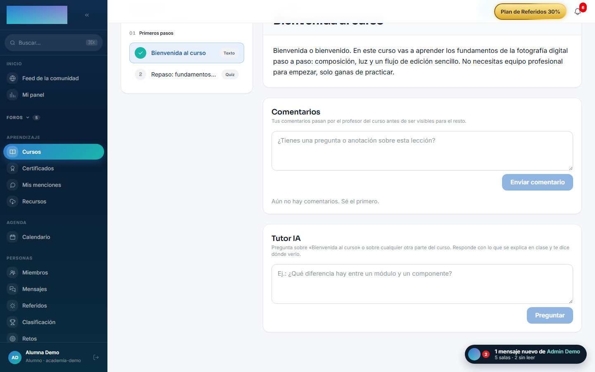
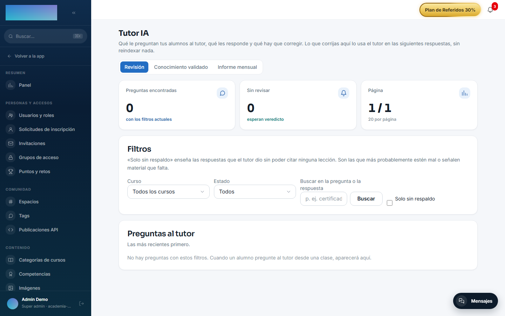

# mod.ai-tutor — Tutor conversacional con RAG

Community · Categoría **ai** (desactivable)

## Qué hace

Tutor IA **por curso** con RAG: indexa el contenido al publicar el curso, genera embeddings (proveedor configurable por tenant vía el [AI Gateway](../../configuracion/ia.md)) y los guarda en pgvector; el chat vive en la página del curso y **cita las lecciones concretas** en las que se apoya cada respuesta.

Encima hay un **ciclo de calidad** en Administración → Tutor IA con tres pestañas: revisión de pares pregunta→respuesta (con filtro «Solo sin respaldo» para aislar respuestas sin citas), **conocimiento validado** escrito por humanos, e informe mensual con las preguntas agrupadas por tema y ordenadas por volumen.

## Cómo funciona

- Indexa al recibir `courses.course.published` y **reindexa por lección** al crear/editar/borrar lecciones — no hace falta reindexar el curso entero al subir una clase.
- Las **correcciones humanas viven en tabla propia**, no como chunks: se recuperan por similitud, se inyectan en el prompt **por encima** del contexto RAG y entran en caliente sin reindexar (y sobreviven a los reindexados, que borran y regeneran los chunks).
- Cuota de **10 preguntas diarias** por alumno (no aplica al staff, que además puede probar el tutor de cualquier curso sin matricularse).
- Cuotas superadas → 429; proveedor de IA sin configurar → 424.

## Configuración

**Activar el módulo.** En `/admin/configuracion?tab=modules` (pestaña «Módulos»). Con el módulo activo aparece **«Tutor IA»** en el grupo Contenido del menú admin y el panel del alumno en la página del curso.

**Proveedor de IA (BYOK).** El tutor necesita **dos** configuraciones en `/admin/ia/providers` (menú «Integraciones y API → Proveedores de IA»): el bloque **«Chat (tutor IA)»** para responder y el bloque **«Embeddings (indexación de cursos)»** para indexar. Cada bloque tiene los campos «Proveedor», «Modelo (opcional)», «API key», «Base URL (opcional)», «Notas internas» y el interruptor «Habilitado». Proveedores que acepta el código hoy:

- **Chat**: OpenAI, Anthropic (Claude), Google Gemini, OpenRouter, Mistral AI, Groq y Ollama (self-hosted).
- **Embeddings**: OpenAI, Google Gemini, Mistral AI, Ollama (self-hosted) y Voyage AI.

La clave se cifra con AES-256-GCM al guardarse y nunca se vuelve a mostrar (para cambiarla hay que reintroducirla). Guardar configuración por tenant exige la variable `AI_CONFIG_ENCRYPTION_KEY` en el servidor. Si el tenant no configura nada, se usa el default global del cluster (`DEFAULT_AI_CHAT_*` / `DEFAULT_AI_EMBED_*`); si tampoco existe, el tutor responde **424** y el alumno ve «No hay proveedor de IA configurado en el tenant. Pídele al admin que configure uno.». El detalle completo del gateway está en [Configuración → IA](../../configuracion/ia.md).

**Indexación.** Automática al publicar el curso. Para cursos publicados **antes** de configurar embeddings, la misma pantalla de proveedores tiene la tarjeta «Indexación de cursos existentes» con el botón **«Reindexar todos los cursos publicados»**. El reindexado de un curso concreto (`POST /admin/ai-tutor/courses/:courseId/index`) no tiene botón: es API.

**Parámetros del RAG.** Son constantes del producto, no ajustes: top-K 5, presupuesto de historial 3000 tokens, umbral de similitud de correcciones y cuota diaria de 10 preguntas.

**Licencia.** Nada del módulo exige licencia Enterprise.

## Uso paso a paso

**Preparación (admin)**

1. Activa `mod.ai-tutor` y configura chat + embeddings en `/admin/ia/providers`.

    

2. Publica el curso (se indexa solo) o pulsa **«Reindexar todos los cursos publicados»** si ya estaban publicados. Si el reindexado masivo tarda y se corta la conexión, no ha fallado: sigue en el servidor.

**Como alumno**

1. En la página del curso (`/cursos/[slug]`), con una lección abierta, debajo del reproductor y de los comentarios está el panel **«Tutor IA»**.

    

2. Escribe la pregunta (mínimo 3 caracteres) y pulsa **«Preguntar»**. El panel manda también qué lección tienes delante y por qué segundo del vídeo vas, para priorizar sus fragmentos.
3. La respuesta llega con **«Citas»** a las lecciones (con «min mm:ss» cuando hay transcripción con tiempos), el gasto en tokens y el contador «Te quedan N de 10 preguntas hoy». Los follow-ups mantienen el contexto del hilo; **«Nuevo hilo»** lo reinicia.
4. Al agotar las 10 preguntas del día el tutor responde 429. El staff no tiene cuota.

**Ciclo de calidad (admin)** — «Contenido → Tutor IA» (`/admin/ia/tutor`):

1. Pestaña **«Revisión»**: filtra por curso, estado («Sin revisar», «Correctas», «Corregidas»), texto libre o el check **«Solo sin respaldo»** (respuestas que el tutor dio sin poder citar ninguna lección: las más sospechosas). Abre una con **«Revisar»** y decide: **«Está bien»**, o corrige rellenando «Pregunta con la que se guardará (generalízala si la original es muy suya)», «Respuesta correcta», «Nota interna (opcional)» y el check «Vale para todos los cursos, no solo para este», y pulsa **«Guardar corrección»**.

    

2. Pestaña **«Conocimiento validado»**: lista las respuestas escritas por el equipo y permite crear una a mano con «Añadir una respuesta validada» (campos «Pregunta», «Respuesta», «Curso» o «Todos los cursos (duda transversal)»). Cada entrada muestra cuántas veces se ha usado y se puede «Desactivar»/«Activar» o «Borrar». Entran en caliente, sin reindexar, y el tutor las usa por encima del contenido del curso.

3. Pestaña **«Informe mensual»**: preguntas del mes agrupadas por significado y ordenadas por volumen, con quién preguntó, badges de «sin respaldo» y «corregidas». Un tema muy preguntado y sin respaldo en el material es contenido que falta.

## Dependencias

Opcionales: `mod.courses`, `mod.learning`.

## Modelo de datos

`mod_ai_tutor_conversation` · `_message` (con embedding de la pregunta y estado de revisión) · `_chunk` (trozos indexados, vector 1536) · `_correction` (conocimiento validado, vector 1536) · `_token_usage` (consumo para la cuota).

## API

`POST /modules/ai-tutor/courses/:courseId/ask` (alumno) + superficie admin (`/admin/ai-tutor/*`: indexado, revisión, correcciones, informe). Detalle en [Referencia → Pagos, aula e IA](../../api/referencia/pagos-directo-ia.md#ia).

## Eventos

- **Emite**: `ai-tutor.course.indexed/index-failed`, `ai-tutor.chat.message-sent/message-received`, `ai-tutor.answer.reviewed/corrected`.
- **Consume**: `courses.course.published/unpublished`, `courses.lesson.created/updated/deleted`.
