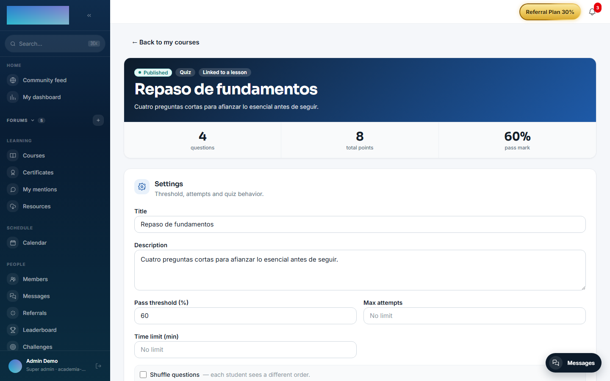
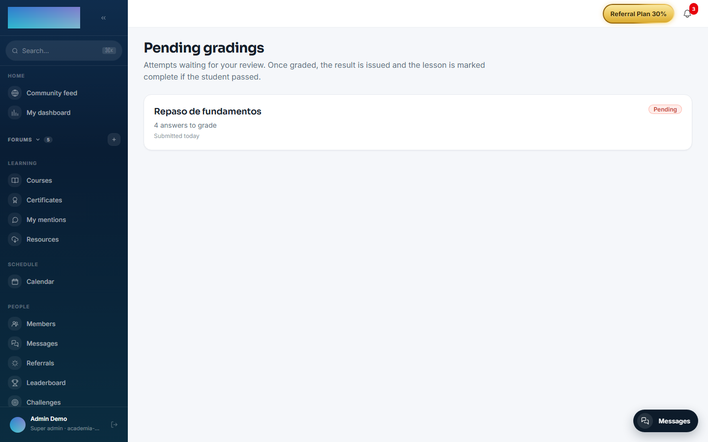

# mod.assessments — Quizzes and exams

Community · **Core** category (always active)

## What it does

Assessments with auto-grading and manual grading. Six question types: `SINGLE_CHOICE`, `MULTIPLE_CHOICE` and `TRUE_FALSE` (graded automatically by a pure, testable scoring engine), `FILL_IN_BLANK` (accepted answers) and `SHORT_ANSWER`/`LONG_ANSWER` (which go to **manual grading by the instructor**, with a pending queue). Each quiz configures a pass threshold (60% by default), a maximum number of attempts, a time limit, question shuffling and whether feedback is shown on completion.

## How it works

- The quiz starts as `DRAFT`, questions are added and then it is published (at least one is required).
- The student sees a **solution-free view** (`preview`), starts an attempt, answers and submits; the engine grades the automatic part and, if there are open-ended questions, the attempt stays in `PENDING_REVIEW` until the instructor grades it from their panel.
- An attempt that has run out of time returns `ATTEMPT_EXPIRED` **410**.
- The instructor's view includes `isCorrect` on the options; the student's view never does.
- With [mod.ai-grader](ai-grader.md) enabled, the instructor gets per-criterion score suggestions with justifications for the open-ended questions.

## Configuration

- **Activation**: a `core`-category module, always active. It does not appear in the "Modules" tab at `/admin/configuracion?tab=modules` and cannot be disabled.
- **Per-tenant settings and environment variables**: none. Everything is configured per quiz, in its editor (`/formador/quizzes/<id>`, "Settings" card): "Pass threshold (%)" (default 60), "Max attempts" (empty = no limit), "Time limit (min)", "Shuffle questions" and "Show feedback to the student".
- **License**: the whole module is Community; no feature requires Enterprise capabilities. AI score suggestions come from [mod.ai-grader](ai-grader.md), not from this module.

## Step-by-step usage

### Creating and publishing a quiz (instructor)

1. In the course builder (`/formador/cursos/<id>`), create a "Quiz"-type lesson and click "Edit": you can "Create new quiz" or paste the UUID of an existing one ("…or paste the UUID of an existing quiz"). The quiz editor lives at `/formador/quizzes/<id>`.
2. In the editor's "Settings" card, adjust "Pass threshold (%)", "Max attempts", "Time limit (min)", "Shuffle questions" (each student sees a different order) and "Show feedback to the student"; click "Save settings".
3. Click "Add question": pick the "Question type" ("Single choice", "Multiple choice", "True / False", "Fill in the blank", "Short answer (manual grading)" or "Long answer (manual grading)"), write the "Prompt" and the "Points".
    - For choice questions, fill in "Options (mark the correct ones)" and, optionally, a per-option "Feedback (optional)".
    - For "Fill in the blank", list the "Accepted answers (one per line)"; the comparison ignores case, accents and spacing.
    - Open-ended types are not auto-graded: the editor warns that the attempt will stay in `PENDING_REVIEW` until you grade it at `/formador/correcciones`.
4. With at least one question, click "Publish quiz". You can mix types in the same quiz.

    

### Taking the quiz (student)

1. In the Quiz-type lesson, the student sees the summary (number of questions, threshold, time and max attempts) and clicks "Start quiz".
2. They answer and click "Submit answers". With a time limit, the header shows the deadline; past it, submitting returns `ATTEMPT_EXPIRED` 410.
3. The result is immediate if everything was auto-gradable: "You did it!" or "You did not reach the pass mark", with the score, points and — if the quiz allows it — "Retry quiz". On passing, the lesson is completed automatically (via `mod.learning`).
4. With open-ended questions, the attempt stays "Under review by your instructor" until grading arrives.

### Grading open answers (instructor)

1. `/formador/correcciones` ("Pending gradings") lists the attempts waiting for review, with how many answers each one needs graded. The trainer dashboard (`/formador`) shows the pending counter.

    

2. Open the detail (`/formador/correcciones/<attemptId>`): auto-graded questions are flagged "Auto-graded" and open ones "Manual", with the "Student's answer", the "Points (max N)" field and a "Feedback (optional)".
3. With [mod.ai-grader](ai-grader.md) active, "Suggest grades with AI" proposes a score and justification per question; "Apply to form" fills it in. The final call is always yours.
4. Click "Submit grades": the student sees the result and, if they passed, the lesson is marked complete.

    

## Dependencies

- Hard: `mod.courses`. Optional: `mod.learning` (auto-completes the QUIZ lesson on passing).

## Data model

| Table | What it stores |
| --- | --- |
| `mod_assessments_quiz` | The quiz: threshold, attempts, time, status. |
| `mod_assessments_question` | Statement, type, points, accepted answers. |
| `mod_assessments_option` | Options for choice questions. |
| `mod_assessments_attempt` | A student's attempt and its score. |
| `mod_assessments_answer` | The answer per question (option or text). |

## API

Prefix `/modules/assessments`, two surfaces: authoring/grading (instructor and above) and student. Details in [Reference → Learning](../../api/referencia/aprendizaje.md#assessments-modulesassessments).

## Events

**Emits**: `assessments.quiz.published`, `assessments.attempt.started/submitted/pending_review/graded/passed/failed`. It consumes none.
