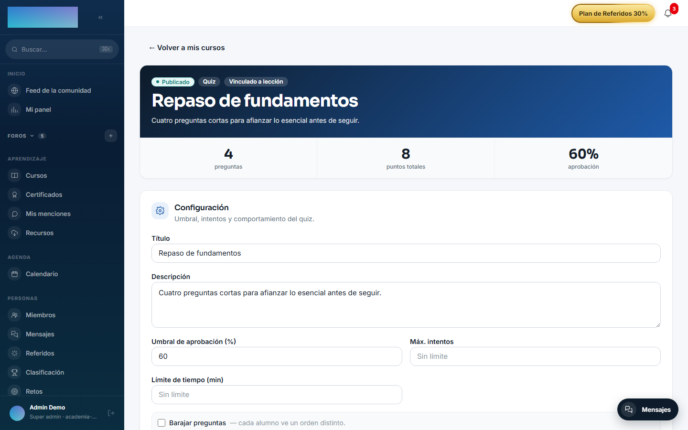
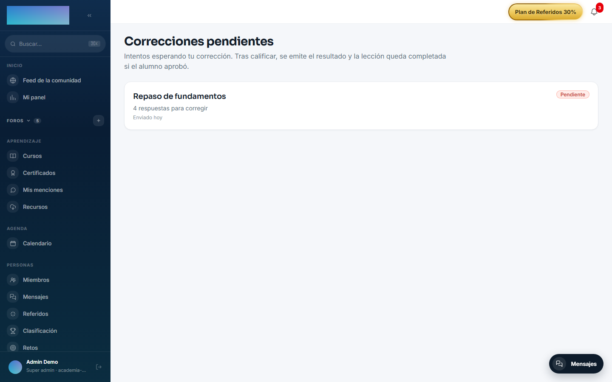
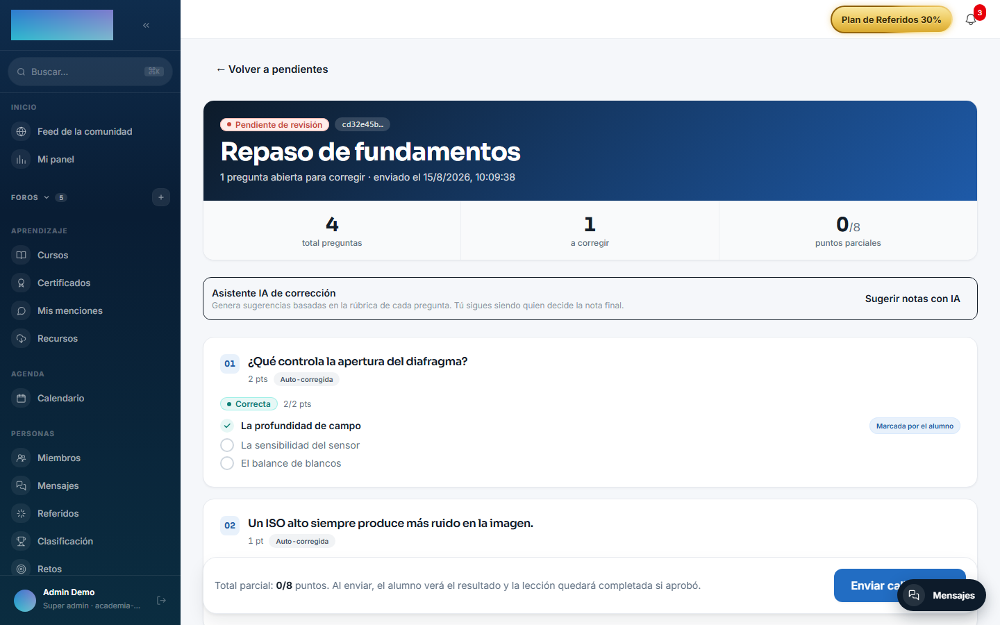

# mod.assessments — Quizzes y exámenes

Community · Categoría **core** (siempre activo)

## Qué hace

Evaluaciones con autocorrección y corrección manual. Seis tipos de pregunta: `SINGLE_CHOICE`, `MULTIPLE_CHOICE` y `TRUE_FALSE` (corregidas automáticamente por un motor de scoring puro y testeable), `FILL_IN_BLANK` (respuestas aceptadas) y `SHORT_ANSWER`/`LONG_ANSWER` (derivan a **corrección manual del formador**, con bandeja de pendientes). Cada quiz configura umbral de aprobación (60% por defecto), máximo de intentos, límite de tiempo, barajado de preguntas y si se muestra feedback al terminar.

## Cómo funciona

- El quiz nace en `DRAFT`, se le añaden preguntas y se publica (exige al menos una).
- El alumno ve una **vista sin soluciones** (`preview`), inicia un intento, responde y entrega; el motor corrige lo automático y, si hay preguntas abiertas, el intento queda en `PENDING_REVIEW` hasta que el formador califica desde su panel.
- Un intento caducado por límite de tiempo responde `ATTEMPT_EXPIRED` **410**.
- La vista del formador incluye `isCorrect` en las opciones; la del alumno, jamás.
- Con [mod.ai-grader](ai-grader.md) activo, el formador recibe sugerencias de nota con justificación por criterio para las preguntas abiertas.

## Configuración

- **Activación**: módulo de categoría `core`, siempre activo. No aparece en la pestaña «Módulos» de `/admin/configuracion?tab=modules` y no se puede desactivar.
- **Ajustes por tenant y variables de entorno**: ninguno. Toda la configuración es por quiz, en su editor (`/formador/quizzes/<id>`, tarjeta «Configuración»): «Umbral de aprobación (%)» (default 60), «Máx. intentos» (vacío = sin límite), «Límite de tiempo (min)», «Barajar preguntas» y «Mostrar feedback al alumno».
- **Licencia**: todo el módulo es Community; ninguna función exige capabilities de Enterprise. Las sugerencias de nota con IA son de [mod.ai-grader](ai-grader.md), no de este módulo.

## Uso paso a paso

### Crear y publicar un quiz (formador)

1. En el builder del curso (`/formador/cursos/<id>`), crea una lección de tipo «Quiz» y pulsa «Editar»: puedes «Crear nuevo quiz» o pegar el UUID de uno existente («…o pega el UUID de un quiz existente»). El editor del quiz vive en `/formador/quizzes/<id>`.
2. En la tarjeta «Configuración» del editor, ajusta «Umbral de aprobación (%)», «Máx. intentos», «Límite de tiempo (min)», «Barajar preguntas» (cada alumno ve un orden distinto) y «Mostrar feedback al alumno»; pulsa «Guardar configuración».
3. Pulsa «Añadir pregunta»: elige «Tipo de pregunta» («Opción única», «Opciones múltiples», «Verdadero / Falso», «Rellenar el hueco», «Respuesta corta (corrección manual)» o «Respuesta larga (corrección manual)»), escribe el «Enunciado» y los «Puntos».
    - En las de elección, rellena «Opciones (marca las correctas)» y, si quieres, un «Feedback (opcional)» por opción.
    - En «Rellenar el hueco», lista las «Respuestas aceptadas (una por línea)»; la comparación ignora mayúsculas, acentos y espaciado.
    - Los tipos abiertos no se autocorrigen: el editor avisa de que el intento quedará en `PENDING_REVIEW` hasta corregirlo en `/formador/correcciones`.
4. Con al menos una pregunta, pulsa «Publicar quiz». Puedes mezclar tipos en un mismo quiz.

    

### Responder el quiz (alumno)

1. En la lección de tipo Quiz, el alumno ve el resumen (nº de preguntas, umbral, tiempo y máximo de intentos) y pulsa «Empezar quiz».
2. Responde y pulsa «Enviar respuestas». Si hay límite de tiempo, la cabecera indica la hora tope; pasado el plazo el envío responde `ATTEMPT_EXPIRED` 410.
3. El resultado sale al momento si todo era autocorregible: «¡Lo lograste!» o «No alcanzaste el umbral», con nota, puntos y — si el quiz lo permite — «Reintentar quiz». Al aprobar, la lección queda completada automáticamente (vía `mod.learning`).
4. Con preguntas abiertas, el intento queda «En revisión por tu formador» hasta que llegue la corrección.

### Corregir respuestas abiertas (formador)

1. `/formador/correcciones` («Correcciones pendientes») lista los intentos esperando revisión, con cuántas respuestas hay por corregir en cada uno. El panel del formador (`/formador`) muestra el contador de pendientes.

    

2. Entra al detalle (`/formador/correcciones/<attemptId>`): las preguntas autocorregidas aparecen marcadas «Auto-corregida» y las abiertas «Manual», con la «Respuesta del alumno», el campo «Puntos (max N)» y un «Feedback (opcional)».
3. Con [mod.ai-grader](ai-grader.md) activo, «Sugerir notas con IA» propone nota y justificación por pregunta; «Aplicar al formulario» la vuelca. La decisión final siempre es tuya.
4. Pulsa «Enviar calificación»: el alumno ve el resultado y, si aprobó, la lección queda completada.

    

## Dependencias

- Dura: `mod.courses`. Opcional: `mod.learning` (autocompleta la lección de tipo QUIZ al aprobar).

## Modelo de datos

| Tabla | Qué guarda |
| --- | --- |
| `mod_assessments_quiz` | Quiz: umbral, intentos, tiempo, estado. |
| `mod_assessments_question` | Enunciado, tipo, puntos, respuestas aceptadas. |
| `mod_assessments_option` | Opciones de las preguntas de elección. |
| `mod_assessments_attempt` | Intento del alumno y su nota. |
| `mod_assessments_answer` | Respuesta por pregunta (opción o texto). |

## API

Prefijo `/modules/assessments`, dos superficies: autoría/corrección (formador+) y alumno. Detalle en [Referencia → Aprendizaje](../../api/referencia/aprendizaje.md#evaluaciones-modulesassessments).

## Eventos

**Emite**: `assessments.quiz.published`, `assessments.attempt.started/submitted/pending_review/graded/passed/failed`. No consume.
