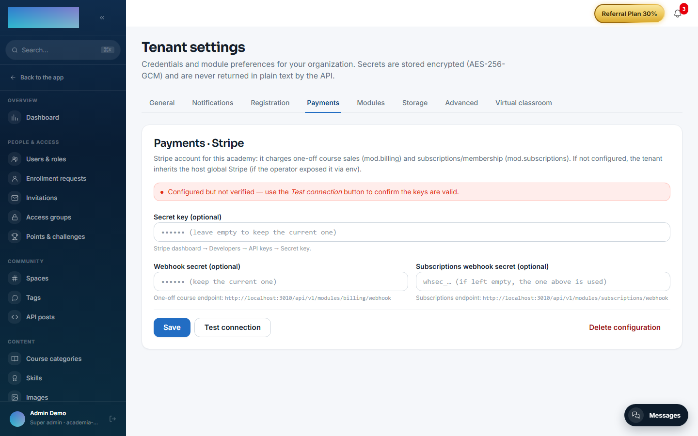
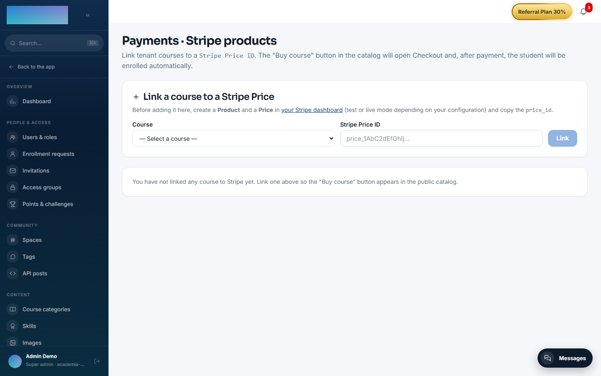

# mod.billing — Stripe Checkout (one-off payment)

Community · **Core** category (always active)

## What it does

Course monetization with one-off payments through **Stripe Checkout**: the admin links each course to a Stripe price (or creates one from Didacta), the student clicks buy, the backend creates the Checkout Session and redirects to the hosted checkout. Once the payment is confirmed, the webhook completes the order and emits `billing.order.completed`, which `mod.learning` listens to in order to enroll the student with origin `PURCHASE`.

It also covers the **public purchase journey**: a visitor **with no account** buys from the public catalog (`/catalogo`) or from a course's sales page (`/catalogo/<slug>`); the order starts as `PENDING` with no owner and fulfillment materialises the account with the email confirmed by Stripe (find-or-create + a welcome email with a "set your password" link, template `billing.welcome`, editable per tenant under Administration → Emails). The return pages for a public payment are `/catalogo/checkout/success` and `/catalogo/checkout/cancel`.

## How it works

- **Explicit idempotency**: every Stripe `evt_*` event is persisted and never reprocessed — redelivering an anonymous checkout duplicates neither the account nor the enrollment.
- Guards before charging: 404 if the course does not exist, 409 if it is not published, 409 if you already have access.
- With no Stripe configured the module still registers itself: the public catalog returns an empty list and checkout returns 503 with a clear message. The rest of the platform is unaffected.
- Refunds are issued from the Stripe dashboard; the `charge.refunded` webhook is processed and flags the order. Only a **full** refund moves the order to `REFUNDED` (and removes access); a partial one leaves the purchase in place.

## Configuration

The module belongs to the **core** category: it is active in every tenant and has no switch of its own.

### Stripe credentials (per tenant)

Under `/admin/configuracion?tab=pagos` (the **Payments** tab), card **"Payments · Stripe"** — shared with `mod.subscriptions`, a single key pair per academy:

- **"Secret key"** — the `sk_test_…` or `sk_live_…` of your account (Stripe dashboard → Developers → API keys).
- **"Webhook secret"** — the `whsec_…` of the one-off course endpoint (see below).
- **"Subscriptions webhook secret (optional)"** — only for `mod.subscriptions`; leave it empty to reuse the one above.
- Buttons **"Save"**, **"Test connection"** (verifies against Stripe and tells you whether the account is in test or LIVE mode) and **"Delete configuration"**.

The card opens with a status banner: verified, configured but unverified, "using the host's global Stripe (fallback)" or "no Stripe configured — selling courses and subscriptions/membership will not work". Credentials are stored **encrypted**; the fields are write-only (they are never shown back).

### Webhook to register in Stripe

The card itself shows the exact URL. For this module:

- Endpoint: `https://<your-academy-domain>/api/v1/modules/billing/webhook`
- Events to select: `checkout.session.completed`, `checkout.session.expired`, `checkout.session.async_payment_failed`, `charge.refunded`.

Paste the `whsec_…` Stripe generates into the **"Webhook secret"** field.

### Environment variables (instance fallback)

| Variable | What it is for |
| --- | --- |
| `STRIPE_SECRET_KEY` / `STRIPE_WEBHOOK_SECRET` | Instance fallback: used only if the tenant has not configured its own keys in the panel. The operator can forbid this fallback with the `allowGlobalStripeFallback` instance setting (scope `billing`, in `instance_setting`; allowed by default). |
| `BILLING_SUCCESS_URL_BASE` / `BILLING_CANCEL_URL_BASE` | Last-resort fallback for the return URLs: the HTTP checkout (authenticated and public) **always** passes per-request URLs derived from the real Host — `/cursos/checkout/success|cancel` for the authenticated one, `/catalogo/checkout/success|cancel` for the public one — so these variables only apply if an in-process caller omits the URLs. |

No feature of this module is gated behind an Enterprise licence.

### Products (course ↔ price)

Under `/admin/billing/products` (**"Payments · Stripe products"**): the **"Link a course to a Stripe Price"** form has a **"Course"** selector (only published, unlinked courses) and the **"Stripe Price ID"** field (a `price_…` created beforehand in your Stripe dashboard); button **"Link"**. The backend validates against Stripe that the price exists and is active before saving. Through the API, the same endpoint alternatively accepts an amount (`amountCents`) and creates the Product + Price in Stripe for you; a course supports several purchase options (option name, strikethrough price, featured), which the panel lists and the catalog renders as formats.

## Step-by-step usage

1. Configure Stripe under `/admin/configuracion?tab=pagos`: save the **"Secret key"**, register the webhook in Stripe with the URL and events above, paste the **"Webhook secret"** and click **"Test connection"**.
2. Under `/admin/billing/products`, link the course: pick the **"Course"**, paste the **"Stripe Price ID"** and click **"Link"**. Each listed product offers **"Change Price ID"**, **"Deactivate"**/**"Reactivate"** and **"Unlink"** (historical orders are kept). If Stripe is not configured, the page says so with the link "Configure Stripe in Administration → Payments".

    

3. Selling to a student **with an account**: `/cursos/<slug>` shows the **"Start this course"** box with the **"Buy"** button (if the course has several options, the **"Choose your format"** section lists them with price, discount and the "Most popular" tag). Payment opens Stripe's hosted checkout and returns to `/cursos/checkout/success`.

4. Selling to a visitor **without an account**: `/catalogo` lists the courses on sale (**"View course"**) and `/catalogo/<slug>` is the sales page with **"Buy now"** ("Secure payment with Stripe. VAT included."). After paying, they land on `/catalogo/checkout/success` — "Thank you for your purchase!" — and get the email to **set their password**; if the email already had an account, the course is added to it.

5. The webhook completes the order (`COMPLETED`) and `mod.learning` enrolls automatically with origin `PURCHASE`. Nothing to do by hand.
6. Refunds: issue them from the Stripe dashboard. A full refund marks the order `REFUNDED` and removes access; a partial one leaves the purchase in place.

## Dependencies

Hard: `mod.learning`, `mod.courses`.

## Data model

`mod_billing_product` (sellable course ↔ price, unique per course and per price) · `mod_billing_order` (the purchase: `PENDING → COMPLETED | CANCELLED | FAILED | REFUNDED`, with a nullable `user_id` for anonymous purchases) · `mod_billing_webhook_event` (idempotent log, PK = `stripe_event_id`).

## API

Prefix `/modules/billing`: authenticated checkout, public surface (`public/catalog`, `public/offer`, `public/checkout`), admin CRUD for products, and the webhook. Details in [Reference → Payments](../../api/referencia/pagos-directo-ia.md#one-off-payment-billing-modulesbilling).

## Events

**Emits**: `billing.order.created/completed/failed/refunded`. It consumes none.
