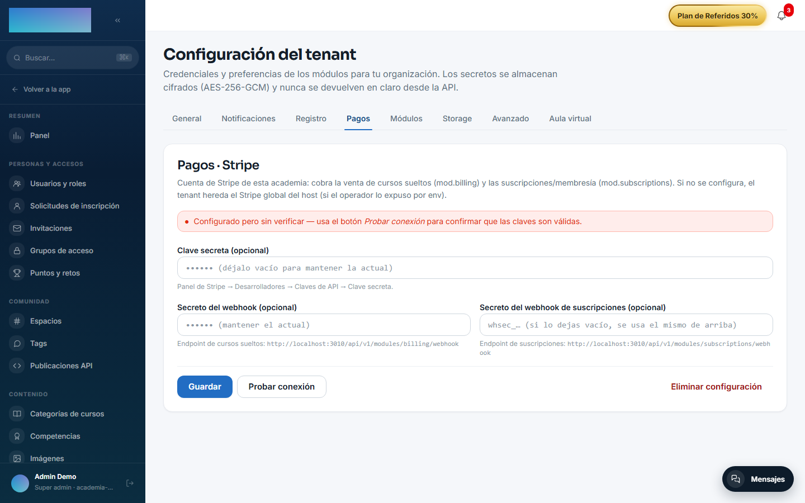
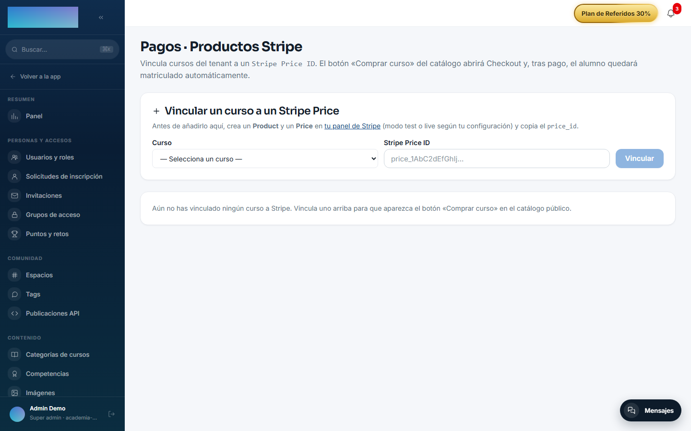

# mod.billing — Stripe Checkout (pago único)

Community · Categoría **core** (siempre activo)

## Qué hace

Monetización de cursos con pago único vía **Stripe Checkout**: el admin liga cada curso a un precio de Stripe (o lo crea desde Didacta), el alumno pulsa comprar, el backend crea la Checkout Session y redirige al checkout hosted. Al confirmarse el pago, el webhook completa la orden y emite `billing.order.completed`, que `mod.learning` escucha para matricular con origen `PURCHASE`.

Incluye además el **viaje de compra pública**: un visitante **sin cuenta** compra desde el catálogo público (`/catalogo`) o la ficha de venta del curso (`/catalogo/<slug>`); la orden nace `PENDING` sin dueño y el fulfillment materializa la cuenta con el email confirmado por Stripe (find-or-create + email de bienvenida con enlace «Define tu contraseña», plantilla `billing.welcome`, editable por tenant en Administración → Emails). Las páginas de retorno del pago público son `/catalogo/checkout/success` y `/catalogo/checkout/cancel`.

## Cómo funciona

- **Idempotencia explícita**: cada evento `evt_*` de Stripe se persiste y no se reprocesa — la reentrega de un checkout anónimo no duplica cuenta ni matrícula.
- Guardas previas al cobro: 404 curso inexistente, 409 no publicado, 409 si ya tienes acceso.
- Sin Stripe configurado el módulo se registra igualmente: el catálogo público devuelve lista vacía y el checkout responde 503 con mensaje claro. El resto de la plataforma no se ve afectado.
- Los reembolsos se lanzan desde el dashboard de Stripe; el webhook `charge.refunded` sí se procesa y marca la orden. Solo el reembolso **total** pasa la orden a `REFUNDED` (y retira el acceso); uno parcial no toca la compra.

## Configuración

El módulo es de categoría **core**: viene activo en todos los tenants y no tiene interruptor propio.

### Credenciales de Stripe (por tenant)

En `/admin/configuracion?tab=pagos` (pestaña **Pagos**), tarjeta **«Pagos · Stripe»** — compartida con `mod.subscriptions`, un único par de claves por academia:

- **«Clave secreta»** — la `sk_test_…` o `sk_live_…` de tu cuenta (Panel de Stripe → Desarrolladores → Claves de API).
- **«Secreto del webhook»** — el `whsec_…` del endpoint de cursos sueltos (ver abajo).
- **«Secreto del webhook de suscripciones (opcional)»** — solo para `mod.subscriptions`; vacío = se reutiliza el de arriba.
- Botones **«Guardar»**, **«Probar conexión»** (verifica contra Stripe y muestra si la cuenta es test o LIVE) y **«Eliminar configuración»**.

La tarjeta abre con un banner de estado: verificado, configurado sin verificar, «Usando Stripe global del host (fallback)» o «Sin Stripe configurado — la venta de cursos sueltos y las suscripciones/membresía no funcionan». Las credenciales se guardan **cifradas**; los campos son write-only (nunca se re-muestran).

### Webhook a dar de alta en Stripe

La propia tarjeta muestra la URL exacta. Para este módulo:

- Endpoint: `https://<dominio-de-tu-academia>/api/v1/modules/billing/webhook`
- Eventos a seleccionar: `checkout.session.completed`, **`checkout.session.async_payment_succeeded`**, `checkout.session.expired`, `checkout.session.async_payment_failed`, `charge.refunded`.

Pega el `whsec_…` que genera Stripe en el campo **«Secreto del webhook»**.

!!! danger "Los cinco eventos no son opcionales"
    Cada uno cierra un camino, y el que falte se queda abierto en silencio — Stripe no avisa de lo que no te manda:

    - **Sin `async_payment_succeeded`**, una compra pagada por transferencia o SEPA **nunca llega a matricular**: se queda esperando para siempre. Este es el que más se olvida, porque con tarjeta no hace falta.
    - **Sin `charge.refunded`**, un reembolso **no retira el acceso**.
    - **Sin `checkout.session.expired`**, los carritos abandonados se acumulan como pedidos pendientes eternos.

## Qué formas de pago acepta

Las que tengas activadas **en tu panel de Stripe** (Configuración → Métodos de pago). Didacta no fija la lista: si activas PayPal o Bizum, aparecen en la pantalla de pago sin tocar nada aquí ni esperar a una versión nueva.

Stripe filtra solo lo que sirve para el importe, la moneda y el país del comprador.

!!! info "Si activas métodos de notificación diferida"
    Transferencia, SEPA y algún Klarna **no confirman el cobro en el momento**: el comprador termina el formulario y el dinero llega horas o días después. Didacta lo contempla — la matrícula espera a que el cobro esté confirmado, no al formulario — pero **exige que `checkout.session.async_payment_succeeded` esté dado de alta** en el webhook. Sin ese evento, esas compras no se completan nunca.

## Códigos de descuento

La pantalla de pago acepta **códigos promocionales de Stripe**. Se crean una vez en el dashboard (Productos → Cupones → Códigos promocionales) y valen para la venta de cursos y para la membresía por igual.

Es distinto del **precio tachado** de cada opción de compra, que es un descuento permanente que se pinta en la ficha. El código lo teclea el comprador; el tachado lo ve todo el mundo.

### Variables de entorno (fallback de instancia)

| Variable | Para qué |
| --- | --- |
| `STRIPE_SECRET_KEY` / `STRIPE_WEBHOOK_SECRET` | Fallback de instancia: solo se usan si el tenant no configuró sus claves en el panel. El operador puede prohibir este fallback con el ajuste de instancia `allowGlobalStripeFallback` (scope `billing`, en `instance_setting`; por defecto permitido). |
| `BILLING_SUCCESS_URL_BASE` / `BILLING_CANCEL_URL_BASE` | Respaldo de último recurso para las URLs de retorno: el checkout HTTP (autenticado y público) **siempre** pasa URLs por petición derivadas del Host real — `/cursos/checkout/success|cancel` para el autenticado, `/catalogo/checkout/success|cancel` para el público — así que estas variables solo aplican si un llamador in-process omite las URLs. |

No hay ninguna funcionalidad de este módulo condicionada a licencia Enterprise.

### Productos (curso ↔ precio)

En `/admin/billing/products` (**«Pagos · Productos Stripe»**): el formulario **«Vincular un curso a un Stripe Price»** tiene un selector **«Curso»** (solo cursos publicados sin vincular) y el campo **«Stripe Price ID»** (`price_…` creado antes en tu dashboard de Stripe); botón **«Vincular»**. El backend valida contra Stripe que el price exista y esté activo antes de guardar. Por API, el mismo endpoint acepta alternativamente un importe (`amountCents`) y crea el Product + Price en Stripe por ti; un curso admite varias opciones de compra (nombre de opción, precio tachado, destacada), que el panel muestra y el catálogo pinta como formatos.

## Uso paso a paso

1. Configura Stripe en `/admin/configuracion?tab=pagos`: guarda la **«Clave secreta»**, da de alta el webhook en Stripe con la URL y los eventos de arriba, pega el **«Secreto del webhook»** y pulsa **«Probar conexión»**.
2. En `/admin/billing/products`, vincula el curso: elige el **«Curso»**, pega el **«Stripe Price ID»** y pulsa **«Vincular»**. Cada producto listado ofrece **«Cambiar Price ID»**, **«Desactivar»**/**«Reactivar»** y **«Desvincular»** (las órdenes históricas se conservan). Si Stripe no está configurado, la página lo avisa con el enlace «Configura Stripe en Administración → Pagos».

    

3. Venta al alumno **con cuenta**: en `/cursos/<slug>` aparece la caja **«Empieza este curso»** con el botón **«Comprar»** (si el curso tiene varias opciones, la sección **«Elige tu formato»** las lista con su precio, descuento y la etiqueta «El más elegido»). El pago abre el checkout hosted de Stripe y vuelve a `/cursos/checkout/success`.

4. Venta al visitante **sin cuenta**: `/catalogo` lista los cursos a la venta (**«Ver curso»**) y `/catalogo/<slug>` es la ficha de venta con **«Comprar ahora»** («Pago seguro con Stripe. IVA incluido.»). Tras pagar, aterriza en `/catalogo/checkout/success` — «¡Gracias por tu compra!» — y recibe el email para **definir su contraseña**; si el email ya tenía cuenta, el curso se añade a ella.

5. El webhook completa la orden (`COMPLETED`) y `mod.learning` matricula automáticamente con origen `PURCHASE`. No hay que hacer nada a mano.
6. Reembolsos: hazlos desde el dashboard de Stripe. Un reembolso total marca la orden `REFUNDED` y retira el acceso; uno parcial deja la compra en pie.

## Dependencias

Duras: `mod.learning`, `mod.courses`.

## Modelo de datos

`mod_billing_product` (curso vendible ↔ precio, unicidad por curso y por precio) · `mod_billing_order` (compra: `PENDING → COMPLETED | CANCELLED | FAILED | REFUNDED`, `user_id` nullable para compra anónima) · `mod_billing_webhook_event` (log idempotente, PK = `stripe_event_id`).

## API

Prefijo `/modules/billing`: checkout autenticado, superficie pública (`public/catalog`, `public/offer`, `public/checkout`), CRUD admin de productos y webhook. Detalle en [Referencia → Pagos](../../api/referencia/pagos-directo-ia.md#pago-unico-billing-modulesbilling).

## Eventos

**Emite**: `billing.order.created/completed/failed/refunded`. No consume.
