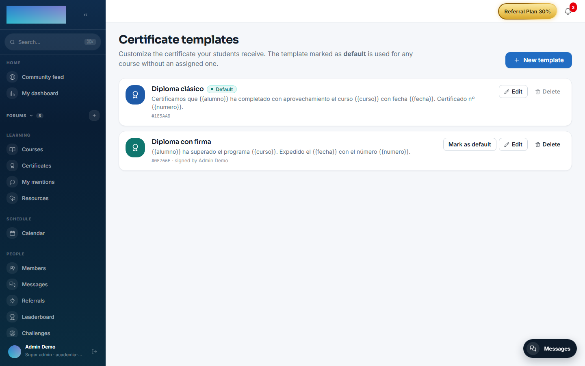
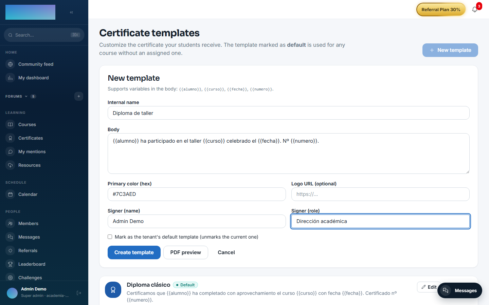
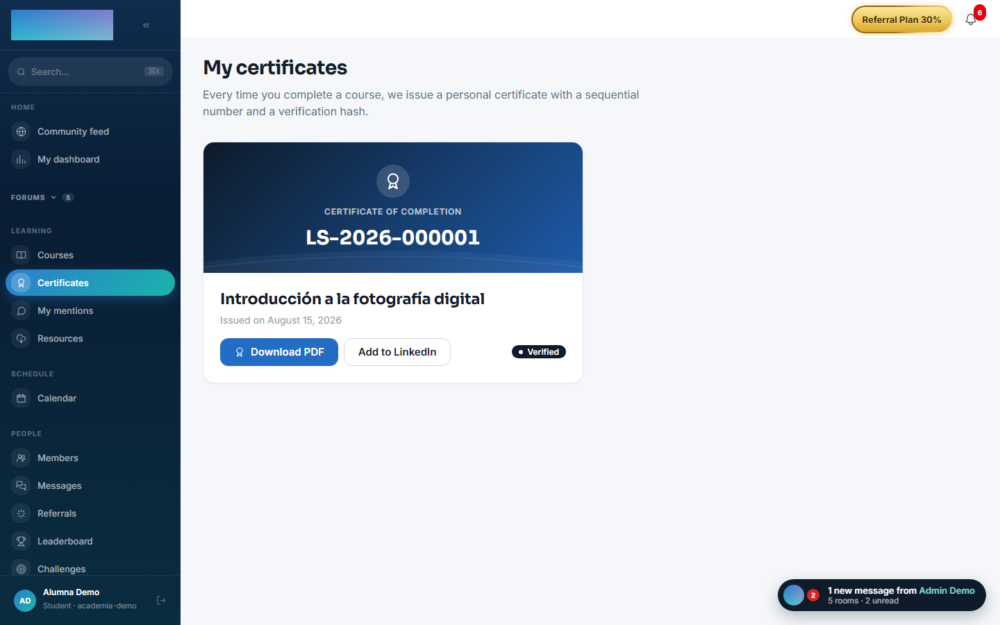

# mod.certificates — Certificates

Community · **Core** category (always active)

## What it does

Issuing and managing PDF certificates on course completion: **customisable templates** per organization (logo, copy, color, signatory) with a default template, **automatic issuing** on receiving `learning.course.completed`, unique sequential numbering per tenant, and **public verification** through a shareable link (the URL you add to a LinkedIn profile).

## How it works

- Every issued certificate stores an **immutable snapshot** (student, course, date) and the SHA-256 hash of the PDF: renaming the course afterwards does not alter an already issued certificate. The PDF is regenerated on demand from the snapshot.
- Two uniqueness constraints: `(tenant, number)` guarantees sequential numbering and `(tenant, enrollment)` prevents issuing twice for the same enrollment.
- **Public verification** (`/modules/certificates/verify/:id`) returns `{ number, studentName, courseTitle, issuedAt, valid }` without ever exposing an email address or internal data. The data model accounts for revocation (`revoked_at`): a revoked certificate verifies with `valid: false` and the public page flags it "Revoked certificate" — although today there is no revoke operation in the API or the panel.
- The template editor has a **PDF preview** with sample data, persisting nothing.

## Configuration

- **Activation**: a `core`-category module, always active. It does not appear in the "Modules" tab at `/admin/configuracion?tab=modules` and cannot be disabled.
- **Tenant templates**: all customisation goes through templates, at `/formador/certificados/templates` ("Certificate templates"); the instructor, tenant_admin and super_admin roles can manage them. The one marked as **default** applies to any course without an assigned template.
- **Template per course**: assigned in the builder (`/formador/cursos/<id>`, "Certificate template" card; the "Tenant default" option delegates to the default).
- **Environment variables**: none of its own. Issued PDFs are stored in the instance's file backend (`/admin/configuracion?tab=storage`).
- **License**: the whole module is Community; no feature requires Enterprise capabilities.

## Step-by-step usage

### Designing the templates (instructor or admin)

1. At `/formador/certificados/templates`, click "New template". Fill in "Internal name", the "Body" (the certificate's central text), "Primary color (hex)", "Logo URL (optional)" and the signatory ("Signer (name)" and "Signer (role)"). The student's name, the course, the date and the number are always rendered by the PDF layout itself, in fixed positions.
2. Click "PDF preview" to see the result with sample data; nothing is saved until you click "Create template".
3. Mark one template as the default ("Mark as the tenant's default template" or the "Mark as default" button): it will apply to every course without its own template. The default cannot be deleted, and deleting a template in use returns 409.

    

    

4. If a specific course needs a different template, assign it from the course builder: "Certificate template" card → pick it under "Template" → "Save". The "Manage templates →" link returns to this screen.

### Issuing is automatic

1. When the student crosses the completion threshold, `mod.learning` emits `learning.course.completed` and the certificate is issued on its own: immutable snapshot, the tenant's sequential number and a PDF with the course's template (or the default). There is no "issue" button: if you need to re-issue, the PDF is regenerated on demand from the snapshot when downloaded.

### Downloading and sharing (student)

1. At `/mis-certificados` ("My certificates") the student sees each certificate with its number and date ("Issued on…").
2. "Download PDF" opens the certificate; "Add to LinkedIn" opens LinkedIn's pre-filled *Add to Profile* flow, with the public verification URL as the credential.
3. The completed course's page also shows "Download certificate".

    

### Verifying a certificate (anyone, no account)

1. The public page `/verificar/<id>` shows "Verified certificate" with the number, student, course and "Issue date" — or "Revoked certificate" if it is no longer valid. It exposes no email or internal data; if the snapshot's name was an email address, it is hidden.

    

## Dependencies

- Hard: `mod.learning` (issuing is triggered on completion). Optional: `mod.courses` (reading course data when issuing).

## Data model

| Table | What it stores |
| --- | --- |
| `mod_certificates_template` | Templates: body, color, logo, signatory, default flag. |
| `mod_certificates_issued` | Issued certificates: number, SHA-256 hash, JSON snapshot, storage key, revocation. |

## API

Prefix `/modules/certificates`: the student's own (`me`, detail, download), templates (instructor and above) and public verification. Details in [Reference → Learning](../../api/referencia/aprendizaje.md#certificates-modulescertificates).

## Events

- **Emits**: `certificates.issued`, `certificates.revoked`.
- **Consumes**: `learning.course.completed` (automatic issuing).
