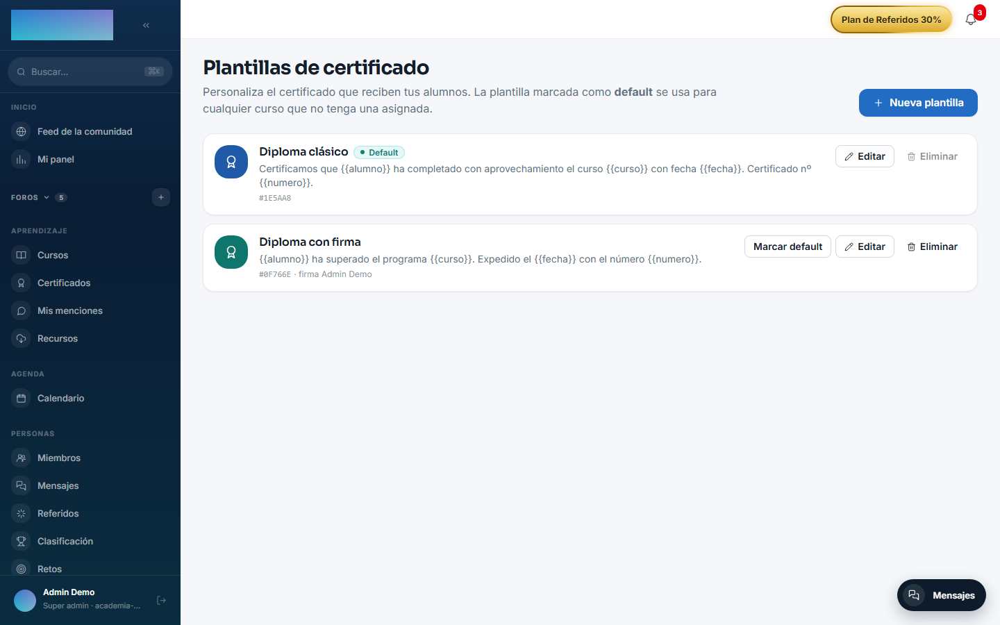
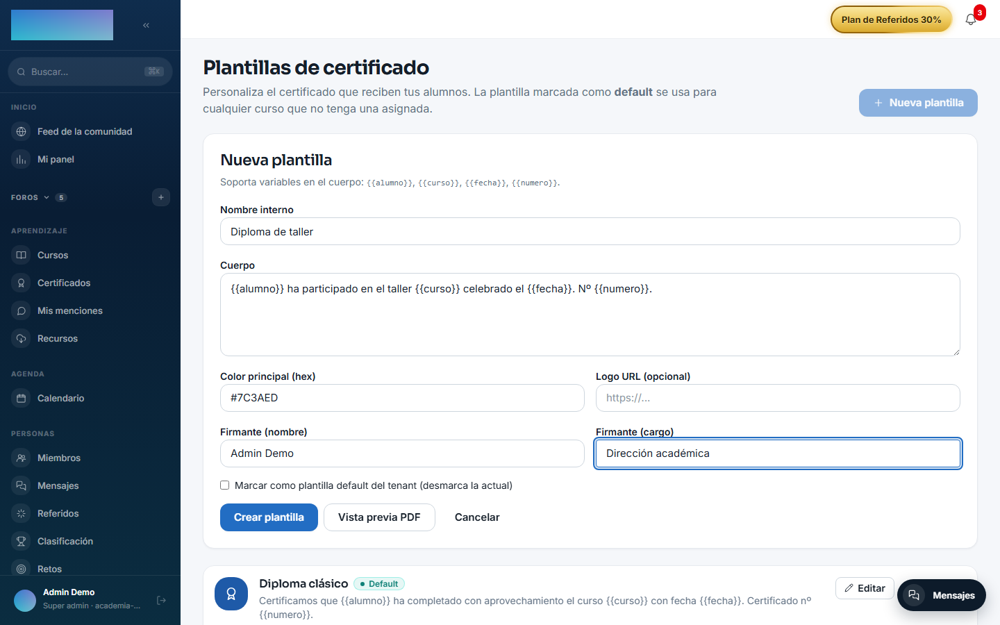
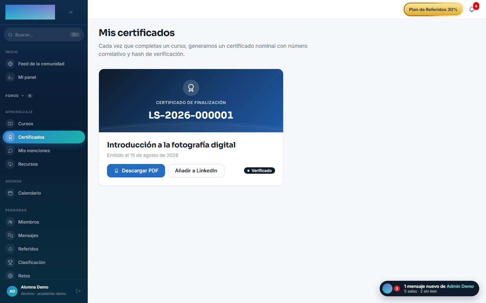

# mod.certificates — Certificados

Community · Categoría **core** (siempre activo)

## Qué hace

Emisión y gestión de certificados PDF al completar un curso: **plantillas personalizables** por organización (logo, copy, color, firmante) con plantilla por defecto, **emisión automática** al recibir `learning.course.completed`, numeración correlativa única por tenant, y **verificación pública** por enlace compartible (la URL que se añade al perfil de LinkedIn).

## Cómo funciona

- Cada certificado emitido guarda un **snapshot inmutable** (alumno, curso, fecha) y el hash SHA-256 del PDF: renombrar el curso después no altera un certificado ya emitido. El PDF se regenera bajo demanda desde el snapshot.
- Doble unicidad: `(tenant, número)` garantiza numeración correlativa y `(tenant, matrícula)` impide emitir dos veces por la misma matrícula.
- La **verificación pública** (`/modules/certificates/verify/:id`) responde `{ number, studentName, courseTitle, issuedAt, valid }` sin exponer nunca email ni datos internos. El modelo de datos contempla la revocación (`revoked_at`): un certificado revocado verifica con `valid: false` y la página pública lo marca «Certificado revocado» — aunque hoy no existe operación de revocado en la API ni en el panel.
- El editor de plantillas tiene **preview PDF** con datos de ejemplo, sin persistir nada.

## Configuración

- **Activación**: módulo de categoría `core`, siempre activo. No aparece en la pestaña «Módulos» de `/admin/configuracion?tab=modules` y no se puede desactivar.
- **Plantillas del tenant**: toda la personalización va por plantillas, en `/formador/certificados/templates` («Plantillas de certificado»); pueden gestionarlas los roles formador, tenant_admin y super_admin. La marcada como **default** se aplica a cualquier curso sin plantilla asignada.
- **Plantilla por curso**: se asigna en el builder (`/formador/cursos/<id>`, tarjeta «Plantilla de certificado»; la opción «Por defecto del tenant» delega en la default).
- **Variables de entorno**: ninguna propia. Los PDF emitidos se guardan en el backend de archivos de la instancia (`/admin/configuracion?tab=storage`).
- **Licencia**: todo el módulo es Community; ninguna función exige capabilities de Enterprise.

## Uso paso a paso

### Diseñar las plantillas (formador o admin)

1. En `/formador/certificados/templates`, pulsa «Nueva plantilla». Rellena «Nombre interno», el «Cuerpo» (el texto central del certificado), «Color principal (hex)», «Logo URL (opcional)» y el firmante («Firmante (nombre)» y «Firmante (cargo)»). El nombre del alumno, el curso, la fecha y el número los pinta siempre el propio diseño del PDF, en sus posiciones fijas.
2. Pulsa «Vista previa PDF» para ver el resultado con datos de ejemplo; no se guarda nada hasta que pulses «Crear plantilla».
3. Marca una plantilla como default («Marcar como plantilla default del tenant» o el botón «Marcar default»): se aplicará a todos los cursos sin plantilla propia. La default no se puede eliminar, y borrar una plantilla en uso responde 409.

    

    

4. Si un curso concreto necesita otra plantilla, asígnala desde el builder del curso: tarjeta «Plantilla de certificado» → elige en «Plantilla» → «Guardar». El enlace «Gestionar plantillas →» vuelve a esta pantalla.

### La emisión es automática

1. Cuando el alumno cruza el umbral de finalización, `mod.learning` emite `learning.course.completed` y el certificado se emite solo: snapshot inmutable, número correlativo del tenant y PDF con la plantilla del curso (o la default). No hay botón de «emitir»: si necesitas re-emitir, el PDF se regenera bajo demanda desde el snapshot al descargarlo.

### Descargar y compartir (alumno)

1. En `/mis-certificados` («Mis certificados») el alumno ve cada certificado con su número y fecha («Emitido el…»).
2. «Descargar PDF» abre el certificado; «Añadir a LinkedIn» abre el flujo *Add to Profile* de LinkedIn pre-rellenado, con la URL de verificación pública como credencial.
3. En la ficha del curso completado también aparece «Descargar certificado».

    

### Verificar un certificado (cualquiera, sin cuenta)

1. La página pública `/verificar/<id>` muestra «Certificado verificado» con número, alumno, curso y «Fecha de emisión» — o «Certificado revocado» si dejó de ser válido. No expone email ni datos internos; si el nombre del snapshot era un email, se oculta.

    

## Dependencias

- Dura: `mod.learning` (la emisión se dispara al completar). Opcional: `mod.courses` (lectura de datos del curso al emitir).

## Modelo de datos

| Tabla | Qué guarda |
| --- | --- |
| `mod_certificates_template` | Plantillas: cuerpo, color, logo, firmante, flag default. |
| `mod_certificates_issued` | Emitidos: número, hash SHA-256, snapshot JSON, clave de storage, revocación. |

## API

Prefijo `/modules/certificates`: los del alumno (`me`, detalle, descarga), plantillas (formador+) y verificación pública. Detalle en [Referencia → Aprendizaje](../../api/referencia/aprendizaje.md#certificados-modulescertificates).

## Eventos

- **Emite**: `certificates.issued`, `certificates.revoked`.
- **Consume**: `learning.course.completed` (auto-emisión).
