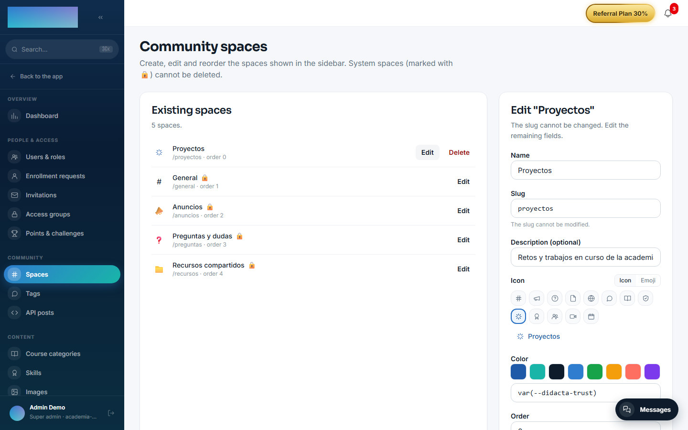
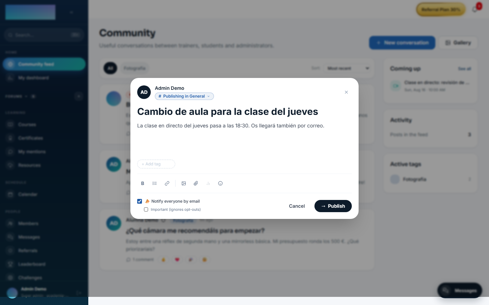
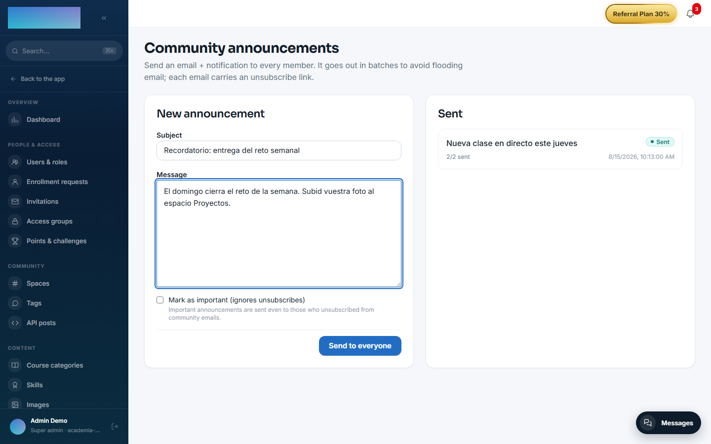
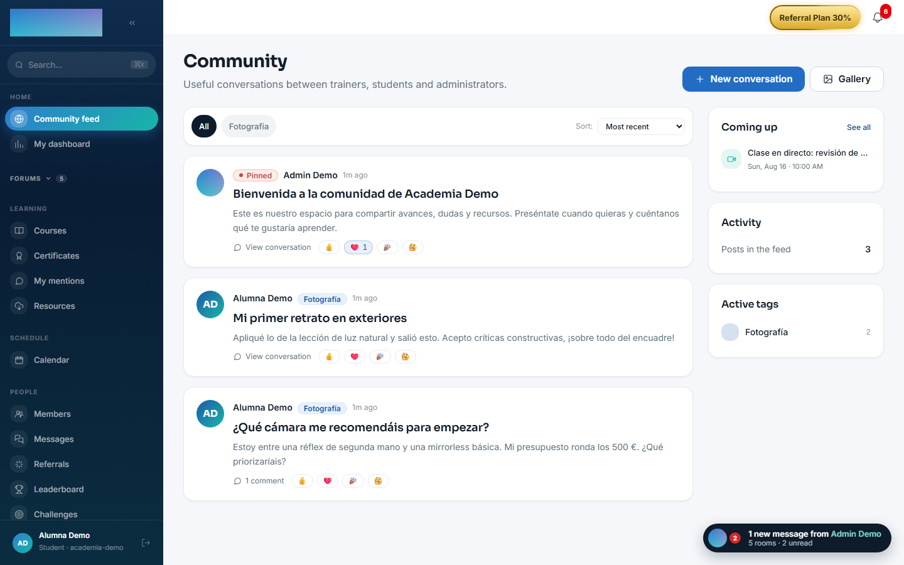

# mod.community — Community

Community · **Core** category (always active)

## What it does

The tenant's social feed: **posts** (optionally tied to a course and a space), **comments** with one level of replies, emoji **reactions**, `@user` **mentions** with autocomplete, admin-**curated tags** (name, color, icon) and manageable **spaces** (the 4 system ones are editable but cannot be deleted). On top of that: moderation, pinned posts, a member directory, a weekly email digest and **announcements** (broadcasts) with an unsubscribe link.

## How it works

- A deliberate distinction between **moderation hiding** (`hidden`, reversible, the row is preserved along with the reason) and **deletion by the author** (soft delete).
- A post with `notifyAll` (admin only) also generates an email + bell broadcast to every member; `important` ignores the recipient's opt-out.
- Broadcasts are sent **in throttled batches** (to protect SMTP reputation) and carry a resume cursor for retries.
- Publishing over the **external API** (`/community-api`, with an API key scoped `community:post` whose owner is an admin): those posts come in with `source='api'`, which is how automated content is distinguished.
- The weekly digest is scheduled with `COMMUNITY_DIGEST_CRON` (Mondays at 09:00 UTC by default) and honours each user's opt-out.

## Configuration

**Activation.** `mod.community` is a **core**-category module: it is always active and does not appear on the "Modules" tab of `Administration → Settings` (`/admin/configuracion`), which only lists the modules that can be disabled. If anything tries to disable it over the API, the backend rejects it with `CORE_MODULE_NOT_DISABLEABLE`.

Everything else is configured from the panel, each thing on its own screen:

- **Spaces** — `/admin/comunidad/espacios` ("Community spaces", Community group of the admin area). Per space: "Name", "Slug" (permanent once created), "Description (optional)", icon or emoji, "Color" and "Order" (lower number → appears earlier in the sidebar). System spaces are marked with 🔒: editable, not deletable. An admin can also create a space from the "+" button of the "Forums" sidebar group.
- **Curated tags** — `/admin/comunidad/tags` ("Community tags"). Name (normalized to lowercase to avoid duplicates), color and icon; editing a tag affects every post that uses it. Authors can still write free-form tags in their posts.
- **Posts via API** — `/admin/comunidad/publicaciones-api` ("Posts via API") lists the posts created with `POST /community-api/posts`, grouped by the admin who owns the API key. Keys (scope `community:post`) are managed in `/admin/api-keys` ("API keys").
- **Announcements** — `/admin/avisos` ("Community announcements", Communication group): "Subject", "Message" and the "Mark as important (ignores unsubscribes)" checkbox.
- **Weekly digest, per user** — each member controls it in `/cuenta`, "Notifications" tab: the "Community" row ("Mentions, replies and the weekly digest.") crossed with the "Email" column.
- **Roles** — hide/restore, pin, tags, spaces, announcements and `notifyAll` require `super_admin` or `tenant_admin`; instructors do not moderate the community.

Environment variables (workers):

- `REDIS_URL` — without it neither the digest nor broadcast delivery starts (the feed keeps working).
- `COMMUNITY_DIGEST_CRON` — cron for the weekly digest (`0 9 * * 1`, Mondays 09:00 UTC).
- `COMMUNITY_BROADCAST_BATCH_SIZE` (5) and `COMMUNITY_BROADCAST_INTERVAL_MS` (10 000 ms) — batch size and pause between announcement batches.
- `WEB_PUBLIC_URL` — base of the unsubscribe link carried by every announcement email.

Manual digest trigger (QA): `POST /modules/community/digest/run-now`, `super_admin` only. No feature of this module requires an Enterprise license.

## Step-by-step usage

**The operator (admin):**

1. Shape the spaces in `/admin/comunidad/espacios`: rename the system ones, create your own and sort them with "Order".
2. Curate the official tags in `/admin/comunidad/tags` so the feed and the sidebar paint them with color and icon.
3. Publish the first post from the feed with "New conversation". Only admins see the "📣 Notify everyone by email" checkbox; ticking it reveals "Important (ignores opt-outs)" for when the message really must bypass unsubscribes.

    

4. Moderate from the feed itself: "Hide post" (asks for an optional reason and preserves the row), "Restore", "Pin" and "Unpin". Hiding also revokes the points the content earned if gamification is active.
5. For announcements without a post, `/admin/avisos`: subject, message and "Send to everyone". The history ("Sent") shows each announcement's status and its "{sent}/{total} sent" progress.

    

**The student (member):**

1. In `/comunidad` press "New conversation": title, rich text, tags, `@user` mentions with autocomplete, up to 10 images and 5 files per post. "Publish".

    

2. Posts can live inside a space: spaces hang from the "Forums" sidebar group and each one lives at `/espacios/<slug>`, with sorting ("Most recent", "Oldest first", "Most commented") and a "Gallery" tab with the space's attachments.
3. Comment (one level of replies) and react with emoji on posts and comments.
4. Mentions accumulate in `/comunidad/menciones` ("My mentions"); the directory lives at `/miembros` and each member's public profile at `/u/<id>`.
5. To stop community emails, turn off the "Community" row in `/cuenta` → "Notifications", or use the unsubscribe link in the email itself; announcements marked as important still arrive.

## Dependencies

Optional: `mod.courses` (posts tied to a course).

## Data model

`mod_community_post` · `_comment` · `_reaction` · `_mention` · `_tag` · `_space` · `_broadcast` (with status and cursor) · `_user_pref` (preferences; today, the digest opt-out).

## API

Prefix `/modules/community` + `/community-api` (integrations) + public token-based unsubscribe. Details in [Reference → Community and people](../../api/referencia/comunidad.md#community-modulescommunity).

## Events

**Emits**: `community.post.created`, `community.comment.created`, `community.reaction.added` (+ mentions). It consumes none. Its events feed [gamification](gamification.md) and the [outgoing webhooks](../../api/convenciones.md#outgoing-webhooks).
