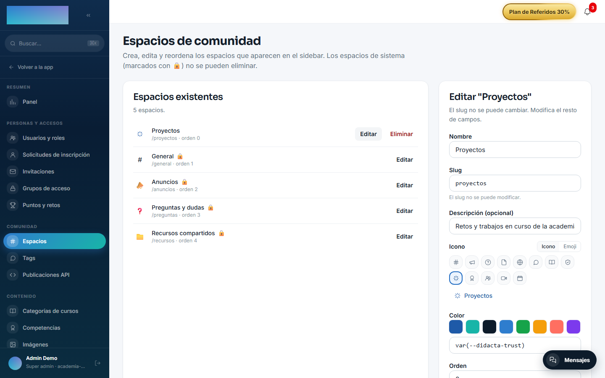
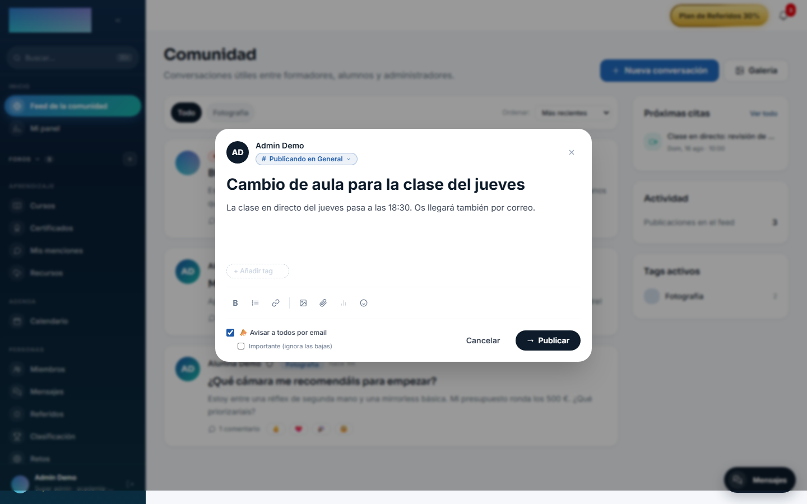
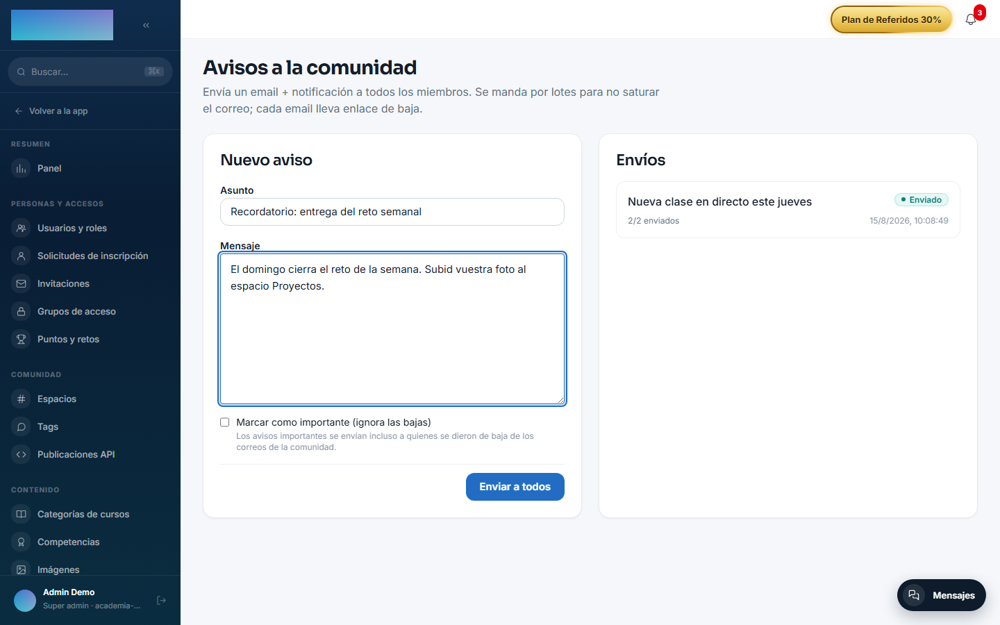
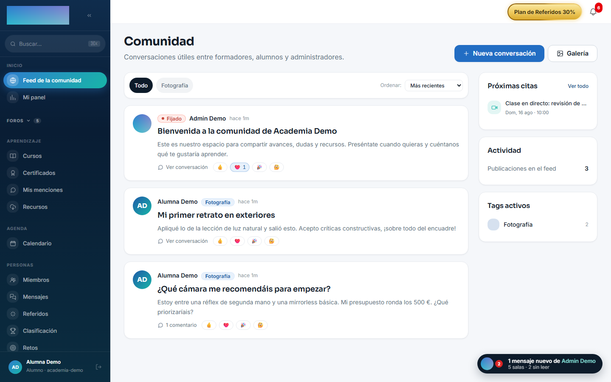

# mod.community — Comunidad

Community · Categoría **core** (siempre activo)

## Qué hace

El feed social del tenant: **posts** (opcionalmente ligados a un curso y a un espacio), **comentarios** con un nivel de respuesta, **reacciones** por emoji, **menciones** `@usuario` con autocomplete, **tags curados** por el admin (nombre, color, icono) y **espacios** administrables (los 4 de sistema son editables pero no eliminables). Encima: moderación, pinning de posts, directorio de miembros, digest semanal por email y **avisos masivos** (broadcasts) con baja por enlace.

## Cómo funciona

- Distinción deliberada entre **ocultado de moderación** (`hidden`, reversible, la fila se preserva con motivo) y **borrado del autor** (soft-delete).
- Un post con `notifyAll` (solo admin) genera además un broadcast por email y campana a todos los miembros; `important` ignora el opt-out del receptor.
- Los broadcasts se envían **por lotes con throttling** (para cuidar la reputación SMTP) y llevan cursor de reanudación para reintentos.
- Publicación por **API externa** (`/community-api`, con API key de scope `community:post` cuyo dueño sea admin): los posts entran con `source='api'` — así se distingue el contenido automatizado.
- El digest semanal se programa con `COMMUNITY_DIGEST_CRON` (lunes 09:00 UTC por defecto) y respeta el opt-out por usuario.

## Configuración

**Activación.** `mod.community` es de categoría **core**: está siempre activo y no aparece en la pestaña «Módulos» de `Administración → Configuración` (`/admin/configuracion`), que solo lista los módulos desactivables. Si algo intenta desactivarlo por API, el backend lo rechaza con `CORE_MODULE_NOT_DISABLEABLE`.

Todo lo demás se configura desde el panel, cada cosa en su pantalla:

- **Espacios** — `/admin/comunidad/espacios` («Espacios de comunidad», grupo Comunidad del área de administración). Por espacio: «Nombre», «Slug» (permanente una vez creado), «Descripción (opcional)», icono o emoji, «Color» y «Orden» (número menor → aparece antes en el sidebar). Los espacios de sistema van marcados con 🔒: editables, no eliminables. Un admin también puede crear un espacio desde el botón «+» del grupo «Foros» del sidebar.
- **Tags curados** — `/admin/comunidad/tags` («Tags de comunidad»). Nombre (se normaliza a minúsculas para evitar duplicados), color e icono; editar un tag impacta a todos los posts que lo usan. Los autores siguen pudiendo escribir tags libres en sus posts.
- **Publicaciones por API** — `/admin/comunidad/publicaciones-api` («Publicaciones por API») lista los posts entrados con `POST /community-api/posts`, agrupados por el admin dueño de la API key. Las claves (scope `community:post`) se gestionan en `/admin/api-keys` («Claves API»).
- **Avisos masivos** — `/admin/avisos` («Avisos a la comunidad», grupo Comunicación): «Asunto», «Mensaje» y el checkbox «Marcar como importante (ignora las bajas)».
- **Digest semanal, por usuario** — cada miembro lo controla en `/cuenta`, pestaña «Notificaciones»: fila «Comunidad» («Menciones, respuestas y resumen semanal.») cruzada con la columna «Email».
- **Roles** — ocultar/restaurar, fijar, tags, espacios, avisos y `notifyAll` exigen `super_admin` o `tenant_admin`; el formador no modera la comunidad.

Variables de entorno (workers):

- `REDIS_URL` — sin ella no arrancan ni el digest ni el envío de broadcasts (el feed sigue funcionando).
- `COMMUNITY_DIGEST_CRON` — cron del digest semanal (`0 9 * * 1`, lunes 09:00 UTC).
- `COMMUNITY_BROADCAST_BATCH_SIZE` (5) y `COMMUNITY_BROADCAST_INTERVAL_MS` (10 000 ms) — tamaño del lote y pausa entre lotes de los avisos.
- `WEB_PUBLIC_URL` — base del enlace de baja que lleva cada email de aviso.

Disparo manual del digest (QA): `POST /modules/community/digest/run-now`, solo `super_admin`. Ninguna función del módulo exige licencia Enterprise.

## Uso paso a paso

**El operador (admin):**

1. Deja los espacios como quiere que se vea la comunidad en `/admin/comunidad/espacios`: renombra los de sistema, crea los suyos y ordénalos con «Orden».
2. Cura los tags oficiales en `/admin/comunidad/tags` para que el feed y el sidebar los pinten con color e icono.
3. Publica el primer post desde el feed con «Nueva conversación». Solo el admin ve el checkbox «📣 Avisar a todos por email»; al marcarlo aparece «Importante (ignora las bajas)» para saltarse el opt-out cuando de verdad toca.

    

4. Modera desde el propio feed: «Ocultar post» (pide un motivo opcional y la fila se conserva), «Restaurar», «Fijar» y «Desfijar». Ocultar también revoca los puntos que dio el contenido si la gamificación está activa.
5. Para comunicados sin post, `/admin/avisos`: asunto, mensaje y «Enviar a todos». El historial («Envíos») muestra el estado y el progreso «{sent}/{total} enviados» de cada aviso.

    

**El alumno (miembro):**

1. En `/comunidad` pulsa «Nueva conversación»: título, texto enriquecido, tags, menciones `@usuario` con autocomplete, hasta 10 imágenes y 5 archivos por publicación. «Publicar».

    

2. Puede publicar dentro de un espacio: cuelgan del grupo «Foros» del sidebar y cada uno vive en `/espacios/<slug>`, con orden («Más recientes», «Más antiguas», «Más comentadas») y pestaña «Galería» con los adjuntos del espacio.
3. Comenta (un nivel de respuesta) y reacciona con emoji sobre posts y comentarios.
4. Sus menciones se acumulan en `/comunidad/menciones` («Mis menciones»); el directorio está en `/miembros` y el perfil público de cada miembro en `/u/<id>`.
5. Si no quiere emails de comunidad, apaga la fila «Comunidad» en `/cuenta` → «Notificaciones», o usa el enlace de baja del propio email; los avisos marcados como importantes llegan igual.

## Dependencias

Opcional: `mod.courses` (posts ligados a curso).

## Modelo de datos

`mod_community_post` · `_comment` · `_reaction` · `_mention` · `_tag` · `_space` · `_broadcast` (con estado y cursor) · `_user_pref` (preferencias, hoy el opt-out del digest).

## API

Prefijo `/modules/community` + `/community-api` (integraciones) + baja pública por token. Detalle en [Referencia → Comunidad y personas](../../api/referencia/comunidad.md#comunidad-modulescommunity).

## Eventos

**Emite**: `community.post.created`, `community.comment.created`, `community.reaction.added` (+ menciones). No consume. Sus eventos alimentan la [gamificación](gamification.md) y los [webhooks salientes](../../api/convenciones.md#webhooks-salientes).
