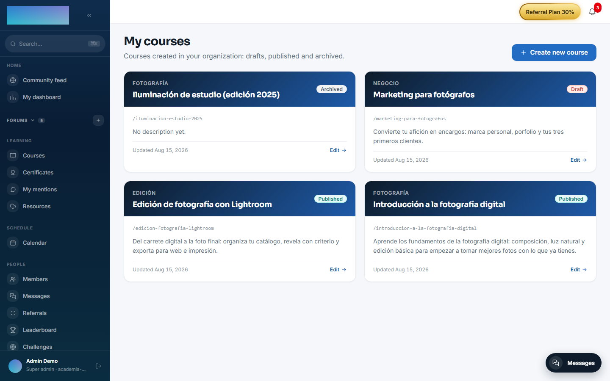
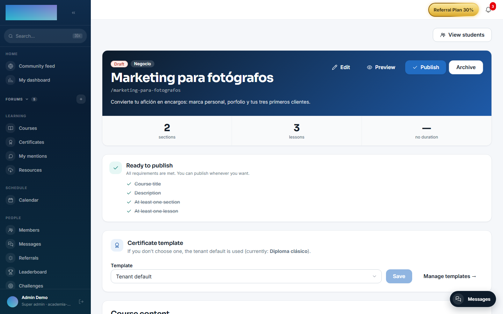
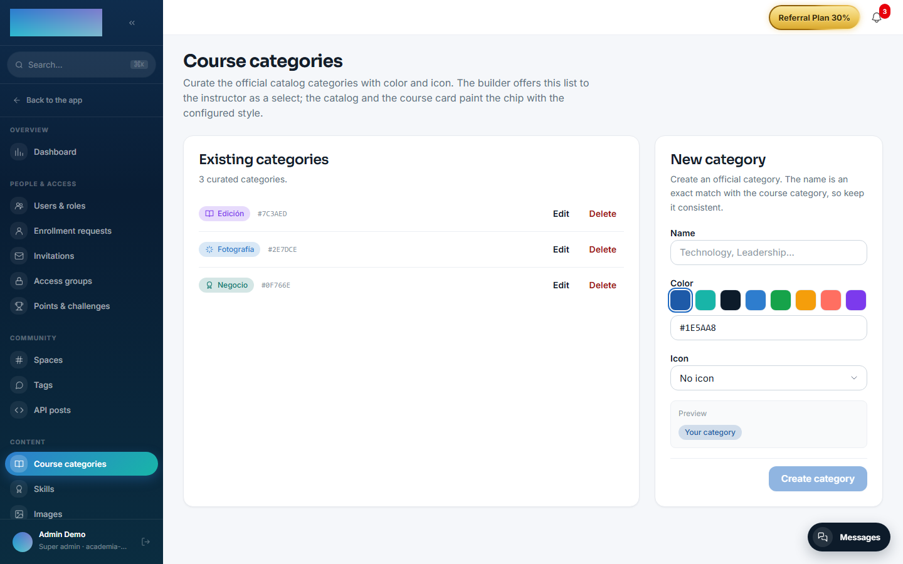
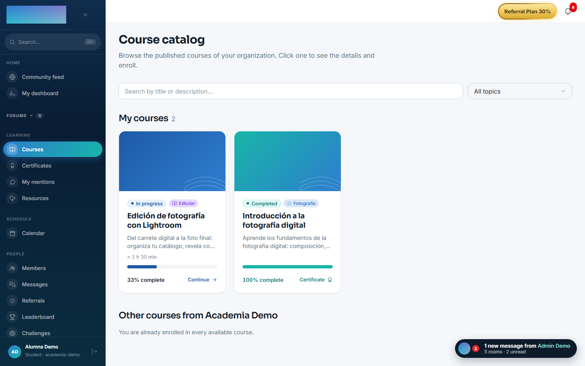

# mod.courses — Courses and catalog

Community · **Core** category (always active)

## What it does

This is the heart of the catalog: courses with a `slug`, title and status (`DRAFT` → `PUBLISHED` → `ARCHIVED`), **modules** as an ordered grouping inside a course, and typed **lessons** (`VIDEO`, `HTML`, `PDF`, `TEXT`, `QUIZ`, `SCORM`) with flexible JSON content. It includes admin-curated categories (name, color, icon) and advanced editing operations: bulk reordering of modules and lessons (drag & drop) and moving lessons between modules.

## How it works

- **Publishing goes through an open hook**: before publishing, `mod.courses` runs `courses.publish.validate` and any registered module can add blocking reasons (for example, `mod.fundae` requires objectives and a duration). If there are any reasons, publishing fails with a 422 and the list of reasons.
- Deletions are **soft deletes** with a logical cascade: removing a module or a lesson preserves students' historical progress.
- It is the piece almost every other module hangs off (learning, access-groups, billing, assessments, ai-content, ai-tutor…).

## Configuration

- **Activation**: a `core`-category module, always active in every tenant. It does not appear in the "Modules" tab at `/admin/configuracion?tab=modules` (that tab only lists deactivatable modules) and the API refuses to disable it; if a row is ever left with `enabled=false` in the database, server startup re-enables it automatically.
- **Per-tenant settings**: none. All configuration is per course, from the instructor's builder.
- **Curated categories**: the administrator manages them at `/admin/cursos/categorias` ("Course categories" screen): name, "Color" and "Icon". The name is an exact-text match with the category written on the course; the catalog and the course card render the chip with that style.
- **Environment variables**: none of its own. Cover images and SCORM packages are stored in the instance's file backend (`/admin/configuracion?tab=storage`, local disk or S3-compatible).
- **License**: the whole module is Community; no feature requires Enterprise capabilities.

## Step-by-step usage

### Creating and building a course (instructor)

1. At `/formador/cursos` ("My courses"), click "Create new course". Fill in "Title" and "Slug" (auto-generated from the title, kebab-case: it will be the course's public URL) and, optionally, a description, "Category" and "Estimated duration (min)". Click "Create course": the course starts in `DRAFT`.

    

2. In the builder (`/formador/cursos/<id>`), click "Add section", type the title and confirm with "Create section". Sections group related lessons.
3. Inside each section, "Add lesson": pick the "Type" (Video, HTML, PDF, Text, Quiz or SCORM), type the title and click "Create".
4. Click "Edit" on the lesson to load its content depending on the type: "Video URL" (YouTube, Bunny Stream or a `.mp4`/`.webm`/`.m3u8` file) with clickable "Resources and chapters", "PDF URL", "HTML", "Text", a linked quiz (see [mod.assessments](assessments.md)) or "Upload SCORM package" (a `.zip` with `imsmanifest.xml` at the root). The "Publish date (optional)" field schedules the lesson: with a future date it shows in the list but stays locked until then.

    

5. "Edit" in the header adjusts the metadata: description, "Category", "Estimated duration (min)", "Featured image" (the "Optimize" button recompresses it to WebP), "Featured video (URL)" and "External purchase URL" if this course is sold on an external page.
6. Reorder sections and lessons by dragging (drag & drop); a lesson can also be moved to another section. Deletions are soft deletes: the item stops showing but students' historical progress is preserved.
7. The "Before publishing" card lists the requirements: "Course title", "Description", "At least one section" and "At least one lesson". Once everything is met it switches to "Ready to publish". Click "Publish"; if a module hooked into the validation blocks publishing (e.g. FUNDAE), the API responds 422 with the reasons.
8. "Archive" removes the course from the catalog without deleting anything; "Unarchive" returns it to `DRAFT` (it is not republished automatically: you review it and click "Publish" again).

### Curating the catalog categories (admin)

1. At `/admin/cursos/categorias`, create each category with "Name", "Color" and "Icon" and click "Create category". The preview shows the resulting chip.
2. The builder offers this list to the instructor as the "Category" dropdown. If a category is deleted, courses that used it keep showing the name as plain text.

    

### What the student sees

- The catalog (`/cursos`) lists only `PUBLISHED` courses, with search and filters by topic and language.
- The course page (`/cursos/<slug>`) shows the hero (featured video > image > fallback), the description and the syllabus. An instructor or admin can open the page of an unpublished course in "Preview" mode, without enrolling.

    

## Dependencies

- Hard: none.
- Optional: `mod.certificates` (validates the certificate template assigned to the course).

## Data model

| Table | What it stores |
| --- | --- |
| `mod_courses_course` | The course: slug, title, status, category, certificate template. |
| `mod_courses_module` | An ordered grouping inside the course. |
| `mod_courses_lesson` | The lesson: type, JSONB content, duration, scheduled publication date. |
| `mod_courses_category` | Curated categories (name, color, icon). |

## API

Prefix `/modules/courses`: CRUD for courses/modules/lessons, managed categories, status transitions and the bulk ordering endpoint. Details in [Reference → Learning](../../api/referencia/aprendizaje.md#courses-modulescourses).

## Events and hooks

- **Emits**: `courses.course.created/updated/published/archived/unarchived`, `courses.module.created/deleted`, `courses.lesson.created/updated/moved`.
- **Exposes the hook** `courses.publish.validate` (the only active hook in the product — the reference pattern).
