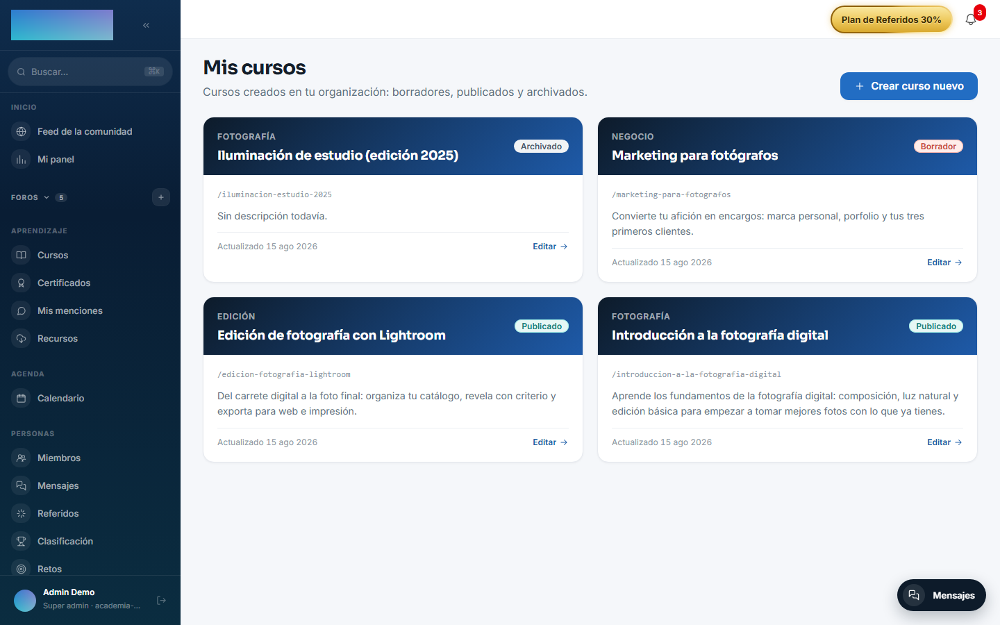
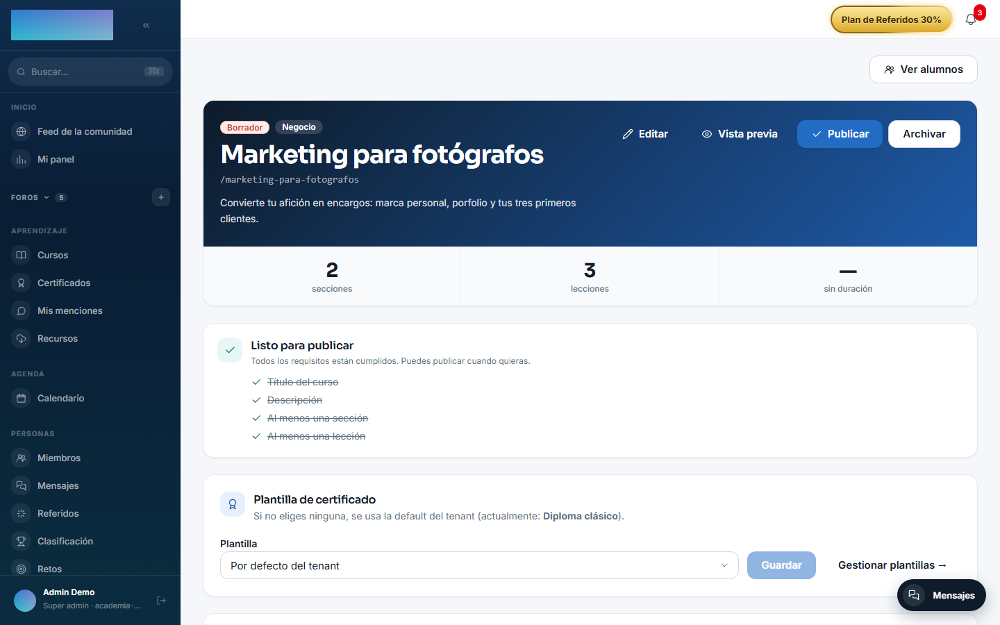
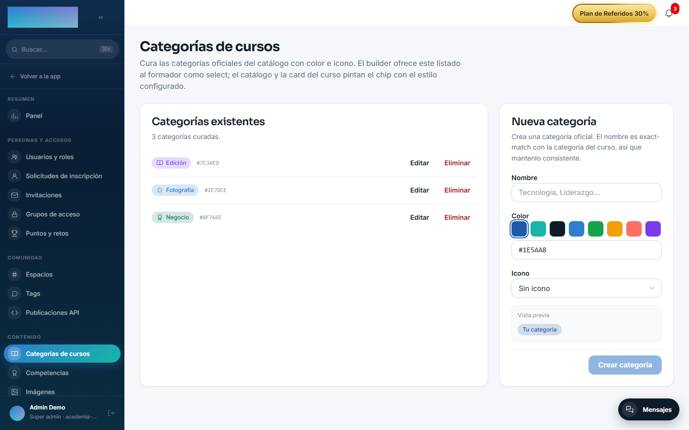
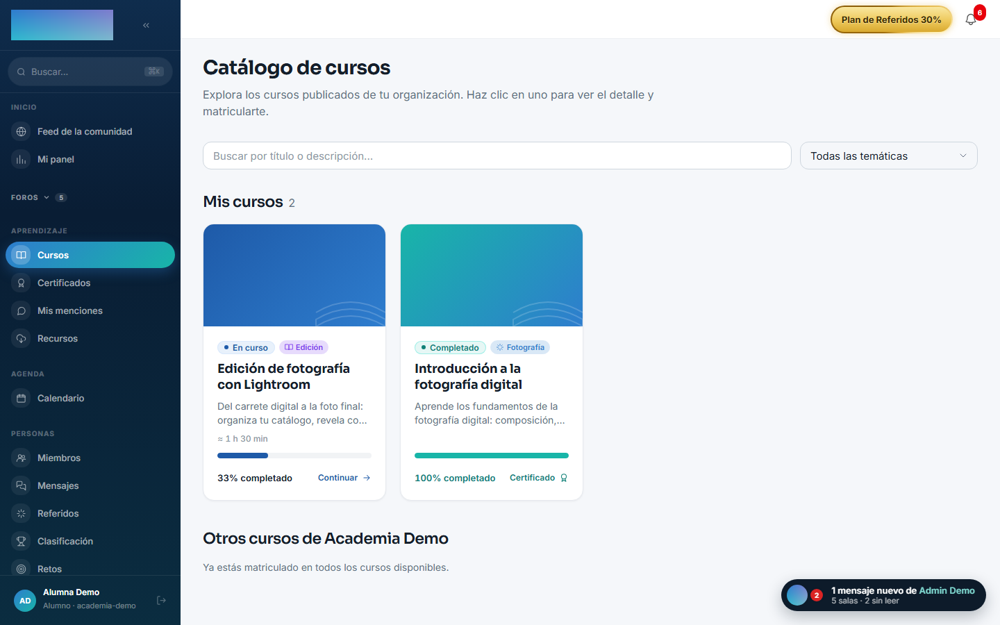

# mod.courses — Cursos y catálogo

Community · Categoría **core** (siempre activo)

## Qué hace

Es el corazón del catálogo: cursos con `slug`, título y estado (`DRAFT` → `PUBLISHED` → `ARCHIVED`), **módulos** como agrupación ordenada dentro del curso y **lecciones** tipadas (`VIDEO`, `HTML`, `PDF`, `TEXT`, `QUIZ`, `SCORM`) con contenido JSON flexible. Incluye categorías curadas por el administrador (nombre, color, icono) y operaciones de edición avanzadas: reordenar módulos y lecciones en bloque (drag & drop) y mover lecciones entre módulos.

## Cómo funciona

- La **publicación pasa por un hook abierto**: antes de publicar, `mod.courses` ejecuta `courses.publish.validate` y cualquier módulo registrado puede añadir razones de bloqueo (por ejemplo, `mod.fundae` exige objetivos y duración). Si hay razones, la publicación falla con 422 y la lista de motivos.
- Los borrados son **soft-delete** con cascada lógica: eliminar un módulo o lección preserva el progreso histórico de los alumnos.
- Es la pieza de la que cuelgan casi todos los demás módulos (learning, access-groups, billing, assessments, ai-content, ai-tutor…).

## Configuración

- **Activación**: módulo de categoría `core`, siempre activo en todos los tenants. No aparece en la pestaña «Módulos» de `/admin/configuracion?tab=modules` (esa pestaña solo lista los módulos desactivables) y la API rechaza desactivarlo; si en base de datos queda una fila con `enabled=false`, el arranque del servidor la re-habilita solo.
- **Ajustes por tenant**: no expone ninguno. Toda la configuración es por curso, desde el builder del formador.
- **Categorías curadas**: el administrador las gestiona en `/admin/cursos/categorias` (pantalla «Categorías de cursos»): nombre, «Color» e «Icono». El nombre casa por texto exacto con la categoría escrita en el curso; el catálogo y la card del curso pintan el chip con ese estilo.
- **Variables de entorno**: ninguna propia. Las imágenes de portada y los paquetes SCORM se guardan en el backend de archivos de la instancia (`/admin/configuracion?tab=storage`, disco local o S3-compatible).
- **Licencia**: todo el módulo es Community; ninguna función exige capabilities de Enterprise.

## Uso paso a paso

### Crear y montar un curso (formador)

1. En `/formador/cursos` («Mis cursos»), pulsa «Crear curso nuevo». Rellena «Título» y «Slug» (se genera solo desde el título, en kebab-case: será la URL pública del curso) y, si quieres, descripción, «Categoría» y «Duración estimada (min)». Pulsa «Crear curso»: el curso nace en `DRAFT`.

    

2. En el builder (`/formador/cursos/<id>`), pulsa «Añadir sección», escribe el título y confirma con «Crear sección». Las secciones agrupan lecciones relacionadas.
3. Dentro de cada sección, «Añadir lección»: elige el «Tipo» (Vídeo, HTML, PDF, Texto, Quiz o SCORM), escribe el título y pulsa «Crear».
4. Pulsa «Editar» sobre la lección para cargar su contenido según el tipo: «URL del vídeo» (YouTube, Bunny Stream o archivo `.mp4`/`.webm`/`.m3u8`) con «Recursos y capítulos» clicables, «URL del PDF», «HTML», «Texto», quiz vinculado (ver [mod.assessments](assessments.md)) o «Subir paquete SCORM» (un `.zip` con `imsmanifest.xml` en la raíz). El campo «Fecha de publicación (opcional)» programa la lección: con fecha futura aparece en el listado pero bloqueada hasta ese momento.

    

5. Con «Editar» en la cabecera ajustas los metadatos: descripción, «Categoría», «Duración estimada (min)», «Imagen destacada» (botón «Optimizar» la recomprime a WebP), «Vídeo destacado (URL)» y «URL de compra externa» si la venta de este curso ocurre en una página externa.
6. Reordena secciones y lecciones arrastrando (drag & drop); una lección también puede moverse a otra sección. Los borrados son soft-delete: dejan de mostrarse pero el progreso histórico de los alumnos se conserva.
7. La tarjeta «Antes de publicar» lista los requisitos: «Título del curso», «Descripción», «Al menos una sección» y «Al menos una lección». Con todo cumplido cambia a «Listo para publicar». Pulsa «Publicar»; si un módulo enganchado al hook bloquea la publicación (p. ej. FUNDAE), la API responde 422 con los motivos.
8. «Archivar» retira el curso del catálogo sin borrar nada; «Desarchivar» lo devuelve a `DRAFT` (no vuelve a publicarse solo: lo revisas y pulsas «Publicar» otra vez).

### Curar las categorías del catálogo (admin)

1. En `/admin/cursos/categorias`, crea cada categoría con «Nombre», «Color» e «Icono» y pulsa «Crear categoría». La vista previa muestra el chip resultante.
2. El builder ofrece este listado al formador como desplegable de «Categoría». Si se elimina una categoría, los cursos que la tenían siguen mostrando el nombre como texto plano.

    

### Lo que ve el alumno

- El catálogo (`/cursos`) lista solo los cursos `PUBLISHED`, con búsqueda y filtros por temática e idioma.
- La ficha (`/cursos/<slug>`) muestra el hero (vídeo destacado > imagen > fallback), la descripción y el temario. Un formador o admin puede abrir la ficha de un curso sin publicar en modo «Vista previa», sin matricularse.

    

## Dependencias

- Duras: ninguna.
- Opcional: `mod.certificates` (valida la plantilla de certificado asignada al curso).

## Modelo de datos

| Tabla | Qué guarda |
| --- | --- |
| `mod_courses_course` | Curso: slug, título, estado, categoría, plantilla de certificado. |
| `mod_courses_module` | Agrupación ordenada dentro del curso. |
| `mod_courses_lesson` | Lección: tipo, contenido JSONB, duración, fecha de publicación programada. |
| `mod_courses_category` | Categorías curadas (nombre, color, icono). |

## API

Prefijo `/modules/courses`: CRUD de cursos/módulos/lecciones, categorías gestionadas, transiciones de estado y bloque de ordenación. Detalle en [Referencia → Aprendizaje](../../api/referencia/aprendizaje.md#cursos-modulescourses).

## Eventos y hooks

- **Emite**: `courses.course.created/updated/published/archived/unarchived`, `courses.module.created/deleted`, `courses.lesson.created/updated/moved`.
- **Expone el hook** `courses.publish.validate` (el único hook activo del producto — el patrón de referencia).
