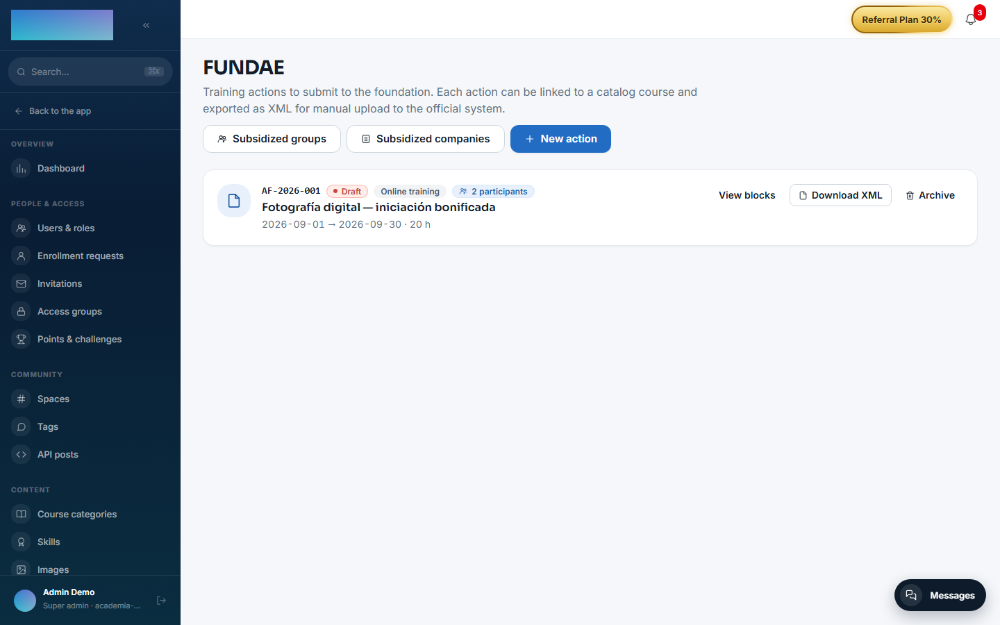
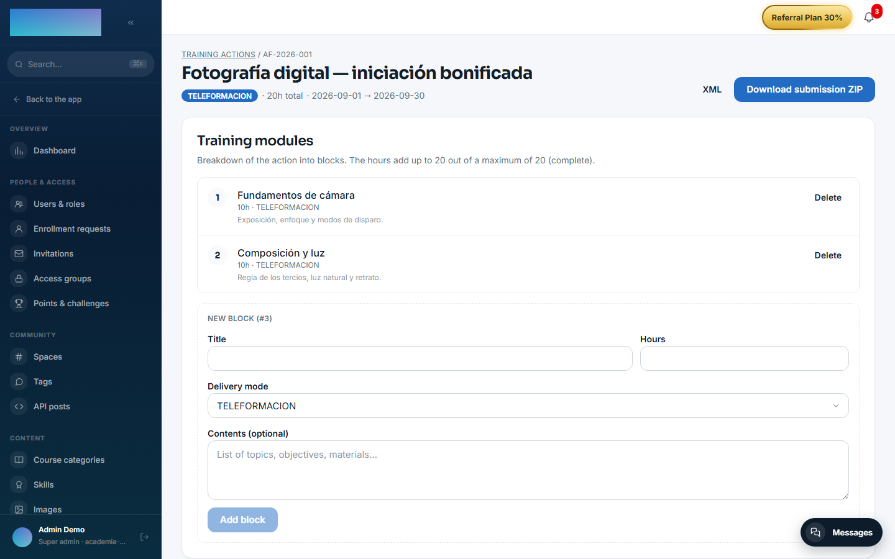

# mod.fundae — Fundae compliance

Community · **Compliance** category (can be disabled)

## What it does

Regulatory compliance for **subsidised training in Spain** (Royal Decree 694/2017):

- **Training actions** with a code, delivery mode (`PRESENCIAL`/`TELEFORMACION`/`MIXTA`), hours, dates and content blocks.
- **Subsidised companies** with a validated tax ID (DNI/NIE/CIF checksum), social security account code (CCC) and annual credit.
- **RLPT notices** to the workers' legal representatives, with the statutory 15 calendar day period calculated automatically and the evidence (PDF) stored in the Evidence Vault with its hash.
- **Subsidised groups** with a lifecycle (`DRAFT → ACTIVE → CLOSED/CANCELLED`), allocated costs and named participant enrollment.
- **Completion** with a configurable threshold (75% by default): APTO / NO_APTO / EN_CURSO per participant, with a `preview` mode.
- **Exports**: group start and group end XML files, plus a complete **audit ZIP** (`manifest.json` with a SHA-256 hash for every artifact + XMLs + CSVs + RLPT evidence), verifiable offline against those hashes.

## How it works

- Starting a group validates the **RLPT lead time** (15 days) and the company's **available credit**; closing the group debits the credit consumed.
- A company's tax ID is **immutable** once created (a change of tax ID means a new company, for traceability).
- The block hours cannot add up to more than the action's hours (Fundae checks this when the XML is uploaded).
- It is the natural consumer of the `courses.publish.validate` hook: it can block a course from being published if objectives or duration are missing.
- The whole surface is admin-only: every endpoint requires `super_admin` or `tenant_admin`. The instructor role has no access to Fundae.

## Configuration

- **Enabling or disabling the module**: `/admin/configuracion`, **Modules** tab — a per-organization switch.
- **Access**: the **Fundae** entry in the **Integrations & API** group of the admin menu (`/admin/fundae`); only `tenant_admin` and `super_admin` see it.
- **Completion threshold**: per group (`umbralFinalizacionPct`, 1–100; 75 by default), set through the API when creating or editing the group; the completion calculation also accepts a one-off `umbralOverride` without touching the persisted config. The panel shows the applied value as **Threshold {pct}%**.
- No environment variables of its own. Nothing requires an Enterprise license.

## Step by step

Register the action and the company:

1. In `/admin/fundae`, click **New action** and fill in **Action code** (unique per tenant), **Delivery mode**, **Name**, **Start date**, **End date** and **Hours**; optionally **Location**, **Training center tax ID (CIF/NIF)**, **Linked course UUID (optional)** and **Internal notes (not included in the XML)**. Click **Create action**.

    

2. Open **View blocks** (`/admin/fundae/<id>`) and break the action down with **Add block** (title, hours, delivery mode, contents); the screen shows how many hours are left up to the action's maximum. If the action has a linked course, the **Participants** section lists the active enrollments and lets you download each one's **PDF evidence**; **Download submission ZIP** bundles the XML with all the evidence files. From the list, **Download XML** exports the action's XML.

    

3. In `/admin/fundae/empresas` (**Subsidized companies**), click **New company**: **NIF / CIF** (checksum-validated; immutable afterwards), **Company name**, **Social Security contribution account code**, **Workforce**, **FUNDAE credit (€)** and contact details. Click **Create company**.
4. Open **Detail / RLPT** (`/admin/fundae/empresas/<id>`) and click **Upload document**: type (**Initial notification**, **Acknowledgement of receipt** or **Statement of disagreement**), date and the PDF or image (max 10 MB, persisted with a SHA-256 hash). The header shows whether the company already meets the 15 calendar days required to start groups.

Operate the subsidised group:

5. In `/admin/fundae/grupos` (**Subsidized groups**), click **New group**: **Training action ID**, **Subsidized company ID**, **Delivery mode**, planned dates and **Estimated credit (€)**. The group is created in **Draft**.
6. Open **View detail** and enroll participants: one by one with **Enroll** (student UUID) or everyone enrolled in the linked course with **Bulk enroll from course**. Record costs with **Add cost** (**Direct**, **Indirect** or **Organization**).
7. Click **Start group**: it validates the 15-day RLPT lead time and the company's available credit. With the group active, generate the **Start XML**.
8. To close: **Completion preview** computes APTO / NO_APTO / EN_CURSO per participant with the applied threshold (without persisting), **Persist completion** consolidates it, and **Close group** debits the consumed credit. Then download the **Completion XML** and the **Audit ZIP**.

## Dependencies

Optional: `mod.courses` (validating the linked course) and `mod.learning` (enrollments and completion).

## Data model

`mod_fundae_action` · `_block` · `_company` · `_rlpt_notice` · `_group` · `_cost` · `_group_participant`.

## API

Prefix `/modules/fundae` (actions, exports) + the admin surface at `/admin/fundae/*` (companies, RLPT, groups, costs, participants). Details in [Reference → Learning](../../api/referencia/aprendizaje.md#fundae-modulesfundae-all-admin-the-instructor-role-has-no-access) and [Reference → Administration](../../api/referencia/administracion.md#fundae-admin-the-instructor-role-has-no-access).

## Events

**Emits** 24 events covering the whole cycle: `fundae.action.*`, `fundae.company.*`, `fundae.rlpt.notice.*`, `fundae.group.*` (including XML and ZIP generation), `fundae.cost.*`, `fundae.export.generated`. It consumes none.
