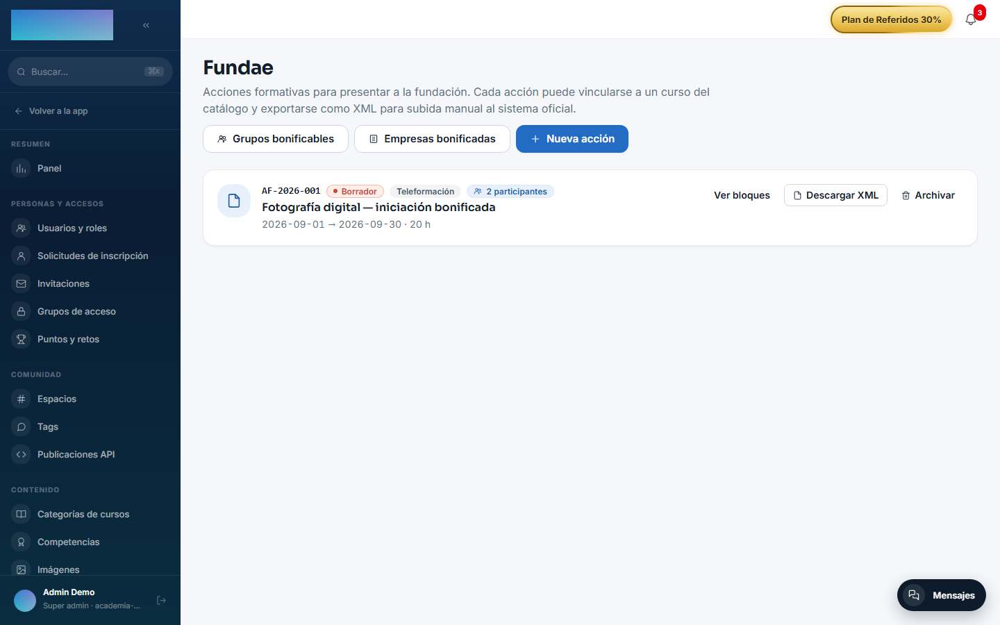
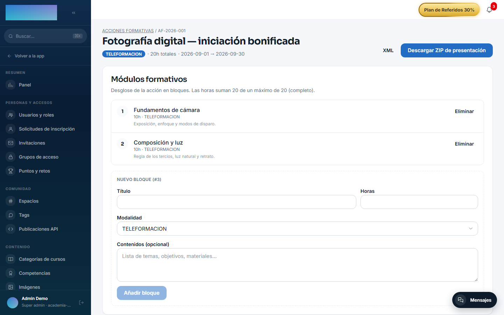

# mod.fundae — Cumplimiento Fundae

Community · Categoría **compliance** (desactivable)

## Qué hace

Cumplimiento regulatorio para **formación bonificable en España** (RD 694/2017):

- **Acciones formativas** con código, modalidad (`PRESENCIAL`/`TELEFORMACION`/`MIXTA`), horas, fechas y bloques de contenido.
- **Empresas bonificadas** con NIF validado (checksum DNI/NIE/CIF), CCC y crédito anual.
- **Notificaciones RLPT** a la representación legal de las personas trabajadoras, con el plazo legal de 15 días naturales calculado automáticamente y la evidencia (PDF) en el Evidence Vault con hash.
- **Grupos bonificables** con ciclo de vida (`DRAFT → ACTIVE → CLOSED/CANCELLED`), costes imputados y matrícula nominal de participantes.
- **Finalización** con umbral configurable (75% por defecto): APTO / NO_APTO / EN_CURSO por participante, con modo `preview`.
- **Exports**: XML de inicio y de fin de grupo, y un **ZIP de auditoría** completo (`manifest.json` con hash SHA-256 de cada artefacto + XMLs + CSVs + evidencias RLPT), verificable offline contra esos hashes.

## Cómo funciona

- Arrancar un grupo valida la **antelación RLPT** (15 días) y el **crédito disponible** de la empresa; cerrar el grupo debita el crédito consumido.
- El NIF de una empresa es **inmutable** tras el alta (cambio de NIF = empresa nueva, por trazabilidad).
- La suma de horas de los bloques no puede superar las horas de la acción (Fundae lo verifica al subir el XML).
- Es el consumidor natural del hook `courses.publish.validate`: puede bloquear la publicación de un curso si faltan objetivos o duración.
- Toda la superficie es de administración: cada endpoint exige `super_admin` o `tenant_admin`. El rol formador no accede a Fundae.

## Configuración

- **Activar o desactivar el módulo**: `/admin/configuracion`, pestaña **Módulos** — interruptor por organización.
- **Acceso**: entrada **Fundae** en el grupo **Integraciones y API** del menú de administración (`/admin/fundae`); solo la ven `tenant_admin` y `super_admin`.
- **Umbral de finalización**: por grupo (`umbralFinalizacionPct`, 1–100; 75 por defecto), se fija por API al crear o editar el grupo; el cálculo de finalización admite además un `umbralOverride` puntual sin tocar la configuración persistida. El panel muestra el valor aplicado como **Umbral {pct}%**.
- Sin variables de entorno propias. Ninguna función exige licencia Enterprise.

## Uso paso a paso

Dar de alta la acción y la empresa:

1. En `/admin/fundae`, pulsa **Nueva acción** y rellena **Código de acción** (único por tenant), **Modalidad**, **Nombre**, **Fecha inicio**, **Fecha fin** y **Horas**; opcionales **Lugar**, **CIF/NIF del centro**, **UUID del curso vinculado (opcional)** y **Notas internas (no van al XML)**. Pulsa **Crear acción**.

    

2. Entra en **Ver bloques** (`/admin/fundae/<id>`) y desglosa la acción con **Añadir bloque** (título, horas, modalidad, contenidos); la pantalla avisa de cuántas horas quedan hasta el máximo de la acción. Si la acción tiene curso vinculado, la sección **Participantes** lista las matrículas activas y permite descargar la **Evidencia PDF** de cada una; **Descargar ZIP de presentación** empaqueta el XML con todas las evidencias. Desde la lista, **Descargar XML** exporta el XML de la acción.

    

3. En `/admin/fundae/empresas` (**Empresas bonificadas**), pulsa **Nueva empresa**: **NIF / CIF** (con checksum validado; inmutable después), **Razón social**, **Código Cuenta Cotización**, **Plantilla**, **Crédito Fundae (€)** y datos de contacto. Pulsa **Crear empresa**.
4. Abre **Detalle / RLPT** (`/admin/fundae/empresas/<id>`) y pulsa **Subir documento**: tipo (**Notificación inicial**, **Acuse de recibo** o **Acta de discrepancia**), fecha y el PDF o imagen (máx. 10 MB, persistido con hash SHA-256). La cabecera indica si la empresa ya cumple los 15 días naturales para iniciar grupos.

Operar el grupo bonificable:

5. En `/admin/fundae/grupos` (**Grupos bonificables**), pulsa **Nuevo grupo**: **ID Acción formativa**, **ID Empresa bonificada**, **Modalidad**, fechas previstas y **Crédito estimado (€)**. El grupo nace en **Borrador**.
6. Abre **Ver detalle** y matricula participantes: uno a uno con **Matricular** (UUID del alumno) o todos los inscritos del curso vinculado con **Bulk enroll desde curso**. Registra costes con **Añadir coste** (**Directo**, **Indirecto** u **Organización**).
7. Pulsa **Iniciar grupo**: valida la antelación RLPT de 15 días y el crédito disponible de la empresa. Con el grupo **En curso**, genera el **XML inicio**.
8. Para cerrar: **Vista previa finalización** calcula APTO / NO_APTO / EN_CURSO por participante con el umbral aplicado (sin persistir), **Persistir finalización** lo consolida, y **Cerrar grupo** debita el crédito consumido. Después descarga **XML finalización** y el **ZIP auditoría**.

## Dependencias

Opcionales: `mod.courses` (validación de curso vinculado) y `mod.learning` (matrículas y completitud).

## Modelo de datos

`mod_fundae_action` · `_block` · `_company` · `_rlpt_notice` · `_group` · `_cost` · `_group_participant`.

## API

Prefijo `/modules/fundae` (acciones, exports) + superficie admin en `/admin/fundae/*` (empresas, RLPT, grupos, costes, participantes). Detalle en [Referencia → Aprendizaje](../../api/referencia/aprendizaje.md#fundae-modulesfundae-todo-admin-el-rol-formador-no-accede) y [Referencia → Administración](../../api/referencia/administracion.md#fundae-admin-el-rol-formador-no-accede).

## Eventos

**Emite** 24 eventos que cubren todo el ciclo: `fundae.action.*`, `fundae.company.*`, `fundae.rlpt.notice.*`, `fundae.group.*` (incluidos los de generación de XML y ZIP), `fundae.cost.*`, `fundae.export.generated`. No consume.
