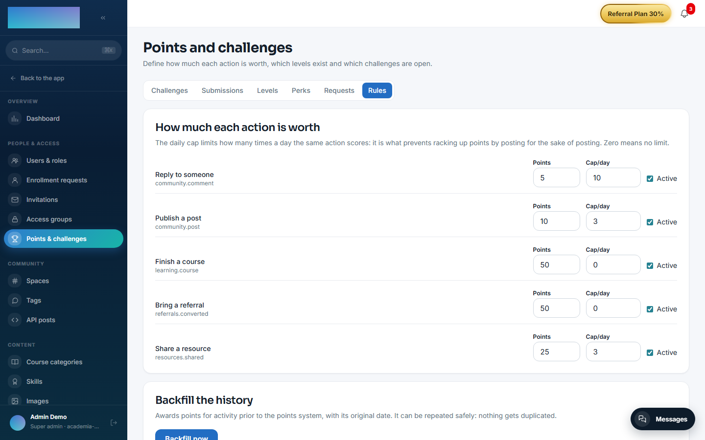
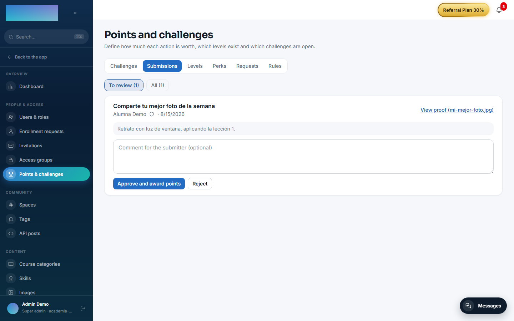
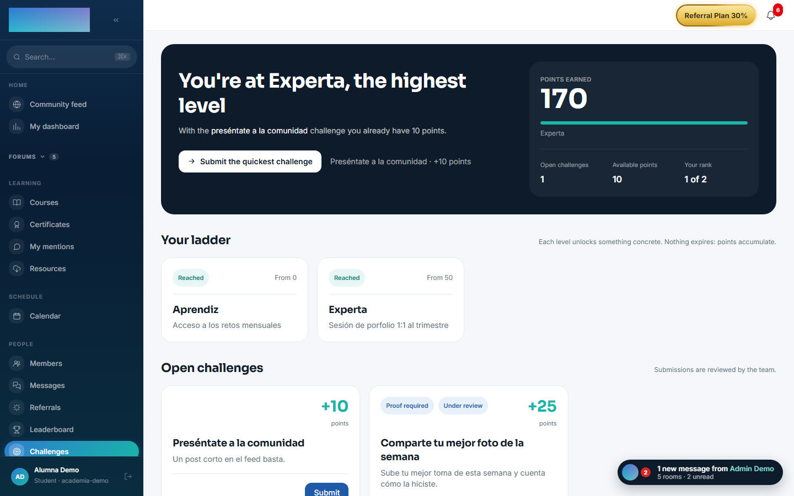
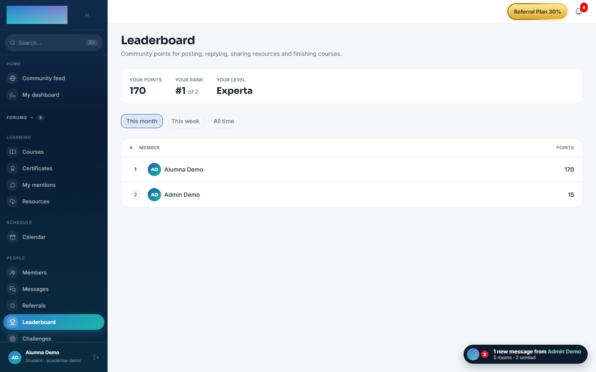

# mod.gamification — Points and challenges

Community · **Engagement** category (deliberately optional)

## What it does

It turns community activity into an **auditable points ledger**, with two deliberately distinct layers:

- **Activity** — automatic entries triggered by events on the bus (post, comment, resource, course completed, referral…), with low weights and a per-rule **daily cap**: they reward consistency, not volume.
- **Milestones** — **challenges** with mandatory proof and human review, carrying high weights.

On top of that, **levels** are computed on lifetime points and never go down; the **leaderboard** is computed over a date range (week/month/all time) and does move. A level unlocks **perks** defined by the operator (a 1:1 session, an extra class…) with a per-student quota and an optional waiting period; the student requests them and a person handles them.

## How it works

- The only real defence against double-crediting is the `(tenant, user, sourceKey)` uniqueness constraint, where `sourceKey` identifies the **fact** (`community.post:<id>`), not the event — the bus delivers at least once.
- **Perks never touch access groups**: access to courses is a paid product and cannot be earned by participating (an explicit product decision).
- Moderating content (hiding it) **revokes** the points it granted; restoring it gives them back.
- The **backfill** populates the ledger with historical activity: idempotent, repeatable, excluding hidden content and API posts, and it does not apply the daily cap retroactively.
- Levels and challenges **start empty on purpose** (their names and rewards are branding decisions); only the weighting rules are seeded.

## Configuration

- **Activation** — `Administration → Settings`, "Modules" tab (`/admin/configuracion`): the toggle for "Puntos y retos" (`mod.gamification`). Disabling it removes "Leaderboard" and "Challenges" from the menu, and "Points & challenges" from the admin area.
- **A single panel** — `/admin/gamificacion` ("Points and challenges", People & access group of the admin area), with 6 tabs: "Challenges", "Submissions", "Levels", "Perks", "Requests" and "Rules".
- **Scoring rules** — "Rules" tab ("How much each action is worth"): for each action ("Publish a post", "Reply to someone", "Share a resource", "Finish a course", "Bring a referral") you set "Points", "Cap/day" (0 = no limit) and the "Active" checkbox. Rules come seeded with default weights.
- **Backfilling history** — same "Rules" tab, the "Backfill the history" card with the "Backfill now" button: awards points for prior activity with its original date; it can be repeated without duplicating anything.
- **Roles** — rules, levels, perks and the backfill: `super_admin` / `tenant_admin` only; challenges, submissions and perk requests: also `formador` (instructor).
- No environment variables of its own. No feature requires an Enterprise license.

## Step-by-step usage

**The operator:**

1. Review the weights and caps in "Rules"; they come seeded, but how much each action is worth is your call.
2. Build the ladder in "Levels": "New level" with "Name", "From (points)" and "Benefit". Until the first one exists nobody has a level — points accumulate all the same.
3. Hang "Perks" from each level: "What it unlocks", "Level that unlocks it", "Times per student (0 = no limit)" and "Wait between requests (days)". A perk can be paused ("Pause") without deleting it.
4. Publish challenges in "Challenges": title, "Points", "What needs to be done" and the "Require proof (screenshot, file or link) to be able to submit" checkbox. They start as a "Draft": press "Open" when the community should see them.
5. Review submissions in "Submissions" ("To review" tab): "View proof", an optional comment and "Approve and award points" or "Reject". The comment is shown to the submitter.

    

6. Handle perk requests in "Requests": "Approve" the request, fulfil it in the real world and "Mark as done" (or "Reject" with an optional reply).
7. If the community was already active before points existed, "Backfill now": the summary reports how many new entries came from posts, comments, resources, courses and referrals.

**The student:**

1. `/retos` ("Challenges", People group): the header says how many points they have, how many are missing for the next level and which challenge gets them there fastest ("Submit the quickest challenge"). Below: "Your ladder" with the levels, "What you can spend your points on" with the perks, and "Open challenges".

    

2. "Submit" opens the submission modal: what they did, the proof (file or link, mandatory if the challenge requires it) and a confirmation — each challenge can be submitted **only once**. It stays "Under review" until the team resolves it.
3. With a perk unlocked, "Request it" creates the request; the screen shows its state ("Requested", "Approved", "Done") and when it can be requested again if there is a waiting period.
4. `/leaderboard` ("Leaderboard"): the ranking for "This month", "This week" or "All time", with "Your points", "Your rank" and "Your level" on top.

    

## Dependencies

Optional (read-only, for the backfill): `mod.community`, `mod.learning`, `mod.resources`.

## Data model

`mod_gamification_ledger_entry` (an entry, append-only except for revocation) · `_profile` (materialised balance) · `_rule` · `_level` · `_perk` · `_perk_request` · `_challenge` · `_submission` (one submission per challenge and person).

## API

Prefix `/modules/gamification` (member + `/admin`). Details in [Reference → Community and people](../../api/referencia/comunidad.md#gamification-modulesgamification).

## Events

- **Emits**: `gamification.points.awarded/revoked`, `gamification.level.changed`, `gamification.challenge.submitted/reviewed`, `gamification.perk.requested/handled`.
- **Consumes**: `community.post.created/comment.created/post.hidden/unhidden/comment.hidden/unhidden`, `resources.resource.created/deleted`, `learning.course.completed`, `referrals.referral.attributed`.
