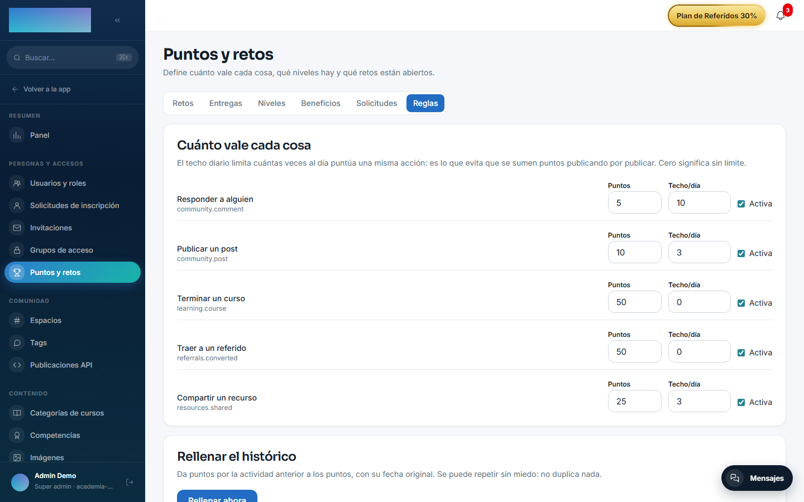
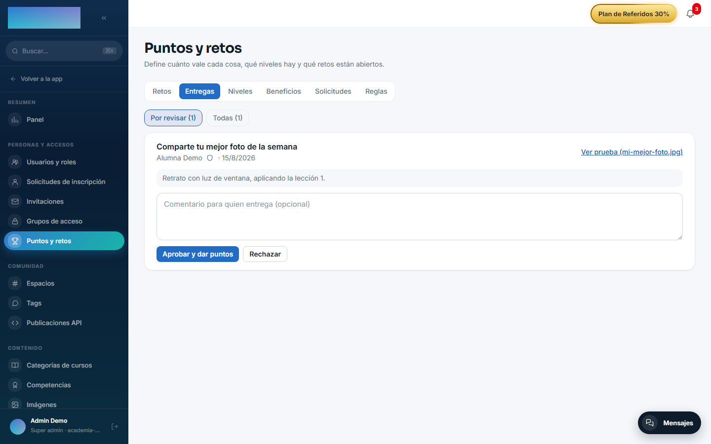
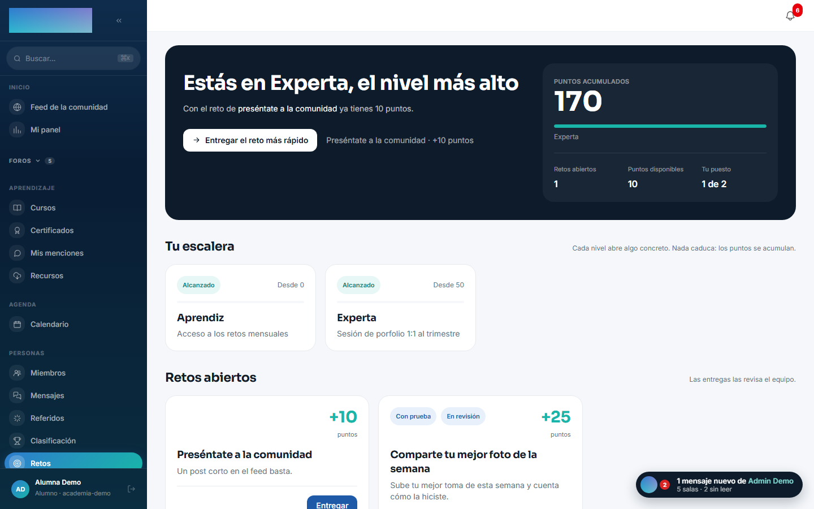
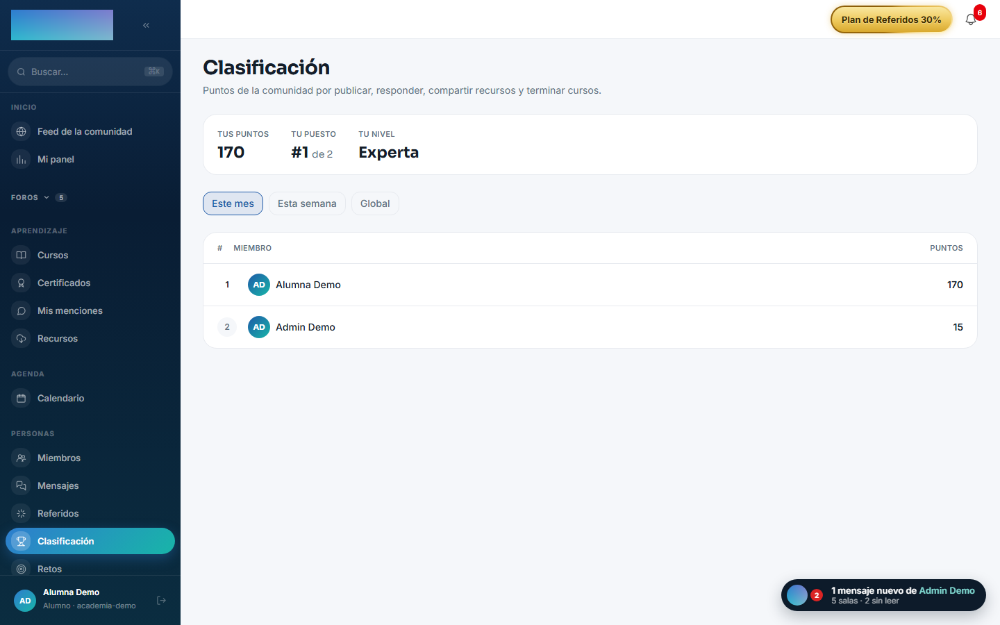

# mod.gamification — Puntos y retos

Community · Categoría **engagement** (desactivable a propósito)

## Qué hace

Convierte la actividad de la comunidad en un **libro de puntos auditable**, con dos capas deliberadamente distintas:

- **Actividad** — asientos automáticos disparados por eventos del bus (post, comentario, recurso, curso completado, referido…), con pesos bajos y **techo diario** por regla: premian constancia, no volumen.
- **Hitos** — **retos** con prueba obligatoria y revisión humana, con pesos altos.

Encima, los **niveles** se calculan sobre puntos de por vida y nunca bajan; la **clasificación** se calcula por rango de fechas (semana/mes/total) y sí se mueve. Un nivel desbloquea **beneficios** definidos por el operador (sesión 1:1, clase extra…) con cupo por alumno y espera opcional; el alumno los solicita y una persona los atiende.

## Cómo funciona

- La única defensa real contra el doble cobro es la unicidad `(tenant, usuario, sourceKey)`, donde la `sourceKey` identifica el **hecho** (`community.post:<id>`), no el evento — el bus entrega al menos una vez.
- Los **beneficios no tocan los grupos de acceso**: el acceso a cursos es producto de pago y no puede ganarse participando (decisión de producto explícita).
- Moderar contenido (ocultarlo) **revoca** los puntos que dio; restaurarlo los devuelve.
- El **backfill** rellena el ledger con la actividad histórica: idempotente, repetible, excluye contenido oculto y posts por API, y no aplica el techo diario hacia atrás.
- Niveles y retos **nacen vacíos a propósito** (sus nombres y premios son decisiones de marca); solo se siembran las reglas de pesos.

## Configuración

- **Activación** — `Administración → Configuración`, pestaña «Módulos» (`/admin/configuracion`): interruptor de «Puntos y retos» (`mod.gamification`). Al desactivarlo desaparecen del menú «Clasificación» y «Retos», y «Puntos y retos» del área de administración.
- **Panel único** — `/admin/gamificacion` («Puntos y retos», grupo Personas y accesos del área de administración), con 6 pestañas: «Retos», «Entregas», «Niveles», «Beneficios», «Solicitudes» y «Reglas».
- **Reglas de puntuación** — pestaña «Reglas» («Cuánto vale cada cosa»): por cada acción («Publicar un post», «Responder a alguien», «Compartir un recurso», «Terminar un curso», «Traer a un referido») se fijan «Puntos», «Techo/día» (0 = sin límite) y el checkbox «Activa». Las reglas vienen sembradas con pesos por defecto.
- **Relleno del histórico** — misma pestaña «Reglas», tarjeta «Rellenar el histórico» con el botón «Rellenar ahora»: da puntos por la actividad anterior con su fecha original; se puede repetir sin duplicar nada.
- **Roles** — reglas, niveles, beneficios y backfill: solo `super_admin` / `tenant_admin`; retos, entregas y solicitudes de beneficio: también `formador`.
- Sin variables de entorno propias. Ninguna función exige licencia Enterprise.

## Uso paso a paso

**El operador:**

1. Repasa los pesos y techos en «Reglas»; vienen sembrados, pero cuánto vale cada acción es una decisión suya.
2. Crea la escalera en «Niveles»: «Nuevo nivel» con «Nombre», «Desde (puntos)» y «Beneficio». Hasta que exista el primero, nadie tiene nivel — los puntos se acumulan igual.
3. Cuelga «Beneficios» de cada nivel: «Qué desbloquea», «Nivel que lo desbloquea», «Veces por alumno (0 = sin límite)» y «Espera entre solicitudes (días)». Un beneficio se puede «Pausar» sin borrarlo.
4. Publica retos en «Retos»: título, «Puntos», «Qué hay que hacer» y el checkbox «Exigir prueba (captura, archivo o enlace) para poder entregar». Nacen en «Borrador»: pulsa «Abrir» cuando la comunidad deba verlos.
5. Revisa las entregas en «Entregas» (pestaña «Por revisar»): «Ver prueba», comentario opcional y «Aprobar y dar puntos» o «Rechazar». El comentario lo ve quien entregó.

    

6. Atiende las peticiones en «Solicitudes»: «Aprobar» la solicitud, cumplirla en el mundo real y «Marcar hecho» (o «Rechazar» con respuesta opcional).
7. Si la comunidad ya tenía actividad antes de los puntos, «Rellenar ahora»: el resumen dice cuántos asientos nuevos salieron de posts, comentarios, recursos, cursos y referidos.

**El alumno:**

1. `/retos` («Retos», grupo Personas): la cabecera dice cuántos puntos tiene, cuántos le faltan para el siguiente nivel y cuál es el reto más rápido para llegar («Entregar el reto más rápido»). Debajo, «Tu escalera» con los niveles, «En qué puedes gastar tus puntos» con los beneficios y «Retos abiertos».

    

2. «Entregar» abre el modal de entrega: qué ha hecho, la prueba (archivo o enlace, obligatoria si el reto la exige) y una confirmación — cada reto se entrega **una sola vez**. Queda «En revisión» hasta que el equipo la resuelve.
3. Con un beneficio desbloqueado, «Pedirlo» crea la solicitud; la pantalla muestra el estado («Solicitado», «Aprobado», «Hecho») y cuándo puede volver a pedirlo si hay espera.
4. `/leaderboard` («Clasificación»): el ranking por «Este mes», «Esta semana» o «Global», con «Tus puntos», «Tu puesto» y «Tu nivel» arriba.

    

## Dependencias

Opcionales (solo lectura para el backfill): `mod.community`, `mod.learning`, `mod.resources`.

## Modelo de datos

`mod_gamification_ledger_entry` (asiento, append-only salvo revocación) · `_profile` (saldo materializado) · `_rule` · `_level` · `_perk` · `_perk_request` · `_challenge` · `_submission` (una entrega por reto y persona).

## API

Prefijo `/modules/gamification` (miembro + `/admin`). Detalle en [Referencia → Comunidad y personas](../../api/referencia/comunidad.md#gamificacion-modulesgamification).

## Eventos

- **Emite**: `gamification.points.awarded/revoked`, `gamification.level.changed`, `gamification.challenge.submitted/reviewed`, `gamification.perk.requested/handled`.
- **Consume**: `community.post.created/comment.created/post.hidden/unhidden/comment.hidden/unhidden`, `resources.resource.created/deleted`, `learning.course.completed`, `referrals.referral.attributed`.
