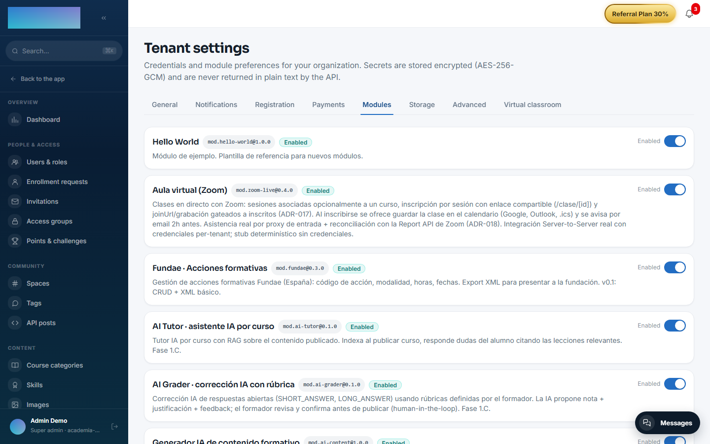

# mod.hello-world — Reference module

Community · **Example** category (can be disabled)

## What it does

An example module and a **starting template** for building new modules. It demonstrates the four elements of the contract:

1. A valid **manifest** parsed with the core-kernel's `parseModuleManifest`.
2. The four **lifecycle hooks** (`onRegister`, `onEnable`, `onDisable`, `onUninstall`), with comments describing what a real module would do in each one.
3. A **domain service** (`HelloWorldService`) that receives the `ModuleContext` and uses `eventBus` and `i18n`.
4. A **contract test suite** that registers the module in a real `ModuleRegistry` and verifies it end to end.

## How to use it

The procedure for starting a new module: copy the folder, rename `name`/`tablePrefix`/`apiNamespace`/permissions, write the domain logic, implement the lifecycle and update the tests — the full guide is in [Building a module](../crear-un-modulo/index.md).

The isolation rules every module honours — never import another module's code, never touch another module's tables with Prisma, never modify the core for your own features, and never emit events without declaring them — are collected in [Building a module → The golden rules](../crear-un-modulo/index.md#the-golden-rules).

## Configuration

None of its own: no environment variables, no panel settings and no Enterprise capabilities. As a **non-core** module (category `example`), it ships registered in the instance and appears with its switch under Administration → Brand & settings → Settings, "Modules" tab (`/admin/configuracion?tab=modules`), where an admin can enable or disable it per tenant — its only visible surface.

## Step-by-step usage

It is a template for developers; the flow lives in code, not in the panel:

1. Copy the `modules/hello-world/` folder as `modules/<your-slug>/`.
2. In `src/manifest.ts`, rename `name`, `displayName`, `tablePrefix`, `apiNamespace` and the permissions.
3. Replace `HelloWorldService` with your domain services and implement the four lifecycle hooks in `src/index.ts` with real work (migrations in `onEnable`, cleanup in `onDisable`…).
4. Update `module.json` and adapt the `tests/contract.test.ts` suite to your module.
5. Register it in the `registry.register([...])` array of `apps/api/src/modules/module-registry.service.ts` and follow the rest of the [Building a module](../crear-un-modulo/index.md) guide.
6. To see it running, open `/admin/configuracion?tab=modules`: "Hello World" is listed with its switch, exactly as your module will be.

## Data, API and events

- It declares a `tablePrefix` but **creates no tables** (it does not need any).
- It declares the `apiNamespace /modules/hello-world` but exposes no real endpoints.
- It declares the `hello-world.greeting.requested` event and the `hello-world.greeting.read` permission as an example of the contract.
