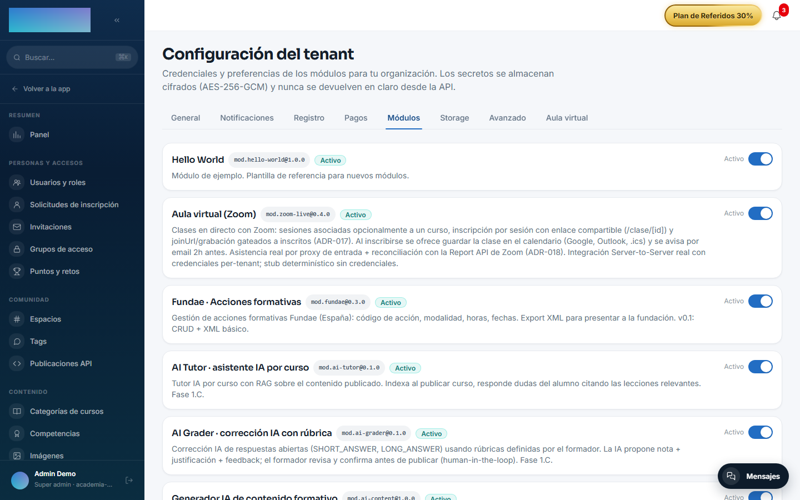

# mod.hello-world — Módulo de referencia

Community · Categoría **example** (desactivable)

## Qué hace

Módulo de ejemplo y **plantilla de partida** para crear módulos nuevos. Demuestra los cuatro elementos del contrato:

1. Un **manifest** válido parseado con `parseModuleManifest` del core-kernel.
2. Los cuatro **lifecycle hooks** (`onRegister`, `onEnable`, `onDisable`, `onUninstall`), con comentarios de qué haría un módulo real en cada uno.
3. Un **service de dominio** (`HelloWorldService`) que recibe el `ModuleContext` y consume `eventBus` e `i18n`.
4. Una **suite de tests de contrato** que registra el módulo en un `ModuleRegistry` real y lo verifica end-to-end.

## Cómo usarlo

El procedimiento para arrancar un módulo nuevo: copiar la carpeta, renombrar `name`/`tablePrefix`/`apiNamespace`/permisos, escribir el dominio, implementar el lifecycle y actualizar los tests — la guía completa está en [Crear un módulo](../crear-un-modulo/index.md).

Las reglas de aislamiento que todo módulo respeta —no importar código de otro módulo, no tocar tablas ajenas con Prisma, no modificar el core para features propias y no emitir eventos sin declararlos— están recogidas en [Crear un módulo → Las reglas de oro](../crear-un-modulo/index.md#las-reglas-de-oro).

## Configuración

Ninguna propia: ni variables de entorno, ni ajustes en el panel, ni capabilities Enterprise. Como módulo **no-core** (categoría `example`), viene registrado en la instancia y aparece con su interruptor en Administración → Marca y ajustes → Configuración, pestaña «Módulos» (`/admin/configuracion?tab=modules`), donde un admin puede activarlo o desactivarlo por tenant — su única superficie visible.

## Uso paso a paso

Es una plantilla para desarrolladores; el flujo es de código, no de panel:

1. Copia la carpeta `modules/hello-world/` como `modules/<tu-slug>/`.
2. En `src/manifest.ts`, renombra `name`, `displayName`, `tablePrefix`, `apiNamespace` y los permisos.
3. Sustituye `HelloWorldService` por tus services de dominio e implementa los cuatro lifecycle hooks de `src/index.ts` con trabajo real (migraciones en `onEnable`, limpieza en `onDisable`…).
4. Actualiza `module.json` y adapta la suite `tests/contract.test.ts` a tu módulo.
5. Regístralo en el `registry.register([...])` de `apps/api/src/modules/module-registry.service.ts` y sigue el resto de la guía [Crear un módulo](../crear-un-modulo/index.md).
6. Para verlo en marcha, entra en `/admin/configuracion?tab=modules`: «Hello World» aparece listado con su interruptor, igual que aparecerá tu módulo.

## Datos, API y eventos

- Declara `tablePrefix` pero **no crea tablas** (no las necesita).
- Declara `apiNamespace /modules/hello-world` pero no expone endpoints reales.
- Declara el evento `hello-world.greeting.requested` y el permiso `hello-world.greeting.read` como ejemplo del contrato.
