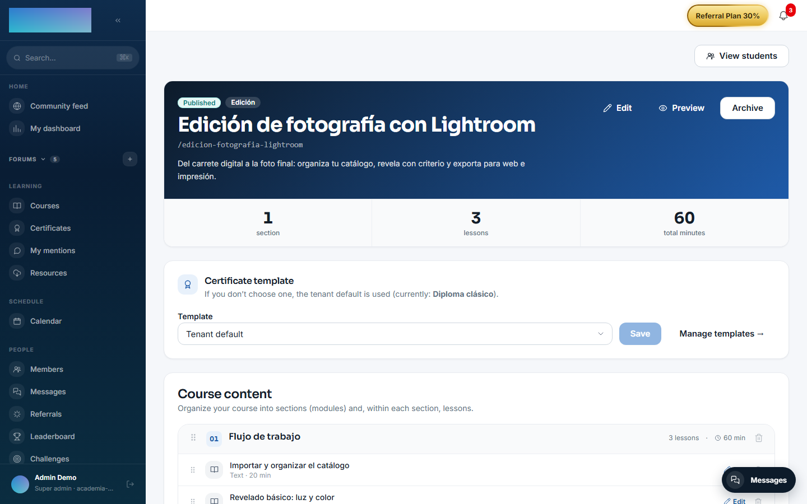
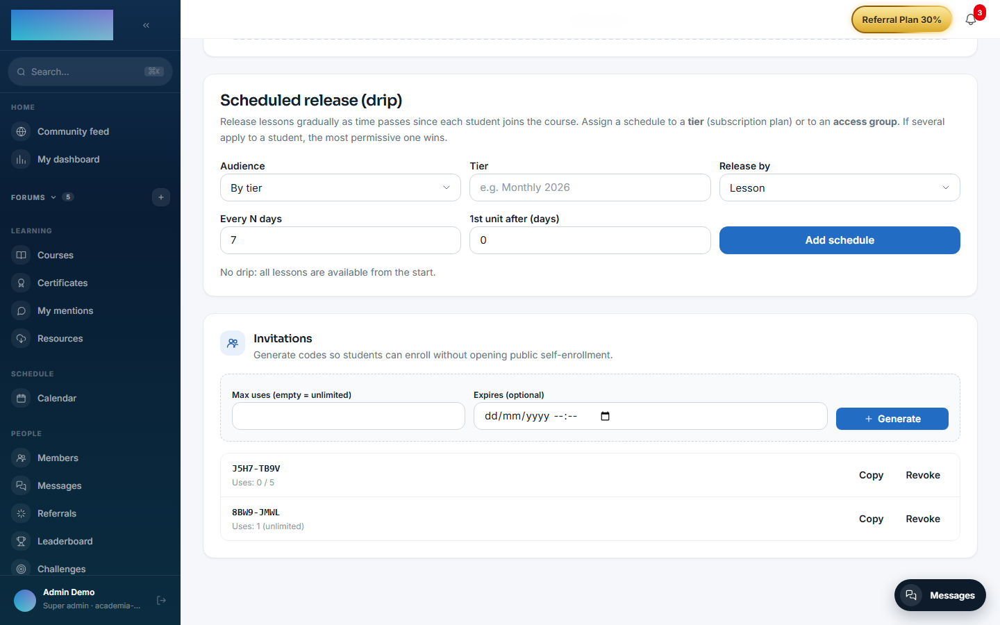
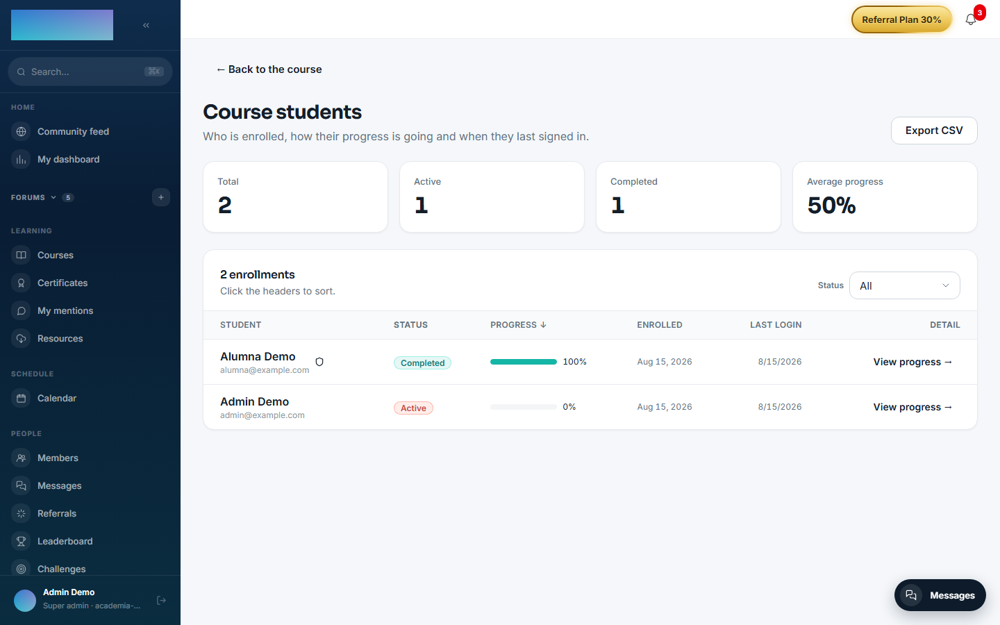
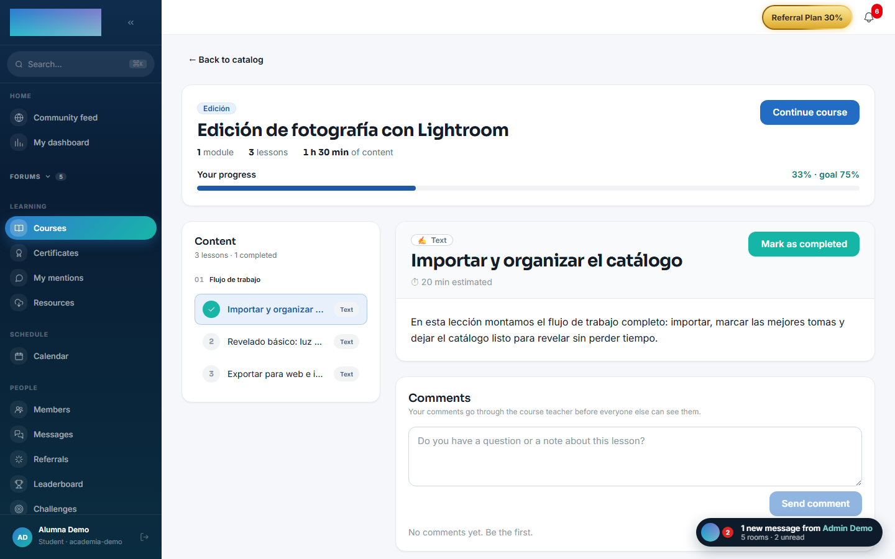

# mod.learning — Player, enrollment and progress

Community · **Core** category (always active)

## What it does

It manages the student's whole lifecycle inside a course: **enrollment** (direct, by an admin, by code or by invitation link), **per-lesson progress** (seconds watched, resume position) and **completion** with a configurable threshold (75% by default). On top of that:

- **Drip content**: release schedules based on intervals relative to the student's start date, segmentable by payment tier or by access group, with an optional email notice when a lesson unlocks.
- **Invitations** with a short code or a URL token, with a usage limit, an expiry date and revocation.
- **Lesson comments** with a moderation queue (they start as `PENDING` until the instructor approves them).
- **Learning paths** (course itineraries, linear or flexible) and per-course weighted **skills**.
- **SCORM 1.2/2004**: package upload, `imsmanifest.xml` parsing and persistence of the `cmi.*` state per attempt.

## How it works

- You can only enroll in `PUBLISHED` courses (`COURSE_NOT_PUBLISHED` 422); a duplicate active enrollment returns `ALREADY_ENROLLED` 409.
- When several drip schedules apply to a student, **the most permissive one wins** (the earliest unlock date). With no applicable schedule, everything is available.
- Trial content (membership trial) is gated with `TRIAL_CONTENT_LOCKED` 403, which the frontend turns into a payment CTA.
- On crossing the threshold it emits `learning.course.completed` **exactly once** — that is what triggers certificate issuing.

## Configuration

- **Activation**: a `core`-category module, always active. It does not appear in the "Modules" tab at `/admin/configuracion?tab=modules` and cannot be disabled.
- **Completion threshold**: an attribute of each enrollment (`completion_threshold` column, default 75%). There is no global setting screen: it is set through the API when creating or editing the enrollment.
- **Drip per course**: configured in the instructor's builder (`/formador/cursos/<id>`, "Scheduled release (drip)" card), not in the admin panel.
- **Invitations per course**: same builder, "Invitations" card.
- **Skills**: the catalog and its assignment to courses live at `/admin/competencias` ("Competencies").
- **Environment variables**: `LESSON_UNLOCK_CRON` sets how often the worker that emails lesson-unlock notices runs (cron pattern, default `*/10 * * * *`). It is the only variable of its own.
- **Storage**: SCORM packages are stored in the instance's file backend (`/admin/configuracion?tab=storage`).
- **License**: the whole module is Community; no feature requires Enterprise capabilities.

## Step-by-step usage

### Releasing content gradually — drip (instructor)

1. In the builder (`/formador/cursos/<id>`), scroll down to "Scheduled release (drip)".
2. Pick the "Audience": "By tier" (subscription plan, type the name in "Tier") or "By access group" (pick the "Group").
3. Define the pace: "Release by" ("Lesson" or "Module / section"), "Every N days" and "1st unit after (days)". Click "Add schedule".
4. Each schedule can be toggled on/off or deleted. If several apply to a student, the most permissive wins; with no schedule, every lesson is available from the start.

    

### Enrolling students with invitations (instructor)

1. In the builder, "Invitations" card: set "Max uses (empty = unlimited)" and "Expires (optional)" and click "Generate".
2. Copy the short code ("Copy code") and hand it out; the card also shows the "URL token for a direct link", meant to be redeemed through the API (`POST /modules/learning/enrollments/by-link`) — today the web app has no dedicated token-redemption page.
3. "Revoke" invalidates an invitation; the list flags "Expired" or "Exhausted" ones.

    

4. The student redeems the code on the course page (`/cursos/<slug>`): "Do you have an invitation code?" field and "Redeem code" button. Directly enrolling another user (`POST /modules/learning/enrollments`) is for instructors/admins via the API or the user-import flows.

### Tracking student progress (instructor)

1. From the builder, "View students" opens `/formador/cursos/<id>/alumnos`: totals, active, completed, average progress, status filters and "Export CSV".
2. "View progress →" opens `/formador/cursos/<id>/alumnos/<enrollmentId>`: time watched per lesson, completed lessons and last activity.

    

### Moderating lesson comments (instructor)

1. Students' comments start out pending: the "Pending comments" queue shows up right in the course builder.
2. Approve the useful ones or reject them with an optional reason the author sees. The student writes from the lesson ("Do you have a question or note about this lesson?" → "Send comment") and sees the notice that comments go through the teacher before becoming visible.

### Learning paths

1. Instructor: `/formador/rutas` lists your paths; "+ New path" (`/formador/rutas/nueva`) asks for "Title", "Description" and "Sequence type" ("Linear" or "Flexible").
2. In the editor (`/formador/rutas/<id>`) you add published courses with "Add course", order them and click "Publish" (requires at least one course).
3. Student: `/rutas` lists published paths; at `/rutas/<slug>` they click "Enroll in this path". In linear paths, courses unlock in order ("🔒 Locked" chip).

### Skills (admin)

1. At `/admin/competencias`, create the catalog ("Competency catalog" → "Add").
2. In "Competencies per course", pick a course, mark the skills it covers and their weight, and click "Save". Each student's score is computed from their progress in the associated courses.

### What the student sees

1. On the course page (`/cursos/<slug>`) an enrolled student sees "Your progress" with the goal (e.g. "62% · goal 75%") and the syllabus with each lesson's state.
2. The player stores seconds watched and the resume position; the "Mark as completed" button closes a lesson manually when the type allows it.
3. A lesson gated by drip or a scheduled date shows as locked ("Will unlock…") with the "🔔 Notify me when it unlocks" button; the notice arrives by email when the worker runs.
4. During a membership trial, lessons beyond the limit show "Available once the trial ends" with the "Pay now and unlock" option.
5. On crossing the threshold, the course switches to "Course completed!" and, with `mod.certificates` active, "Download certificate" appears.

    

## Dependencies

- Hard: `mod.courses`.
- Optional: `mod.payment-connections` (tiers for drip), `mod.access-groups` (groups for drip), `mod.subscriptions` (trial status + lesson limit).

## Data model

`mod_learning_enrollment` (one enrollment per user and course) · `mod_learning_progress` · `mod_learning_invitation` · `mod_learning_drip_schedule` · `mod_learning_lesson_unlock_sub` · `mod_learning_scorm_package` · `mod_learning_scorm_attempt` · `mod_learning_lesson_comment` · `mod_learning_path` + `_path_course` + `_path_enrollment` · `mod_learning_competency` + `_course_competency`.

## API

Prefix `/modules/learning` (+ `/modules/learning/paths`). Full details in [Reference → Learning](../../api/referencia/aprendizaje.md#enrollments-progress-and-drip-moduleslearning).

## Events

- **Emits**: `learning.enrollment.created`, `learning.enrollment.cancelled`, `learning.progress.updated`, `learning.course.completed`, `learning.invitation.created`.
- **Consumes**: `courses.course.archived`.
