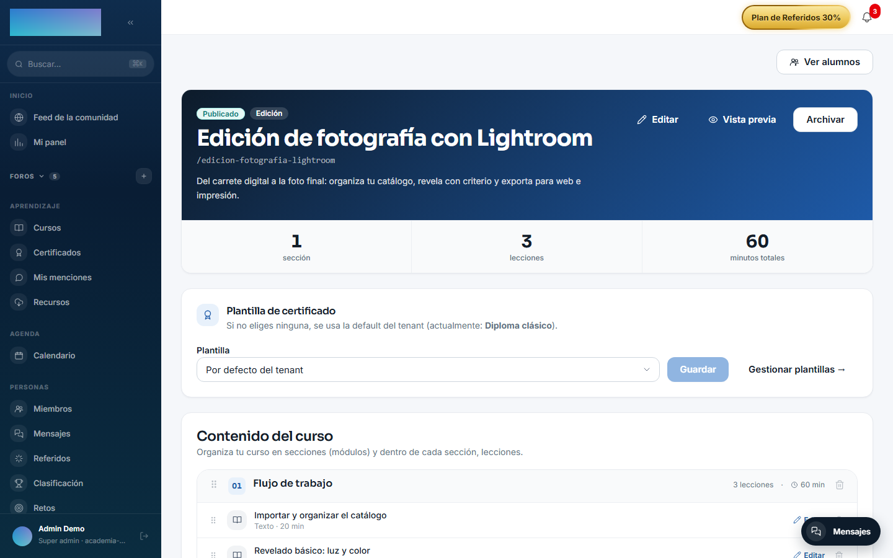
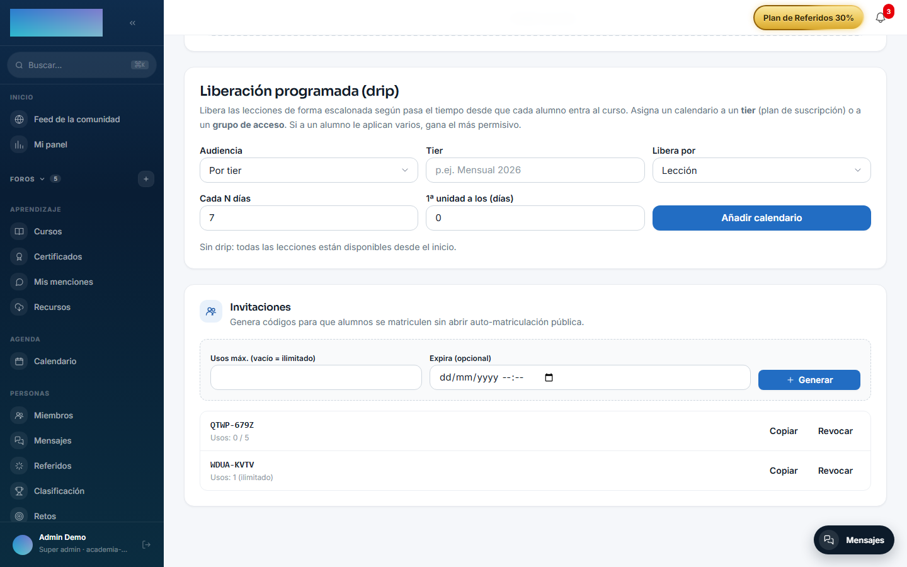
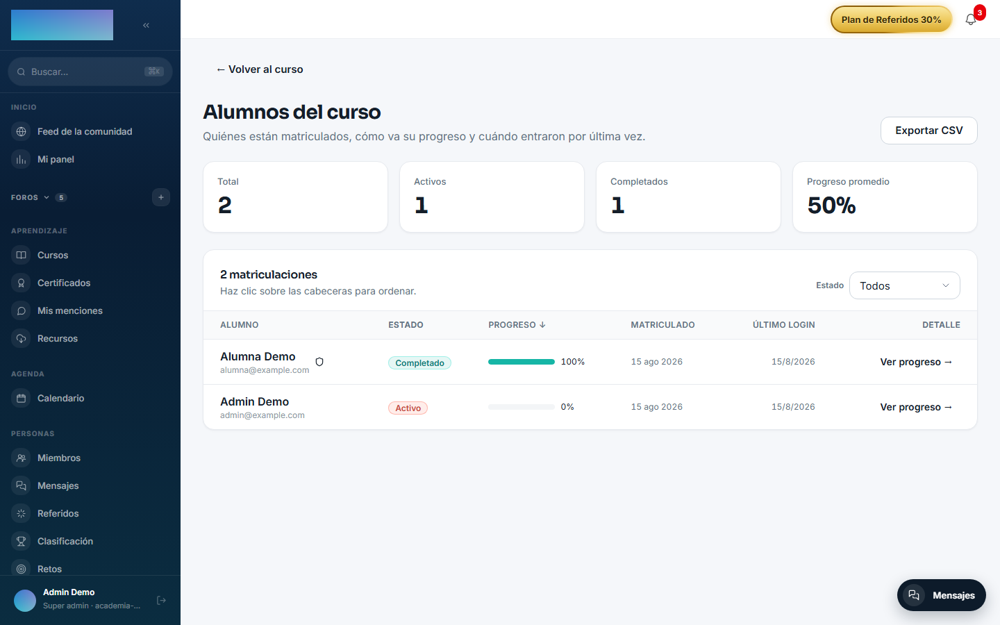
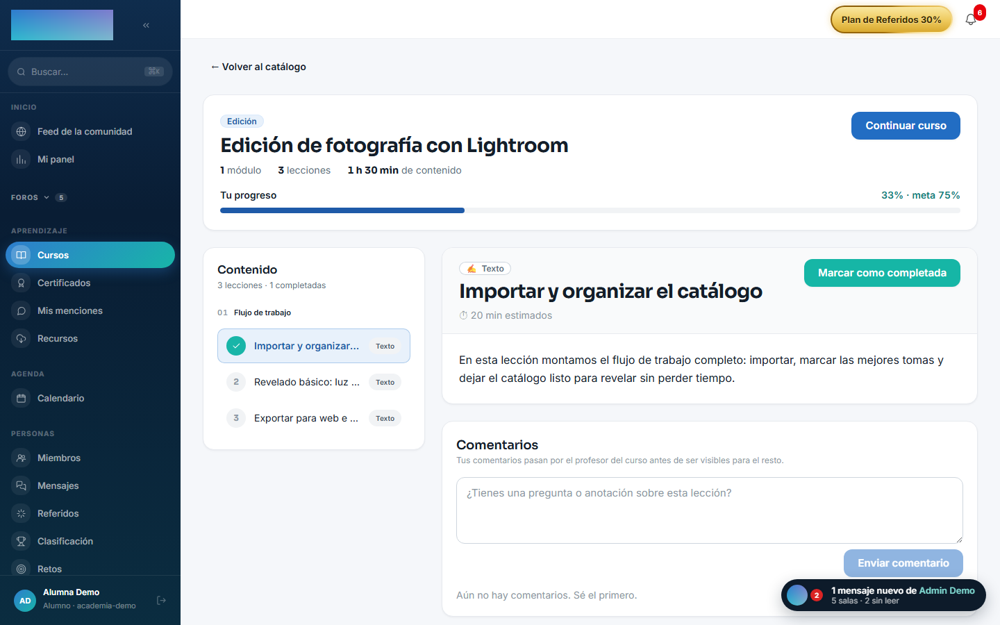

# mod.learning — Player, matrícula y progreso

Community · Categoría **core** (siempre activo)

## Qué hace

Gestiona todo el ciclo del alumno dentro de un curso: **matriculación** (directa, por admin, por código o enlace de invitación), **progreso por lección** (segundos vistos, posición de reanudación) y **finalización** con umbral configurable (75% por defecto). Añade además:

- **Drip content**: calendarios de liberación programada por intervalos relativos a la fecha de entrada del alumno, segmentables por tier de pago o por grupo de acceso, con aviso opcional por email al desbloquearse una lección.
- **Invitaciones** con código corto o token URL, con límite de usos, caducidad y revocación.
- **Comentarios de lección** con cola de moderación (nacen `PENDING` hasta que el formador aprueba).
- **Rutas de aprendizaje** (itinerarios de cursos, lineales o flexibles) y **competencias** ponderadas por curso.
- **SCORM 1.2/2004**: subida del paquete, parseo del `imsmanifest.xml` y persistencia del estado `cmi.*` por intento.

## Cómo funciona

- Solo se puede matricular en cursos `PUBLISHED` (`COURSE_NOT_PUBLISHED` 422); una matrícula activa duplicada responde `ALREADY_ENROLLED` 409.
- Cuando a un alumno le aplican varios calendarios de drip, **gana el más permisivo** (la fecha de desbloqueo más temprana). Sin calendario aplicable, todo está disponible.
- El contenido de prueba (trial de membresía) se gatea con `TRIAL_CONTENT_LOCKED` 403, que el frontend convierte en CTA de pago.
- Al cruzar el umbral emite `learning.course.completed` **una sola vez** — es lo que dispara la emisión de certificados.

## Configuración

- **Activación**: módulo de categoría `core`, siempre activo. No aparece en la pestaña «Módulos» de `/admin/configuracion?tab=modules` y no se puede desactivar.
- **Umbral de finalización**: es un atributo de cada matrícula (columna `completion_threshold`, default 75%). No hay pantalla de ajuste global: se fija por API al crear o editar la matrícula.
- **Drip por curso**: se configura en el builder del formador (`/formador/cursos/<id>`, tarjeta «Liberación programada (drip)»), no en el panel de administración.
- **Invitaciones por curso**: en el mismo builder, tarjeta «Invitaciones».
- **Competencias**: el catálogo y su asignación a cursos viven en `/admin/competencias` («Competencias»).
- **Variables de entorno**: `LESSON_UNLOCK_CRON` define la frecuencia del worker que avisa por email de lecciones desbloqueadas (patrón cron, por defecto `*/10 * * * *`). Es la única variable propia.
- **Storage**: los paquetes SCORM se guardan en el backend de archivos de la instancia (`/admin/configuracion?tab=storage`).
- **Licencia**: todo el módulo es Community; ninguna función exige capabilities de Enterprise.

## Uso paso a paso

### Liberar contenido de forma escalonada — drip (formador)

1. En el builder (`/formador/cursos/<id>`), baja hasta «Liberación programada (drip)».
2. Elige la «Audiencia»: «Por tier» (plan de suscripción, escribe el nombre en «Tier») o «Por grupo de acceso» (elige el «Grupo»).
3. Define el ritmo: «Libera por» («Lección» o «Módulo / sección»), «Cada N días» y «1ª unidad a los (días)». Pulsa «Añadir calendario».
4. Cada calendario puede activarse/desactivarse o eliminarse. Si a un alumno le aplican varios, gana el más permisivo; sin calendario, todas las lecciones están disponibles desde el inicio.

    

### Matricular alumnos con invitaciones (formador)

1. En el builder, tarjeta «Invitaciones»: define «Usos máx. (vacío = ilimitado)» y «Expira (opcional)» y pulsa «Generar».
2. Copia el código corto («Copiar código») y repártelo; la tarjeta también muestra el «Token URL para link directo», pensado para canjearlo por API (`POST /modules/learning/enrollments/by-link`) — hoy la web no tiene página propia de canje por token.
3. «Revocar» invalida una invitación; el listado marca las «Expirada» o «Agotada».

    

4. El alumno canjea el código en la ficha del curso (`/cursos/<slug>`): campo «¿Tienes un código de invitación?» y botón «Canjear código». La matrícula directa de otro usuario (`POST /modules/learning/enrollments`) queda para formador/admin vía API o desde los flujos de importación de usuarios.

### Seguir el progreso del alumnado (formador)

1. Desde el builder, «Ver alumnos» abre `/formador/cursos/<id>/alumnos`: totales, activos, completados, progreso promedio, filtros por estado y «Exportar CSV».
2. «Ver progreso →» abre `/formador/cursos/<id>/alumnos/<enrollmentId>`: tiempo visto por lección, lecciones completadas y última actividad.

    

### Moderar comentarios de lección (formador)

1. Los comentarios de los alumnos nacen pendientes: la cola «Comentarios pendientes» aparece en el propio builder del curso.
2. Aprueba los útiles o recházalos con un motivo opcional que ve el autor. El alumno escribe desde la lección («¿Tienes una pregunta o anotación sobre esta lección?» → «Enviar comentario») y ve el aviso de que pasan por el profesor antes de ser visibles.

### Rutas de aprendizaje

1. Formador: `/formador/rutas` lista tus rutas; «+ Nueva ruta» (`/formador/rutas/nueva`) pide «Título», «Descripción» y «Tipo de secuencia» («Lineal» o «Flexible»).
2. En el editor (`/formador/rutas/<id>`) añades cursos publicados con «Añadir curso», los ordenas y pulsas «Publicar» (exige al menos un curso).
3. Alumno: `/rutas` lista las rutas publicadas; en `/rutas/<slug>` pulsa «Matricularme en esta ruta». En rutas lineales los cursos se desbloquean en orden (chip «🔒 Bloqueado»).

### Competencias (admin)

1. En `/admin/competencias`, crea el catálogo («Catálogo de competencias» → «Añadir»).
2. En «Competencias por curso», elige un curso, marca las competencias que cubre y su peso, y pulsa «Guardar». La puntuación del alumno se calcula desde su progreso en los cursos asociados.

### Lo que ve el alumno

1. En la ficha del curso (`/cursos/<slug>`) el alumno matriculado ve «Tu progreso» con la meta (p. ej. «62% · meta 75%») y el temario con el estado de cada lección.
2. El player guarda los segundos vistos y la posición de reanudación; el botón «Marcar como completada» cierra la lección a mano cuando el tipo lo permite.
3. Una lección con drip o fecha programada sale bloqueada («Se desbloqueará…») con el botón «🔔 Avísame cuando se desbloquee»; el aviso llega por email cuando el worker corre.
4. Durante un trial de membresía, las lecciones fuera del límite muestran «Disponible cuando pase el periodo de prueba» con la opción «Pagar ahora y desbloquear».
5. Al cruzar el umbral, el curso pasa a «¡Curso completado!» y, con `mod.certificates` activo, aparece «Descargar certificado».

    

## Dependencias

- Dura: `mod.courses`.
- Opcionales: `mod.payment-connections` (tier para el drip), `mod.access-groups` (grupos para el drip), `mod.subscriptions` (estado trial + límite de lecciones).

## Modelo de datos

`mod_learning_enrollment` (matrícula única por usuario y curso) · `mod_learning_progress` · `mod_learning_invitation` · `mod_learning_drip_schedule` · `mod_learning_lesson_unlock_sub` · `mod_learning_scorm_package` · `mod_learning_scorm_attempt` · `mod_learning_lesson_comment` · `mod_learning_path` + `_path_course` + `_path_enrollment` · `mod_learning_competency` + `_course_competency`.

## API

Prefijo `/modules/learning` (+ `/modules/learning/paths`). Detalle completo en [Referencia → Aprendizaje](../../api/referencia/aprendizaje.md#matriculas-progreso-y-drip-moduleslearning).

## Eventos

- **Emite**: `learning.enrollment.created`, `learning.enrollment.cancelled`, `learning.progress.updated`, `learning.course.completed`, `learning.invitation.created`.
- **Consume**: `courses.course.archived`.
