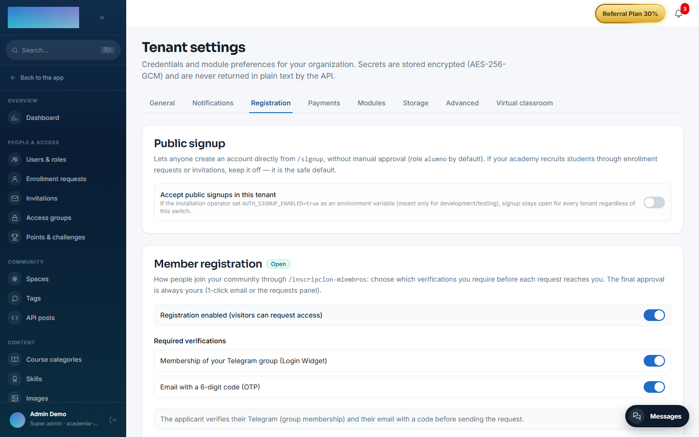
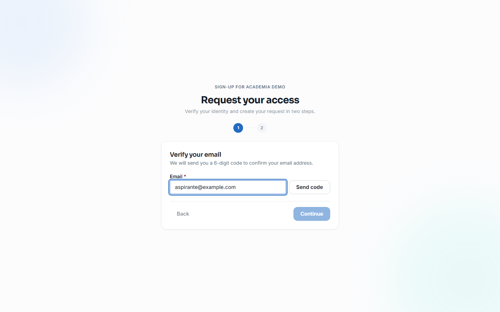
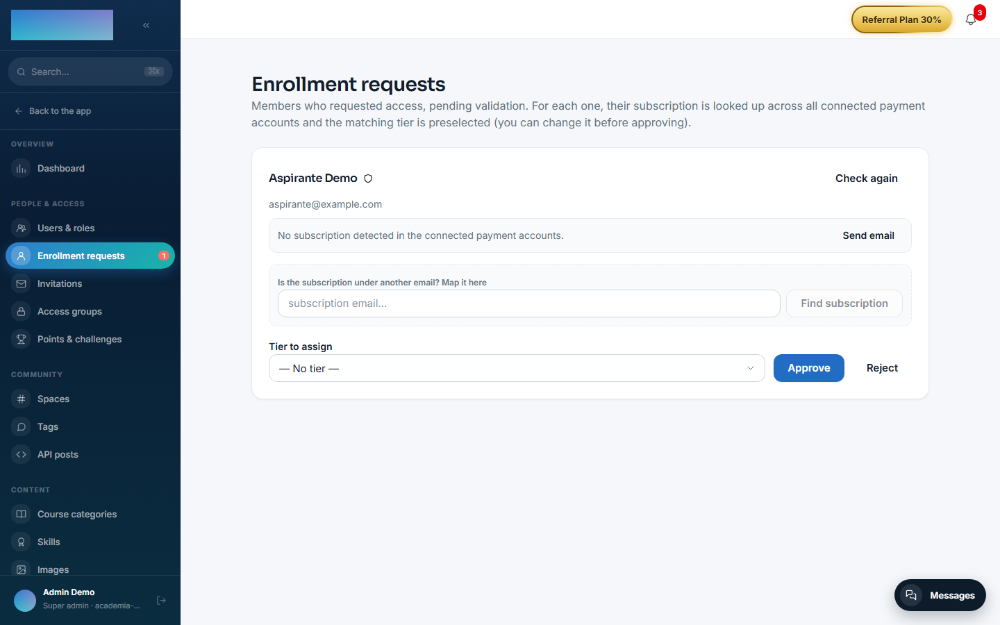

# mod.member-registration — Member registration

Community · **Core** category (always active)

## What it does

Member sign-up with **manual validation**: request → evidence → human decision. The public wizard (`/inscripcion-miembros`) assembles its steps according to the tenant's policy:

- Verification through **Telegram** (Login Widget + a group membership check).
- **Email OTP** (a 6-digit code).
- Both, or **open registration** (the only gate being manual approval).

Registration creates the user as `PENDING`, kicks off a background **lookup of subscriptions and purchases** for that email across the connected payment accounts, and notifies the **approver** by email with two signed single-use links (approve / reject) plus the overdue payment status if there is one.

## How it works

- The steps are chained with **HMAC-signed tickets** (no state in the database): the Telegram ticket authorises the OTP and the OTP's `verificationToken` authorises registration.
- Approving activates the user, assigns them the **default access group** and sends the welcome email; rejecting deactivates them and sends a notice.
- If the tenant requires a verifier that is not operational (for example Telegram with no bot configured), registration returns a **fail-closed 503** — it never lets anyone through unverified.
- A daily **GDPR purge** worker anonymises the Telegram data of requests that were never decided once the retention window expires (90 days by default).
- The admin panel also supports re-running the payment lookup, deciding without the email, sending renewal reminders and managing **overdue payment flags** (with CSV import). **Manual sign-up** without OTP exists as an admin API endpoint (`POST /modules/member-registration/admin/requests`), with no dedicated panel screen.

## Configuration

A **core**-category module: always active, with no switch in the "Modules" tab. No setting requires an Enterprise licence.

**Per tenant, from the panel** — Administration → Brand & settings → **Settings**, "Registration" tab (`/admin/configuracion?tab=registro`), "Member registration" card:

- **"Registration enabled (visitors can request access)"** — when off, registration is CLOSED and accounts are created by the administrator.
- **"Required verifications"** — "Membership of your Telegram group (Login Widget)" and/or "Email with a 6-digit code (OTP)". None checked = open registration: anyone can send a request and the only gate is your manual approval.
- **Telegram bot** (appears when Telegram is required): "Bot username (without @)", "Group ID" (numeric, with the `-100` prefix for supergroups) and "Bot token". The token is encrypted at rest with AES-256-GCM, the API never returns it in plain text, and leaving the field empty keeps the stored one. Requiring Telegram without a configured bot is rejected on save.
- **"Approver email"** — receives every request with the 1-click links. Empty = uses the deployment's global approver, if any.

**Emails** — it registers 4 editable templates under Administration → Communication → **Emails** (`/admin/emails`), keys `member_registration.otp_code`, `member_registration.approval_request`, `member_registration.welcome_approved` and `member_registration.rejection`. Sending uses the tenant's SMTP (the "Notifications" tab of the same Settings screen): without SMTP neither the OTP code nor the notices go out.

**Environment variables** (legacy fallback for single-tenant deployments; the cascade is tenant setting → env → nothing):

- `TELEGRAM_BOT_TOKEN`, `TELEGRAM_GROUP_ID`, `TELEGRAM_BOT_USERNAME` — global bot. Without an explicit tenant setting, the default preserves the historical behaviour: with a bot in the env → Telegram+OTP required; without one → registration closed.
- `MEMBER_APPROVAL_EMAIL` — global approver.
- `MEMBER_PURGE_CRON` (default `0 3 * * *`, daily at 03:00 UTC) and `MEMBER_RETENTION_DAYS` (default 90) — the GDPR purge worker.

## Step-by-step usage

**Setup (admin):**

1. On `/admin/configuracion?tab=registro`, turn on "Registration enabled…", check the verifications you require, fill in the bot if you require Telegram plus the "Approver email", and press **Save settings**.

2. *(Optional)* Adjust the copy of the 4 templates on `/admin/emails`.
3. Share your tenant's public sign-up URL: `/inscripcion-miembros`.

**What the applicant sees** (steps depend on the policy):

4. "Verify your Telegram" step: they press the Login Widget button; the screen confirms "Your Telegram account has been verified" or warns them when they are not in the group (they can continue and their case will be reviewed).
5. "Verify your email" step: they type their address, press **Send code**, enter the "6-digit code" and press **Verify**.
6. "Your details" step: name, password (at least 12 characters) and an optional bio — the email is asked for in this step when there is no OTP step — then they press **Create request**. Final screen: "Registration pending validation".

**The decision (approver):**

7. By email: "Nueva inscripción pendiente — {name}" arrives with the "Approve"/"Reject" buttons (signed single-use links, 7-day TTL) and the overdue status if there is one; clicking lands on `/inscripcion-miembros/decision` with the outcome.
8. Or from the panel: Administration → People & access → **Enrollment requests** (`/admin/solicitudes-miembros`). Each request shows its detected subscription ("Active subscription" / "Subscription not active — canceled or past due"), one-off purchases, and lets you **Check again**, map the subscription under another email ("Is the subscription under another email? Map it here"), send reminders and pick the "Tier to assign" (preselected when it matches the subscription). Press **Approve** or **Reject**.

9. Approving activates the account, assigns the default access group and sends the welcome email; rejecting deactivates the user and notifies them.
10. Keep the overdue reference list under Administration → Revenue → **Overdue payments** (`/admin/impagos`): manual entry ("New record", "Mark as overdue") or **Import CSV**. Registration uses these flags to warn you when someone requests access without being up to date.

## Dependencies

Hard: `mod.payment-connections` (lookup and renewal links) and `mod.access-groups` (default group on approval).

## Data model

`mod_member_registration_profile` (per-user flow data) · `mod_member_registration_decision_token` (single-use tokens, SHA-256 hash, 7-day TTL) · `mod_member_registration_payment_flag` (reference overdue payments) · `mod_member_registration_subscription_lookup` (the lookup result).

## API

Prefix `/modules/member-registration` (public, admin and payment-flags blocks). Details in [Reference → Community and people](../../api/referencia/comunidad.md#member-registration-modulesmember-registration).

## Events

**Emits**: `member_registration.request.created/approved/rejected`. It consumes none.
