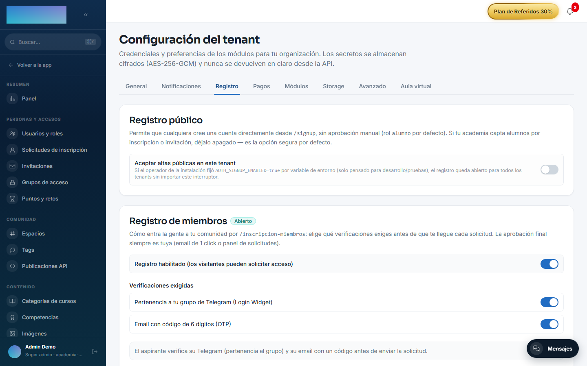
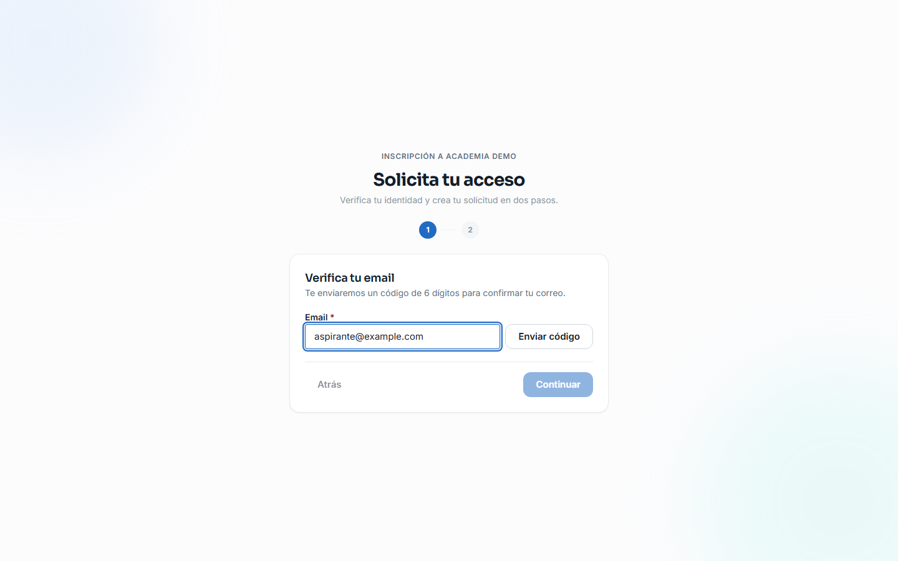
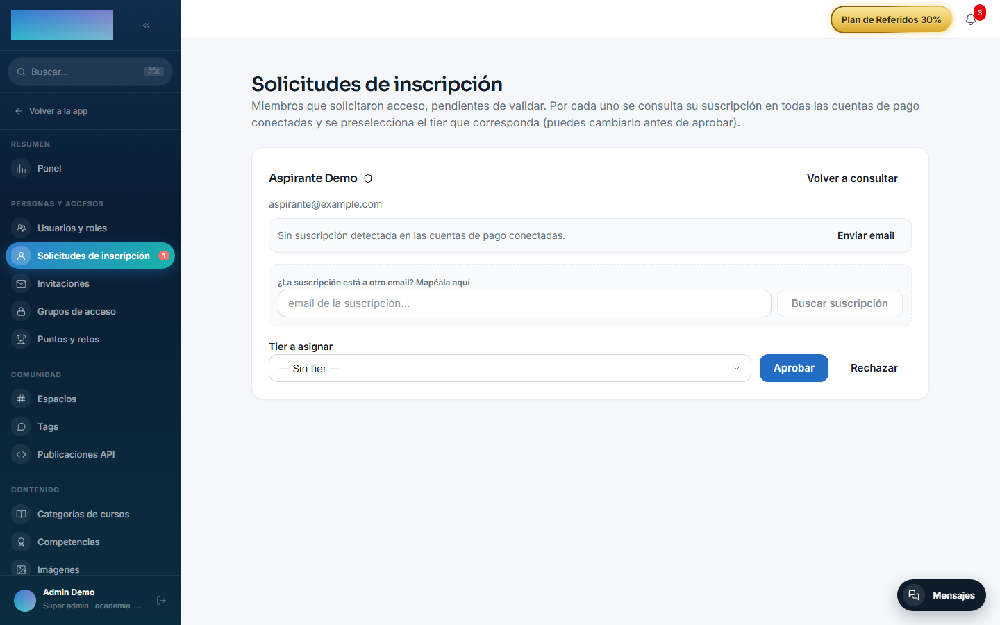

# mod.member-registration — Inscripción de miembros

Community · Categoría **core** (siempre activo)

## Qué hace

Alta de miembros con **validación manual**: solicitud → evidencia → decisión humana. El wizard público (`/inscripcion-miembros`) monta sus pasos según la política del tenant:

- Verificación por **Telegram** (Login Widget + comprobación de pertenencia al grupo).
- **OTP por email** (código de 6 dígitos).
- Ambas, o **registro libre** (el único gate es la aprobación manual).

El registro crea el usuario en `PENDING`, lanza en segundo plano el **lookup de suscripciones y compras** del email en las cuentas de pago conectadas, y avisa al **aprobador** por email con dos enlaces firmados de un solo uso (aprobar / rechazar) más el estado de impago si consta.

## Cómo funciona

- Los pasos se encadenan con **tickets firmados HMAC** (sin estado en base de datos): el ticket de Telegram autoriza el OTP y el `verificationToken` del OTP autoriza el registro.
- Aprobar activa al usuario, le asigna el **grupo de acceso por defecto** y envía la bienvenida; rechazar lo desactiva y avisa.
- Si el tenant exige un verificador no operativo (p. ej. Telegram sin bot configurado), la inscripción responde **503 fail-closed** — nunca deja pasar sin verificar.
- Un worker diario de **purga GDPR** anonimiza los datos de Telegram de las solicitudes nunca decididas al vencer la retención (90 días por defecto).
- El panel admin permite además re-lanzar el lookup de pagos, decidir sin el email, enviar recordatorios de renovación y gestionar **flags de impago** (con import CSV). El **alta manual** sin OTP existe como endpoint de la API admin (`POST /modules/member-registration/admin/requests`), sin pantalla propia en el panel.

## Configuración

Módulo de categoría **core**: siempre activo, sin interruptor en la pestaña «Módulos». Ningún ajuste exige licencia Enterprise.

**Por tenant, desde el panel** — Administración → Marca y ajustes → **Configuración**, pestaña «Registro» (`/admin/configuracion?tab=registro`), tarjeta «Registro de miembros»:

- **«Registro habilitado (los visitantes pueden solicitar acceso)»** — apagado, el registro queda CERRADO y las altas las hace el administrador.
- **«Verificaciones exigidas»** — «Pertenencia a tu grupo de Telegram (Login Widget)» y/o «Email con código de 6 dígitos (OTP)». Ninguna marcada = registro libre: cualquiera envía solicitud y el único gate es tu aprobación.
- **Bot de Telegram** (aparece al exigir Telegram): «Username del bot (sin @)», «ID del grupo» (numérico, con prefijo `-100` en supergrupos) y «Token del bot». El token se cifra at-rest con AES-256-GCM, la API nunca lo devuelve en claro y dejar el campo vacío conserva el guardado. Exigir Telegram sin bot configurado se rechaza al guardar.
- **«Email del aprobador»** — recibe cada solicitud con los enlaces de 1 click. Vacío = usa el aprobador global del despliegue, si existe.

**Emails** — registra 4 plantillas editables en Administración → Comunicación → **Emails** (`/admin/emails`), claves `member_registration.otp_code`, `member_registration.approval_request`, `member_registration.welcome_approved` y `member_registration.rejection`. El envío usa el SMTP del tenant (pestaña «Notificaciones» de la misma Configuración): sin SMTP no salen ni el código OTP ni los avisos.

**Variables de entorno** (fallback legacy para despliegues mono-tenant; la cascada es setting del tenant → env → nada):

- `TELEGRAM_BOT_TOKEN`, `TELEGRAM_GROUP_ID`, `TELEGRAM_BOT_USERNAME` — bot global. Sin setting explícito del tenant, el default preserva el comportamiento histórico: con bot en el env → exige Telegram+OTP; sin bot → registro cerrado.
- `MEMBER_APPROVAL_EMAIL` — aprobador global.
- `MEMBER_PURGE_CRON` (default `0 3 * * *`, diario a las 03:00 UTC) y `MEMBER_RETENTION_DAYS` (default 90) — el worker de purga GDPR.

## Uso paso a paso

**Preparación (admin):**

1. En `/admin/configuracion?tab=registro`, activa «Registro habilitado…», marca las verificaciones que exiges, rellena el bot si exiges Telegram y el «Email del aprobador», y pulsa **Guardar configuración**.

2. *(Opcional)* Ajusta el texto de las 4 plantillas en `/admin/emails`.
3. Comparte la URL pública de inscripción de tu tenant: `/inscripcion-miembros`.

**Lo que ve el solicitante** (los pasos dependen de la política):

4. Paso «Verifica tu Telegram»: pulsa el botón del Login Widget; la pantalla confirma «Tu cuenta de Telegram quedó verificada» o avisa si no está en el grupo (puede continuar y se revisará su caso).
5. Paso «Verifica tu email»: escribe su correo, pulsa **Enviar código**, teclea el «Código de 6 dígitos» y pulsa **Verificar**.
6. Paso «Tus datos»: nombre, contraseña (mínimo 12 caracteres) y biografía opcional — el email se pide en este paso cuando no hay paso OTP — y pulsa **Crear solicitud**. Pantalla final: «Registro pendiente de validación».

**La decisión (aprobador):**

7. Por email: llega «Nueva inscripción pendiente — {nombre}» con los botones «Aprobar»/«Rechazar» (enlaces firmados de un solo uso, TTL 7 días) y el estado de impago si consta; al pulsar, aterriza en `/inscripcion-miembros/decision` con el resultado.
8. O desde el panel: Administración → Personas y accesos → **Solicitudes de inscripción** (`/admin/solicitudes-miembros`). Cada solicitud muestra su suscripción detectada («Suscripción vigente» / «Suscripción no vigente — baja o impago»), las compras puntuales y permite **Volver a consultar**, mapear la suscripción por otro email («¿La suscripción está a otro email? Mapéala aquí»), enviar recordatorios y elegir el «Tier a asignar» (preseleccionado si coincide con la suscripción). Pulsa **Aprobar** o **Rechazar**.

9. Aprobar activa la cuenta, asigna el grupo de acceso por defecto y envía la bienvenida; rechazar desactiva al usuario y le avisa.
10. Mantén la lista de referencia de impagos en Administración → Ingresos → **Impagos** (`/admin/impagos`): alta manual («Nuevo registro», «Marcar como impago») o **Importar CSV**. La inscripción usa estas marcas para avisarte de quien solicita acceso sin estar al día.

## Dependencias

Duras: `mod.payment-connections` (lookup y enlaces de renovación) y `mod.access-groups` (grupo por defecto al aprobar).

## Modelo de datos

`mod_member_registration_profile` (datos del flujo por usuario) · `mod_member_registration_decision_token` (tokens de un solo uso, hash SHA-256, TTL 7 días) · `mod_member_registration_payment_flag` (impagos de referencia) · `mod_member_registration_subscription_lookup` (resultado del lookup).

## API

Prefijo `/modules/member-registration` (bloques público, admin y payment-flags). Detalle en [Referencia → Comunidad y personas](../../api/referencia/comunidad.md#inscripcion-de-miembros-modulesmember-registration).

## Eventos

**Emite**: `member_registration.request.created/approved/rejected`. No consume.
