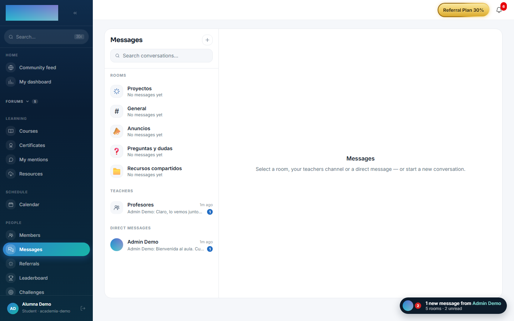
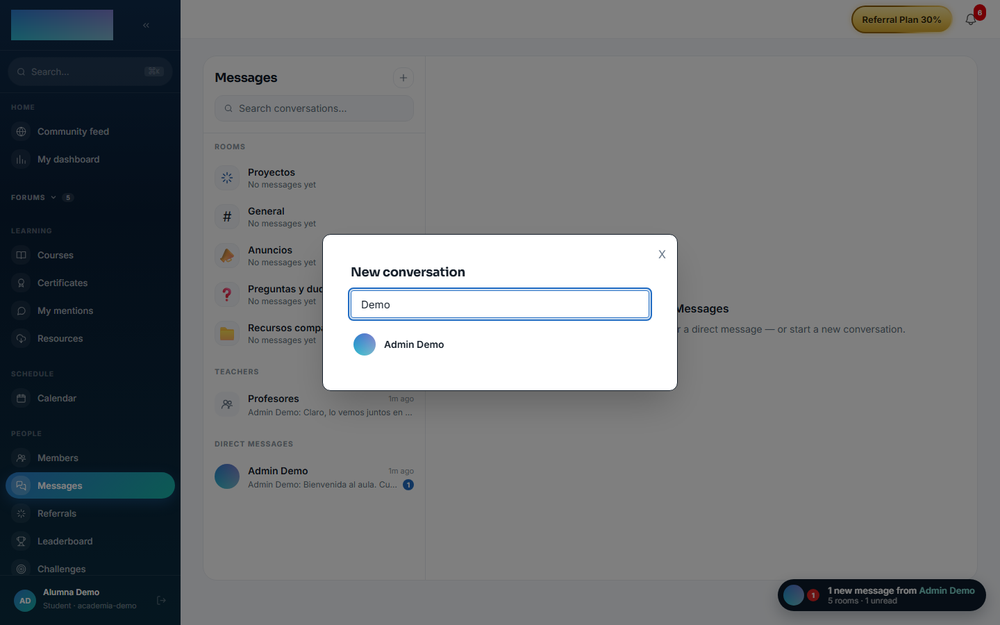
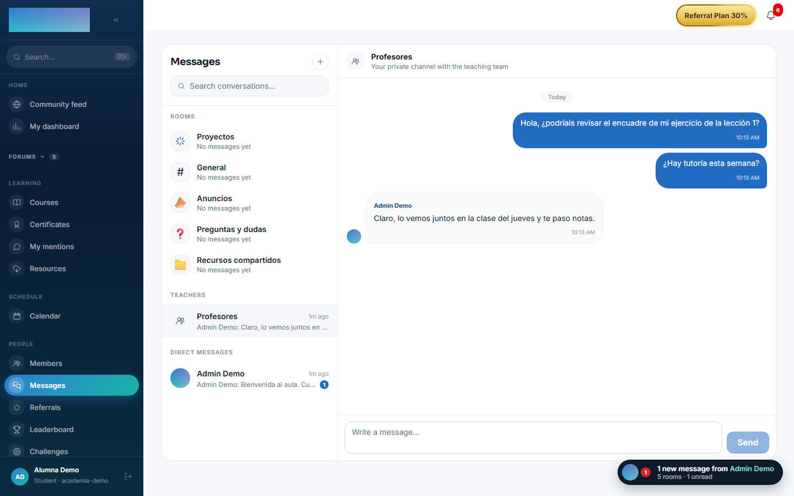

# mod.messaging — Messaging

Community · **Community** category (can be disabled)

## What it does

Native messaging with three conversation types:

- A **chat room for every community space**.
- **Direct messages** between members.
- An **automatic private channel** between each student and the instructor team (the staff enquiries inbox).

With **real-time delivery over SSE**, presence, a typing indicator, read receipts, an unread counter and rate limiting (20 messages/min, 30 typing signals/min).

## How it works

- Uniqueness is enforced in the database: one conversation per space, one per student in the instructors channel, and one per pair of users in DMs (a canonical ordered key), which makes *get-or-create* **idempotent**.
- The author's name is stored as a **snapshot** on send (it survives renames and deletions, and avoids N+1 queries).
- The data model keeps deleted messages' bodies for auditing and the client renders them as "Message deleted"; today the API exposes no message-deletion action.
- The SSE stream opens with an **ephemeral ticket** (~60 s) because `EventSource` does not accept headers; events: `message.created`, `typing`, `ping`.
- A suspended or deleted account cannot use messaging even if its token is still valid (checked against the database on every call).
- Rate limiting uses Redis and degrades to a local in-memory counter if Redis fails.

## Configuration

- **Activation** — `Administration → Settings`, "Modules" tab (`/admin/configuracion`): the toggle for "Mensajería · salas, directos y canal de profesores" (`mod.messaging`). With the module disabled the API answers "The messaging module is not active in this community.".
- **No per-tenant settings** — the module exposes no settings screen of its own; the quotas (20 messages/min, 30 typing signals/min) are fixed in code.
- **`REDIS_URL`** — used by realtime (pub/sub across API instances), presence and rate limiting. Without Redis messages are still persisted: rate limiting degrades to an in-memory counter and presence to a local mirror (enough with a single API instance); real-time fan-out across several instances does need Redis.
- **Rooms per space** — they exist if `mod.community` is active (the module reads its spaces, read-only).
- No feature requires an Enterprise license.

## Step-by-step usage

**The student (member):**

1. Open `/mensajes` from the "Messages" item in the People group. The list comes grouped into "Rooms", "Teachers" and "Direct messages", with a search box ("Search conversations…").

    

2. For a new DM, press the "New conversation" button (+) and search with "Search for a member by name…": picking someone opens the conversation (or reopens the existing one — get-or-create is idempotent).

    

3. The "Teachers" channel already exists for every student, no setup needed: "Write your first question: the teaching team will see it right away."

    

4. Type in "Write a message…" and press "Send". Live, they'll see the typing indicator, "Online now" next to who is connected, read receipts and the per-conversation unread counter.
5. The floating chat (the pill at the bottom right, visible across the whole app) opens these same conversations in a compact panel; "See all messages ›" leads to `/mensajes`.

**The staff (admin / instructor):**

1. Each student's enquiries appear in the "Student inquiries" group of `/mensajes`: one conversation per student, created automatically the first time they write.

2. Reply right there; the student receives the message instantly over SSE (and as unread if they are not connected).

## Dependencies

Optional: `mod.community` (reading spaces for the rooms).

## Data model

`mod_messaging_conversation` (typed SPACE/DM/FACULTY, with a denormalised `lastMessageAt`) · `mod_messaging_participant` (with `lastReadAt`) · `mod_messaging_message` (author snapshot, attachment support, soft delete).

## API

Prefix `/modules/messaging` (+ the SSE stream). Details in [Reference → Community and people](../../api/referencia/comunidad.md#messaging-modulesmessaging).

## Events

**Emits**: `messaging.conversation.created`, `messaging.message.sent`. It consumes none.
