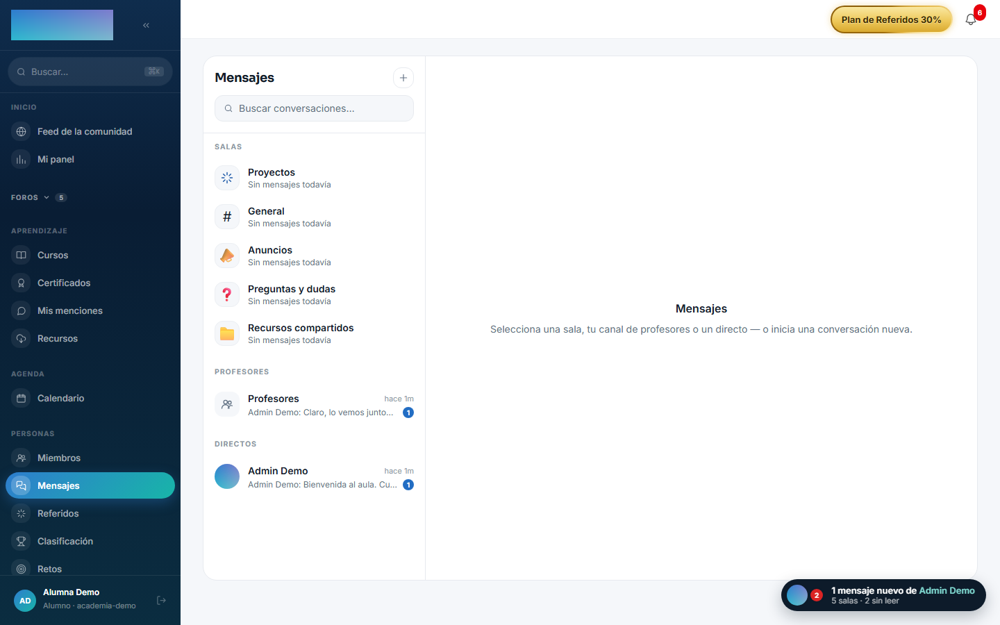
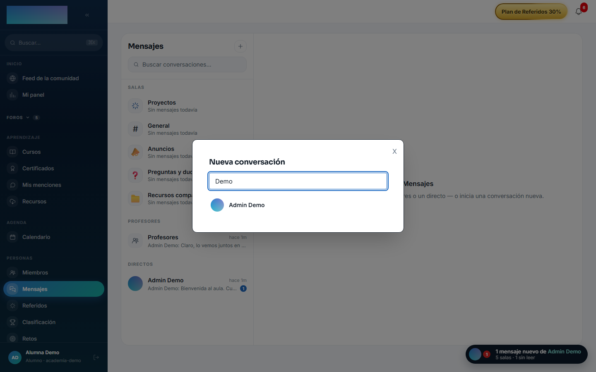
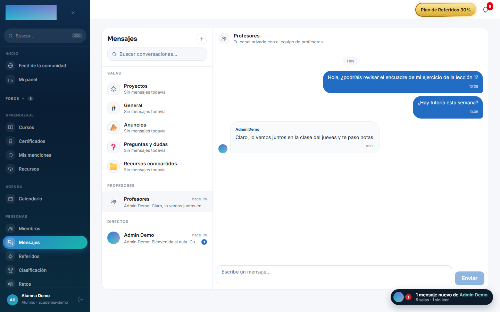

# mod.messaging — Mensajería

Community · Categoría **community** (desactivable)

## Qué hace

Mensajería nativa con tres tipos de conversación:

- Una **sala de chat por cada espacio** de comunidad.
- **Mensajes directos** entre miembros.
- Un **canal privado automático** de cada alumno con el equipo de profesores (bandeja de consultas del staff).

Con entrega en **tiempo real vía SSE**, presencia, indicador de «escribiendo», marcas de lectura, contador de no-leídos y rate limiting (20 mensajes/min, 30 señales de typing/min).

## Cómo funciona

- La unicidad está garantizada en base de datos: una conversación por espacio, una por alumno en el canal de profesores y una por par de usuarios en DM (clave canónica ordenada), lo que hace el *get-or-create* **idempotente**.
- El nombre del autor se guarda como **snapshot** al enviar (sobrevive a renombres y bajas, y evita N+1).
- El modelo conserva el cuerpo de los mensajes borrados para auditoría y el cliente los pinta como «Mensaje eliminado»; hoy la API no expone ninguna acción de borrado de mensajes.
- El stream SSE se abre con un **ticket efímero** (~60 s) porque `EventSource` no admite headers; eventos: `message.created`, `typing`, `ping`.
- Una cuenta suspendida o borrada no puede usar la mensajería aunque su token siga vivo (verificación contra BD en cada llamada).
- El rate limit usa Redis y degrada a contador local en memoria si Redis falla.

## Configuración

- **Activación** — `Administración → Configuración`, pestaña «Módulos» (`/admin/configuracion`): interruptor de «Mensajería · salas, directos y canal de profesores» (`mod.messaging`). Con el módulo desactivado la API responde con «El módulo de mensajería no está activo en esta comunidad.».
- **Sin ajustes por tenant** — el módulo no expone ninguna pantalla de configuración propia; los cupos (20 mensajes/min, 30 señales de typing/min) están fijados en código.
- **`REDIS_URL`** — la usan el realtime (pub/sub entre instancias de la API), la presencia y el rate limit. Sin Redis los mensajes se persisten igual: el rate limit degrada a un contador en memoria y la presencia a un espejo local (suficiente con una sola instancia de API); el fan-out en tiempo real entre varias instancias sí necesita Redis.
- **Salas por espacio** — existen si `mod.community` está activo (el módulo lee sus espacios, solo lectura).
- Ninguna función exige licencia Enterprise.

## Uso paso a paso

**El alumno (miembro):**

1. Abre `/mensajes` desde el ítem «Mensajes» del grupo Personas. La lista viene agrupada en «Salas», «Profesores» y «Directos», con buscador («Buscar conversaciones…»).

    

2. Para un directo nuevo, pulsa el botón «Nueva conversación» (+) y busca con «Busca un miembro por nombre…»: al elegirlo se abre la conversación (o se reabre la existente — el get-or-create es idempotente).

    

3. El canal «Profesores» ya existe para cada alumno sin hacer nada: «Escribe tu primera consulta: el equipo de profesores la verá al momento.»

    

4. Escribe en «Escribe un mensaje…» y pulsa «Enviar». En vivo verá el indicador de escritura, «Conectado ahora» junto a quien está en línea, las marcas de lectura y el contador de no-leídos por conversación.
5. El chat flotante (la píldora de abajo a la derecha, visible en toda la app) abre estas mismas conversaciones en un panel compacto; «Ver todos los mensajes ›» lleva a `/mensajes`.

**El staff (admin / formador):**

1. Las consultas de cada alumno aparecen en el grupo «Consultas de alumnos» de `/mensajes`: una conversación por alumno, creada sola la primera vez que escribe.

2. Responde ahí mismo; el alumno recibe el mensaje al momento por SSE (y como no-leído si no está conectado).

## Dependencias

Opcional: `mod.community` (lectura de espacios para las salas).

## Modelo de datos

`mod_messaging_conversation` (tipada SPACE/DM/FACULTY, con `lastMessageAt` denormalizado) · `mod_messaging_participant` (con `lastReadAt`) · `mod_messaging_message` (snapshot de autor, soporte de adjunto, soft-delete).

## API

Prefijo `/modules/messaging` (+ stream SSE). Detalle en [Referencia → Comunidad y personas](../../api/referencia/comunidad.md#mensajeria-modulesmessaging).

## Eventos

**Emite**: `messaging.conversation.created`, `messaging.message.sent`. No consume.
