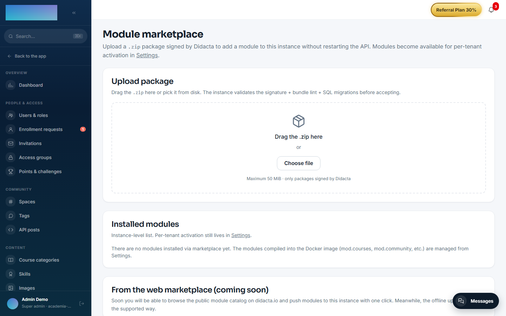

# mod.migrator-learndash — Migrator from WordPress + LearnDash

Community · **Migration** category · **Beta** · Distributed as a **signed ZIP** (third-party format)

## What it does

It migrates a **WordPress + LearnDash** academy to Didacta: courses, lessons, topics, quizzes, questions, users, enrollments, media and progress (LearnDash groups are not loaded yet: see the MVP limitations). It is driven by a **6-milestone wizard** (Start → Connect with a URL + Application Password → Source summary → Options → Trial → Full run), designed so a non-technical administrator can complete it in an hour. The **trial** genuinely imports 1 random course with up to 5 students so you can verify the result before committing to the full volume.

## How it works

- An **ETL pipeline with staging**: it extracts into staging tables, transforms and loads with **idempotent mapping** by checksum — re-running duplicates nothing, and the full run reuses whatever the trial already loaded.
- Data errors go to a **DLQ** without aborting the job; at the end there is a **reconciliation report** (totals plus a per-entity breakdown) that includes the verification of the SHA-256 audit chain.
- It **only reads** from the source: the WordPress site is left untouched.
- Passwords: hashes are not imported (PHPass is not compatible with Argon2id); every user gets an email to set their own.
- The job runs on the backend: you can close the browser and it keeps going; the screen refreshes itself every 3 seconds.
- It is the **real-world example of the third-party format**: it is installed as a ZIP under Administration → Module marketplace, runs in the isolated VM with sandboxed `ctx.db`/`ctx.http`/`ctx.secrets`, and its WordPress credentials are stored AES-256-GCM encrypted with a key scoped to the job.

## Configuration

- **Installation**: it is a marketplace module, not enabled out of the box. In **Admin → Module marketplace** (`/admin/marketplace`), **Upload package** area, drag the module's `.zip`; the instance validates the signature + bundle lint + SQL migrations before accepting.
- **Access**: once installed, the **Migrate from LearnDash** entry appears in the admin menu (`/admin/integraciones/migrator-learndash`). Only the `super_admin` role can use it; everyone else sees a notice.
- **No environment variables and no settings screen of its own**: the WordPress URL, user and Application Password travel in the job the wizard creates, encrypted with a key scoped to that job.
- **Wizard options** (Options step): what to migrate (**courses only** / **only students enrolled in courses** / **everything**), passwords (**send activation email**, the recommended default) and images (**copy images into Didacta**). Staging tables are retained for 30 days.
- Nothing requires an Enterprise license.

## Step by step

Before starting: take a `pg_dump` of Didacta (it is the supported way back) and have an administrator user of your WordPress with LearnDash reachable over HTTPS.

The wizard's interface currently ships in Spanish only; the labels below quote it verbatim with translations.

1. In your WordPress, create an **Application Password** for the administrator user (Users → Profile → Application Passwords). Do not use the normal password.
2. In Didacta, open **Migrate from LearnDash**, tab **«Crear migración»** (create migration), and click **«Comenzar»** (start).
3. **Connect**: fill in **«URL de tu WordPress»**, **«Usuario administrador»** and **«Application Password»**, and click **«Comprobar y continuar»** (check and continue).

4. **Summary** ("this is what we are going to migrate"): counts of courses, lessons, topics, quizzes, groups and students, samples of the 5 most recent entities per type, and the source warnings. Click **«Continuar»**.
5. **Options**: choose what to migrate, the password strategy and whether to copy images, then click **«Empezar la prueba»** (start the trial). The enrolled-students-only mode requires the courses to be migrated first: enrollments of unmigrated courses are recorded as incidents in the report.
6. **Trial**: 1 random course and up to 5 students are imported. The screen refreshes every 3 seconds and you can close the browser. When it finishes you see the Source / Loaded / Skipped / Failed figures and the per-entity detail.
7. Verify in Didacta that the trial course looks right, then decide: **«Sí, hacer integración completa»** (yes, run the full integration — idempotent: the trial is not duplicated, only what is missing gets added) or **«Terminar aquí (conservo solo la muestra)»** (stop here, keep only the sample).
8. On completion, the report shows the totals and the audit chain status. The **«Monitor de migraciones»** tab lists every job with its status, a cancel button while it runs, the reconciliation report and the **DLQ** with per-entity incidents (this is where, for example, unsupported LearnDash groups show up).

9. Imported users receive the email to set their password and can then sign in.

## Dependencies

Required: `mod.courses`, `mod.learning`, `mod.assessments` — the load phase writes courses, lessons, quizzes and enrollments through their tables. Optional: `mod.certificates`, `mod.community`.

## Data model

15 `mod_migrator_learndash_*` tables: `_jobs`, `_mappings` (source ↔ target per entity), `_dlq`, `_audit_events` (append-only, chained), `_validation_reports` and 10 staging tables (`_stg_users`, `_stg_courses`, `_stg_lessons`, `_stg_quizzes`…).

## API

Prefix `/modules/migrator-learndash`: `preflight`, `jobs` (create, list, status, cancel), the per-job reconciliation report (which includes the audit chain verification) and the paginated DLQ. Progress is read by polling the job status.

!!! warning "MVP limitations"
    There is no automatic rollback: the supported path is restoring from the `pg_dump` you took beforehand. **LearnDash groups are not migrated** yet (enrollments are imported course by course; each group is recorded in the DLQ with an actionable message). Fine-grained quiz attempt history and already-issued certificates are not migrated (templates only). The wizard's interface is Spanish-only for now.
