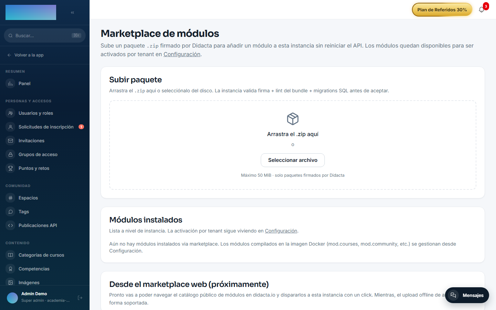

# mod.migrator-learndash — Migrador desde WordPress + LearnDash

Community · Categoría **migration** · **Beta** · Se distribuye como **ZIP firmado** (formato third-party)

## Qué hace

Migra una academia de **WordPress + LearnDash** a Didacta: cursos, lecciones, temas, quizzes, preguntas, usuarios, matrículas, media y progreso (los grupos de LearnDash todavía no se cargan: ver los límites del MVP). Se opera con un **wizard de 6 hitos** (Inicio → Conectar con URL + Application Password → Resumen del origen → Opciones → Prueba → Completa), pensado para que un administrador no técnico lo complete en una hora. La **prueba** importa de verdad 1 curso aleatorio con hasta 5 alumnos para verificar el resultado antes de comprometerse con el volumen completo.

## Cómo funciona

- Pipeline **ETL con staging**: extrae a tablas de staging, transforma y carga con **mapeo idempotente** por checksum — relanzar no duplica, y la integración completa reutiliza lo que ya cargó la prueba.
- Los errores de datos van a una **DLQ** sin abortar el job; al final hay un **reporte de reconciliación** (totales y desglose por entidad) que incluye la verificación de la cadena de auditoría SHA-256.
- **Solo lee** del origen: el WordPress queda intacto.
- Contraseñas: no se importan hashes (PHPass no es compatible con Argon2id); cada usuario recibe un email para definir la suya.
- El job corre en backend: se puede cerrar el navegador y el progreso sigue; la pantalla se actualiza sola cada 3 segundos.
- Es el **ejemplo real del formato third-party**: se instala por ZIP en Administración → Marketplace módulos, corre en la VM aislada con `ctx.db`/`ctx.http`/`ctx.secrets` sandboxeados, y sus credenciales de WordPress se guardan cifradas AES-256-GCM con clave scoped al job.

## Configuración

- **Instalación**: es un módulo de marketplace, no viene activado de serie. En **Administración → Marketplace módulos** (`/admin/marketplace`), zona **Subir paquete**, arrastra el `.zip` del módulo; la instancia valida firma + lint del bundle + migrations SQL antes de aceptar.
- **Acceso**: tras instalarlo aparece la entrada **Migrar desde LearnDash** en el menú de administración (`/admin/integraciones/migrator-learndash`). Solo el rol `super_admin` puede usarla; el resto ve un aviso.
- **Sin variables de entorno ni pantalla de ajustes propia**: la URL, el usuario y el Application Password de WordPress viajan en el job que crea el wizard, cifrados y con clave scoped a ese job.
- **Opciones del wizard** (paso Opciones): qué migrar (**Solo cursos** / **Solo alumnos matriculados en cursos** / **Todo**), contraseñas (**Enviar email de activación (recomendado)**) e imágenes (**Copiar imágenes a Didacta (recomendado)**). Las tablas de staging se retienen 30 días.
- Ninguna función exige licencia Enterprise.

## Uso paso a paso

Antes de empezar: haz un `pg_dump` de Didacta (es el camino de vuelta soportado) y ten a mano un usuario administrador de tu WordPress con LearnDash accesible por HTTPS.

1. En tu WordPress, crea un **Application Password** para el usuario administrador (Usuarios → Perfil → Application Passwords). No uses la contraseña normal.
2. En Didacta, abre **Migrar desde LearnDash**, pestaña **Crear migración**, y pulsa **Comenzar**.
3. **Conectar**: rellena **URL de tu WordPress**, **Usuario administrador** y **Application Password**, y pulsa **Comprobar y continuar**.

4. **Resumen** («Esto es lo que vamos a migrar»): recuentos de Cursos, Lecciones, Temas, Quizzes, Grupos y Alumnos, muestras de las últimas 5 entidades por tipo y los avisos del origen. Pulsa **Continuar**.
5. **Opciones**: elige qué migrar, la estrategia de contraseñas y si copiar imágenes, y pulsa **Empezar la prueba**. El modo **Solo alumnos matriculados en cursos** exige haber migrado antes los cursos: las matrículas de cursos no migrados quedan como incidencia en el informe.
6. **Prueba**: se importa 1 curso aleatorio y hasta 5 alumnos. La pantalla se refresca cada 3 segundos y puedes cerrar el navegador. Al terminar verás las cifras Origen / Cargados / Saltados / Fallidos y el detalle por entidad.
7. Verifica en Didacta que el curso de la prueba se ve bien, y decide: **Sí, hacer integración completa** (idempotente: la muestra no se duplica, solo se añade lo que falta) o **Terminar aquí (conservo solo la muestra)**.
8. Al finalizar, el reporte muestra los totales y el estado de la cadena de auditoría. En la pestaña **Monitor de migraciones** tienes cada job con su estado, el botón **Cancelar** mientras corre, el reporte de reconciliación y la **DLQ** con las incidencias por entidad (aquí aparecen, por ejemplo, los grupos de LearnDash no soportados).

9. Los usuarios importados reciben el email para establecer su contraseña y ya pueden entrar.

## Dependencias

Requeridos: `mod.courses`, `mod.learning`, `mod.assessments` — la carga escribe cursos, lecciones, quizzes y matrículas a través de sus tablas. Opcionales: `mod.certificates`, `mod.community`.

## Modelo de datos

15 tablas `mod_migrator_learndash_*`: `_jobs`, `_mappings` (origen ↔ destino por entidad), `_dlq`, `_audit_events` (append-only encadenada), `_validation_reports` y 10 de staging (`_stg_users`, `_stg_courses`, `_stg_lessons`, `_stg_quizzes`…).

## API

Prefijo `/modules/migrator-learndash`: `preflight`, `jobs` (crear, listar, estado, cancelar), reporte de reconciliación por job (incluye la verificación de la cadena de auditoría) y DLQ paginada. El progreso se consulta por polling del estado del job.

!!! warning "Límites del MVP"
    No hay rollback automático: el camino soportado es restaurar desde el `pg_dump` previo. Los **grupos de LearnDash no se migran** todavía (las matrículas se importan curso a curso; cada grupo queda registrado en la DLQ con un mensaje accionable). No se migra el histórico fino de intentos de quiz ni certificados ya emitidos (solo plantillas). La interfaz del wizard está por ahora solo en español.
