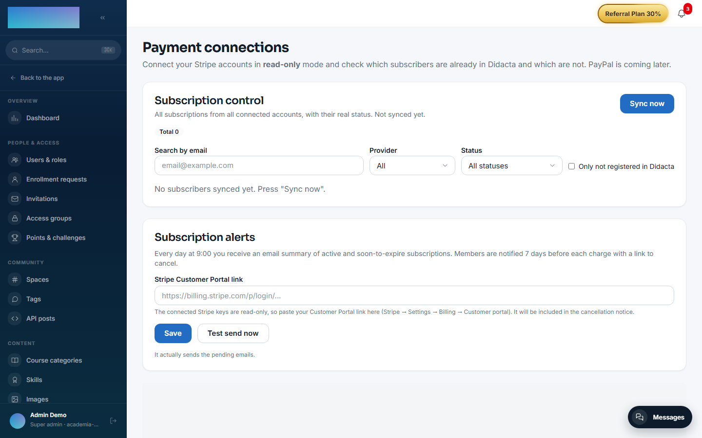
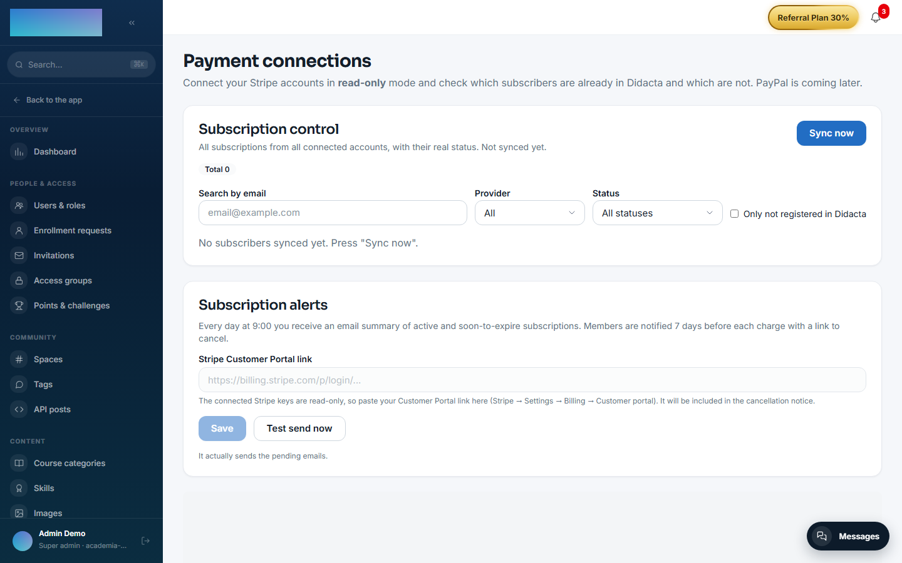
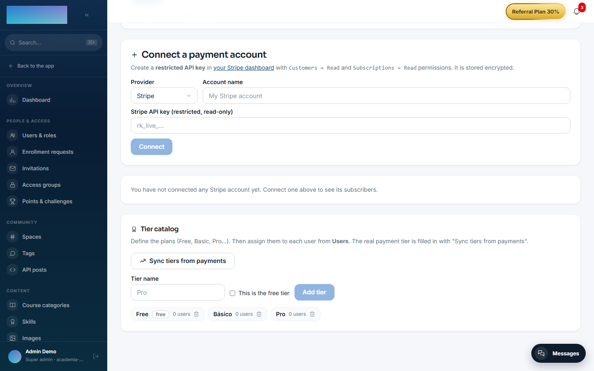

# mod.payment-connections — Payment connections

Community · **Core** category (always active)

## What it does

It connects several payment accounts **in read-only mode** (Stripe with a restricted key, plus PayPal and WooCommerce readers) and reconciles their active subscriptions against Didacta users **by email**. On that foundation it builds:

- The **tier** catalog (a manual level assigned by the admin and/or derived from payment), which other modules consume (drip, access groups).
- A **subscription control dashboard** materialised by a sync worker, with renewal links and reminder emails.
- The **order mirror** for external stores (WooCommerce, with a signed webhook) and access classification rules (`LIFETIME`, `SUBSCRIPTION`, `TIMED`…), with expiry notices.
- **Bulk invitations** for subscribers who are not in Didacta yet.

## What it is NOT

It creates no charges: to sell, use [mod.billing](billing.md) and [mod.subscriptions](subscriptions.md). Cancelling is a deep link into the Stripe portal — the model is 100% read-only over the connected accounts.

## How it works

- Matching is by **normalised email** (lowercase + trim) on both sides; `active`, `trialing` and `past_due` all count as active.
- The effective tier resolves as: manual → derived from payment → "Unknown". Changes publish `payment_connections.user_tier.changed`, which `mod.access-groups` consumes to reconcile memberships.
- API keys are stored **encrypted** per connection; they never come back in a GET.
- The dashboard reads only the materialised table — it never queries the providers live.

## Configuration

The module belongs to the **core** category: it is always active and has no switch of its own. The whole admin screen is **super_admin only** (it shows customers' payment data). Nothing requires an Enterprise licence.

Everything is configured on a single screen: `/admin/integraciones/payment-connections` (**"Payment connections"**), which chains four blocks:

### Connecting accounts

The **"Connect a payment account"** form: a **"Provider"** selector, an **"Account name"** field and the per-provider credentials — all stored encrypted and validated when you click **"Connect"**:

- **Stripe** — **"Stripe API key (restricted, read-only)"**: create a restricted key in your Stripe dashboard with `Customers = Read` and `Subscriptions = Read` permissions (optionally `Invoices = Read`, needed for the invoice links in the reminders).
- **PayPal** — **"PayPal Client ID"** + **"Secret"** of a REST app with the "Transaction Search" permission, plus the **"Environment"** (Live/Sandbox).
- **WooCommerce** — the **store URL** (https) + **"Consumer Key"** / **"Consumer Secret"** (WooCommerce → Settings → Advanced → REST API, *Read* permission). Requires the WooCommerce Subscriptions plugin.

Each listed connection shows its status (**"Verified"** / "Error"…), the Live or "test mode" badge and the actions **"View subscribers"**, **"Verify"** and **"Disconnect"** (which also deletes the stored key; subscriptions at the provider are untouched).

### Subscription control (dashboard)

The **"Subscription control"** block on the same screen: a **"Sync now"** button (besides the cron), the filters **"Search by email"**, **"Provider"**, **"Status"** and **"Only not registered in Didacta"**, and a per-row **"Reminder"** button that sends the renewal email (template editable from the modal itself, per tenant).

### Tier catalog

The **"Tier catalog"** block: a **"Tier name"** field, the **"This is the free tier"** toggle, the **"Add tier"** button and **"Sync tiers from payments"** (creates tiers from the accounts' real plans and fills in each user's payment tier). Manual per-user assignment is done from **Users**.

### Subscription alerts

The **"Subscription alerts"** block: the **"Stripe Customer Portal link"** field (the connected keys are read-only, so the cancellation link is pasted by hand: Stripe → Settings → Billing → Customer portal), plus the **"Save"** and **"Test send now"** buttons. With this in place, every day at 9:00 the admins receive the summary of active and soon-to-expire subscriptions, and each member is warned 7 days before their charge with the link to cancel.

### WooCommerce webhook (order mirror)

- URL to register in the store: `https://<your-academy-domain>/api/v1/modules/payment-connections/woo-webhook?tenant=<tenant-slug>` (topics `order.created` / `order.updated`). WooCommerce's verification ping is answered automatically.
- The webhook **signing secret** and the product **classification rules** (`LIFETIME`, `SUBSCRIPTION`, `TIMED`…) have no screen of their own today: they are set through the API (`PUT /modules/payment-connections/orders-mirror/webhook-secret` and `PUT /modules/payment-connections/orders-mirror/rules`). They are stored per tenant, the secret encrypted.

### Environment variables

| Variable | What it is for |
| --- | --- |
| `PAYMENT_SUBSCRIBERS_SYNC_CRON` | Cron of the worker materialising subscribers (`*/15 * * * *`). |
| `SUBSCRIPTIONS_DAILY_CRON` / `SUBSCRIPTIONS_DAILY_TZ` | Daily summary to the admins (`0 9 * * *`, `UTC`). |
| `SUBSCRIPTIONS_RENEWAL_WINDOW_DAYS` | Window of the renewal notices (7 days). |

Credentials, the Woo webhook secret, the renewal template and the cancellation portal URL are all **per tenant**, encrypted in the database — no variables of their own.

## Step-by-step usage

1. Create the restricted key in Stripe (`Customers = Read` + `Subscriptions = Read`, optionally `Invoices = Read`) and connect it under **"Connect a payment account"** → **"Connect"**. The connection ends up **"Verified"** with the account's details.
2. Click **"View subscribers"**: the live reconciliation splits **"In Didacta with an active subscription"** from **"Subscribers NOT in Didacta"**. In the second table, **"Select all with email"** → **"Invite (n)"** creates their accounts (PENDING) and sends the activation email.
3. Under **"Subscription control"**, click **"Sync now"** (or wait for the cron, every 15 min): the materialised table shows every subscription of every account with its real status ("Active", "Payment overdue (unpaid)", "Cancelled"…). Filter by email, provider or status; the **"Reminder"** button sends the renewal email with the open invoice's payment link (if the key can read Invoices).
4. Tiers: create the catalog (Free, Basic, Pro…), click **"Sync tiers from payments"** to derive each user's real tier, and adjust manually from **Users** where needed. Every tier change publishes `payment_connections.user_tier.changed`, which access groups consume.
5. Under **"Subscription alerts"**, paste your **"Stripe Customer Portal link"** and use **"Test send now"** to verify the circuit. After that, the daily summary and the 7-day notices go out on their own.
6. With WooCommerce: connect the store, register the signed webhook pointing to the URL with `?tenant=`, and set the secret through the API. The order mirror surfaces one-off purchases ("lifetime access") in the member enrollment requests and warns about `TIMED` access expiries.
7. What the end user sees: under `/cuenta?tab=suscripcion` (the **"Subscription"** tab) their external subscription appears with status and amount, plus the **"Manage my subscription"** button (opens the Stripe Customer Portal) or, without a portal, **"View / pay invoice ↗"** and a note to contact the academy.

## Dependencies

None.

## Data model

`mod_payment_connections_connection` · `_log` · `_tier` · `_user_tier` · `_subscriber` (materialised snapshot) · `_order` (order mirror with entitlement and expiry) · `_sync_history`.

## API

Prefix `/modules/payment-connections` (super_admin, except the self-service `me/*` endpoints). Details in [Reference → Payments](../../api/referencia/pagos-directo-ia.md#payment-connections-modulespayment-connections-super_admin).

## Events

**Emits**: `payment_connections.user_tier.changed`. It consumes none.
