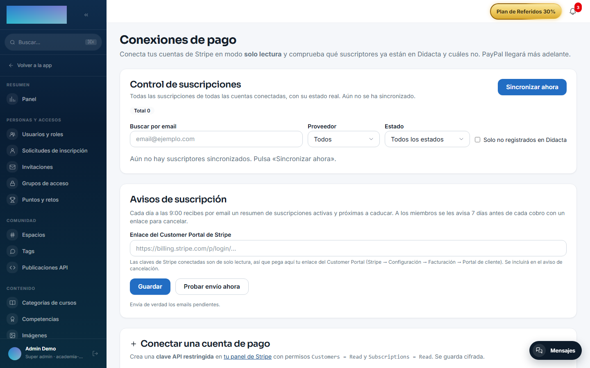
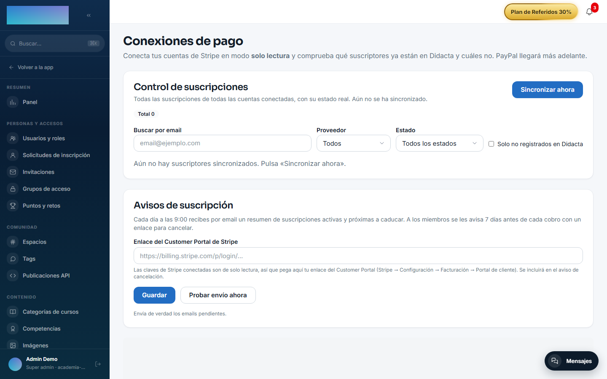
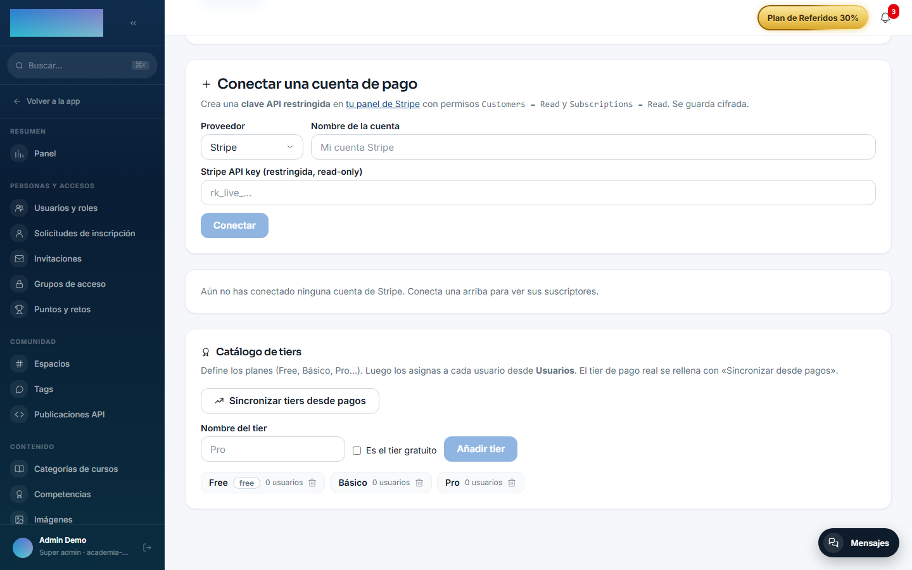

# mod.payment-connections — Conexiones de pago

Community · Categoría **core** (siempre activo)

## Qué hace

Conecta varias cuentas de pago **en modo solo lectura** (Stripe con clave restringida, y lectores de PayPal y WooCommerce) y reconcilia sus suscripciones activas contra los usuarios de Didacta **por email**. Sobre esa base construye:

- El catálogo de **tiers** (nivel manual asignado por el admin y/o derivado del pago), que otros módulos consumen (drip, grupos de acceso).
- Un **dashboard de control de suscripciones** materializado por un worker de sincronización, con enlaces de renovación y emails de recordatorio.
- El **espejo de pedidos** de tiendas externas (WooCommerce, con webhook firmado) y reglas de clasificación de accesos (`LIFETIME`, `SUBSCRIPTION`, `TIMED`…), con avisos de caducidad.
- La **invitación en bloque** de suscriptores que aún no están en Didacta.

## Qué NO es

No crea cobros: para vender están [mod.billing](billing.md) y [mod.subscriptions](subscriptions.md). Cancelar es un deep-link al portal de Stripe — el modelo es 100% read-only sobre las cuentas conectadas.

## Cómo funciona

- El match es por **email normalizado** (lowercase + trim) en ambos lados; cuentan como activas `active`, `trialing` y `past_due`.
- El tier efectivo se resuelve: manual → derivado del pago → «Desconocido». Los cambios publican `payment_connections.user_tier.changed`, que `mod.access-groups` consume para reconciliar membresías.
- Las claves API se guardan **cifradas** por conexión; jamás salen en un GET.
- El dashboard lee solo la tabla materializada — nunca consulta a los proveedores en vivo.

## Configuración

El módulo es de categoría **core**: viene activo siempre y no tiene interruptor propio. Toda la pantalla de administración es exclusiva de **super_admin** (muestra datos de pago de clientes). Nada exige licencia Enterprise.

Todo se configura en una sola pantalla: `/admin/integraciones/payment-connections` (**«Conexiones de pago»**), que encadena cuatro bloques:

### Conectar cuentas

Formulario **«Conectar una cuenta de pago»**: selector **«Proveedor»**, campo **«Nombre de la cuenta»** y las credenciales según proveedor — todas se guardan cifradas y se validan al pulsar **«Conectar»**:

- **Stripe** — **«Stripe API key (restringida, read-only)»**: crea en tu panel de Stripe una clave restringida con permisos `Customers = Read` y `Subscriptions = Read` (opcional `Invoices = Read`, necesario para los enlaces de factura de los recordatorios).
- **PayPal** — **«PayPal Client ID»** + **«Secret»** de una app REST con el permiso «Transaction Search», y el **«Entorno»** (Live/Sandbox).
- **WooCommerce** — **«URL de la tienda»** (https) + **«Consumer Key»** / **«Consumer Secret»** (WooCommerce → Ajustes → Avanzado → REST API, permiso *Lectura*). Requiere el plugin WooCommerce Subscriptions.

Cada conexión listada muestra su estado (**«Verificada»** / «Error»…), la insignia Live o «Modo test» y las acciones **«Ver suscriptores»**, **«Verificar»** y **«Desconectar»** (borra también la clave guardada; las suscripciones en el proveedor no se tocan).

### Control de suscripciones (dashboard)

Bloque **«Control de suscripciones»** en la misma pantalla: botón **«Sincronizar ahora»** (además del cron), filtros **«Buscar por email»**, **«Proveedor»**, **«Estado»** y **«Solo no registrados en Didacta»**, y por fila el botón **«Recordatorio»**, que envía el email de renovación (plantilla editable desde el propio modal, por tenant).

### Catálogo de tiers

Bloque **«Catálogo de tiers»**: campo **«Nombre del tier»**, interruptor **«Es el tier gratuito»**, botón **«Añadir tier»** y **«Sincronizar tiers desde pagos»** (crea tiers a partir de los planes reales de las cuentas y rellena el tier de pago de cada usuario). La asignación manual por usuario se hace desde **Usuarios**.

### Avisos de suscripción

Bloque **«Avisos de suscripción»**: campo **«Enlace del Customer Portal de Stripe»** (las claves conectadas son read-only, así que el enlace de cancelación se pega a mano: Stripe → Configuración → Facturación → Portal de cliente), botones **«Guardar»** y **«Probar envío ahora»**. Con esto, cada día a las 9:00 los admins reciben el resumen de suscripciones activas y próximas a caducar, y a cada miembro se le avisa 7 días antes de su cobro con el enlace para cancelar.

### Webhook de WooCommerce (espejo de pedidos)

- URL a dar de alta en la tienda: `https://<dominio-de-tu-academia>/api/v1/modules/payment-connections/woo-webhook?tenant=<slug-del-tenant>` (temas `order.created` / `order.updated`). El ping de verificación de WooCommerce se responde solo.
- El **secreto de firma** del webhook y las **reglas de clasificación** de producto (`LIFETIME`, `SUBSCRIPTION`, `TIMED`…) no tienen pantalla propia hoy: se fijan por API (`PUT /modules/payment-connections/orders-mirror/webhook-secret` y `PUT /modules/payment-connections/orders-mirror/rules`). Se guardan por tenant, el secreto cifrado.

### Variables de entorno

| Variable | Para qué |
| --- | --- |
| `PAYMENT_SUBSCRIBERS_SYNC_CRON` | Cron del worker que materializa los suscriptores (`*/15 * * * *`). |
| `SUBSCRIPTIONS_DAILY_CRON` / `SUBSCRIPTIONS_DAILY_TZ` | Resumen diario a los admins (`0 9 * * *`, `UTC`). |
| `SUBSCRIPTIONS_RENEWAL_WINDOW_DAYS` | Ventana de los avisos de renovación (7 días). |

Credenciales, secreto del webhook Woo, plantilla de renovación y URL del portal de cancelación son **por tenant**, cifradas en base de datos — sin variables propias.

## Uso paso a paso

1. Crea la clave restringida en Stripe (`Customers = Read` + `Subscriptions = Read`, opcional `Invoices = Read`) y conéctala en **«Conectar una cuenta de pago»** → **«Conectar»**. La conexión queda **«Verificada»** con los datos de la cuenta.
2. Pulsa **«Ver suscriptores»**: la reconciliación en vivo separa **«En Didacta con suscripción activa»** de **«Suscritos que NO están en Didacta»**. En la segunda tabla, **«Seleccionar todos con email»** → **«Invitar (n)»** les crea cuenta (PENDING) y les envía el email de activación.
3. En **«Control de suscripciones»**, pulsa **«Sincronizar ahora»** (o espera al cron, cada 15 min): la tabla materializada muestra todas las suscripciones de todas las cuentas con su estado real («Activa», «Pago atrasado (impago)», «Dada de baja»…). Filtra por email, proveedor o estado; el botón **«Recordatorio»** envía el email de renovación con el enlace de pago de la factura abierta (si la clave tiene lectura de Facturas).
4. Tiers: crea el catálogo (Free, Básico, Pro…), pulsa **«Sincronizar tiers desde pagos»** para derivar el tier real de cada usuario y ajusta a mano desde **Usuarios** lo que haga falta. Cada cambio de tier publica `payment_connections.user_tier.changed`, que los grupos de acceso consumen.
5. En **«Avisos de suscripción»**, pega tu **«Enlace del Customer Portal de Stripe»** y usa **«Probar envío ahora»** para verificar el circuito. Después, el resumen diario y los avisos a 7 días salen solos.
6. Con WooCommerce: conecta la tienda, da de alta el webhook firmado hacia la URL con `?tenant=` y fija el secreto por API. El espejo de pedidos delata compras puntuales («acceso lifetime») en las solicitudes de inscripción y avisa de las caducidades de los accesos `TIMED`.
7. Lo que ve el usuario final: en `/cuenta?tab=suscripcion` (pestaña **«Suscripción»**) aparece su suscripción externa con estado e importe, el botón **«Gestionar mi suscripción»** (abre el Customer Portal de Stripe) o, si no hay portal, **«Ver / pagar factura ↗»** y el aviso de contactar con la academia.

## Dependencias

Ninguna.

## Modelo de datos

`mod_payment_connections_connection` · `_log` · `_tier` · `_user_tier` · `_subscriber` (snapshot materializado) · `_order` (espejo de pedidos con entitlement y caducidad) · `_sync_history`.

## API

Prefijo `/modules/payment-connections` (super_admin salvo el autoservicio `me/*`). Detalle en [Referencia → Pagos](../../api/referencia/pagos-directo-ia.md#conexiones-de-pago-modulespayment-connections-super_admin).

## Eventos

**Emite**: `payment_connections.user_tier.changed`. No consume.
