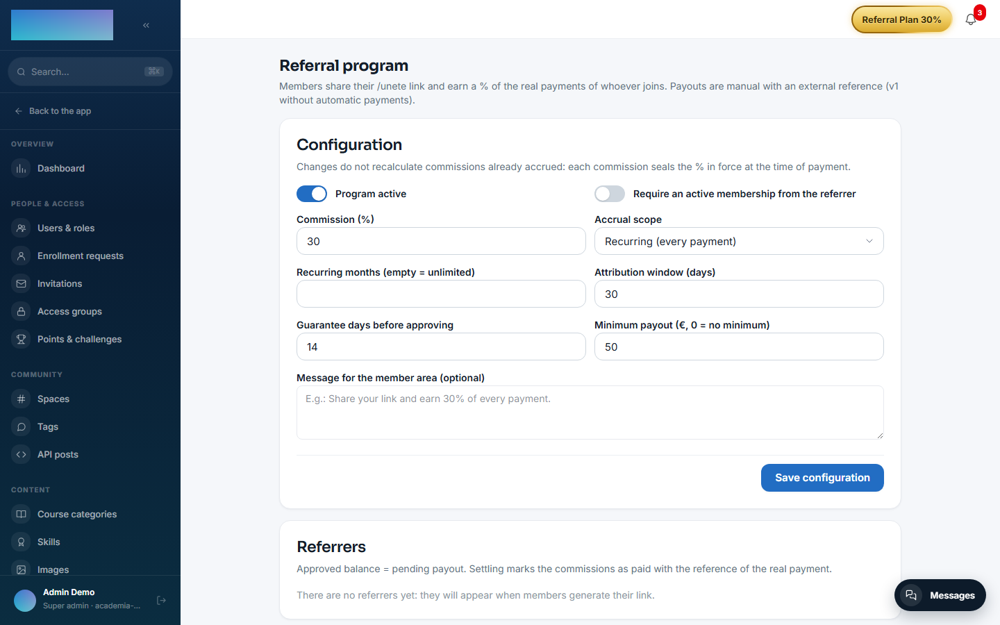
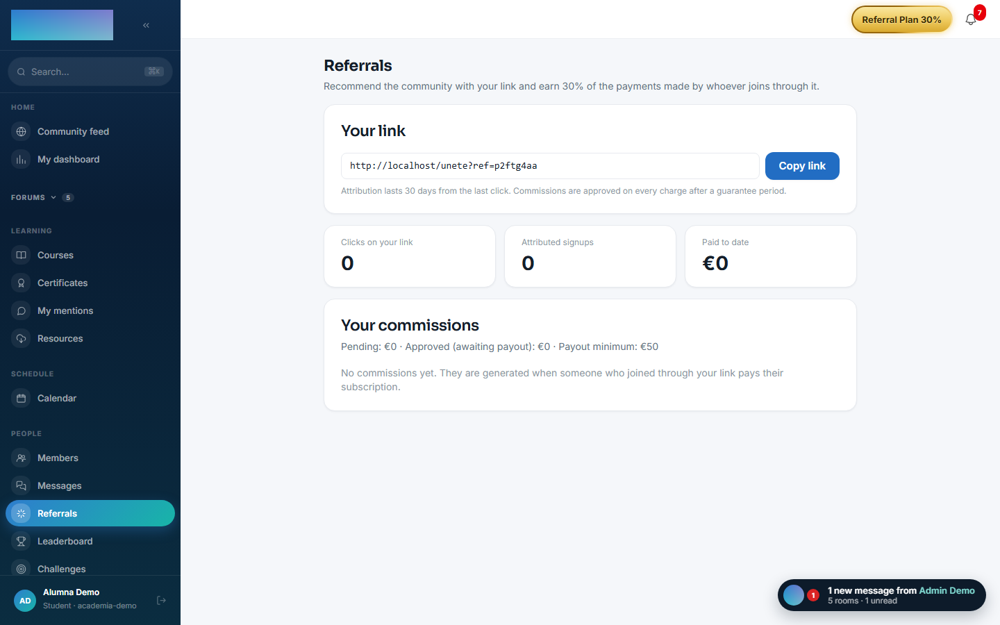
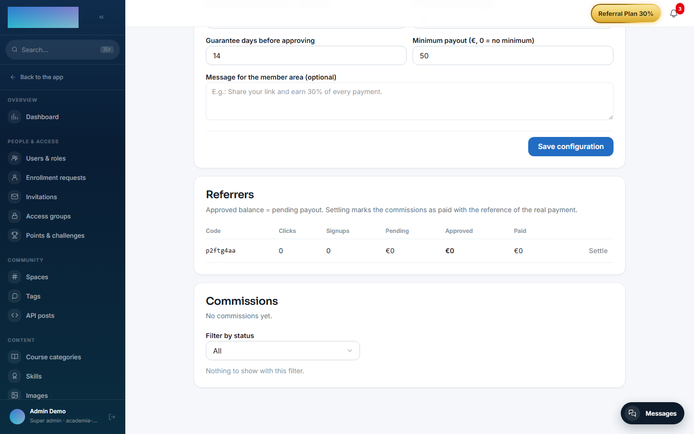

# mod.referrals — Referral program

Community · **Core** category (always active)

## What it does

The membership referral program: every member has their own code and link (`/unete?ref=CODE`) and, if someone arrives through it and **pays**, the referrer earns a percentage of the actual charge. The operator configures everything from the panel without touching code: percentage (`commissionBps`), scope (first payment only, or recurring with a month limit), attribution window, guarantee period, minimum payout and whether the referrer must hold an active membership.

## How it works

The full cycle: click (deduplicated by code + day + **hash of the IP address** — the IP is never stored in the clear) → checkout with the code in Stripe's metadata → **attribution** during webhook fulfillment (idempotent and anti-self-referral) → a `PENDING` commission for every invoice paid within scope → `APPROVED` once the guarantee period elapses (automatic worker) → **manual payout** by the admin with an external reference → `PAID`.

- A refund **automatically revokes** a commission in `PENDING`/`APPROVED`; one already `PAID` is left alone (the operator handles the clawback manually).
- The referrer gets an in-app notification + email when they earn a commission and when a payout is settled (templates editable under Administration → Emails).
- With the program disabled, the public endpoints behave as if it did not exist (404).

## Configuration

The module belongs to the **core** category (always registered), but the **program starts disabled**: until the admin switches it on, the public endpoints return 404 and members see nothing. Nothing requires an Enterprise licence.

Everything is configured per tenant under `/admin/referidos` (**"Referral program"**), card **"Configuration"** — changes do **not** recalculate commissions already accrued (each commission seals the % in force when it was charged):

| Panel field | What it controls (default) |
| --- | --- |
| **"Program active"** | The master switch (off). |
| **"Require an active membership from the referrer"** | Without a live membership (`ACTIVE`/`TRIALING`), no link and no accrual (off). |
| **"Commission (%)"** | Percentage over the actual charge (30%). |
| **"Accrual scope"** | **"Recurring (every payment)"** or **"First payment only"** (recurring). |
| **"Recurring months (empty = unlimited)"** | Time cap of the recurring accrual since attribution (unlimited). |
| **"Attribution window (days)"** | Lifetime of the stored code after a click, last-click (30). |
| **"Guarantee days before approving"** | Time in `PENDING` before automatic approval (14). |
| **"Minimum payout (€, 0 = no minimum)"** | Minimum approved balance to settle (€50). |
| **"Message for the member area (optional)"** | The copy the member sees at `/referidos`. |

Button **"Save configuration"** ("Configuration saved. It only affects future accruals.").

Environment variable (instance): `REFERRALS_APPROVAL_CRON` — cron of the worker approving commissions whose guarantee elapsed (`30 * * * *`, hourly).

Practical requirement: the program only generates commissions if the **membership** ([mod.subscriptions](subscriptions.md)) is selling — attribution travels in the `/unete` checkout.

## Step-by-step usage

1. Enable the program under `/admin/referidos`: switch on **"Program active"**, adjust commission, scope and guarantee → **"Save configuration"**.
2. The member opens `/referidos` (**"Referrals"**): the page generates their code on demand and shows **"Your link"** with the **"Copy link"** button, plus their real results — **"Clicks on your link"**, **"Attributed signups"**, **"Paid to date"** — and the **"Your commissions"** / **"Payouts received"** history. If the program requires a membership and they lack one, the page tells them what is missing.

    

3. The member shares `/unete?ref=THEIRCODE`. The click is recorded (deduplicated by day and hashed IP) and the code is stored in the visitor's browser (last-click, for the attribution window) — it later travels in the membership checkout metadata.
4. When the referred person pays: attribution materialises during webhook fulfillment (first-touch, once per user; self-referral is blocked by user and by email). Every paid invoice with an amount > €0 within scope accrues a `PENDING` commission; €0 trials and 100% coupons accrue nothing.
5. Once the guarantee elapses, the worker approves commissions on its own (`APPROVED`). The admin can also move earlier with **"Approve now"** or withdraw one with **"Revoke"** (reason required, the member will see it) in the **"Commissions"** card, with its status filter.
6. Payout: in the **"Referrers"** card, each referrer's **"Settle"** button asks for the **external reference** of the actual payment (bank transfer, PayPal…) and marks the approved batch as `PAID` — all or nothing, no mixed currencies, and only above the minimum. v1 without Stripe Connect: the money moves outside Didacta.

    

7. A refund of the source charge revokes the commission automatically while it is `PENDING`/`APPROVED`; a `PAID` one is flagged for manual clawback.

## Dependencies

Optional: `mod.subscriptions` (checking that the referrer's membership is live).

## Data model

`mod_referrals_config` (per-tenant policy) · `mod_referrals_code` (one unique code per user) · `mod_referrals_click` (deduplicated clicks) · `mod_referrals_referral` (attribution) · `mod_referrals_commission` (one per Stripe invoice) · `mod_referrals_payout` (payouts).

## API

Prefix `/modules/referrals` (member + public `track` + admin). Details in [Reference → Community and people](../../api/referencia/comunidad.md#referrals-modulesreferrals).

## Events

- **Emits**: `referrals.referral.attributed`, `referrals.commission.created/approved/revoked`, `referrals.payout.recorded`.
- **Consumes** (through a bridge): `subscriptions.membership.activated`, `subscriptions.invoice.paid`, `subscriptions.invoice.refunded`.
