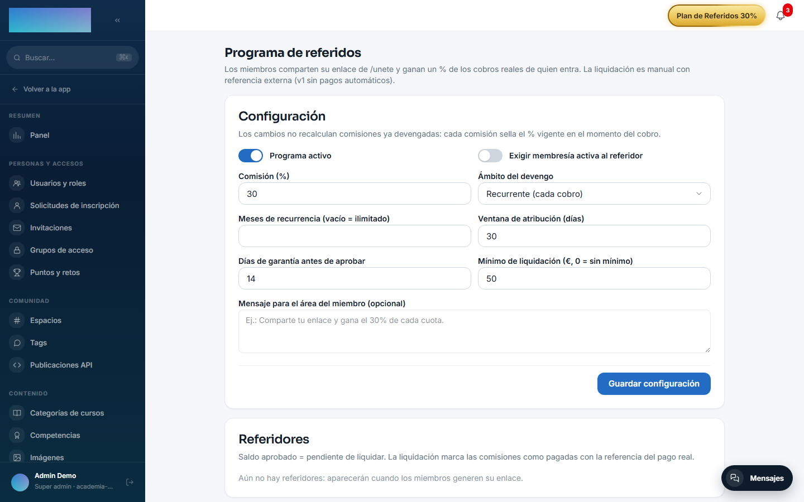
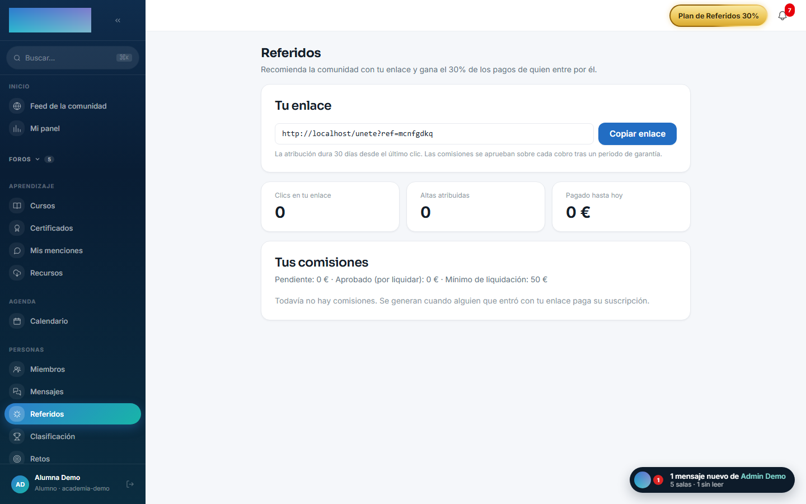
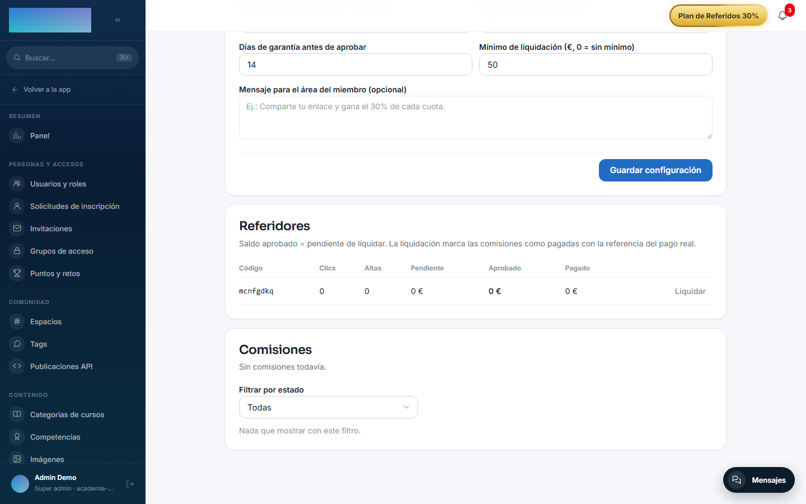

# mod.referrals — Programa de referidos

Community · Categoría **core** (siempre activo)

## Qué hace

Programa de referidos de la membresía: cada miembro tiene un código y enlace propios (`/unete?ref=CODIGO`) y, si alguien entra por él y **paga**, el referidor devenga un porcentaje del cobro real. El operador configura todo desde el panel sin tocar código: porcentaje (`commissionBps`), ámbito (solo primer pago o recurrente con límite de meses), ventana de atribución, periodo de garantía, mínimo de liquidación y si exige membresía activa del referidor.

## Cómo funciona

El ciclo completo: clic (deduplicado por código + día + **hash de la IP** — la IP nunca se guarda en claro) → checkout con el código en la metadata de Stripe → **atribución** en el fulfillment del webhook (idempotente y anti-auto-referido) → comisión `PENDING` por cada factura pagada dentro del ámbito → `APPROVED` al vencer la garantía (worker automático) → **liquidación manual** del admin con referencia externa → `PAID`.

- Un reembolso **revoca automáticamente** la comisión en `PENDING`/`APPROVED`; una ya `PAID` no se toca (clawback manual del operador).
- El referidor recibe notificación in-app + email al ganar comisión y al cobrar liquidación (plantillas editables en Administración → Emails).
- Con el programa desactivado, los endpoints públicos se comportan como si no existiera (404).

## Configuración

El módulo es de categoría **core** (siempre registrado), pero el **programa nace desactivado**: hasta que el admin lo enciende, los endpoints públicos devuelven 404 y los miembros no ven nada. Nada exige licencia Enterprise.

Todo se configura por tenant en `/admin/referidos` (**«Programa de referidos»**), tarjeta **«Configuración»** — los cambios **no** recalculan comisiones ya devengadas (cada comisión sella el % vigente al cobrarse):

| Campo del panel | Qué controla (default) |
| --- | --- |
| **«Programa activo»** | Interruptor general (apagado). |
| **«Exigir membresía activa al referidor»** | Sin membresía viva (`ACTIVE`/`TRIALING`), ni enlace ni devengo (apagado). |
| **«Comisión (%)»** | Porcentaje sobre el cobro real (30 %). |
| **«Ámbito del devengo»** | **«Recurrente (cada cobro)»** o **«Solo el primer cobro»** (recurrente). |
| **«Meses de recurrencia (vacío = ilimitado)»** | Tope temporal del devengo recurrente desde la atribución (ilimitado). |
| **«Ventana de atribución (días)»** | Vida del código guardado tras el clic, last-click (30). |
| **«Días de garantía antes de aprobar»** | Tiempo en `PENDING` antes de la aprobación automática (14). |
| **«Mínimo de liquidación (€, 0 = sin mínimo)»** | Saldo aprobado mínimo para poder liquidar (50 €). |
| **«Mensaje para el área del miembro (opcional)»** | Copy que ve el miembro en `/referidos`. |

Botón **«Guardar configuración»** («Configuración guardada. Solo afecta a devengos futuros.»).

Variable de entorno (instancia): `REFERRALS_APPROVAL_CRON` — cron del worker que aprueba las comisiones con garantía vencida (`30 * * * *`, cada hora).

Requisito práctico: el programa solo genera comisiones si la **membresía** ([mod.subscriptions](subscriptions.md)) está vendiendo — la atribución viaja en el checkout de `/unete`.

## Uso paso a paso

1. Activa el programa en `/admin/referidos`: enciende **«Programa activo»**, ajusta comisión, ámbito y garantía → **«Guardar configuración»**.
2. El miembro entra en `/referidos` (**«Referidos»**): la página genera su código bajo demanda y muestra **«Tu enlace»** con el botón **«Copiar enlace»**, más sus resultados reales — **«Clics en tu enlace»**, **«Altas atribuidas»**, **«Pagado hasta hoy»** — y el historial **«Tus comisiones»** / **«Liquidaciones recibidas»**. Si el programa exige membresía y no la tiene, la página le dice qué falta.

    

3. El miembro comparte `/unete?ref=SUCODIGO`. El clic queda registrado (deduplicado por día e IP hasheada) y el código se guarda en el navegador del visitante (last-click, durante la ventana de atribución) — viaja después en la metadata del checkout de membresía.
4. Cuando el referido paga: la atribución se materializa en el fulfillment del webhook (first-touch, una vez por usuario; el auto-referido se bloquea por usuario y por email). Cada factura pagada con importe > 0 € dentro del ámbito devenga una comisión `PENDING`; el trial a 0 € y los cupones del 100 % no devengan.
5. Al vencer la garantía, el worker aprueba solas las comisiones (`APPROVED`). El admin también puede adelantarlo con **«Aprobar ya»** o retirar una con **«Revocar»** (motivo obligatorio, lo verá el miembro) en la tarjeta **«Comisiones»**, con su filtro por estado.
6. Liquidación: en la tarjeta **«Referidores»**, el botón **«Liquidar»** de cada referidor pide la **referencia externa** del pago real (transferencia, PayPal…) y marca el lote aprobado como `PAID` — todo o nada, sin mezclar monedas, y solo si supera el mínimo. v1 sin Stripe Connect: el dinero se mueve fuera de Didacta.

    

7. Un reembolso del cobro origen revoca la comisión automáticamente si sigue `PENDING`/`APPROVED`; una `PAID` queda señalada para clawback manual.

## Dependencias

Opcional: `mod.subscriptions` (comprobar membresía viva del referidor).

## Modelo de datos

`mod_referrals_config` (política por tenant) · `mod_referrals_code` (código único por usuario) · `mod_referrals_click` (clics deduplicados) · `mod_referrals_referral` (atribución) · `mod_referrals_commission` (única por factura de Stripe) · `mod_referrals_payout` (liquidaciones).

## API

Prefijo `/modules/referrals` (miembro + `track` público + admin). Detalle en [Referencia → Comunidad y personas](../../api/referencia/comunidad.md#referidos-modulesreferrals).

## Eventos

- **Emite**: `referrals.referral.attributed`, `referrals.commission.created/approved/revoked`, `referrals.payout.recorded`.
- **Consume** (vía bridge): `subscriptions.membership.activated`, `subscriptions.invoice.paid`, `subscriptions.invoice.refunded`.
