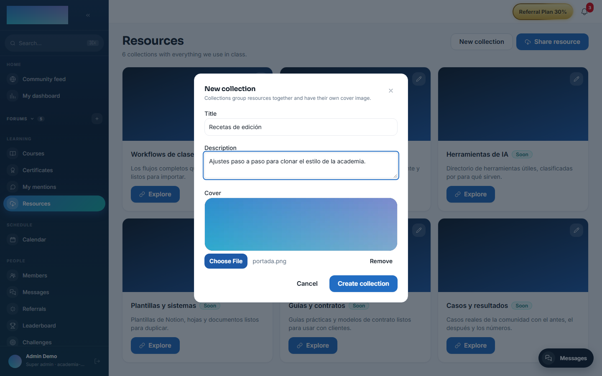
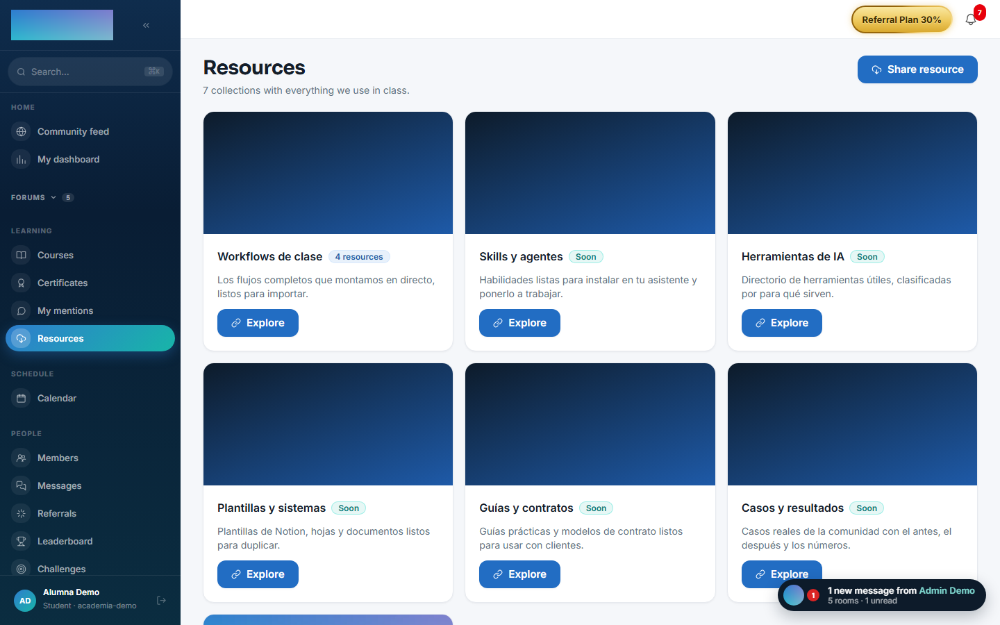
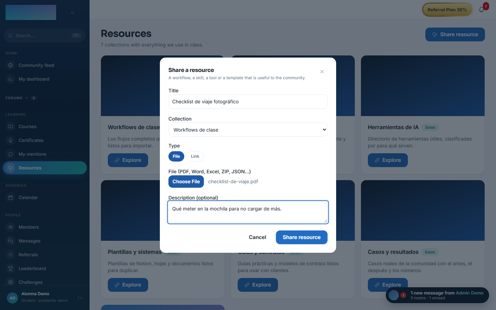
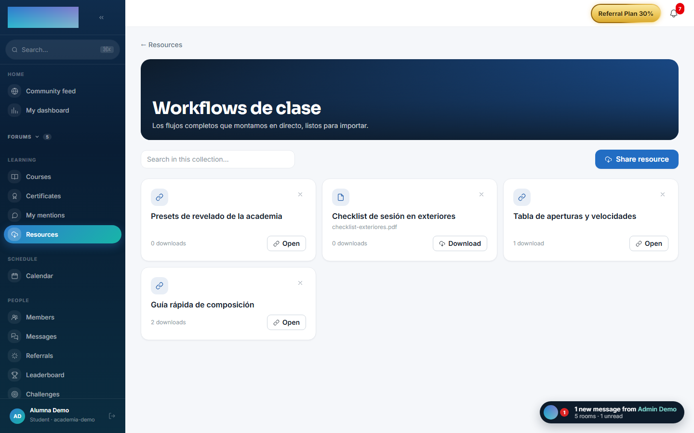

# mod.resources — Resource library

Community · **Engagement** category (can be disabled)

## What it does

A library of community resources, organised into **collections** and searchable: workflows from the classes, skills, an AI tool directory and templates. Each resource is either a file uploaded to the tenant's storage (`FILE`) or an external link (`LINK`), can be tied to the live class that produced it, and carries a download counter.

## How it works

- The first visit seeds **6 default collections**; staff can create more, each with a cover image.
- Any member can **share resources**; deleting is available to the author (for their own) or to staff (for any).
- Deleting a collection that still holds resources is **blocked on purpose** (`Restrict`, not cascade): you have to empty it first — content is never lost silently.
- `POST /:id/download` records the download/open and returns the URL: the counter feeds the popularity ordering.

## Configuration

- **Activation** — `Administration → Settings`, "Modules" tab (`/admin/configuracion`): the toggle for "Biblioteca de recursos" (`mod.resources`). Disabling it removes the "Resources" item from the Learning group of the menu.
- **Collections** — there is no separate admin screen: staff (`super_admin`, `tenant_admin`, `formador`) manage them from the `/recursos` page itself, with "New collection" and the edit button on each card. The first visit seeds 6 collections ("Workflows de clase", "Skills y agentes", "Herramientas de IA", "Plantillas y sistemas", "Guías y contratos", "Casos y resultados"), all editable.
- **Storage** — file resources upload to the tenant's storage, configured on the "Storage" tab of `/admin/configuracion` (the container's local disk or an S3-compatible bucket).
- No environment variables of its own and no further settings. No feature requires an Enterprise license.

## Step-by-step usage

**The staff (admin or instructor):**

1. In `/recursos`, press "New collection": "Title", "Description" and "Cover" (without a cover the brand gradient is used).

    

2. Edit any collection with "Edit collection" (the button on the card); changing the cover or the text does not touch the resources.
3. Staff can delete any resource; a collection can only be deleted once it is empty.

**Any member:**

1. `/recursos` ("Resources", Learning group) shows the grid of collections with their resource counts.

    

2. "Share resource": "Title", "Collection", type "File" (PDF, Word, Excel, ZIP, JSON…) or "Link", and "Description (optional)".

    

3. Inside a collection (`/recursos/<id>`), search with "Search in this collection…" — the search runs on the server, within that collection.
4. "Download" (files) or "Open" (links): every open adds to the download counter shown on the card.

    

5. Every author can delete their own resources with the X on the card (with confirmation).

## Dependencies

None. The reference to the class (`zoomSessionId`) is a logical ID with no foreign key.

## Data model

`mod_resources_collection` (title unique per tenant, ordering, default flag) · `mod_resources_resource` (kind FILE/LINK, URL, author, originating class, downloads).

## API

Prefix `/modules/resources`. Details in [Reference → Community and people](../../api/referencia/comunidad.md#resources-modulesresources).

## Events

**Emits**: `resources.resource.created`, `resources.resource.deleted`, `resources.collection.created` (the first two score points in [gamification](gamification.md)). It consumes none.
