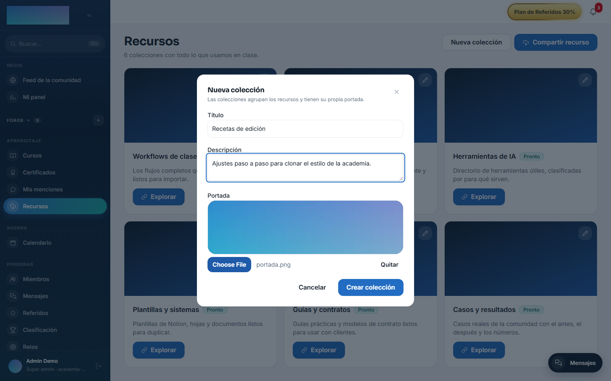
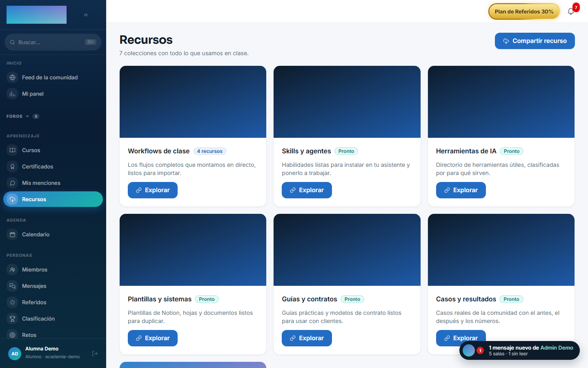
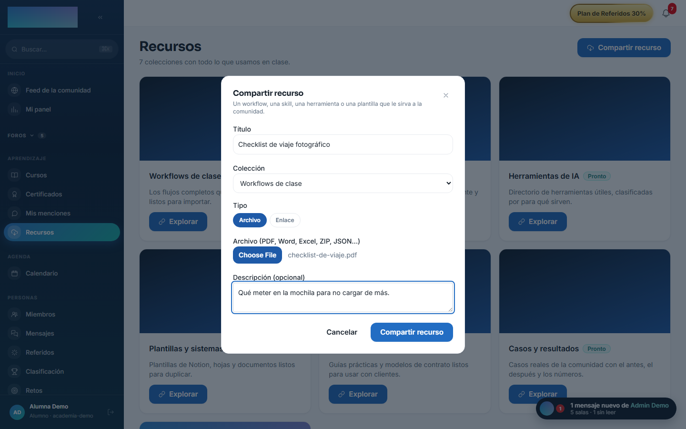
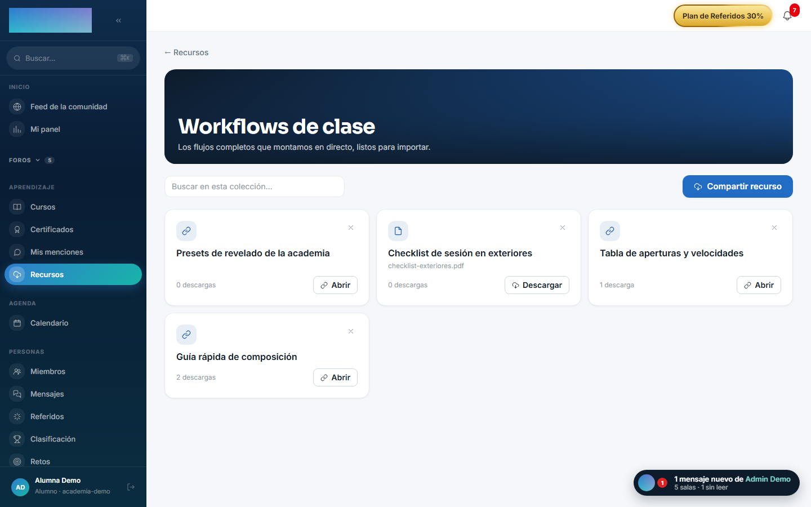

# mod.resources — Biblioteca de recursos

Community · Categoría **engagement** (desactivable)

## Qué hace

Biblioteca de recursos de la comunidad, organizados en **colecciones** y buscables: workflows de las clases, skills, directorio de herramientas de IA y plantillas. Cada recurso es un archivo subido al storage del tenant (`FILE`) o un enlace externo (`LINK`), puede quedar vinculado a la clase en directo que lo generó y lleva contador de descargas.

## Cómo funciona

- La primera visita siembra **6 colecciones por defecto**; el staff puede crear más, con portada.
- Cualquier miembro puede **compartir recursos**; borrar puede el autor (lo suyo) o el staff (cualquiera).
- El borrado de una colección con recursos dentro está **bloqueado a propósito** (`Restrict`, no cascade): hay que vaciarla antes — nunca se pierde contenido en silencio.
- `POST /:id/download` registra la descarga/apertura y devuelve la URL: el contador alimenta la ordenación por popularidad.

## Configuración

- **Activación** — `Administración → Configuración`, pestaña «Módulos» (`/admin/configuracion`): interruptor de «Biblioteca de recursos» (`mod.resources`). Al desactivarlo desaparece el ítem «Recursos» del grupo Aprendizaje del menú.
- **Colecciones** — no hay pantalla de administración aparte: las gestiona el staff (`super_admin`, `tenant_admin`, `formador`) desde la propia página `/recursos`, con «Nueva colección» y el botón de editar de cada tarjeta. La primera visita siembra 6 colecciones («Workflows de clase», «Skills y agentes», «Herramientas de IA», «Plantillas y sistemas», «Guías y contratos», «Casos y resultados»), todas editables.
- **Storage** — los recursos de tipo archivo suben al storage del tenant, que se configura en la pestaña «Storage» de `/admin/configuracion` (disco local del contenedor o bucket S3-compatible).
- Sin variables de entorno propias ni más ajustes. Ninguna función exige licencia Enterprise.

## Uso paso a paso

**El staff (admin o formador):**

1. En `/recursos`, pulsa «Nueva colección»: «Título», «Descripción» y «Portada» (sin portada se usa el degradado de marca).

    

2. Edita cualquier colección con «Editar colección» (el botón de la tarjeta); cambiar la portada o el texto no toca los recursos.
3. Puede borrar cualquier recurso; una colección solo se elimina si está vacía.

**Cualquier miembro:**

1. `/recursos` («Recursos», grupo Aprendizaje) muestra la parrilla de colecciones con su número de recursos.

    

2. «Compartir recurso»: «Título», «Colección», tipo «Archivo» (PDF, Word, Excel, ZIP, JSON…) o «Enlace», y «Descripción (opcional)».

    

3. Dentro de una colección (`/recursos/<id>`), busca con «Buscar en esta colección…» — la búsqueda corre en el servidor, dentro de esa colección.
4. «Descargar» (archivos) o «Abrir» (enlaces): cada apertura suma al contador de descargas que se ve en la tarjeta.

    

5. Cada autor puede eliminar lo suyo con la X de la tarjeta (con confirmación).

## Dependencias

Ninguna. La referencia a la clase (`zoomSessionId`) es un ID lógico sin FK.

## Modelo de datos

`mod_resources_collection` (título único por tenant, orden, flag default) · `mod_resources_resource` (kind FILE/LINK, URL, autor, clase de origen, descargas).

## API

Prefijo `/modules/resources`. Detalle en [Referencia → Comunidad y personas](../../api/referencia/comunidad.md#recursos-modulesresources).

## Eventos

**Emite**: `resources.resource.created`, `resources.resource.deleted`, `resources.collection.created` (los dos primeros puntúan en [gamificación](gamification.md)). No consume.
