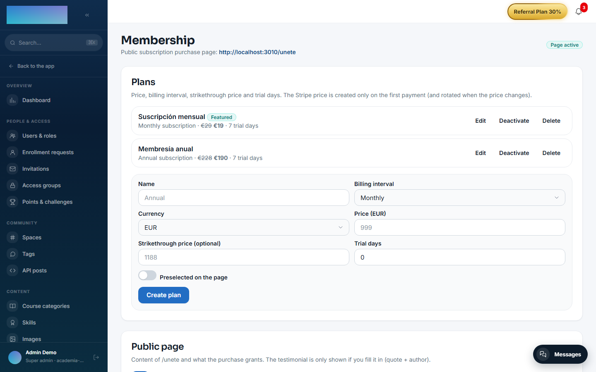

# mod.subscriptions — Recurring subscriptions

Community · **Core** category (always active)

## What it does

Recurring subscriptions with Stripe (`mode=subscription`), with a configurable billing period of 1 to 12 months (monthly, quarterly, semi-annual, annual…): subscriptions to specific courses and, on top of that, the **membership** behind the public `/unete` page, with its own plans (billing period, price, struck-through price, trial days, featured plan) and its landing configuration (headlines, the access group it grants, the lesson limit during the trial, a testimonial).

## How it works

- Stripe webhooks (`customer.subscription.*`, `invoice.*`) update the local state: `PENDING → TRIALING / ACTIVE → PAST_DUE → UNPAID / CANCELED`.
- A configurable **grace period** after a failed payment (3 days by default): if Stripe charges successfully before it expires, the subscription returns to `ACTIVE`; if it expires, it moves to `UNPAID` and **pauses the enrollment** (an hourly cron expires elapsed grace periods). Dunning is handled by Stripe's automatic retries. A trial that never paid gets no grace: if its first charge fails, access is lost immediately.
- Cancellation can be at the end of the period (the default) or immediate (unenrolling right away).
- Host bridges connect it to the rest: activation → enrollment; non-payment → pause; membership activated/revoked → granting/removing the access group.
- The membership checkout is **anonymous** (the visitor pays at `/unete` and the account is materialised with the email confirmed by Stripe) and accepts referral codes, which `mod.referrals` interprets.
- It coexists with `mod.billing` in the same tenant (one-off and subscription courses) without sharing tables.

## Configuration

The module belongs to the **core** category: it is active in every tenant and has no switch of its own. Nothing below requires an Enterprise licence.

### Stripe credentials (per tenant)

The same ones as `mod.billing`: under `/admin/configuracion?tab=pagos` (the **Payments** tab), card **"Payments · Stripe"**. This module adds one field of its own: **"Subscriptions webhook secret (optional)"** — leave it empty to reuse the same secret as the one-off course webhook. With no credentials (neither tenant nor instance) checkout returns 503 — plans, trials and the access group remain editable regardless, as they do not depend on Stripe.

### Webhook to register in Stripe

The card shows the exact URL. For this module (recommended as an endpoint separate from billing's):

- Endpoint: `https://<your-academy-domain>/api/v1/modules/subscriptions/webhook`
- Events to select: `checkout.session.completed`, `customer.subscription.created`, `customer.subscription.updated`, `customer.subscription.deleted`, `invoice.paid`, `invoice.payment_failed`, `charge.refunded`.

!!! danger "`invoice.paid` and `invoice.payment_failed` hold up the whole lifecycle"
    They are not optional, and they are not "just for the history". If they are missing:

    - **There is no cut-off for non-payment.** `invoice.payment_failed` is what marks the subscription past due, starts the grace period and eventually revokes access. Without it, whoever stops paying **keeps the membership indefinitely** and shows as active in the admin panel.
    - **Trials never convert.** Whoever pays at the end of the trial stays stuck with the trial lesson limit.
    - **The student sees no invoices** in their account, however many receipts Stripe has charged.

    None of this raises an error in any log: an event that never arrives is never missed. If in doubt, check it the other way round — take one payment in test mode and confirm the invoice shows up in the student's account.

### Payment methods

Whichever you have enabled in your Stripe dashboard, same as for single-course sales. Stripe automatically filters out anything that doesn't work for recurring charges, so the list a membership buyer sees may be shorter than the one for a single course.

### Membership plans and page

Everything under `/admin/membresia` (**"Membership"**). If Stripe is not configured, the page warns you ("you can prepare plans and the page, but real checkout will fail…").

- **"Plans"** card: fields **"Name"**, **"Billing interval"** (monthly / quarterly / semi-annual / annual / every N months), **"Currency"**, **"Price"**, **"Strikethrough price (optional)"**, **"Trial days"**, toggle **"Preselected on the page"**; button **"Create plan"**. The Stripe Product/Price is created lazily on the first checkout and **rotated** when the amount, currency or period changes (Stripe prices are immutable); renaming the plan renames the Product. A plan with sales is never deleted: it is deactivated.
- **"Public page"** card: toggle **"Purchase page active"**, **"Title"**, **"Subtitle"**, **"Access group it grants"**, **"Show the course catalog on the page"**, **"Lessons visible per course during the trial period"** (0 = no limit), per-course reference prices and an optional testimonial; button **"Save configuration"**.

### Environment variables

| Variable | What it is for |
| --- | --- |
| `STRIPE_SECRET_KEY` | Instance fallback: only if the tenant has not configured its key in the panel. |
| `SUBSCRIPTIONS_WEBHOOK_SECRET` | A dedicated webhook (keeping it separate from billing's is recommended); instance fallback. |
| `SUBSCRIPTIONS_GRACE_PERIOD_DAYS` | Grace period after a failed payment (3). |
| `SUBSCRIPTIONS_GRACE_EXPIRATION_CRON` | Cron expiring elapsed grace periods (`0 * * * *`, hourly UTC). |
| `SUBSCRIPTIONS_SUCCESS_URL_BASE` / `SUBSCRIPTIONS_CANCEL_URL_BASE` | Return URLs for the per-course subscription checkout (default: `/cuenta/suscripciones` on the instance domain, which redirects to `/cuenta?tab=suscripcion`). |

The daily summary and renewal notices (`SUBSCRIPTIONS_DAILY_CRON`, `SUBSCRIPTIONS_DAILY_TZ`, `SUBSCRIPTIONS_RENEWAL_WINDOW_DAYS`) belong to [mod.payment-connections](payment-connections.md), which is the module watching external subscriptions.

Out of scope for the MVP: plan changes with proration, B2B invoicing and pause/resume — cancellation is the only way out.

## Step-by-step usage

1. Configure Stripe under `/admin/configuracion?tab=pagos` and register the subscriptions webhook with the URL and events above.
2. Under `/admin/membresia`, create the plans: **"Name"**, **"Billing interval"**, **"Price"**, **"Trial days"** if you want a trial, and mark one as **"Preselected on the page"** → **"Create plan"**.
3. In the **"Public page"** card, enable **"Purchase page active"**, pick the **"Access group it grants"** (that is what unlocks the courses upon payment) and, if you use a trial, set **"Lessons visible per course during the trial period"** → **"Save configuration"**.
4. Share `/unete`. The visitor picks a plan and clicks **"Continue to secure payment"** ("Payment processed by Stripe · Cancel anytime"; coupons can be applied on the payment screen). On return (`/unete?status=success`) they see "Payment received!" and get the email to **set their password**; the account is created automatically and the access group granted through an event.

5. The student manages their subscription under `/cuenta?tab=suscripcion` (the **"Subscription"** tab): trial and next-charge dates, **"Pay now and activate"** (ends the trial and charges right away), **"Cancel at the end of the period"**, **"Cancel now"** and **"View invoices"** (with a link to the Stripe PDF).

6. Failed payments: nothing to do on your side. Stripe retries the charge; during the grace period the student keeps access (`PAST_DUE`) and, if the grace elapses unpaid, the enrollment is paused (`UNPAID`) until a later charge reactivates it.
7. The **per-course** subscription (besides the membership) exists today only through the API: `POST /modules/subscriptions/checkout/<courseId>` with a recurring Stripe price — the web app has no button for it.

## Dependencies

Hard: `mod.learning`, `mod.courses`.

## Data model

`mod_subscriptions_subscription` (one live subscription per user and course) · `mod_subscriptions_plan` (membership plans + Stripe IDs) · `mod_subscriptions_membership_config` (the copy and rules of `/unete`) · `mod_subscriptions_invoice` · `mod_subscriptions_webhook_event` (idempotent log).

## API

Prefixes `/modules/subscriptions` (student + webhook) and `/membership` (public + admin). Details in [Reference → Payments](../../api/referencia/pagos-directo-ia.md#subscriptions-modulessubscriptions) and [Reference → Community](../../api/referencia/comunidad.md#membership-membership).

## Events

**Emits**: `subscriptions.subscription.created/activated/past_due/unpaid/canceled`, `subscriptions.invoice.paid/payment_failed/refunded`, `subscriptions.membership.activated/revoked`. It consumes none.
