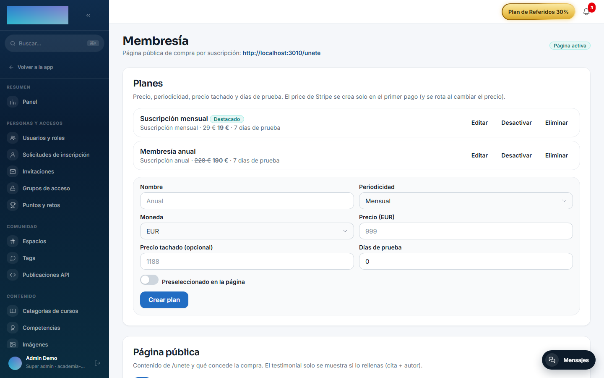

# mod.subscriptions — Suscripciones recurrentes

Community · Categoría **core** (siempre activo)

## Qué hace

Suscripciones recurrentes con Stripe (`mode=subscription`), con periodicidad configurable de 1 a 12 meses (mensual, trimestral, semestral, anual…): suscripción a cursos concretos y, sobre esa base, la **membresía** de la página pública `/unete`, con planes propios (periodicidad, precio, precio tachado, días de trial, plan destacado) y su configuración de landing (titulares, grupo de acceso que concede, límite de lecciones en trial, testimonial).

## Cómo funciona

- Los webhooks de Stripe (`customer.subscription.*`, `invoice.*`) actualizan el estado local: `PENDING → TRIALING / ACTIVE → PAST_DUE → UNPAID / CANCELED`.
- **Periodo de gracia** configurable tras un impago (3 días por defecto): si Stripe cobra antes de expirar, vuelve a `ACTIVE`; si expira, pasa a `UNPAID` y **pausa la matrícula** (un cron horario expira las gracias vencidas). El dunning lo hacen los reintentos automáticos de Stripe. Un trial que nunca pagó no tiene gracia: si su primer cobro falla, pierde el acceso al momento.
- La cancelación puede ser al final del periodo (default) o inmediata (desenrola al momento).
- Bridges del host conectan con el resto: activación → matrícula; impago → pausa; membresía activada/revocada → concesión/retirada del grupo de acceso.
- El checkout de membresía es **anónimo** (el visitante paga en `/unete` y la cuenta se materializa con el email confirmado por Stripe) y acepta códigos de referido, que interpreta `mod.referrals`.
- Convive con `mod.billing` en el mismo tenant (cursos one-shot y por suscripción) sin compartir tablas.

## Configuración

El módulo es de categoría **core**: viene activo en todos los tenants y no tiene interruptor propio. Nada de lo que sigue exige licencia Enterprise.

### Credenciales de Stripe (por tenant)

Las mismas de `mod.billing`: en `/admin/configuracion?tab=pagos` (pestaña **Pagos**), tarjeta **«Pagos · Stripe»**. Este módulo añade un campo propio: **«Secreto del webhook de suscripciones (opcional)»** — si lo dejas vacío se usa el mismo secreto que el webhook de cursos sueltos. Sin credenciales (ni de tenant ni de instancia) el checkout responde 503 — planes, trial y grupo de acceso siguen editables igualmente, no dependen de Stripe.

### Webhook a dar de alta en Stripe

La tarjeta muestra la URL exacta. Para este módulo (recomendado como endpoint separado del de billing):

- Endpoint: `https://<dominio-de-tu-academia>/api/v1/modules/subscriptions/webhook`
- Eventos a seleccionar: `customer.subscription.created`, `customer.subscription.updated`, `customer.subscription.deleted`, `invoice.paid`, `invoice.payment_failed`, `charge.refunded`.

### Planes y página de membresía

Todo en `/admin/membresia` (**«Membresía»**). Si Stripe no está configurado, la página lo avisa («puedes preparar planes y página, pero el checkout real fallará…»).

- Tarjeta **«Planes»**: campos **«Nombre»**, **«Periodicidad»** (Mensual / Trimestral / Semestral / Anual / cada N meses), **«Moneda»**, **«Precio»**, **«Precio tachado (opcional)»**, **«Días de prueba»**, interruptor **«Preseleccionado en la página»**; botón **«Crear plan»**. El Product/Price de Stripe se crea perezosamente en el primer checkout y se **rota** al cambiar importe, moneda o periodicidad (los prices de Stripe son inmutables); renombrar el plan renombra el Product. Un plan con ventas no se borra: se desactiva.
- Tarjeta **«Página pública»**: interruptor **«Página de compra activa»**, **«Título»**, **«Subtítulo»**, **«Grupo de acceso que concede»**, **«Mostrar el catálogo de cursos en la página»**, **«Clases visibles por curso durante el periodo de prueba»** (0 = sin límite), precios individuales de referencia por curso y testimonial opcional; botón **«Guardar configuración»**.

### Variables de entorno

| Variable | Para qué |
| --- | --- |
| `STRIPE_SECRET_KEY` | Fallback de instancia: solo si el tenant no configuró su clave en el panel. |
| `SUBSCRIPTIONS_WEBHOOK_SECRET` | Webhook dedicado (recomendado separarlo del de billing); fallback de instancia. |
| `SUBSCRIPTIONS_GRACE_PERIOD_DAYS` | Gracia tras impago (3). |
| `SUBSCRIPTIONS_GRACE_EXPIRATION_CRON` | Cron que expira las gracias vencidas (`0 * * * *`, cada hora UTC). |
| `SUBSCRIPTIONS_SUCCESS_URL_BASE` / `SUBSCRIPTIONS_CANCEL_URL_BASE` | Retorno del checkout de suscripción por curso (default: `/cuenta/suscripciones` del dominio de la instancia, que redirige a `/cuenta?tab=suscripcion`). |

El resumen diario y los avisos de renovación (`SUBSCRIPTIONS_DAILY_CRON`, `SUBSCRIPTIONS_DAILY_TZ`, `SUBSCRIPTIONS_RENEWAL_WINDOW_DAYS`) pertenecen a [mod.payment-connections](payment-connections.md), que es quien vigila las suscripciones externas.

Fuera del MVP: cambio de plan con prorrateo, facturación B2B y pause/resume — la cancelación es la única salida.

## Uso paso a paso

1. Configura Stripe en `/admin/configuracion?tab=pagos` y da de alta el webhook de suscripciones con la URL y los eventos de arriba.
2. En `/admin/membresia`, crea los planes: **«Nombre»**, **«Periodicidad»**, **«Precio»**, **«Días de prueba»** si quieres trial, y marca uno como **«Preseleccionado en la página»** → **«Crear plan»**.
3. En la tarjeta **«Página pública»**, activa **«Página de compra activa»**, elige el **«Grupo de acceso que concede»** (es lo que desbloquea los cursos al pagar) y, si usas trial, fija **«Clases visibles por curso durante el periodo de prueba»** → **«Guardar configuración»**.
4. Comparte `/unete`. El visitante elige plan y pulsa **«Continuar al pago seguro»** («Pago procesado por Stripe · Cancela cuando quieras»; admite cupones en la pantalla de pago). Al volver (`/unete?status=success`) ve «¡Pago recibido!» y recibe el email para **definir su contraseña**; la cuenta se crea sola y el grupo de acceso se concede vía evento.

5. El alumno gestiona su suscripción en `/cuenta?tab=suscripcion` (pestaña **«Suscripción»**): fechas de prueba y próximo cobro, **«Pagar ahora y activar»** (termina el trial y cobra ya), **«Cancelar al final del periodo»**, **«Cancelar ahora»** y **«Ver facturas»** (con enlace al PDF de Stripe).

6. Impagos: no tienes que hacer nada. Stripe reintenta el cobro; durante la gracia el alumno conserva el acceso (`PAST_DUE`) y, si la gracia vence sin pago, la matrícula se pausa (`UNPAID`) hasta que un cobro posterior la reactive.
7. La suscripción **por curso** (además de la membresía) existe hoy solo por API: `POST /modules/subscriptions/checkout/<courseId>` con un price recurrente de Stripe — la web no tiene botón para ella.

## Dependencias

Duras: `mod.learning`, `mod.courses`.

## Modelo de datos

`mod_subscriptions_subscription` (una viva por usuario y curso) · `mod_subscriptions_plan` (planes de membresía + IDs de Stripe) · `mod_subscriptions_membership_config` (copy y reglas de `/unete`) · `mod_subscriptions_invoice` · `mod_subscriptions_webhook_event` (log idempotente).

## API

Prefijos `/modules/subscriptions` (alumno + webhook) y `/membership` (público + admin). Detalle en [Referencia → Pagos](../../api/referencia/pagos-directo-ia.md#suscripciones-modulessubscriptions) y [Referencia → Comunidad](../../api/referencia/comunidad.md#membresia-membership).

## Eventos

**Emite**: `subscriptions.subscription.created/activated/past_due/unpaid/canceled`, `subscriptions.invoice.paid/payment_failed/refunded`, `subscriptions.membership.activated/revoked`. No consume.
