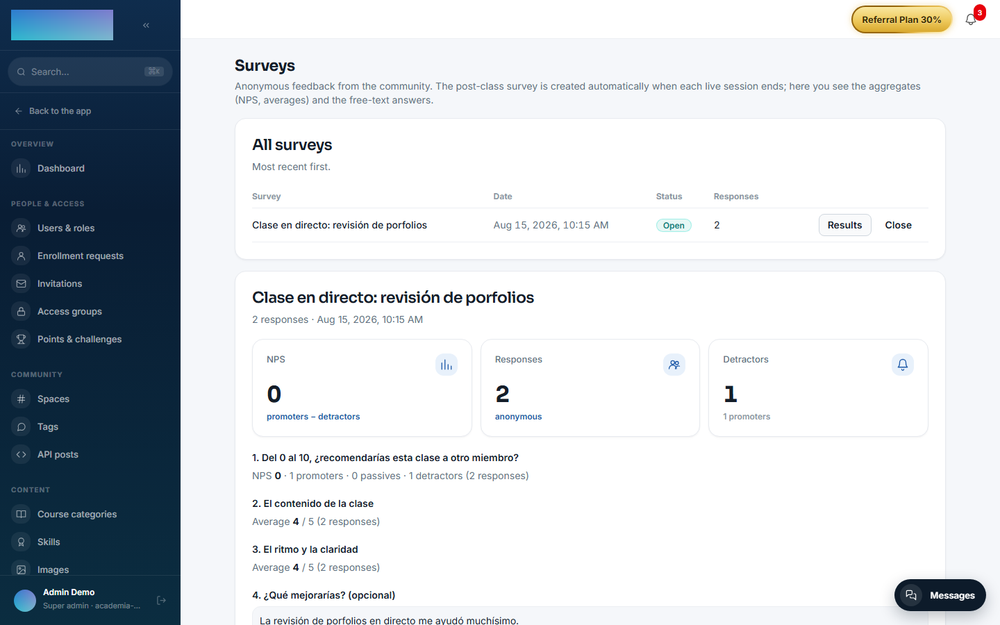
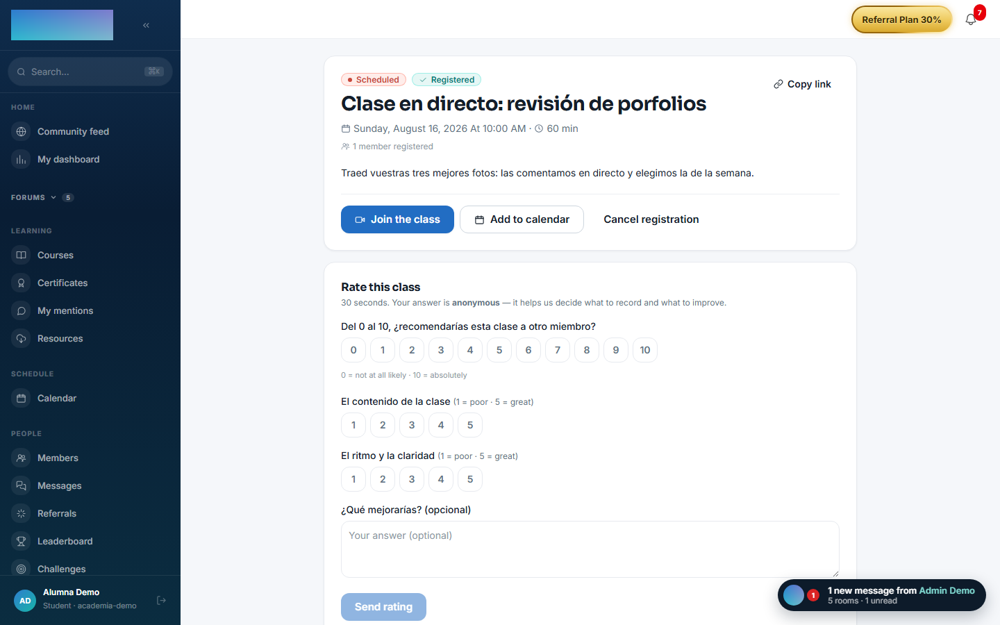

# mod.surveys — Surveys and NPS

Community · **Engagement** category (can be disabled)

## What it does

**Anonymous** community surveys. The main use case: at the end of every live class (`zoom.session.ended`) the post-class survey is created automatically (NPS + rating), the registered attendees are notified and the admin sees the **aggregate results** (NPS, averages, free-text answers). It includes a reminder worker for anyone who has not answered after 24 h.

## How it works

- Anonymity is **structural**: the response stores no `userId`, only a `respondentHash` = HMAC(survey:user) with a server-side secret — enough to deduplicate (one response per person) without being able to identify the author.
- One survey per Zoom session and one reminder per survey (guaranteed with unique constraints in the database).
- The admin can create a class's survey without waiting for the webhook, close surveys (they stop accepting responses with a 409) and force the reminder sweep.
- The model also covers course-completion and general tenant surveys (`POST_COURSE`, `GENERAL`), which have no automatic trigger yet.

## Configuration

**Enabling or disabling the module.** Under `/admin/configuracion?tab=modules` (the "Modules" tab of Settings), with the "Enable …" / "Disable …" buttons on the module's row. With the module enabled, the **"Surveys"** entry appears in the Content group of the admin panel; with it disabled, the student panel simply does not render.

**Per-tenant settings.** There are none: neither the post-class survey nor its questions can be edited from the panel (the 4 questions are fixed on purpose, so results are comparable across classes and over time).

**Email templates.** The module's two emails — the invitation when the survey is created and the 24 h reminder — use the `surveys.post_class.invitation` and `surveys.post_class.reminder` templates, customizable under `/admin/emails`. Both notices also go out through the in-app channel.

**Environment variables** (installation-wide, not per tenant):

| Variable | Effect | Default |
| --- | --- | --- |
| `SURVEYS_HASH_SECRET` | Secret for the `respondentHash` HMAC. At least 16 characters and **stable across deploys**: changing it breaks the "already answered" dedupe. | Falls back to `AUTH_SECRET` |
| `SURVEYS_REMINDER_CRON` | Frequency of the reminder sweep (cron, UTC). | `*/15 * * * *` |
| `SURVEYS_REMINDER_DELAY_HOURS` | Hours without answering after which the reminder is sent. | `24` |

The reminder worker needs `REDIS_URL` (without Redis it does not start, with a log warning) and uses `WEB_PUBLIC_URL` for the link to the class. It only reminds about surveys up to 72 h old (a fixed product cap: a late deploy does not spam old surveys).

**License.** Nothing in this module requires an Enterprise license.

## Step by step

**As an admin**

1. Enable `mod.surveys` (with `mod.zoom-live` enabled if you want the automatic post-class survey).
2. There is nothing to create: when each live class ends, the survey is created on its own with its 4 fixed questions — NPS 0-10 ("From 0 to 10, would you recommend this class to another member?"), two 1-5 scales ("The class content", "Pace and clarity") and an optional free-text one ("What would you improve? (optional)"). Registered attendees get the in-app notice and an email with the link to the class page.
3. Open **"Surveys"** (`/admin/encuestas`): a table with the columns "Survey", "Date", "Status" ("Open"/"Closed") and "Responses", most recent first.

4. Click **"Results"** on a row: you will see the NPS (promoters 9-10 minus detractors 0-6, in points), the average of each scale question and the free-text answers with no author.

    

5. Click **"Close"** when you want to stop accepting responses (later submissions get a 409).
6. Two actions have no button and are API-only: creating a session's survey without waiting for the webhook (`POST /modules/surveys/admin/sessions/:sessionId`) and forcing the reminder sweep (`POST /modules/surveys/admin/reminders/run`).

**As a student**

1. Go to the class page (`/clase/[id]`). If the class has an open survey and you have not answered it yet, the **"Rate this class"** card appears at the bottom, with the note that your answer is anonymous.

    

2. Answer by tapping the 0-10 (NPS) and 1-5 buttons (scale "(1 = poor · 5 = great)"); the free text is optional. The **"Send rating"** button only activates once every scored question is answered.
3. After sending you will see "Thanks for your feedback! We'll take it into account for upcoming classes.". Only one submission per person is accepted; a second attempt (another tab, a double click) lands on the same thank-you state.
4. If you have not answered after 24 h, you will get a single reminder with the link to the class.

## Dependencies

Optional: `mod.zoom-live` (reading the registered attendees in order to notify them when the post-class survey is created).

## Data model

`mod_surveys_survey` (type, OPEN/CLOSED status, reminder flag) · `_question` (typed and positioned) · `_response` (anonymous, `respondentHash` only) · `_answer` (numeric or text value).

## API

Prefix `/modules/surveys` (student + admin). Details in [Reference → Community and people](../../api/referencia/comunidad.md#surveys-modulessurveys-anonymous-responses).

## Events

- **Emits**: `surveys.survey.created`, `surveys.response.submitted`.
- **Consumes**: `zoom.session.ended` (creates the post-class survey).
