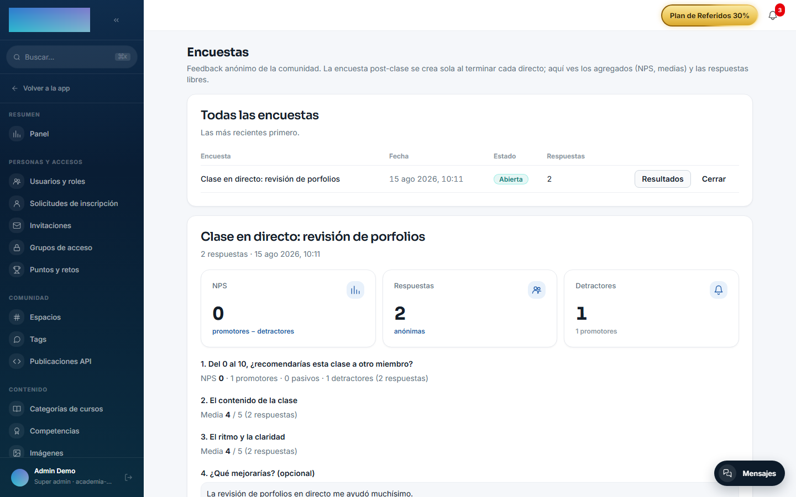
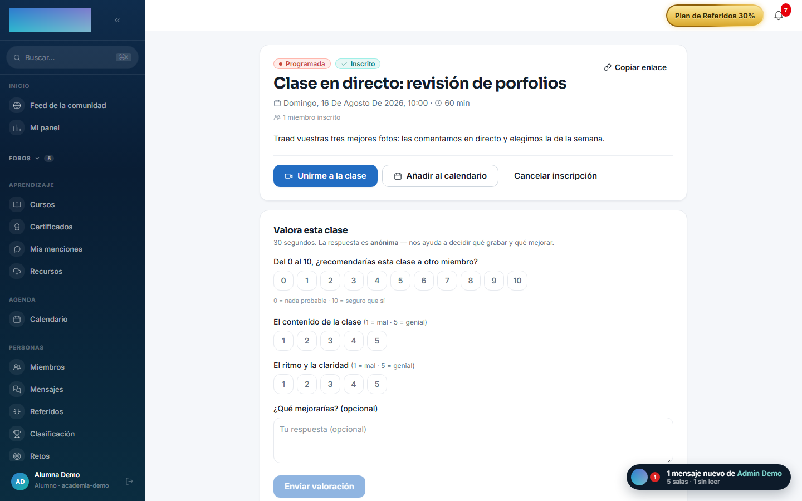

# mod.surveys — Encuestas y NPS

Community · Categoría **engagement** (desactivable)

## Qué hace

Encuestas **anónimas** de la comunidad. El caso principal: al terminar cada clase en directo (`zoom.session.ended`) se crea automáticamente la encuesta post-clase (NPS + valoración), se avisa a los inscritos y el admin ve los **resultados agregados** (NPS, medias, respuestas de texto). Incluye un worker de recordatorio a quienes no han respondido tras 24 h.

## Cómo funciona

- El anonimato es **estructural**: la respuesta no guarda `userId`, solo un `respondentHash` = HMAC(encuesta:usuario) con secreto del servidor — permite deduplicar (una respuesta por persona) sin poder identificar al autor.
- Una única encuesta por sesión de Zoom y un único recordatorio por encuesta (garantizado con uniques en BD).
- El admin puede crear la encuesta de una clase sin esperar al webhook, cerrar encuestas (dejan de aceptar respuestas con 409) y forzar el barrido de recordatorios.
- El modelo contempla también encuestas al completar curso y generales del tenant (`POST_COURSE`, `GENERAL`), aún sin disparador automático.

## Configuración

**Activar o desactivar el módulo.** En `/admin/configuracion?tab=modules` (pestaña «Módulos» de Configuración), con los botones «Activar …» / «Desactivar …» de la fila del módulo. Con el módulo activo aparece la entrada **«Encuestas»** en el grupo Contenido del panel admin; con el módulo inactivo, el panel del alumno simplemente no se renderiza.

**Ajustes por tenant.** No hay: ni la encuesta post-clase ni sus preguntas se editan desde el panel (las 4 preguntas son fijas a propósito, para que los resultados sean comparables entre clases y en el tiempo).

**Plantillas de correo.** Los dos correos del módulo — invitación al crearse la encuesta y recordatorio a las 24 h — usan las plantillas `surveys.post_class.invitation` y `surveys.post_class.reminder`, personalizables en `/admin/emails`. Ambos avisos salen también por el canal in-app.

**Variables de entorno** (de la instalación, no por tenant):

| Variable | Efecto | Default |
| --- | --- | --- |
| `SURVEYS_HASH_SECRET` | Secreto del HMAC de `respondentHash`. Mínimo 16 caracteres y **estable entre deploys**: cambiarlo rompe el dedupe de «ya respondió». | Cae a `AUTH_SECRET` |
| `SURVEYS_REMINDER_CRON` | Frecuencia del barrido de recordatorios (cron, UTC). | `*/15 * * * *` |
| `SURVEYS_REMINDER_DELAY_HOURS` | Horas sin responder tras las que se envía el recordatorio. | `24` |

El worker de recordatorios necesita `REDIS_URL` (sin Redis no arranca, con aviso en el log) y usa `WEB_PUBLIC_URL` para el enlace a la clase. Solo recuerda encuestas con ≤ 72 h de antigüedad (tope fijo del producto: un deploy tardío no bombardea encuestas viejas).

**Licencia.** Nada del módulo exige licencia Enterprise.

## Uso paso a paso

**Como admin**

1. Activa `mod.surveys` (con `mod.zoom-live` activo si quieres la encuesta post-clase automática).
2. No hay nada que crear: al terminar cada clase en directo, la encuesta se crea sola con sus 4 preguntas fijas — NPS 0-10 («Del 0 al 10, ¿recomendarías esta clase a otro miembro?»), dos escalas 1-5 («El contenido de la clase», «El ritmo y la claridad») y un texto opcional («¿Qué mejorarías? (opcional)»). Los inscritos reciben el aviso in-app y por correo con el enlace a la página de la clase.
3. Abre **«Encuestas»** (`/admin/encuestas`): tabla con columnas «Encuesta», «Fecha», «Estado» («Abierta»/«Cerrada») y «Respuestas», las más recientes primero.

4. Pulsa **«Resultados»** en una fila: verás el NPS (promotores 9-10 menos detractores 0-6, en puntos), la media de cada pregunta de escala y las respuestas libres sin autor.

    

5. Pulsa **«Cerrar»** cuando quieras dejar de aceptar respuestas (los envíos posteriores reciben 409).
6. Dos acciones no tienen botón y son solo API: crear la encuesta de una sesión sin esperar al webhook (`POST /modules/surveys/admin/sessions/:sessionId`) y forzar el barrido de recordatorios (`POST /modules/surveys/admin/reminders/run`).

**Como alumno**

1. Entra en la página de la clase (`/clase/[id]`). Si la clase tiene encuesta abierta y aún no la respondiste, al final aparece la tarjeta **«Valora esta clase»**, con la nota de que la respuesta es anónima.

    

2. Responde tocando los botones 0-10 (NPS) y 1-5 (escala «1 = mal · 5 = genial»); el texto es opcional. El botón **«Enviar valoración»** solo se activa con todas las preguntas puntuables respondidas.
3. Tras enviar verás «¡Gracias por tu respuesta! La tenemos en cuenta para las próximas clases.». Solo se acepta un envío por persona; un segundo intento (otra pestaña, doble clic) termina en el mismo agradecimiento.
4. Si a las 24 h no respondiste, recibirás un único recordatorio con el enlace a la clase.

## Dependencias

Opcional: `mod.zoom-live` (lectura de inscritos para avisar al crear la encuesta post-clase).

## Modelo de datos

`mod_surveys_survey` (tipo, estado OPEN/CLOSED, marca de recordatorio) · `_question` (tipada y posicionada) · `_response` (anónima, solo `respondentHash`) · `_answer` (valor numérico o texto).

## API

Prefijo `/modules/surveys` (alumno + admin). Detalle en [Referencia → Comunidad y personas](../../api/referencia/comunidad.md#encuestas-modulessurveys-respuestas-anonimas).

## Eventos

- **Emite**: `surveys.survey.created`, `surveys.response.submitted`.
- **Consume**: `zoom.session.ended` (crea la encuesta post-clase).
