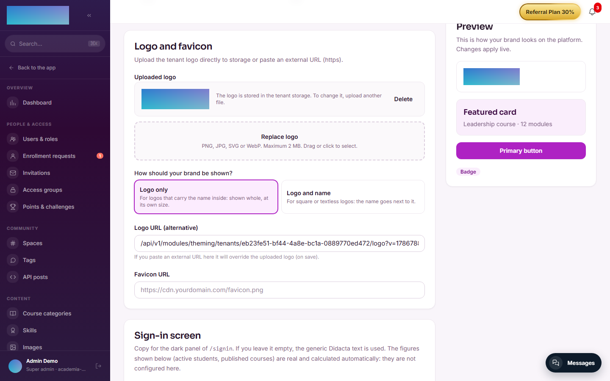
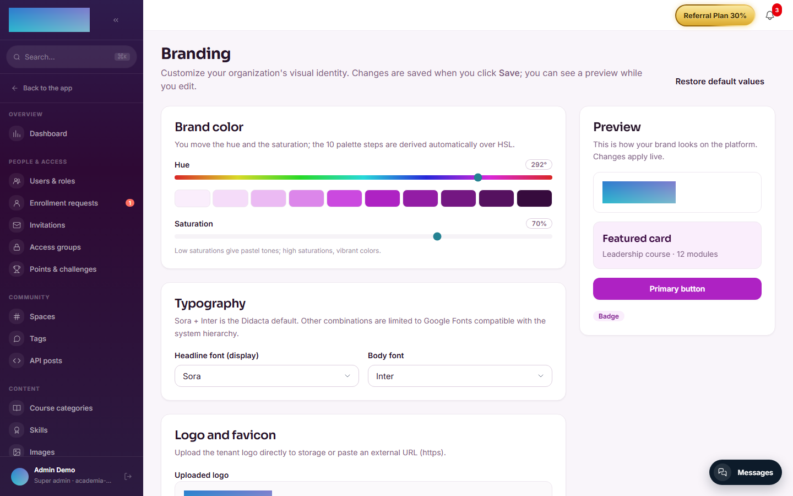
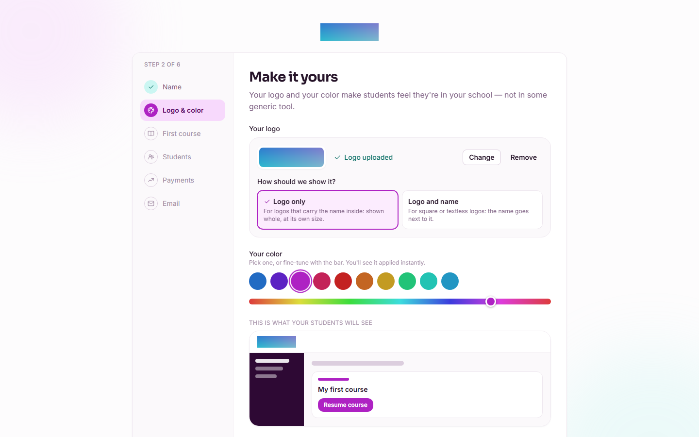
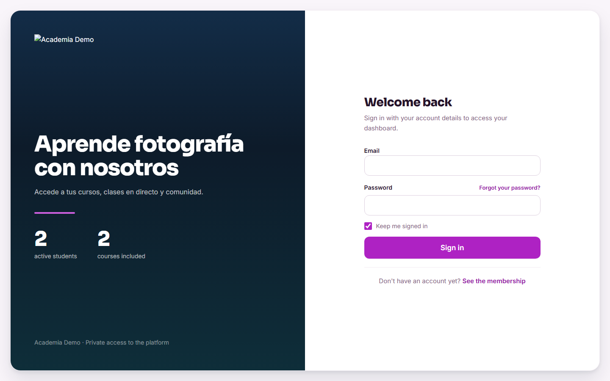

# mod.theming — Visual customization

Community · **Core** category (always active)

## What it does

Visual branding **per organization**: logo (uploaded to storage or a URL), brand display mode (logo only / logo and name), favicon, primary color expressed as an **HSL hue + saturation**, display and body font families, sanitised custom CSS, footer HTML and the headlines on the sign-in screens.

## How it works

- The theme is loaded **server-side** in the web app's root layout and injects CSS variables that override the base design tokens: changing the hue propagates automatically to all 10 steps of the brand scale (`brand-50…900`) — there is no need to touch tokens one by one.
- Fonts are restricted to a **whitelist** of Google Fonts (Sora, Inter, Manrope, Space Grotesk, DM Sans, Plus Jakarta Sans…).
- Custom CSS is **sanitised** and capped at 16 KB; the footer HTML accepts only basic tags.
- The logo is served through a **public** endpoint (necessary on `/signin`, before authentication) with a 5-minute cache.
- The defaults are the Didacta identity (hue 213, saturation 70, Sora + Inter); `reset` returns to them.

!!! note "Which part is Enterprise"
    Basic branding (logo, colors, fonts, headlines) is **Community**. Only `customCss` and `footerHtml` with actual content require the `feat:white_label` capability (saving a logo and colors without a license always works). Hiding the Didacta brand is also white-label.

## Configuration

This is a **core** module: always active, it does not appear in the Modules tab switch. Everything is configured in **Admin → Branding** (`/admin/branding`), for `tenant_admin` and `super_admin` only, with a live **Preview** and a **Restore default values** button:

- **Brand color**: **Hue** (0–360) and **Saturation** (0–100) sliders, with the resulting `brand-50…900` scale in view.
- **Typography**: **Headline font (display)** and **Body font**, each with its whitelist.
- **Logo and favicon**: **Upload logo to storage** (PNG, JPG, SVG or WebP, 2 MB max; with **Replace logo** and **Delete**), or a **Logo URL (alternative)** (`https://…` or a relative `/api/v1/…` endpoint), plus a **Favicon URL**.
- **How should your brand be shown?** — the logo mode (`logo_display_mode`, added in alpha.113): **Logo only** (`logo_only`, shown whole at its own size; for logos that carry the name inside) or **Logo and name** (`logo_and_name`; for square or textless marks). The choice drives the classroom sidebar, `/signin` and the welcome assistant.

    

- **Sign-in screen**: **Headline** (160 characters max) and **Supporting line (optional)** (240 max) for the `/signin` brand panel.
- **Custom CSS (advanced)** (16 KB max) and **Custom footer** (4 KB max): they require the Enterprise `feat:white_label` capability. Without a license an upgrade card is shown in their place, and the backend answers `402` to any attempt to save them with content — sending the fields empty or as `null` is always allowed.

The **Logo & color** step of the welcome assistant (`/bienvenida`) configures the same things in a minimal version: upload the logo (applied instantly), pick **How should we show it?** (**Logo only** / **Logo and name**) and the color from 10 swatches + a fine-tune bar; color and mode are saved on continuing. It is one of the assistant's two mandatory steps (together with "Name").

No environment variables.

## Step by step

1. Go to **Admin → Branding** (`/admin/branding`). The panel loads the tenant's current theme.
2. Move **Hue** and **Saturation**: the **Preview** column and the brand scale reflect the change instantly, without affecting other users yet.
3. Upload your logo with **Upload logo to storage** (or paste a **Logo URL (alternative)**) and choose between **Logo only** and **Logo and name** under **How should your brand be shown?**.
4. Adjust the fonts and, if you want, the sign-in screen's **Headline** and **Supporting line (optional)**.
5. Click **Save changes**: the theme is persisted and applied to the whole organization (other users see it on reload, because it is injected server-side).

    

6. (Enterprise) With a `feat:white_label` license, add **Custom CSS (advanced)** and a **Custom footer**.
7. **Restore default values** goes back to the Didacta identity in one click (it asks for confirmation).

For a brand-new academy, the `/bienvenida` assistant walks you through the same without entering the panel:

The result shows where your students see it first, the sign-in screen:

## Dependencies

None.

## Data model

`mod_theming_tenant_theme` — a single row per tenant holding all the branding.

## API

Prefix `/modules/theming` (`me`, `me/reset`, `me/logo`, public logo). Details in [Reference → Community and people](../../api/referencia/comunidad.md#theming-modulestheming).

## Events

**Emits**: `theming.logo.uploaded`. It consumes none.
