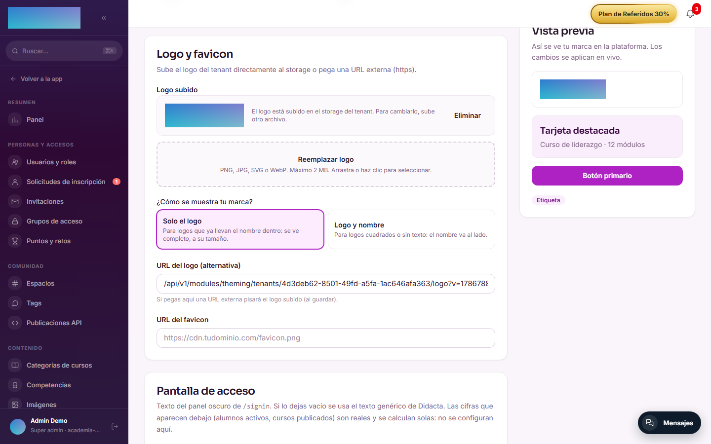
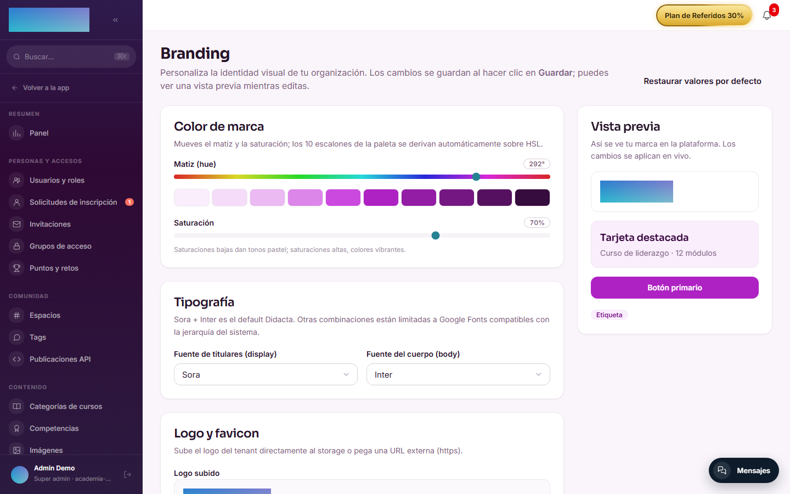
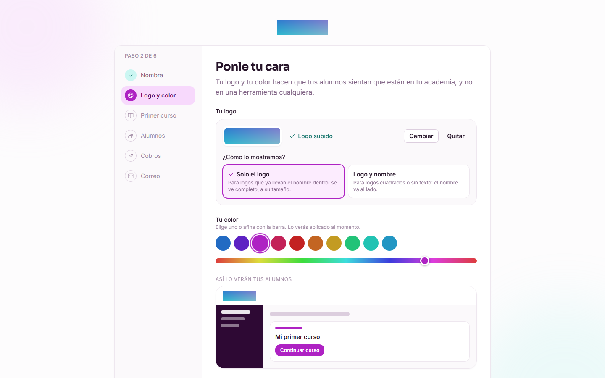
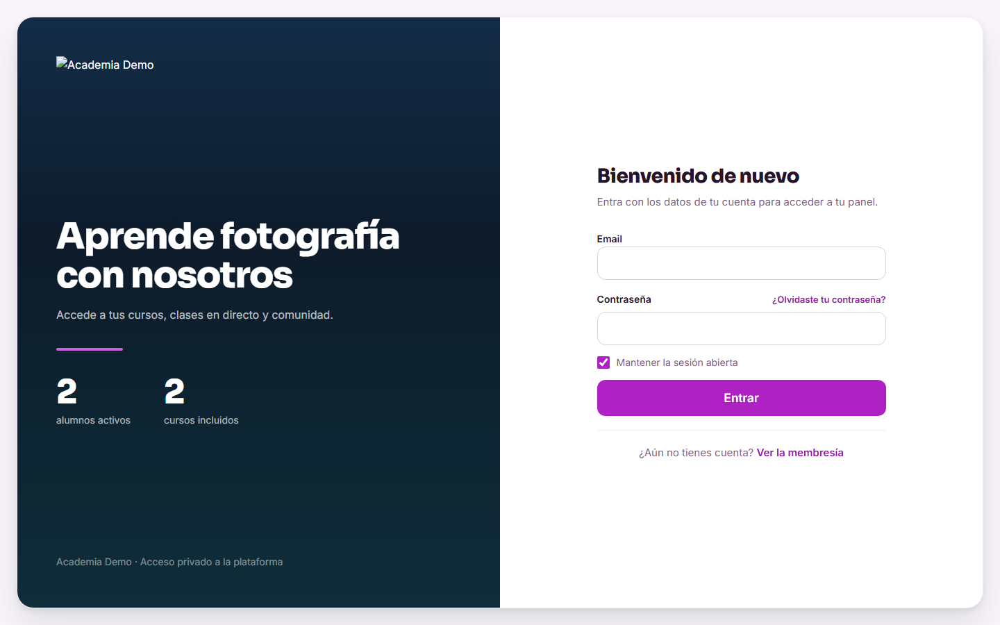

# mod.theming — Personalización visual

Community · Categoría **core** (siempre activo)

## Qué hace

Branding visual **por organización**: logo (subido al storage o URL), modo de presentación de la marca (solo logo / logo y nombre), favicon, color primario expresado como **hue + saturación HSL**, familias tipográficas display y body, CSS custom sanitizado, footer HTML y los titulares de las pantallas de acceso.

## Cómo funciona

- El theme se carga **server-side** en el layout raíz de la web e inyecta variables CSS que sobrescriben los design tokens base: cambiar el hue propaga automáticamente a los 10 escalones de la escala de marca (`brand-50…900`) — no hay que tocar token a token.
- Las fuentes están limitadas a una **whitelist** de Google Fonts (Sora, Inter, Manrope, Space Grotesk, DM Sans, Plus Jakarta Sans…).
- El CSS custom se **sanitiza** y se limita a 16 KB; el footer HTML solo admite etiquetas básicas.
- El logo se sirve por un endpoint **público** (necesario en `/signin`, antes de autenticar) con caché de 5 minutos.
- Los defaults son la identidad Didacta (hue 213, saturación 70, Sora + Inter); `reset` vuelve a ellos.

!!! note "Qué parte es Enterprise"
    El branding básico (logo, colores, fuentes, titulares) es **Community**. Solo `customCss` y `footerHtml` con contenido requieren la capability `feat:white_label` (guardar logo y colores sin licencia funciona siempre). Ocultar la marca Didacta también es white-label.

## Configuración

Es un módulo **core**: siempre activo, no aparece en el interruptor de la pestaña Módulos. Todo se configura en **Administración → Branding** (`/admin/branding`), solo para `tenant_admin` y `super_admin`, con **Vista previa** en vivo y botón **Restaurar valores por defecto**:

- **Color de marca**: deslizadores **Matiz (hue)** (0–360) y **Saturación** (0–100), con la escala `brand-50…900` resultante a la vista.
- **Tipografía**: **Fuente de titulares (display)** y **Fuente del cuerpo (body)**, cada una con su whitelist.
- **Logo y favicon**: **Subir logo al storage** (PNG, JPG, SVG o WebP, máx. 2 MB; con **Reemplazar logo** y **Eliminar**), o **URL del logo (alternativa)** (`https://…` o un endpoint relativo `/api/v1/…`), más **URL del favicon**.
- **¿Cómo se muestra tu marca?** — el modo de logo (`logo_display_mode`, añadido en alpha.113): **Solo el logo** (`logo_only`, se ve completo a su ancho natural; para logos que ya llevan el nombre dentro) o **Logo y nombre** (`logo_and_name`; para isotipos cuadrados o sin texto). La elección manda en el sidebar del aula, `/signin` y el asistente de bienvenida.

    

- **Pantalla de acceso**: **Titular** (máx. 160 caracteres) y **Línea de apoyo (opcional)** (máx. 240) del panel de marca de `/signin`.
- **CSS personalizado (avanzado)** (máx. 16 KB) y **Footer personalizado** (máx. 4 KB): requieren la capability Enterprise `feat:white_label`. Sin licencia se muestra la tarjeta de upgrade en su lugar, y el backend responde `402` a cualquier intento de guardarlos con contenido — enviar los campos vacíos o a `null` siempre está permitido.

El paso **Logo y color** del asistente de bienvenida (`/bienvenida`) configura lo mismo en versión mínima: subir el logo (se aplica al momento), elegir **¿Cómo lo mostramos?** (**Solo el logo** / **Logo y nombre**) y el color con 10 muestras + barra de ajuste fino; color y modo se guardan al continuar. Es uno de los dos pasos obligatorios del asistente (junto a «Nombre»).

Sin variables de entorno.

## Uso paso a paso

1. Entra en **Administración → Branding** (`/admin/branding`). El panel carga el theme actual del tenant.
2. Mueve **Matiz (hue)** y **Saturación**: la columna **Vista previa** y la escala de marca reflejan el cambio al instante, sin afectar aún al resto de usuarios.
3. Sube tu logo con **Subir logo al storage** (o pega una **URL del logo (alternativa)**) y elige en **¿Cómo se muestra tu marca?** entre **Solo el logo** y **Logo y nombre**.
4. Ajusta las fuentes y, si quieres, el **Titular** y la **Línea de apoyo (opcional)** de la pantalla de acceso.
5. Pulsa **Guardar cambios**: el theme se persiste y se aplica a toda la organización (el resto de usuarios lo ve al recargar, porque se inyecta server-side).

    

6. (Enterprise) Con licencia `feat:white_label`, añade **CSS personalizado (avanzado)** y **Footer personalizado**.
7. **Restaurar valores por defecto** vuelve a la identidad Didacta en un clic (pide confirmación).

Si la academia es nueva, el asistente de `/bienvenida` te lleva por lo mismo sin entrar al panel:

El resultado se ve donde primero lo ven tus alumnos, la pantalla de acceso:

## Dependencias

Ninguna.

## Modelo de datos

`mod_theming_tenant_theme` — un único registro por tenant con todo el branding.

## API

Prefijo `/modules/theming` (`me`, `me/reset`, `me/logo`, logo público). Detalle en [Referencia → Comunidad y personas](../../api/referencia/comunidad.md#theming-modulestheming).

## Eventos

**Emite**: `theming.logo.uploaded`. No consume.
