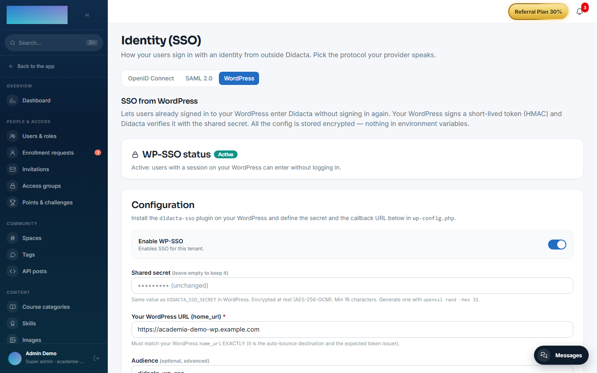

# mod.wp-sso — WordPress SSO

<span class="didacta-chip didacta-chip--community">Community</span> · **Integration** category (can be disabled)

## What it does

It lets a user **already authenticated in WordPress** enter Didacta without signing in again. The WordPress plugin (bundled with the module: `didacta-sso.php`) signs a short HS256 JWT (email, name, `sub` = WordPress user_id, expiry ≤ 5 min, unique `jti`) and redirects to Didacta's callback, which verifies the signature, issuer, audience and TTL, resolves the user by their **stable identity** (`sub`, with an email fallback to link existing accounts; creating a student if none exists and auto-provisioning is enabled) and issues the session.

## How it works

- The token is **single use**: the `jti` is marked as consumed (anti-replay, in Redis with an in-memory fallback).
- The HMAC secret is known only to WordPress and Didacta; it never reaches the browser.
- Email addresses are normalised (trimmed + lowercased) before the user is resolved.
- The final redirect uses the hardened web base (`WEB_PUBLIC_URL` / the tenant's verified domain / allowlist), never the `Host` header — this prevents open redirects with token exfiltration.
- In WordPress: `DIDACTA_SSO_SECRET` and `DIDACTA_SSO_CALLBACK` in `wp-config.php`, and the button through the `[didacta_sso_button]` shortcode.

## Configuration

A **non-core** module: an admin turns it on or off per tenant under Administration → Brand & settings → Settings, "Modules" tab (`/admin/configuracion?tab=modules`).

**The configuration screen** is Administration → Security → **Identity (SSO)** (`/admin/sso`), "WordPress" tab — the old route `/admin/sso-wordpress` still works as a redirect. Only `super_admin` / `tenant_admin`. It is Community, **with no Enterprise capability** (the OpenID Connect and SAML 2.0 tabs on the same screen are EE). Fields:

- **"Enable WP-SSO"** — enables SSO for the tenant.
- **"Shared secret"** — the same value as `DIDACTA_SSO_SECRET` in WordPress; at least 16 characters, encrypted at rest (AES-256-GCM) and never returned in plain text (empty on save = keep the current one). The screen itself suggests generating it with `openssl rand -hex 32`.
- **"Your WordPress URL (home_url)"** — required; it must match the WordPress `home_url` EXACTLY (it is the expected token issuer and the auto-bounce destination).
- **"Audience"** — optional; empty = `didacta-wp-sso` (the plugin's default).
- **"Transparent auto-redirect"** — Didacta's login bounces to the WordPress; with a session there, the user comes back authenticated; without one, it silently returns to the normal login.
- **"Auto-provision users"** — the first SSO creates the account (student role); when off, only users that already exist in the tenant can enter.
- **"Callback URL (paste into wp-config.php)"** — read-only; it includes the tenant slug.

All the configuration lives **encrypted in the database per tenant** — the module reads no environment variables of its own. The only env involved is `WEB_PUBLIC_URL` (the deployment's address), which hardens the base of the final redirect.

On the WordPress side, the `wp-config.php` constants: `DIDACTA_SSO_SECRET`, `DIDACTA_SSO_CALLBACK` and the optional `DIDACTA_SSO_AUDIENCE` (default `didacta-wp-sso`) and `DIDACTA_SSO_TTL` (seconds, default 120; Didacta rejects tokens with a TTL > 300 s).

## Step-by-step usage

**Didacta side (admin):**

1. Go to Administration → Security → **Identity (SSO)** and open the "WordPress" tab (`/admin/sso?tab=wordpress`).
2. Generate a secret (e.g. `openssl rand -hex 32`), paste it into "Shared secret" and type "Your WordPress URL (home_url)".
3. Press **Create configuration** (or **Save changes** if one already existed).
4. Copy the "Callback URL (paste into wp-config.php)".
5. Turn on the "Enable WP-SSO" switch and save.



**WordPress side** (as documented by the plugin itself):

6. Copy `didacta-sso.php` to `wp-content/plugins/didacta-sso/didacta-sso.php` and activate it in the plugins panel.
7. In `wp-config.php` define (same values as in Didacta):

    ```php
    define('DIDACTA_SSO_SECRET', 'the-long-random-shared-secret');
    // It includes the tenant slug; copy it AS IS from the Didacta panel:
    define('DIDACTA_SSO_CALLBACK', 'https://your-didacta.com/api/v1/modules/wp-sso/<tenant-slug>/callback');
    // Optional:
    define('DIDACTA_SSO_AUDIENCE', 'didacta-wp-sso'); // default
    define('DIDACTA_SSO_TTL', 120);                    // seconds, default 120 (max 300)
    ```

8. Link to Didacta with any of these options:
    - Button/shortcode: `[didacta_sso_button label="Ir a Didacta"]`.
    - Explicit URL: `https://your-wordpress/?didacta_sso=go` (without a WP session it goes through `wp-login` and comes back).
    - Transparent URL: `https://your-wordpress/?didacta_sso=try` (without a WP session it SILENTLY returns to Didacta's sign-in; this is the one the auto-bounce uses).
9. Test the loop with the **Test the bounce ↗** button on the WordPress tab (it appears when the configuration is active).

**What the user sees:** from WordPress, with a session open, the button takes them into Didacta already authenticated (302 to the callback → `/auth/callback` with the session). With "Transparent auto-redirect" on, visiting Didacta's `/signin` bounces to the WordPress and, if there is a session there, the user comes back authenticated without touching anything; if there is none, the normal login appears without noise. With "Auto-provision users" on, the first SSO creates the account with the student role; when off, anyone who does not exist in the tenant sees the `user_not_provisioned` error.

## Dependencies

None.

## Data model

No tables of its own: the only state (the consumed `jti`) is ephemeral and lives in Redis. Users are created/resolved in the core users table, and the `sub` → user link in the core external identities table.

## API

- `GET /modules/wp-sso/:tenantSlug/status` — public configuration (for the sign-in auto-redirect).
- `GET /modules/wp-sso/:tenantSlug/callback?token=` — exchanging the token for a session (302).
- Admin: `GET`/`PUT`/`DELETE` `/api/v1/admin/sso/wp/config` (Community, no capability required). The screen that consumes them is `/admin/sso?tab=wordpress`.

## Events

**Emits**: `wp-sso.signin.success`, `wp-sso.user.provisioned`, `wp-sso.account.linked`. It consumes none.
