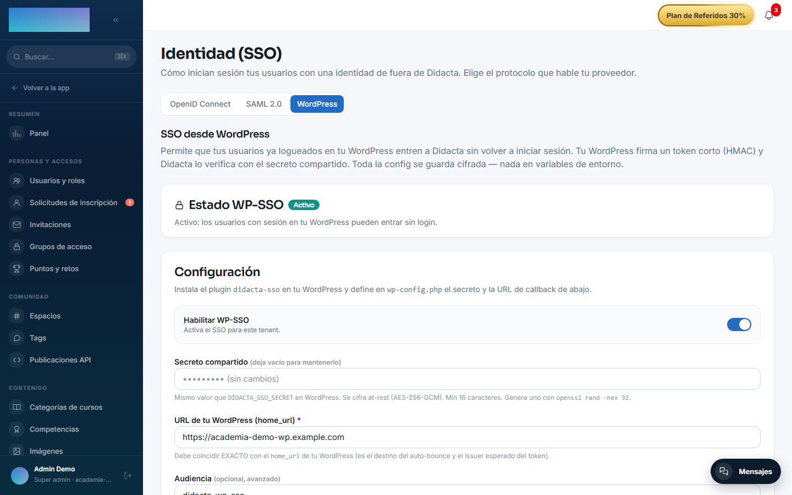

# mod.wp-sso — SSO desde WordPress

<span class="didacta-chip didacta-chip--community">Community</span> · Categoría **integration** (desactivable)

## Qué hace

Permite que un usuario **ya autenticado en WordPress** entre a Didacta sin volver a iniciar sesión. El plugin de WordPress (incluido en el módulo: `didacta-sso.php`) firma un JWT HS256 corto (email, nombre, `sub` = user_id de WordPress, caducidad ≤ 5 min, `jti` único) y redirige al callback de Didacta, que verifica firma, issuer, audiencia y TTL, resuelve al usuario por su **identidad estable** (`sub`, con fallback a email para vincular cuentas existentes; crea un alumno si no existe y el auto-provisionado está activo) y emite la sesión.

## Cómo funciona

- El token es de **un solo uso**: el `jti` se marca como consumido (anti-replay, en Redis con fallback en memoria).
- El secreto HMAC solo lo conocen WordPress y Didacta; nunca viaja al navegador.
- Los emails se normalizan (trim + lowercase) antes de resolver el usuario.
- La redirección final usa la base web endurecida (`WEB_PUBLIC_URL` / dominio verificado del tenant / allowlist), nunca el header `Host` — evita open-redirect con exfiltración de tokens.
- En WordPress: `DIDACTA_SSO_SECRET` y `DIDACTA_SSO_CALLBACK` en `wp-config.php`, y el botón vía shortcode `[didacta_sso_button]`.

## Configuración

Módulo **no-core**: un admin lo activa o desactiva por tenant en Administración → Marca y ajustes → Configuración, pestaña «Módulos» (`/admin/configuracion?tab=modules`).

**La pantalla de configuración** es Administración → Seguridad → **Identidad (SSO)** (`/admin/sso`), pestaña «WordPress» — la ruta antigua `/admin/sso-wordpress` sigue viva como redirección. Solo `super_admin` / `tenant_admin`. Es Community, **sin capability Enterprise** (las pestañas OpenID Connect y SAML 2.0 de la misma pantalla sí son EE). Campos:

- **«Habilitar WP-SSO»** — activa el SSO para el tenant.
- **«Secreto compartido»** — mismo valor que `DIDACTA_SSO_SECRET` en WordPress; mínimo 16 caracteres, se cifra at-rest (AES-256-GCM) y nunca se devuelve en claro (vacío al guardar = conservar el actual). La propia pantalla sugiere generarlo con `openssl rand -hex 32`.
- **«URL de tu WordPress (home_url)»** — obligatoria; debe coincidir EXACTO con el `home_url` de WordPress (es el issuer esperado del token y el destino del auto-bounce).
- **«Audiencia»** — opcional; vacío = `didacta-wp-sso` (el default del plugin).
- **«Auto-redirect transparente»** — el login de Didacta rebota al WordPress; si hay sesión, el usuario vuelve autenticado; si no, vuelve en silencio al login normal.
- **«Auto-provisionar usuarios»** — el primer SSO crea la cuenta (rol alumno); apagado, solo entran usuarios que ya existen en el tenant.
- **«URL de callback (pegar en wp-config.php)»** — solo lectura; incluye el slug del tenant.

Toda la configuración vive **cifrada en BD por tenant** — el módulo no lee variables de entorno propias. La única env implicada es `WEB_PUBLIC_URL` (la dirección del despliegue), que endurece la base del redirect final.

En el lado WordPress, las constantes de `wp-config.php`: `DIDACTA_SSO_SECRET`, `DIDACTA_SSO_CALLBACK` y las opcionales `DIDACTA_SSO_AUDIENCE` (default `didacta-wp-sso`) y `DIDACTA_SSO_TTL` (segundos, default 120; Didacta rechaza tokens con TTL > 300 s).

## Uso paso a paso

**Lado Didacta (admin):**

1. Entra en Administración → Seguridad → **Identidad (SSO)** y abre la pestaña «WordPress» (`/admin/sso?tab=wordpress`).
2. Genera un secreto (p. ej. `openssl rand -hex 32`), pégalo en «Secreto compartido» y escribe la «URL de tu WordPress (home_url)».
3. Pulsa **Crear configuración** (o **Guardar cambios** si ya existía).
4. Copia la «URL de callback (pegar en wp-config.php)».
5. Activa el interruptor «Habilitar WP-SSO» y guarda.



**Lado WordPress** (según la instalación documentada en el propio plugin):

6. Copia `didacta-sso.php` a `wp-content/plugins/didacta-sso/didacta-sso.php` y actívalo en el panel de plugins.
7. En `wp-config.php` define (mismos valores que en Didacta):

    ```php
    define('DIDACTA_SSO_SECRET', 'el-secreto-compartido-largo-y-aleatorio');
    // Incluye el slug del tenant; cópiala TAL CUAL del panel de Didacta:
    define('DIDACTA_SSO_CALLBACK', 'https://tu-didacta.com/api/v1/modules/wp-sso/<tenant-slug>/callback');
    // Opcionales:
    define('DIDACTA_SSO_AUDIENCE', 'didacta-wp-sso'); // default
    define('DIDACTA_SSO_TTL', 120);                    // segundos, default 120 (máx. 300)
    ```

8. Enlaza a Didacta con cualquiera de estas opciones:
    - Botón/shortcode: `[didacta_sso_button label="Ir a Didacta"]`.
    - URL explícita: `https://tu-wordpress/?didacta_sso=go` (sin sesión WP manda a `wp-login` y vuelve).
    - URL transparente: `https://tu-wordpress/?didacta_sso=try` (sin sesión WP vuelve EN SILENCIO al signin de Didacta; es la que usa el auto-bounce).
9. Prueba el circuito con el botón **Probar bounce ↗** de la pestaña WordPress (aparece cuando la config está activa).

**Lo que ve el usuario:** desde WordPress, con sesión iniciada, el botón lo lleva a Didacta ya autenticado (302 al callback → `/auth/callback` con la sesión). Con «Auto-redirect transparente» activo, entrar en `/signin` de Didacta rebota al WordPress y, si hay sesión allí, vuelve autenticado sin tocar nada; si no la hay, el login normal aparece sin ruido. Si «Auto-provisionar usuarios» está activo, el primer SSO crea la cuenta con rol alumno; si está apagado, quien no exista en el tenant ve el error `user_not_provisioned`.

## Dependencias

Ninguna.

## Modelo de datos

Sin tablas propias: el único estado (el `jti` consumido) es efímero y vive en Redis. Los usuarios se crean/resuelven en la tabla de usuarios del core, y el vínculo `sub` → usuario en la tabla de identidades externas del core.

## API

- `GET /modules/wp-sso/:tenantSlug/status` — config pública (para el auto-redirect del signin).
- `GET /modules/wp-sso/:tenantSlug/callback?token=` — intercambio del token por sesión (302).
- Admin: `GET`/`PUT`/`DELETE` `/api/v1/admin/sso/wp/config` (Community, sin capability). La pantalla que los consume es `/admin/sso?tab=wordpress`.

## Eventos

**Emite**: `wp-sso.signin.success`, `wp-sso.user.provisioned`, `wp-sso.account.linked`. No consume.
