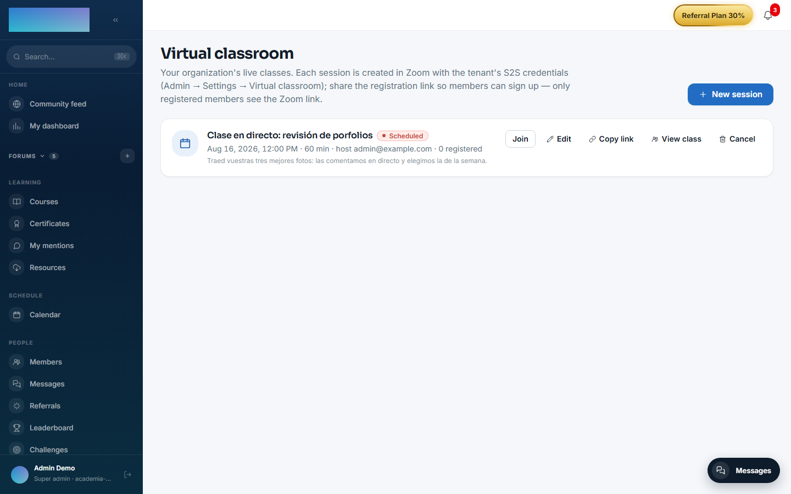
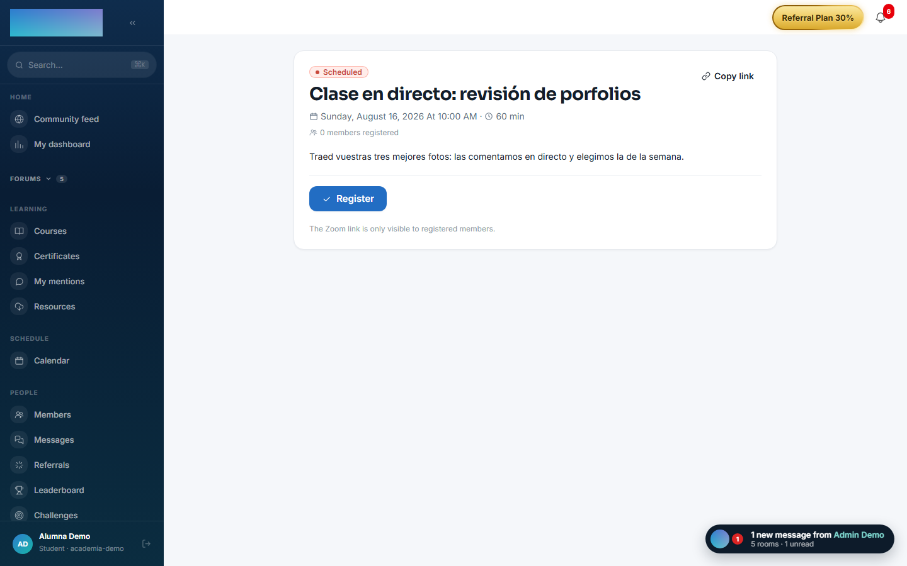
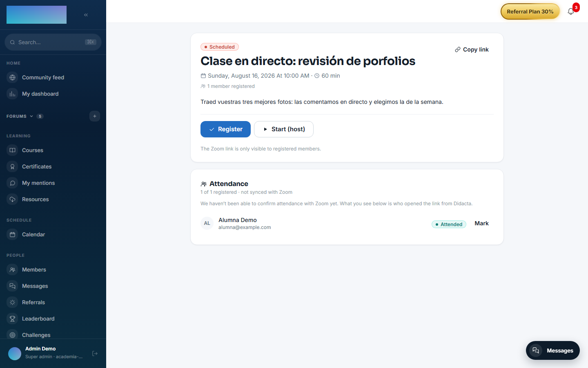

# mod.zoom-live — Virtual classroom (Zoom)

Community · **Live** category (can be disabled)

## What it does

Live classes over Zoom's **Server-to-Server OAuth** API. The instructor schedules sessions (optionally linked to a course or to a specific lesson, which enables the "Join" button in the lesson); students register from a shareable link, and both the `joinUrl` and the **recording** are gated server-side to registered attendees or staff. It includes:

- **Add to calendar** on registering: Google, Outlook.com, Microsoft 365 and `.ics` (the links never contain the `joinUrl`).
- An email + in-app **reminder** 2 hours beforehand (exactly one per class, with an atomic claim to prevent duplicates).
- **Real attendance**: an entry proxy (the click on "Join") reconciled afterwards against Zoom's Report API, with a manual override by the instructor.
- The recording is persisted when the `recording.completed` webhook arrives.

## How it works

- With no credentials configured, the module uses a **deterministic stub** — the whole flow can be tested without a Zoom account.
- Webhooks are processed with an **idempotent log** keyed by `event_id` (Zoom retries up to 3 times) and a verified HMAC signature; this includes Zoom's endpoint validation handshake.
- Zoom participants who match no user (guests, a different email address) are kept with their Zoom identity for manual reconciliation.
- The typical attendance sync error is a missing `report:read:admin` scope on the Zoom app; it is recorded on the session so the instructor knows why there is no data.
- When the class ends, `mod.surveys` can fire the post-class survey automatically.

## Configuration

- **Enabling or disabling the module**: `/admin/configuracion`, **Modules** tab — a per-organization switch.
- **Zoom credentials, per tenant**: `/admin/configuracion`, **Virtual classroom** tab (contributed by the module; it disappears if you disable it). Fields **Account ID**, **Client ID**, **Client Secret** and **Webhook Secret Token**, with **Save credentials**, **Test credentials** and **Delete credentials** buttons. They are stored encrypted (AES-256-GCM) and never returned in plain text; without credentials the module falls back to the development stub.
- **Webhook**: the endpoint is `https://your-domain/api/v1/webhooks/zoom`. Zoom's **Secret Token** is pasted into the same panel form — it is **no longer** the `ZOOM_WEBHOOK_SECRET` environment variable (that one was global while the S2S credentials were already per tenant).
- **Environment (workers)**: `ZOOM_REMINDER_CRON`, `ZOOM_REMINDER_HOURS_BEFORE`, `ZOOM_ATTENDANCE_SYNC_CRON` control reminders and attendance reconciliation (they require Redis). The defaults table and the Zoom App Marketplace setup live in [Configuring Zoom](../../configuracion/zoom.md).
- Nothing in this module requires an Enterprise license.

## Step by step

As an instructor (or admin):

1. Open **Virtual classroom** in the instructor menu (`/formador/aula-virtual`) and click **New session**.
2. Fill in **Title**, **Date and time**, **Duration (min)** (15–480) and **Time zone** — the time is interpreted in the chosen zone, not in your computer's. The **Host email** must have a user in your Zoom account: the meeting is created under their name.
3. Optional: link a **Course (optional)** and a **Lesson (optional)** — with a lesson, enrolled students see the session in its detail. Leave **Announce in the community** checked to publish a feed card people can register from.
4. Click **Create session**, then **Copy link** to share the registration page (`/clase/<id>`).
5. **Edit** only allows changing title, date, duration, time zone and agenda; the host, course and lesson are fixed at creation. **Cancel** notifies everyone registered.
6. At class time, click **Start** (or **Start (host)** from the class page).

As a student:

1. Open the `/clase/<id>` link (or the class from `/calendario`); with no session you go through sign-in and come back.
2. Click **Register**. The **Add to calendar** dialog opens (Google Calendar, Outlook.com, Outlook (Microsoft 365), Apple Calendar and others via `.ics`).
3. The **Join the class** / **Join now** button only appears if you are registered; the click seals your entry as attendance evidence. You get a reminder 2 hours beforehand.
4. Once the class ends, **Watch recording** appears for registered attendees as soon as Zoom delivers the recording.

Attendance (staff, on the same class page):

1. The **Attendance** panel lists registered members and unmatched Zoom participants.
2. **Sync with Zoom** reconciles against the Report API; each row shows how strong the evidence is.
3. The **Mark** button cycles the manual override: **Present** → **Absent** → back to the automatic calculation.

## Dependencies

Optional: `mod.courses` (linking a session ↔ course/lesson).

## Data model

`mod_zoom_session` (the class: schedule, host, URLs, recording, sync flags) · `_session_registration` (registration, the basis for gating) · `_session_attendance` (entry click + Zoom data + override) · `_webhook_event` (idempotent log).

## API

Prefix `/modules/zoom-live` (+ the public calendar + the webhook at `/webhooks/zoom`). Details in [Reference → Payments, classroom and AI](../../api/referencia/pagos-directo-ia.md#virtual-classroom-moduleszoom-live).

## Events

**Emits**: `zoom.session.created/updated/cancelled/started/ended`, `zoom.session.recording_ready`, `zoom.session.registration.created/cancelled`, `zoom.session.attendance_synced`. It consumes none.
