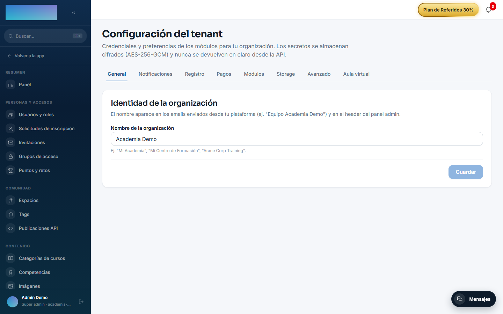
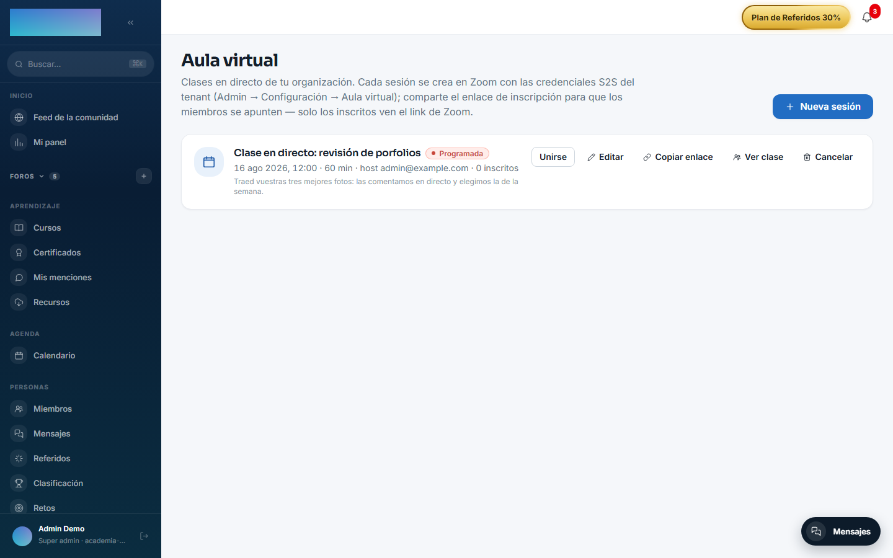
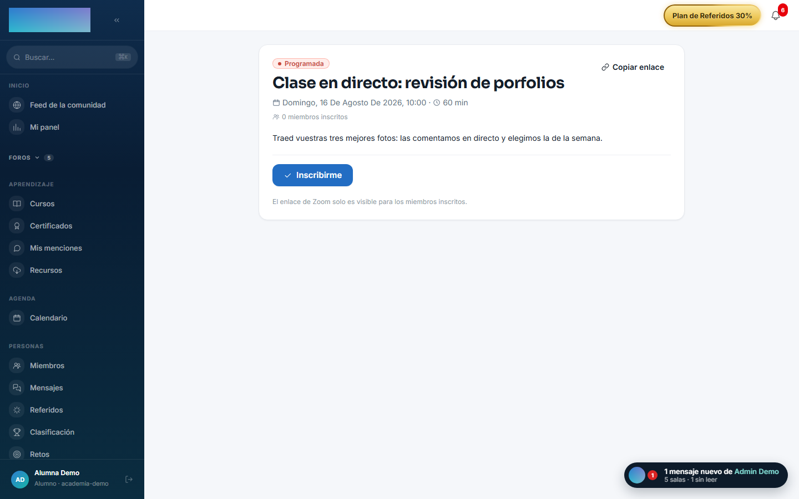
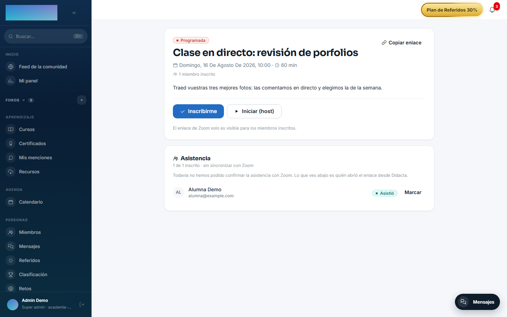

# mod.zoom-live — Aula virtual (Zoom)

Community · Categoría **live** (desactivable)

## Qué hace

Clases en directo con la API **Server-to-Server OAuth** de Zoom. El formador programa sesiones (opcionalmente vinculadas a un curso o a una lección concreta, lo que habilita el botón «Unirse» en la lección); los alumnos se inscriben desde un enlace compartible, y el `joinUrl` y la **grabación** quedan gateados server-side a inscritos o staff. Incluye:

- **Añadir al calendario** al inscribirse: Google, Outlook.com, Microsoft 365 y `.ics` (los enlaces nunca contienen el `joinUrl`).
- **Recordatorio** por email + in-app 2 horas antes (uno solo por clase, con claim atómico anti-duplicados).
- **Asistencia real**: proxy de entrada (clic en «Unirme») reconciliado después contra la Report API de Zoom, con override manual del formador.
- La grabación se persiste al llegar el webhook `recording.completed`.

## Cómo funciona

- Sin credenciales configuradas, el módulo usa un **stub determinístico** — se puede probar todo el flujo sin cuenta de Zoom.
- Los webhooks se procesan con **log idempotente** por `event_id` (Zoom reintenta hasta 3 veces) y firma HMAC verificada; incluye el handshake de validación de endpoint de Zoom.
- Los participantes de Zoom que no casan con ningún usuario (invitados, otro email) se conservan con su identidad de Zoom para conciliación manual.
- El error típico del sync de asistencia es que falte el scope `report:read:admin` en la app de Zoom; queda registrado en la sesión para que el formador sepa por qué no hay datos.
- Al terminar la clase, `mod.surveys` puede lanzar automáticamente la encuesta post-clase.

## Configuración

- **Activar o desactivar el módulo**: `/admin/configuracion`, pestaña **Módulos** — interruptor por organización.
- **Credenciales Zoom, por tenant**: `/admin/configuracion`, pestaña **Aula virtual** (la aporta el módulo; desaparece si lo desactivas). Campos **Account ID**, **Client ID**, **Client Secret** y **Webhook Secret Token**, con botones **Guardar credenciales**, **Probar credenciales** y **Borrar credenciales**. Se guardan cifradas (AES-256-GCM) y nunca se devuelven en claro; sin credenciales, el módulo cae al stub de desarrollo.
- **Webhook**: el endpoint es `https://tu-dominio/api/v1/webhooks/zoom`. El **Secret Token** de Zoom se pega en el mismo formulario del panel — ya **no** es la variable de entorno `ZOOM_WEBHOOK_SECRET` (era global y las credenciales ya eran per-tenant).
- **Entorno (workers)**: `ZOOM_REMINDER_CRON`, `ZOOM_REMINDER_HOURS_BEFORE`, `ZOOM_ATTENDANCE_SYNC_CRON` controlan recordatorios y reconciliación de asistencia (requieren Redis). La tabla de valores por defecto y el alta de la app en el Zoom App Marketplace están en [Configurar Zoom](../../configuracion/zoom.md).
- Ninguna función del módulo exige licencia Enterprise.

## Uso paso a paso

Como formador (o admin):

1. Abre **Aula virtual** en el menú del formador (`/formador/aula-virtual`) y pulsa **Nueva sesión**.
2. Rellena **Título**, **Fecha y hora**, **Duración (min)** (15–480) y **Zona horaria** — la hora se interpreta en la zona elegida, no en la de tu ordenador. El **Email del host** debe tener usuario en vuestra cuenta de Zoom: la reunión se crea a su nombre.
3. Opcional: vincula **Curso (opcional)** y **Lección (opcional)** — con lección, los alumnos matriculados ven la sesión en su detalle. Deja marcado **Anunciar en la comunidad** para publicar una tarjeta en el feed desde la que inscribirse.
4. Pulsa **Crear sesión** y luego **Copiar enlace** para compartir la página de inscripción (`/clase/<id>`).
5. **Editar** solo permite cambiar título, fecha, duración, zona y agenda; el host, el curso y la lección quedan fijos desde la creación. **Cancelar** avisa a los inscritos.
6. A la hora de la clase, pulsa **Iniciar** (o **Iniciar (host)** desde la página de la clase).

Como alumno:

1. Abre el enlace `/clase/<id>` (o la clase desde `/calendario`); si no tienes sesión, pasas por el login y vuelves.
2. Pulsa **Inscribirme**. Se abre el diálogo **Añadir al calendario** (Google Calendar, Outlook.com, Outlook (Microsoft 365), Apple Calendar y otros vía `.ics`).
3. El botón **Unirme a la clase** / **Unirme ahora** solo aparece si estás inscrito; el clic sella tu entrada como evidencia de asistencia. Recibirás recordatorio 2 horas antes.
4. Cuando la clase termina, **Ver grabación** aparece para los inscritos en cuanto Zoom entrega la grabación.

Asistencia (staff, en la misma página de la clase):

1. El panel **Asistencia** lista inscritos y participantes de Zoom sin casar.
2. **Sincronizar con Zoom** reconcilia contra la Report API; cada fila indica la confianza de la evidencia.
3. El botón **Marcar** cicla el override manual: **Presente** → **Ausente** → vuelta al cálculo automático.

## Dependencias

Opcional: `mod.courses` (vincular sesión ↔ curso/lección).

## Modelo de datos

`mod_zoom_session` (clase: horario, host, URLs, grabación, marcas de sync) · `_session_registration` (inscripción, base del gating) · `_session_attendance` (clic de entrada + datos de Zoom + override) · `_webhook_event` (log idempotente).

## API

Prefijo `/modules/zoom-live` (+ calendario público + webhook en `/webhooks/zoom`). Detalle en [Referencia → Pagos, aula e IA](../../api/referencia/pagos-directo-ia.md#aula-virtual-moduleszoom-live).

## Eventos

**Emite**: `zoom.session.created/updated/cancelled/started/ended`, `zoom.session.recording_ready`, `zoom.session.registration.created/cancelled`, `zoom.session.attendance_synced`. No consume.
